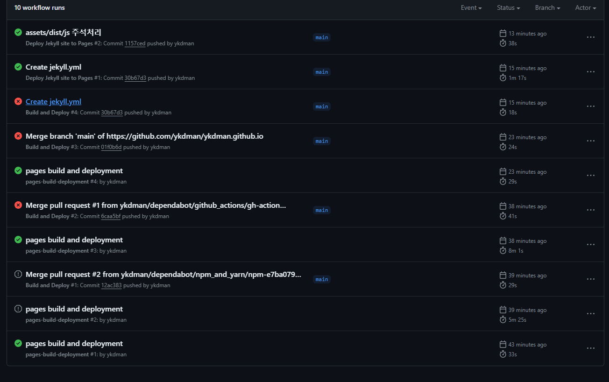

# 블로그 생성 과정

1. Ruby 설치 (3.1.x - x86 버전)
2. git bash 를 이용하여 bundle 및 jekyll 설치

- 설치
```shell
$ gem install jekyll
$ gem install bundle
```

- 버전 확인 (설치 확인)

```shell
$ jekyll -v
$ bundle -v
```

## 블로그 테마
- [Chirpy Them ](https://chirpy.cotes.page/)
- [완전 따라한 블로그 : devpro.kr](https://devpro.kr/)
- [assets/dist/min js 파일 경로 오류 해결을 하기 위해 참조한 블로그 : jjikin.com](https://jjikin.com/posts/Jekyll-Chirpy-%ED%85%8C%EB%A7%88%EB%A5%BC-%ED%99%9C%EC%9A%A9%ED%95%9C-Github-%EB%B8%94%EB%A1%9C%EA%B7%B8-%EB%A7%8C%EB%93%A4%EA%B8%B0(2023-6%EC%9B%94-%EA%B8%B0%EC%A4%80)/)

## 소감
github에서 setting > pages > build & Deploy 옵션이 Branch 기준으로 되어있었다.  
그래서 Github Action 으로 속성을 바꾸어 주고 Configure를 진행!  
추후에 블로그를 생성했던 방법에 대해 자세히 기술해야할것 같다.  
성공하고나서 보니 쉬운데, 안될때는 막막했다 ㅎㅎ

- 내 블로그 github 오류들
