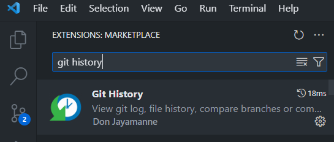
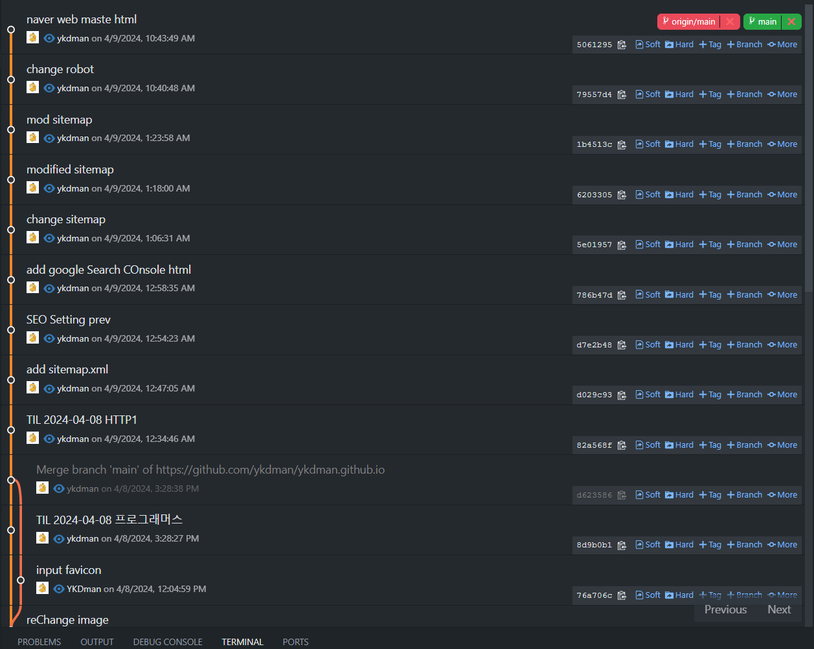

## 목차
- [목차](#목차)
- [Git 기본](#git-기본)
- [CLI \& GUI](#cli--gui)
- [git 기본 명령어](#git-기본-명령어)
- [git history Extension](#git-history-extension)
- [git 명령어 사용해보기](#git-명령어-사용해보기)
- [💻회고](#회고)


## Git 기본

- Git은 분산식 버전관리시스템 (VCS)
- Git 은 로컬 시스템이다. (설치해서 사용)
- 원격으로 중앙에서 프로젝트를 백업해두고, 버전관리 및 협업을 가능하게 해주는 시스템
- 로컬 = GIt / 원격 저장소 = Github
- Git은 이력을 관리하여 버전을 관리한다. (commit)
- 깃은 로컬 PC에서 버전을 관리해주며, 깃허브와 소통하는 시스템
- 깃허브는 원격 컴퓨터에서 백업을 담당하는 시스템이자 내 컴퓨터와 별도로 버전 관리도 해주는 플랫폼
- Github를 통해 장소에 제약 없이  
복구 및 백업 등 다양한 버전 관리가 가능해진다.  
(Github 사이트 내에서도 수정이 가능)

## CLI & GUI

- `CLI` (Command Line Interface) : 커맨드라인으로만 컨트롤 가능한 인터페이스
- `GUI` (Graphic User Interface) : 그래픽(UI)로 컨트롤 가능한 인터페이스
- Git은 CLI 및 GUI 둘다 사용할 수 있다.
- 나는 기존에 Git Bash 를 이용하여 CLI 형태의 Git 을 사용하는것이 편하다고 느꼈다
(Git Kraken 은 사용해봤을 때 되게 좋았다.)

## git 기본 명령어
- Git Bash를 사용하여 CLI 형태로 Git 을 사용할 수 있다.
- Git Bash 는 Unix 운영체제의 명령어를 같이 활용할 수 있다.
  + Linux도 Unix운영체제 기반으로 만들어졌다

```shell
$ ls : 현재 있는 Directory내의 파일 및 폴더를 표시한다.
$ cd [경로] : 원하는 경로로 포커스를 이동한다 (Directory).
$ touch [파일명.확장자]: 파일을 생성한다.
$ git init : 현재 폴더를 Git에서 관리할 수 있도록 등록 (.git 폴더 생성) 
$ git status : 현재 Git의 상태 (HEAD, Branch...) 를 표시한다.
$ git add : Stage에 등록되어 있지 않으며, 변경된 파일들을 git의 Stage로 올린다.(Tracking 시작)
$ git commit : add 로 인해 Stage에 올라간 파일들을 묶어 일종의 버전을 만든다.
$ git log : git 의 History를 조회 한다.
$ git remote : github Repository와의 연동을 위해 사용한다.
```

## git history Extension
- VScode의 Git history 확장프로그램을 사용해 가시적으로 Git 기록을 조회 가능하다.



- git history Extension 을 사용하여 Git log를 조회한 화면 (Blog Git)



## git 명령어 사용해보기

- git add, log, commit 을 사용하여 텍스트파일 추가 및 수정에 대한 버전관리를 수행해 보았다.
  


## 💻회고
- 오늘 프로그래머스 공유 Notion 에서 자기소개를 각자 생성하였는데, 생각보다 더 꾸준히 개발공부나 일을 하고 계신분들이 더 많았던것 같다.
- 좀 자극받았다...
- 앞으로 이 블로그에서 나도 더 열심히 활동 하려고 한다.
- Git을 이용하는 과정은 익숙하긴 하지만, GUI는 처음 써봤던것같다.
- 그래도 개발자는... CLI가 간지 아닐까?
- 앞으로는 Git의 대해 조금 더 알아보고 싶다. Actions나 Flow 와 같은 지식을 겸비해야 프로젝트에서 이득을 볼것 같다.