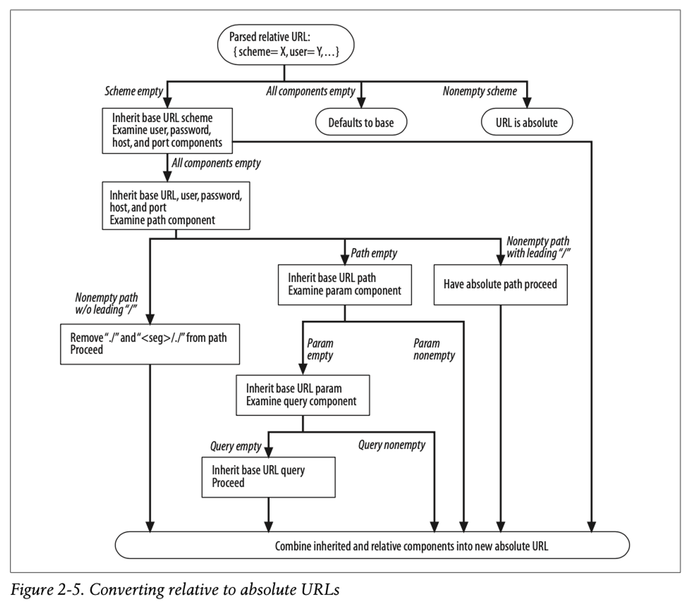

## 📚목차
- [📚목차](#목차)
- [📖오늘의 주제](#오늘의-주제)
- [URL](#url)
  - [URL 의 기본적인 구조](#url-의-기본적인-구조)
  - [URL이 등장하기 전](#url이-등장하기-전)
  - [URL의 자세한 문법](#url의-자세한-문법)
- [URL 의 속성들](#url-의-속성들)
  - [스킴 (Scheme)](#스킴-scheme)
  - [호스트와 포트](#호스트와-포트)
  - [사용자이름과 비밀번호](#사용자이름과-비밀번호)
  - [경로 (Path)](#경로-path)
  - [파라미터 (Parameter)](#파라미터-parameter)
  - [질의 문자열 (Query)](#질의-문자열-query)
  - [프래그먼트 (Fragment)](#프래그먼트-fragment)
- [상대 URL](#상대-url)
- [URN](#urn)
- [📖회고](#회고)

## 📖오늘의 주제
- URL
- URN
- URL의 기본구조
- URI, URL, URN

## URL
- URL 은 인터넷의 리소스를 가리키는 `표준이름` 이다.
- 현재 인터넷에서는 `URL`을 이용해 수십억개의 리소스를 찾고 사용하며 공유할 수 있다.
- URL 은 URI 의 한 부분이다! (URI 안에 URL, URN 이 있다.)

### URL 의 기본적인 구조

- `http://www.google.com/index.html`

    - Scheme (어떻게?) : `http://` - 사용할 프로토콜을 의미
    - Host (어디서?) : `www.google.com` - 서버의 위치를 의미 (DNS 때문에 대부분 도메인의 이름이다.)
    - Path (무엇을?) : `index.html` - 찾고자 하는 리소스의 경로를 의미

### URL이 등장하기 전

- URL이 등장하기 전에는 파일을 공유하고 찾는 과정이 정말 복잡했다고 한다.
- 애플리케이션 별로 파일을 저장하고 공유하고 찾는 방법이 다 달랐어서 더욱 복잡했다고 한다.
- 지금 시대에서는 URL 주소만 알면 어디든 접속할 수 있고, 파일도 다운받을 수 있다.

### URL의 자세한 문법

- `<스킴>://<사용자이름>:<비밀번호>@<호스트>:<포트>/<경로>;<파라미터>?<질의>#<프래그먼트>`
  - URL 문법의 모든 속성들을 표현한것이다.
  

  | 속성(컴포넌트) |  | 설명 |
  | -------------- ||---------------|
  |스킴||프로토콜 정의|
  |사용자 이름| |리소스 접근을 위한 사용자이름|
  |비밀번호| |리소스 접근을 위한 비밀번호 (사용자이름에 :을 붙여 정의)|
  |호스트||리소스를 호스팅 하는 서버의 호스트명이나 IP주소|
  |포트| |호스팅 서버가 열어놓은 포트번호|
  |경로||서버 내 리소스의 위치를 가리킨다.  문법은 서버와 스킴별로 다르다|
  |파라미터| |특정 스킴에서 사용된다. 키-값 쌍으로 구성(: 사용)|
  |질의||스킴에서 애플리케이션에 파라미터를 전달하는데 쓰인다. URL의 끝에 '?'로 구분|
  |프래그먼트||리소스의 조각이나, 특정부분을 가리키는 용도로 사용된다.('#'문자로구분)|

      

## URL 의 속성들

### 스킴 (Scheme)

- 리소스 요청시에 사용할 `프로토콜` 을 정의한다.
- 스킴의 종류

  | 이름 |  | 예시 |
  | ---- || --- |
  | http        | ||
  | https       | ||
  | mailto      | ||
  | ftp         | ||
  | rtsp, rtspu | ||
  | file        | ||
  | news        | ||
  | telnet      | ||

### 호스트와 포트

- 호스트 : 리소스를 가지고있는 인터넷상의 호스트 장비

  + 주로 도메인 이름이다.(DNS 사용때문)

- 포트 : 서버가 열어놓은 네트워크 포트 (출입문)

  + 프로토콜 별로 기본 포트가 다르며, 서버별로도 포트번호는 상이할 수 있다.
  
### 사용자이름과 비밀번호

- 서버가 데이터에 접근을 허용하기 전에 사용자의 이름과 비밀번호를 요구할 수 있다.
- 서버에 요구사항에 이름과 비밀번호가 있다면, 프로토콜 및 문법에 맞게 계정을 넣어줘야 한다.

### 경로 (Path)

- 경로 : 리소스가 서버의 `어디에` 위치하는지 알려준다.
- 보통 경로는 `계층적 파일 시스템 경로`와 유사하다.

### 파라미터 (Parameter)

- 대다수의 스킴이 호스트 및 경로정보 만으로는 리소스를 찾지 못한다.
- 좀 더 상세한 리소스 위치를 요청하기 위해 사용된다.
- 예시

  + http://www.videoshop.com/DB;sales:true/atrip.html;disscount:false;
  + `sales:true` 와 `disscount:false`는 파라미터이다.
  + URL 로 요청하는 리소스에 접근하기 위해 좀 더 자세한 명세를 위해 사용


### 질의 문자열 (Query)

  - 데이터 베이스 성격의 서비스들은 요청받을 리소스의 범위를 좁히기 위해 질의문을 받을 수도 있다.

  - http://video-rental-shop.com/videolist.cgi?item=123000

    + `item=123000` 이 질의문으로 사용되었다.
    + '?' 문자로 질의문을 구분한다.
    + 복합 질의는 '&' 를 사용하여 구성할 수 있다.


### 프래그먼트 (Fragment)

- 리소스 안의 특정 부분 (일부분)을 가리키기 위해 제공되는 컴포넌트 이다.
- '#' 문자로 구분
- https://www.naver.com/devblog/page12#title

  + `#title` 이 프래그먼트로 사용되었다.
  + 해당 URL 이 실제 존재한다는 가정하에, 열어보았다면, 리소스안의 '#title'에 해당하는 부분으로 바로 시점을 이동시켜준다.
  + 프래그먼트는 서버에 전송되는 컴포넌트는 아니며 클라이언트 단에서만 요청 및 처리된다.


## 상대 URL

```html
<a href="./home.html">Home</a>
```

- 위의 a태그의 href 속성이 절대 URL 을 표시하지 않고, 최종경로만을 표시하였다.
- 개발시, 해당 리소스를 호스팅하는 Base URL을 기반으로 스스로 URL을 설정하는 알고리즘을 통해 클라이언트에서 올바른 리소스를 요청할 수 있게 해준다.




## URN

- 기존 URL 의 치명적 단점

  + 리소스의 위치가 옮겨지면, 같은 URL을 더는 사용할 수 가 없다.


- 새로 제시된 URN

  + URN 은 객체의 위치가 옮겨지더라도, 항상 객체를 가리킬수 있는 이름을 제공한다.
  + 현재 표준화된 URL을 URN으로 주소체계를 바꾸는 것은 상당히 볼륨이 큰 작업이다.


## 📖회고
- 내가 그냥 타이핑 쳐서 들어가던 URL이 이렇게 많은 명세를 포함하고 있을 줄 몰랐다.
- JS의 fetch 함수를 사용했을때 Argument가 'URI'인 위치에 그냥 URL을 입력했었는데, 그 이유를 오늘 알았다.
- 언젠가 주소 체계가 URN이 되었을 떄의 모습들이 궁금해졌다.
- 프론트엔드든 백엔드이든 무엇을 공부하던 `웹`을 이용한다는 것에 변함이 없기에 이 책으로 웹의 기반을 다지기로 한것이 참 잘한 선택인것 같다.
- 아직 내용이 생각보다 더 심오하지는 않아서 재밌다 ㅎㅎ