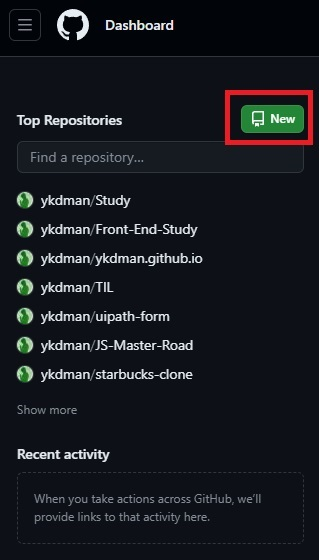
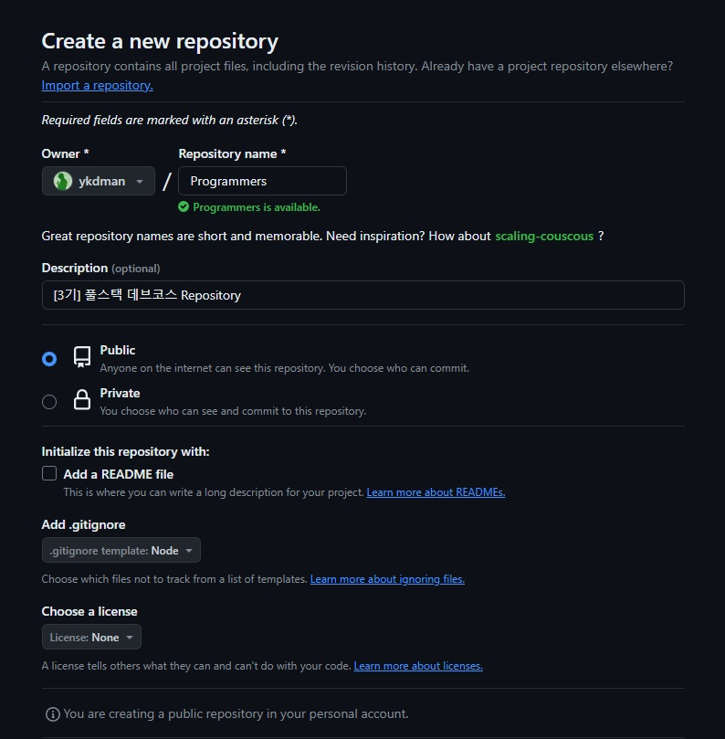
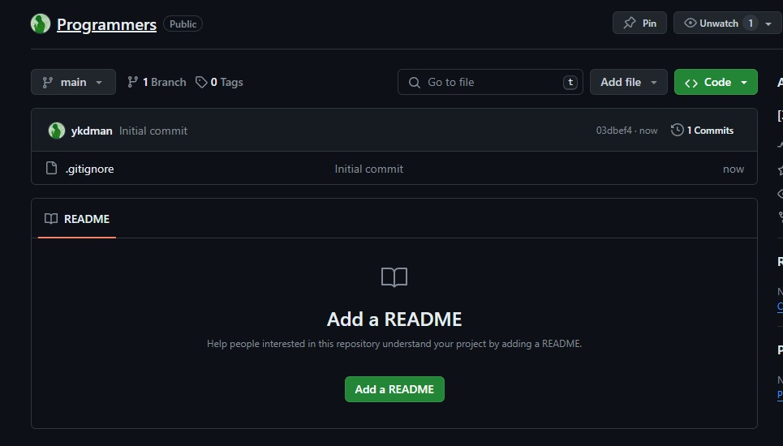
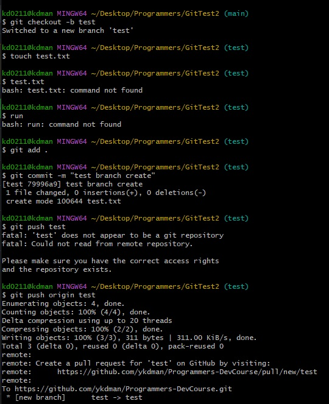

## 💻 Today I Learned
1. git
2. github 사용법
3. branch
4. merge
5. PR (Pull Request)

## github에서 새로운 Repository 만들기

1. github에 가입부터한다 (나는 원래 있다!)
2. 'New' 로 표시된 버튼을 눌러 New Repository 생성 페이지로 이동
    
3. 새로 생성할 프로젝트의 속성에 맞게 설정해준다.
    

4. 새로운 Repository 생성!
  
    


## github와 로컬 프로젝트 연결 1 (로컬 To Github)
- 로컬 프로젝트 → Git Repository 이다. (실제로 나는 사용하지 않는 방법이다.)

```bash
# 로컬 프로젝트에서 수행하는 것으로 가정한다.
$ git init
$ git add .
$ git status
$ git commit -m "first commit"
$ git branch -M main
$ git remote add origin [Repository URL]
$ git push -u origin main
$ git log
```

- 실제 수행과정
  


## github와 로컬 프로젝트 연결 2 (github to 로컬)
- 미리 생성한 github Repository를 로컬에 Clone 한다.
- 나도 주로 이방법으로 github와 로컬을 연결 시킨다.

```bash
# 새로 Clone 할 폴더의 위치해 있다고 가정
$ git clone [Clone URL]
```

- github Repository를 로컬로 클론하는 순간, 해당 Repo와 remote 연결이 된다.
- 실질적으로 clone 명령은 `remote add ~` 후 `pull & fetch` 까지 진행시켜준다.


## git branch 의 사용

- Branch 는 하나의 Repository 안에서 병렬적을 작업이 가능한 공간을 할당시켜주는 개념이다.
- Branch를 이용하여 하나의 프로젝트 내에서 병렬적으로 다양한 기능을 제작하면서 반영할 수 있다.
- Branch 사용을 위해 Git flow 전략과 같은 일종의 협업 디자인 패턴이 존재한다.
- Branch 사용시에는, 주기적인 Pull 과 PR(Pull&Request), 쓰지않는 branch 삭제, 주기적인 Commit 이 상당히 중요하다.

### branch 실습
- 강의가 끝난 후 branch 사용에 관해 잠깐 실습을 해보았다.
1. 로컬에서 'test' 브랜치 생성
2. main에 없던 새로운 'test.txt'파일 생성
3. git add & commit 으로 버전 생성 (HEAD -> test)
4. git push origin test 로 github에 test 브랜치 생성 및 push를 진행하였다.
5. github에서 새롭게 생성된 Branch 인 'test' 반영에 따라 Compare & PR 진행
6. test → main 으로 PR을 완료
7. github 내에서 test branch 삭제
8. 로컬에서 test branch 삭제
   
   
- bash 작업  
 

- github PR 진행

  

  

- 로컬 test branch 삭제
- 
  