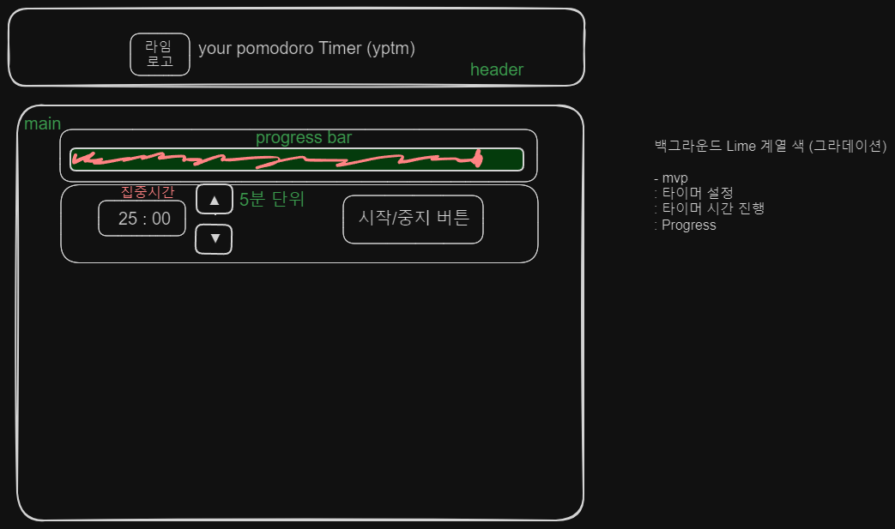

# 시작의 이유
> 그동안은 강의를 듣거나 클론코딩만 했었다.  
> 그게 나를 얼마나 발전시키지 못하는지 깨달았다.  
> 어쩌면 지금이 벽 하나를 꺨 수 있는 기회라고 느꼈다.  
> 그래서 내가 실제로 필요한 어플을 만들어 보려고 한다.

## 기획

- [excalidraw](https://excalidraw.com/) 를 사용하여 대략 적인 화면 레이아웃만 그려봤다.

  
  > _너무 비루하다..._

- 실제로 써본 타이머중에 `ProgressBar` 의 형태가 원형인것이 가시적으로 좋았다는 경험이 있어, 원형으로 구현 하려고 한다.
- 타이머 안에 시간이 있고, 그 시간이 줄어들면서 `집중시간` 이 변화하는 형식으로 구현하려고 한다.
- 반복 횟수 + 집중시간 설정 + 산뜻한 디자인(편안함) + 알람?(가능하면!)을 최종적으로 구현할거다.
- 우선 디자인은 구도만 잡고, 기능 구현을 먼저 하려고 한다.

## 구현

#### 필수 구현
1. 집중시간 설정
2. 반복횟수 설정
3. 일시정지
4. 타이머 진행률
5. 시작 / 중지 버튼
6. 편안함을 주는 디자인
7. 알람(까지 하면 좋겠다.)

#### 구현 기간
- 1~6번까지는 2024-04-12 부터 2024-04-27 까지
- 7번은 희망사항이다.

#### 오픈소스
- 원형 ProgressBar를 구현하기위한 오픈소스 : [react-circular-progressbar](https://www.npmjs.com/package/react-circular-progressbar)
- 디자인 참고 : 구글링
- 레이아웃 디자인 : [excalidraw](https://excalidraw.com/)

## 프로젝트 설정

- [`vite + react`](https://ko.vitejs.dev/guide/) 조합으로 진행
- css framework : [`tailwind`](https://tailwindcss.com/)

## git flow

### branch

- main
- feature

---
> 처음 시도해 보는 개인 프로젝트다, 진짜 별거 없을 수 있는데  
> 기대되고, 무섭다.  
> 잘할거라고 믿는다.