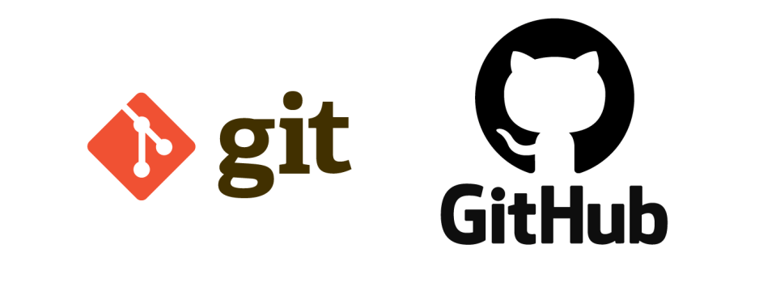
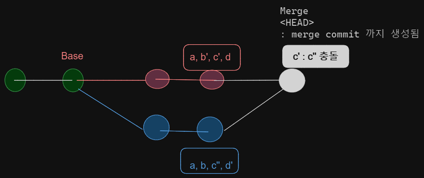
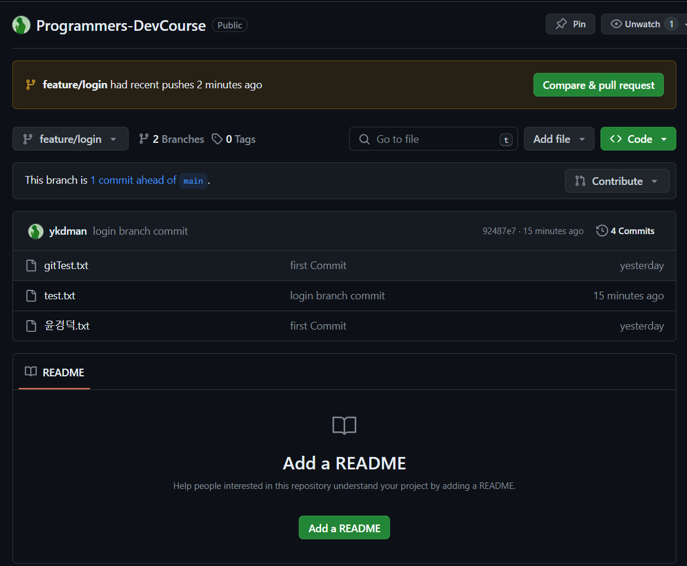

## Git 브랜치 이름 규칙 예시

- develope Branch 를 만들어서 기능 개발 착수 ?
- **기능 개발** : Fearute/Login, feature/select-product …
- **출시 준비** : Release-1.0.1, release-1.0.5, RB-1.0.5
- **긴급 수정** : hotfix-1.2.1
- 병렬 개발 및 원할한 PR을 위해 `develope` 브랜치에서 분기 한 여러 브랜치로 개발을 진행하는 것이 좋다.

## CLI 에서 Branch 생성 및 이동하기

```bash
$ git branch [브랜치 이름] : 브랜치 생성
$ git branch [브랜치 이름] [부모 브랜치명 ] : 새로운 브랜치가, 부모 브랜치에서 분기하여 나온다.
$ git checkout [브랜치 이름] : 해당 브랜치로 이동
$ git checkout - : 이전 브랜치로 이동
$ git branch -d [브랜치이름] : 브랜치 삭제
```
- 브랜치는 작업 후, Commit 까지 수행하여야 한다! (그래야 브랜치다~)

### 원격 저장소의 Branch 확인

```bash
$ git branch -r
```

## Git Flow (브랜치 전략)

- 원할한 협업을 위해 Git & Github 브랜치 전략을 사용해야 한다.
- 병렬 개발 및 생산성을 증대시키기 위해 사용된다.
- 대표적으로 사용되는 전략은 `fast-forwad`, `3 way` 전략이 있다.

### fast-forward 전략
- main 브랜치에서의 개발을 진행 하지 않는다.
- main 외의 브랜치에서 개발 진행 후 push & merge를 한다.
- 결과적으로 main은 merge 된 branch들의 commit을 추적하는 양상을 보여준다. (HEAD를 계속 최신화)

  #### 단점
  - 조상 브랜치인 main에서 수정을 할 수 없다는 것, (규칙에 따라 단점이 안 된다.)
  - 여러개의 자식 Branch 에서 작업을 진행 시, Merge 단계에서 상당히 많은 양의 Conflic가 일어날 가능성이 크다.
  - main을 건드리지 않는다는 철저한? 약속이 필요하다.
  - 병합에 대한 Commit이 생성되지 않기 때문에 히스토리 추적이 어렵다. (작업 완료 이후 시점)
  
### 3 Way 전략
- Base 브랜치를 두고 2개 이상의 분기 브랜치에서 개발을 진행 후, Merge 하는 방식

- 간단히 표를 통해 3 way 전략 수행일 알아봅시다

| A branch |  | Base |  | B Branch |
| -------- ||---||---|
| a | | a | | a |
| b'| |b| |b|
|c'| |c| |c''|
|d| |d| |d'|

- Base는 A,B 브랜치의 공통 조상 브랜치이다.
- 이 상태에서 Merge 할 떄, 조상 브랜치 Base 가 없다면, 원본에서 무엇이 변경되었는지 추적하기 어렵다. 떄문에 충돌의 여부조차 파악하기 힘들다.
- 조상(Base) 의 존재로 인해, 충돌이 발생한 사항에 대한 정확한 파악이 가능해지며, 병렬작업에 대해 부담이 줄어든다.
- merge commit 도 생성 되기 때문에, 히스토리 관리에 상당히 용이하다.

  #### Merge 후
  | Merge |
  | ----- |
  | a     |
  | b'    |
  | 충돌  |
  | d'    |
  
  - 위와 같이 여러 작업자가 작업을 해도, 공통 조상을 통해 COnflict(충돌) 이 발생한 지점을 쉽게 알고 해결 할 수 있다.

- 그래프 예시
  


## PR 요청 시 남기는 내용

- Github 에서 PR을 요청시, 내가 무슨 기능을 추가하고, 어떤 작업을 수행했는지 알려줘야 한다.
- main 이 아닌 다른 Branch 에서 변경사항이 일어나면 `Compare&PullRequest` 를 통해 PR 요청이 가능하다.

- PR 요청 예시
  
  ```markdown
  ### 주요 구현 내용
  - 로그인
  - 계정정보 : 아이디(이메일), 비밀번호
  - 인증 : JWT

  ### 이슈
  - 인증과정 구현 시, A 알고리즘 사용이 속도저하의 우려가 있어서 B 알고리즘으로 인증 구현
  ```

- PR 요청 시 필수 내용

  + 추가한 기능
  + 구현 정보
  + 이슈

### PR 룰

  - Github 세팅 메뉴를 통해 원하는 Branch에 PR 및 Push 에 대한 룰을 추가할 수 있다.
  - 강제 Push 금지, 최소 검토자 설정 등을 설정 가능하다.

### PR 완료 이후

  - PR 완료 이후에는, Merge된 Branch를 삭제한다.
  - 원격의 브랜치 최신화를 동기화 하기위해 로컬에서도 브랜치를 동기화 해준다.

    ```bash
    $ git fetch -p : 원격 브랜치정보를 동기화
    ```


## 실습

1. main 외에 `feature/login` , `feature/select-product` 브랜치를 생성 한다.
  

2. 공통으로 존재하는 test.txt 파일을 수정한다.

     + feature/login : 'feature 1 create' 수정 후 저장
     + feature/select-product : 'feature 2 create' 수정 후 저장
  
3. 각 브랜치 에서 Commit & push 진행

    + feature/1 commit & push
      

    + feature/2 commit & push
      

4. feature/login 브랜치 Merge (Compare & pull Request)
   
     
   
   - merge 버튼을 눌러 정상 merge를 수행한다.
5. feature/select-product 브랜치에서도 동일한 과정을 진행 한다.
6. feature/select-product에서는 PR 요청 후에 Conflict 충돌이 발생한다.
   

   - Resolve Conflicts 버튼을 눌러준다.
7. 반영할 변경사항을 선택(수정) 후 `mark as resolved` 를 눌러 commit change를 수행
  
  - `feature 2 create` 만 남겨주었다.

8. 수정된 Commit으로 정상 merge가 확인되면 이어서 merge를 수행 !
  
  


### 📖 회고

- 이번 과정을 공부하면서, Github가 새삼 얼마나 대단한지 느꼈다.
- 협업은 어느 개발자나 피할수 없는 부분이기에, github를 통해 협업하는 방식을 맛본것같아 너무 좋았다.
- git flow전략에는 위에 작성한 것보다 좀 더 디테일하고 복잡? 한 것들이 더 많은데 추후에 다뤄봐야겠다.
- github 짱짱