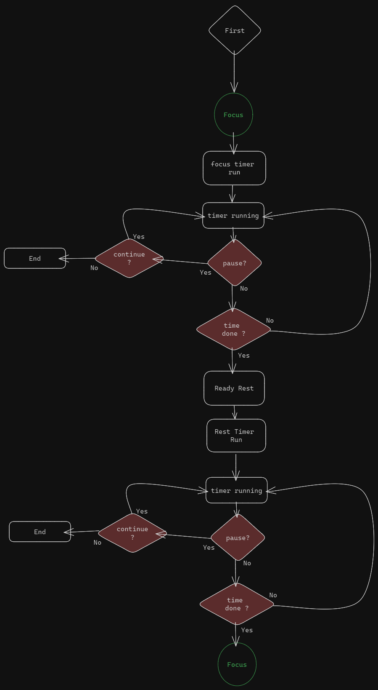
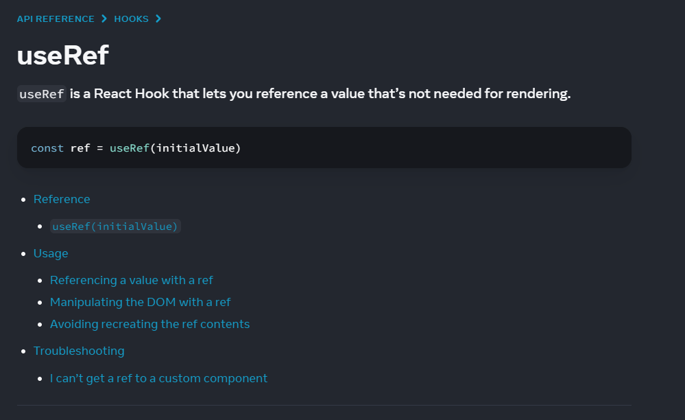
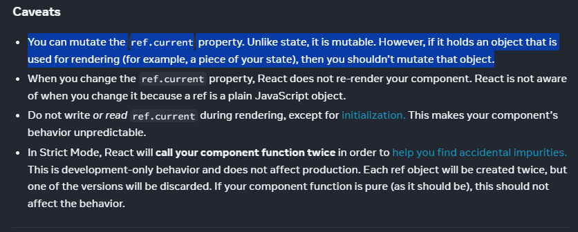

## 현재 구상도


1. Focus 타이머 시작
2. 타이머 진행 (Pause 분기)
3. Focus 타이머 끝
4. Rest 타이머 대기 상태
5. Rest 타이머 시작
6. 타이머 진행 (Pause 분기)
7. 타이머 끝
8. 다시 Focus 타이머 준비

- 위의 Flow 가 돌아가게끔 개발을 하고자 간단하게 도식화 해보았다.
- 시간 설정은 추후 구상하여 추가

## Interval 설정

- React의 useRef hook의 기능을 톡톡히 맛보았다.

    

    
  - 2번 째 사진 1~2문단이 useRef hook을 사용한 결정적인 이유  
  > mutable 한 값을 관리하고 싶을 떄는 state같은 rendering에 영향을 주는(Re-rendering) hook 이 아닌,  
  > 변화를 감지는 하지만 React가 re-render까지는 하지 않기 때문에 (순수한 JS Object라고 한다?)  
  > 나는 `setInterval` 과 `setTimeout` API를 사용해서 사용자가 원할때 시작하고, 
  > 중지한 후에는 중지시점의 타이머 시간부터 이어서 할 수 있는 것을 원했기 떄문에, useRef를 선택했다. (이게 정석일까?)  
  <br>
  <br>
    

  
  ```jsx
  // Timezone.jsx
  import { useRef, useState } from "react";

  import { excuteBtnStyle } from "../assets/Style.js";

  export default function TimeZone() {
    const [timer, setTimer] = useState({
      time: 0.1 * 1000 * 60,
      run: false,
      max: 0.1 * 1000 * 60,
    });
    const [timeState, setTimeState] = useState({
      run: false,
      pause: false,
    });

    const [timeCategory, setTimeCategory] = useState({
      focus: false,
      rest: true,
    });

    const timerInterval = useRef(null);
    const timerTimeout = useRef(null);
    const displayMinute = Math.floor(timer.time / (1000 * 60));
    const displaySeconds = Math.floor((timer.time % (1000 * 60)) / 1000);

    function cleareTimes() {
      clearInterval(timerInterval.current);
      clearTimeout(timerTimeout.current);
    }

    function timeEnd() {
      setTimeCategory((prevCategories) => {
        return {
          ...prevCategories,
          focus: !prevCategories.focus,
          rest: !prevCategories.rest,
        };
      });
    }
    function handleRun() {
      cleareTimes();

      if (!timeCategory.focus && !timeCategory.rest) {
        //첫수행
        setTimeCategory((prevCategories) => {
          return {
            ...prevCategories,
            focus: true,
            rest: false,
          };
        });
      }

      setTimeState((prevState) => {
        return {
          ...prevState,
          run: true,
          pause: false,
        };
      });
      timerInterval.current = setInterval(() => {
        setTimer((prevTime) => {
          // 이전 시간에서 1000ms(1초)를 빼서 재개
          return {
            ...prevTime,
            time: prevTime.time - 1000,
          };
        });
      }, 1000);

      timerTimeout.current = setTimeout(() => {}, timer.time);
    }

    function handlePause() {
      cleareTimes();

      setTimeState((prevState) => {
        return {
          ...prevState,
          pause: true,
          run: false,
        };
      });
    }

    return (
      <section id="timezone">
        <progress value={timer.time} max={timer.max}>
          {timer.time}
        </progress>
        <div id="user-selection">
          {((!timeState.run && !timeState.pause) || timeState.pause) && (
            <button id="btn-run" className={excuteBtnStyle} onClick={handleRun}>
              Run
            </button>
          )}

          {timeState.run && (
            <button
              id="btn-pause"
              className={excuteBtnStyle}
              onClick={handlePause}
            >
              Pause
            </button>
          )}
        </div>
        <div id="info">
          <p>{`${displayMinute}분 : ${displaySeconds}초`}</p>
        </div>
      </section>
    );
  }
  ```

  - 진짜 내가 개못한다는걸 또한번 깨닫게 되긴 했다.ㅎㅎ


## Component 구조

- App.jsx에서 관리하는 State가 없게 하고 싶은 이상한 욕심이 들었다.
- 그래서 TimeZone 이라는 컴포넌트를 만들어서 실직적으로 이 컴포넌트에서만 State가 다루어지게 하려고 한다.
- 그래도 개발하다가 필요하면 App 단위로 State를 넘겨서 전체적으로 관리하게 할것이다.

- 지금은 App.jsx 안에 TimeZone과 Header만 Import 된 상황  

  ```
  📦 yptm
  ├─ .eslintrc.cjs
  ├─ .gitignore
  ├─ README.md
  ├─ index.html
  ├─ package-lock.json
  ├─ package.json
  ├─ postcss.config.js
  ├─ public
  │  ├─ Layout1.png
  │  └─ vite.svg
  ├─ src
  │  ├─ App.jsx
  │  ├─ assets
  │  │  ├─ Style.js
  │  │  └─ timerScheme.js
  │  ├─ components
  │  │  ├─ Header.jsx
  │  │  └─ TimeZone.jsx
  │  ├─ index.css
  │  └─ main.jsx
  ├─ tailwind.config.js
  └─ vite.config.js
  ```
  ©generated by [Project Tree Generator](https://woochanleee.github.io/project-tree-generator)


## 느낀점

- 진짜 아주아주 남들한테는 쉬운 구현이더라도, 내손으로 제로부터 구현하려고하니까 생각이상으로 더 복잡하고 어려웠다.
- 내가 정말 못한다는걸 다시 한번 뼈저리게 느꼈다.
- 근데 하다보니까 재미는 확실히 있다. (성취감이 쩔어...)
- 일단 완성까지 달려보자