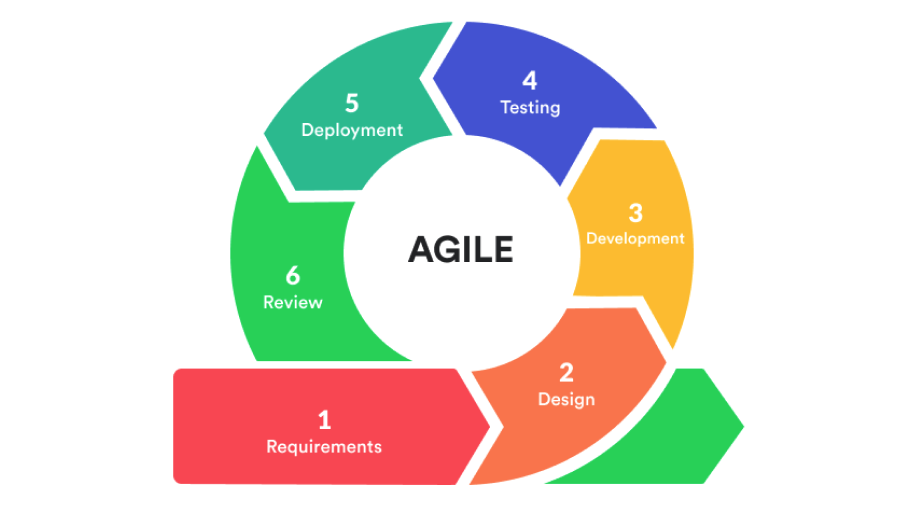

 출처 : [indevlab.com](https://indevlab.com/blog/what-is-agile-development/)

# Agile이란?
> Agile은 소프트웨어 개발 프로젝트에 대한 개발 방법론이다. (현재는 소프트웨어에 국한되지 않음)
> Agile이 가장 크게 중점은 두는 것은 `User` 즉, 사용자의 요청사항에 대한 기능 구현 이다.  
> 기본적으로 `Sprint` 라고하는 짧은 주기를 가지면서 반복된 `Sprint` 를 수행하여 목표 값을 빠르고, 반복적으로 성취한다.

- Agile은 `애자일 선언문 과 4가지 원칙` 의 규칙 안에 수행된다.
- [Agile 선언문과 4가지 원칙](https://agilemanifesto.org/iso/ko/manifesto.html)
- 선언문을 읽어보면 `고객의 만족도` 를 최우선으로 여긴다.
- 그에따른 팀의 상호작용 및 잘 작동하는 소프트웨어를 구축함에 의미를 둔다.
- 한마디로 `고객과 개발팀` 모두가 상호작용하며 발전해나가며 완성하는 프로젝트 를 지향한다는 것으로 이해된다.

## Agile을 수행한다면 필수로 알아야 할 용어들

1. Sprint (스프린트)
2. User Story (사용자 스토리)
3. Backlog (백로그)
4. Scrum (스크럼)

## Scrum
- 복잡한 제품을 개발하고 유지하기 위한 업무프레임 워크이다.
- 솔루션에 포함할 `기능`, `개선점` 에 우선순위를 둔다.
 
### Scrum 의 주요 특징
1. 1~4주 정도의 짧은 개발 주기를 가진다.
2. 개발 주기마다 `실제 동작할 수 있는 결과` 를 보여야 한다.
3. 개발 주기에는 `Goal` 이 존재하여야 한다. (목적을 잃은 개발이 되지 않게 한다.)
4. `공유` 의 목적으로 매일 최소 15분 정도의 `Scrum Meeting` 을 가져야 한다.
5. Team 을 우선으로 생각하고 착수 한다.

     - 공동의 목표를 `같이` 완수하는데에 초점이 맞추어져 있다.
6. 원활한 의사소통을 위해, 열린 공간과 마음을 모두가 갖추고 유지하여야 한다.
  
### Scrum 의 포지션
- Product Owner (제품 책임자)
- Scrum Master (스크럼 마스터)
- Developer Team (개발팀)
### Product Owner
- 제품 요구사항 (백로그) 관리 및 설명
- 백로그 우선순위 관리
- 요구사항을 충족시키게 개발 되었는지 확인

### Scrum Master
- 팀을 보호
- 장애요소 해결
- 일일 스크럼 회의 진행
- 모니터링 및 트랙킹

### Developer Team
- 최선의 기술력으로 백로그 (요구사항) 을 충족하는 개발을 통해 고객을 만족시킨다.
  
### Daily Scrum (일일 스크럼)
- 매일 어제 작업한일, 오늘 해야할 일, 해결해야 할 장애, 이슈사항을 `공유` 하는 회의

## Backlog (백로그)
- 개발할 제품의 요구사항(User Story) 묶음
- 우선순위로 관리 된다.

## UserStory (사용자 스토리)
- `사용자 관점` 에서의 요구사항
- 개발자 입장이 아닌 온전히 사용자 사용의 관점으로 요구사항을 명세한다.

## Sprint (스프린트)
- 계획, 개발, 리뷰 등 최소단위의 개발 Cycle
- 1~4주 단위로 정해진다.
  
### Sprint Backlog (스프린트 백로그)
  - 각각의 스프린트 목표에 도달하기 위해 필요한 작업 목록

### Sprint Review (스프린트 리뷰)
  - 스프린트 마지막 날, 개발한 내용을 검토하는 작업
  - 고객, 제품책임자 에게 시연 및 검토

### Sprint RetroSpective (스프린트 회고)
- 스프린트 마지막 날, 진행하면서 좋았던점, 개선할점을 도출
- 도출한 것들을 토대로 더 나은방향으로 개선을 수행

## 협업을 위한 툴들
- Trello
- JIRA
- Notion

## 참고 글
- [Medium : 애자일 Scrum(스크럼) 이해하기](https://medium.com/dtevangelist/scrum-dfc6523a3604)
- [Medium : Scrum Guide2020](https://medium.com/hgmin/scrum-guide-2020-2ab65414005a)
- [Medium : 애자일 12가지 원칙](https://medium.com/hgmin/agile-principles-%EC%95%A0%EC%9E%90%EC%9D%BC-12%EA%B0%80%EC%A7%80-%EC%9B%90%EC%B9%99-d3f386bd9839)
- [애자일 소프트웨어 개발 선언](https://agilemanifesto.org/iso/ko/manifesto.html)