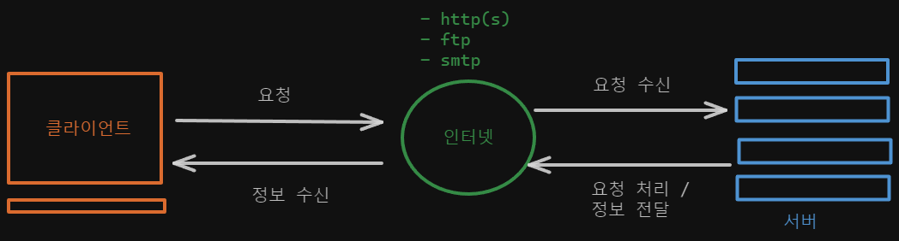
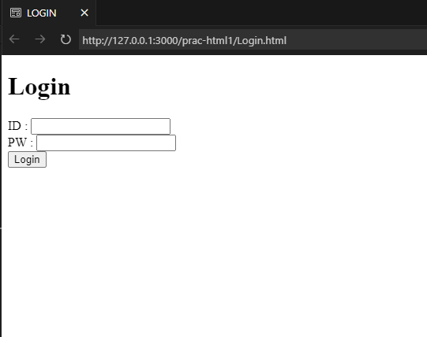

<!-- 
{: width="50%" height="70%"}{: .align-center} -->
<div align="center">

</div>


## 인터넷 (Internet)

- 전 세계의 모든 컴퓨터를 하나의 통신망 안에서 연결한다.

> 💡 “우리는 모두 연결되어있다.”
> 

## 웹 (Web)

- 월드 와이드 웹 (www)
- 인터넷에 연결된 컴퓨터를 통해서 사람들이 정보를 공유할 수 있는 공간

### 웹의 탄생 배경

- 1980년대에 스위스의 유럽 입자 물리 연구소 내에서, 연구원들 간의 편리한 정보교환을 위해 탄생 되었다. (팀 버너스 리)

## 웹 브라우저

- http 사용자 에이전트
- 쉽게 말해, 웹서버의 문서나 파일을 사용자에게 출력(표시) 해주는 역할을 한다.

## 웹의 구조

- 클라이언트 (Client)
- 서버 (Server)
- 음식점의 고객과, 서빙하는사람으로 이해해도 좋다

### 클라이언트

- 서비스를 `요청하고 제공받는` 컴퓨터

### 서버

- 서비스를 `제공하는` 컴퓨

### 프로토콜

- 클라이언트와 서버가 통신하기 위한 규약(약속)
- HTTP(s), FTP, 등 통신목적에 따른 다양한 프로토콜이 존재한다.
- 네트워크를 통한 정보 교환(통신)에는 프로토콜이 적용되어 있어야 한다.



## 웹 개발

### 프론트엔드 (Front-End)

- 사용자 측면의 기능을 개발하는 직무 (Client-Side)
- 사용자와 상호작용을 위한 기능을 개발하며, 그에 따른 서버 통신 및 정보 요청 / 수신과 같은 기능들을 개발한다.

### 백엔드 (Back-End)

- 서버 측면의 기능을 개발하는 직무 (Server-Side)
- 클라이언트 측에서 전달받은 데이터 및 요청을 내부 서버에서 처리 후, 클라이언트에 전달하는 기능을 개발한다.

## 풀스택

- Client-Side 와 Server-Side 양측의 기능을 모두 개발한다.

### IDE

- 통합 개발 환경
- 웹 및 앱 등을 개발 할 수 있는 환경을 제공하는 환경이다
- VSCode, IntelliJ, PyCharm 등이 있다.

## 프론트엔드에 관하여…

- HTML & CSS & JS 를 통한 Client-Side 개발을 담당한다.

### HTML

- 웹 페이지의 구조 (Structure)
- 뼈대를 담당한다.(골격)

### CSS

- 웹 페이지의 디자인
- 사람의 피부, 머리색, 눈동자색과 같은 미적? 요소를 담당

### JS

- 웹 페이지의 동작
- 근육을 담당한다. (근육이 있기에 움직이고, 동적일 수 있다!)

## HTML 기본

- 하이퍼 텍스트 마크업 랭귀지 (Hyper Text markup Language)
- `<>` (태그) 의 구조로 이루어져 있다.
- HTML 사용 선언
    
    ```html
    <!DOCTYPE html> : html 문서임을 명시
    
    <html> : html 전체를 감싸는 html 태그
    <head> : 페이지의 정보를 구성하는 head 태그
      <meta charset="UTF-8"> : 페이지의 metadata를 구성하는 meta 태그 
      <meta name="viewport" content="width=device-width, initial-scale=1.0">
      <title>Programmers-Login</title> : 웹 페이지의 제목을 나타내는 title 태그
    </head>
    <body> : 화면을 구성하는 body 태그
      
    </body>
    </html>
    ```

### 간단한 로그인 페이지 실습

```html
<!DOCTYPE html>
<html>
  <head>
    <meta charset="UTF-8" />
    <meta name="viewport" content="width=device-width, initial-scale=1.0" />
    <title>LOGIN</title>
  </head>
  <body>
    <h1>Login</h1>
    <form action="#">
      <label for="id">ID : </label>
      <input type="text" name="id" />
      <br />
      <label for="pw">PW : </label>
      <input type="password" id="pw" />
      <br />
      <input type="button" value="Login" />
    </form>
  </body>
</html>

```
