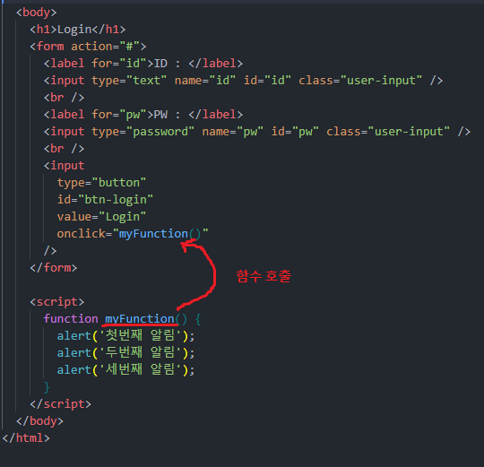
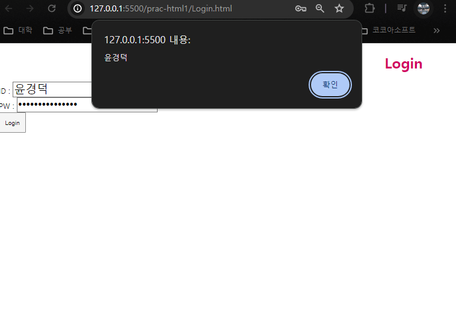

## 인라인 CSS

```html
<h1 style="color: red">Login</h1>
```

- 스타일을 지정하는 방법 중 하나
- 태그 안에 `style` 속성을 추가 후, 해당 속성안에서 CSS 속성을 설정 한다.

```html
<!-- Login.html -->
<!DOCTYPE html>
<html>
  <head>
    <meta charset="UTF-8" />
    <meta name="viewport" content="width=device-width, initial-scale=1.0" />
    <title>LOGIN</title>
  </head>
  <body>
    <h1 style="color: #d20062; text-align: center">Login</h1>
    <form action="#">
      <label for="id">ID : </label>
      <input type="text" name="id" id="id" style="font-size: 25px" />
      <br />
      <label for="pw">PW : </label>
      <input type="password" name="pw" id="pw" style="font-size: 25px" />
      <br />
      <input type="button" value="Login" style="width: 60px; height: 45px" />
    </form>
  </body>
</html>

```

## 내부 Style Sheet

- html 내부  `<head>` 안에 `<style>` 을 선언하여 그 안에서 스타일을 설정하는 방법

```html
<!-- Login.html -->
<!DOCTYPE html>
<html>
  <head>
    <meta charset="UTF-8" />
    <meta name="viewport" content="width=device-width, initial-scale=1.0" />
    <title>LOGIN</title>
    <style>
      h1 {
        color: #d20062;
        text-align: center;
      }
      .user-input {
        font-size: 25px;
      }

      #btn-login {
        width: 60px;
        height: 45px;
      }
    </style>
  </head>

  <body>
    <h1>Login</h1>
    <form action="#">
      <label for="id">ID : </label>
      <input type="text" name="id" id="id" class="user-input" />
      <br />
      <label for="pw">PW : </label>
      <input type="password" name="pw" id="pw" class="user-input" />
      <br />
      <input type="button" id="btn-login" value="Login" />
    </form>
  </body>
</html>

```

## 외부 Style Sheet

- html 파일내부가 아닌 html 파일 외부의 css 파일에 css 코드를 작성하는 방법
1. css 파일 생성 및 css 작성

```css
/* login.css*/
h1 {
  color: #d20062;
  text-align: center;
}
.user-input {
  font-size: 25px;
}

#btn-login {
  width: 60px;
  height: 45px;
}

```

1. login.html 파일에 `<link>` 를 사용하여 StyleSheet 연결

```html
<!DOCTYPE html>
<html>
  <head>
    <meta charset="UTF-8" />
    <meta name="viewport" content="width=device-width, initial-scale=1.0" />
    <title>LOGIN</title>
    <link rel="stylesheet" href="./login.css" />
  </head>
```

1. 연결된 StyleSheet가 적용되었는지 확인

## JS 입문

- HTML 요소를 선택하여 `제어` 할 수 있는 `스크립트 언어` 이다.
- `Node.js` 의 등장으로 Front-End & Back-End 모두에서 인기있게 사용되는 언어이다.
- JS도 인라인, 내부 스크립트, 외부 스크립트 형태로 작성 가능하다.

### 스크립트 언어

- 독립적으로 프로그램을 개발할 수 있는 언어가 아니다.
- 프로그램의 내부요소로써, 프로그램을 제어하는 언어
- 스크립트 언어를 실행하는 환경 : `런타임`
- JS를 실행하는 런타임 : `Node.js`
- 런타임의 발전으로 인해, 독립적으로 실행 가능한 스크립트 언어들이 있다.

### 인라인 JS

- html 요소 안에 작성

```html
      <input
        type="button"
        id="btn-login"
        value="Login"
        onclick="alert('버튼을 누름!')"
      />
```

- onclick, on~ 같이 사용자 상호작용시 작동되는 JS 스크립트 작성

### 내부 JS 스크립트

- `<body>` 또는 `<head>` 내부에 `<script>` 를 사용하여 JS 코드를 작성한다.
- `<script>` 에서 작성한 함수, 변수는 인라인 JS 안에서 호출가능하다.



### Document

- 브라우저가 불러온 웹 페이지를 나타낸다.
- 페이지 콘텐츠(`DOM 트리`)의 진입점 역할을 수행한다.
- document 객체 내부 인스턴스 Method 및 속성을 이용해 DOM 트리 조작이 가능하다.

### 원하는 요소 찾기 (in JS)

- `document.getElementById`
- `document.getElementByClassName`
- `document.getByName`
- `document.querySelector`
- `document.querySelectorAll`
위의 인스턴스 메소드 들로 연결된 html 페이지 내에서 원하는 요소를 찾고 사용할수 있다.

### 조건문

- `if .. else` 문을 사용

```jsx
if(조건문) {
	// 조건이 '참' 일때 수행되어야할 코드
	} else {
	// 조건이 '거짓' 일 떄 수행되어야 할 코드
	}
```

```html
  <body>
    <h1>Login</h1>
    <form action="#">
      <label for="id">ID : </label>
      <input type="text" name="id" id="id" class="user-input" />
      <br />
      <label for="pw">PW : </label>
      <input type="password" name="pw" id="pw" class="user-input" />
      <br />
      <input type="button" id="btn-login" value="Login" onclick="popId()" />
    </form>

    <script>
      function popId() {
        if (document.getElementById('id').value) {
	        // 'id' 를 id로 가진 Element의 값이 존재할때
          alert(document.getElementById('id').value);
        } else {
	        // 그렇지 않은 경우
          alert('아이디가 입력 되지 않았습니다.');
        }
      }

      /* function myFunction() {
        alert('첫번째 알림');
        alert('두번째 알림');
        alert('세번째 알림');
      } */
    </script>
  </body>
```

- 비어있는 문자열 ‘’ 은 False가 반환된다.



### 외부 JS 스크립트

- 외부 CSS 사용과 같이 js파일을 html파일에 연결해준다.
- `<script src='경로'>` 와 같은 형식으로 필요한 js파일을 연결한다.

```html
<!DOCTYPE html>
<html>
  <head>
    <meta charset="UTF-8" />
    <meta name="viewport" content="width=device-width, initial-scale=1.0" />
    <title>LOGIN</title>
    <link rel="stylesheet" href="./login.css" />
    <!--js 파일 연결 -->
    <script type="text/javascript" src="./login.js"></script>
  </head>
```