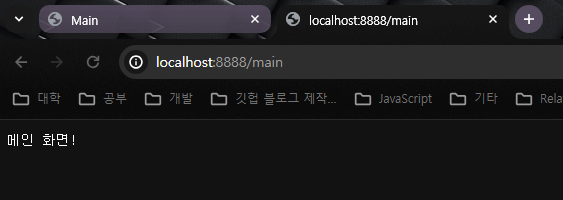

## 백엔드의 구조


### 웹 서버

- 역할
    - 정적 페이지에 대한 대응
    - 동적 페이지에 대한 처리는 `웹 어플리케이션 서버` 에 전달

### 정적 페이지

- 화면의 내용 / 데이터 등의 변화가 없는 페이지

### 동적 페이지

- 사용자 상호작용, 데이터 처리 등으로 인한 화면의 내용 / 데이터가 변하는 페이지

## 웹 어플리케이션 서버 & 데이터베이스

- 웹 어플리케이션 서버 (WAS) 는 동적 페이지를 처리
- 필요한 데이터의 연산을 위해 데이터베이스에 연결
- 데이터의 조회, 수정, 삭제에대한 처리를 WAS↔DB의 구조로 처리

## Node.js


> 구글의 `V8` 엔진을 통해 브라우저 외부 환경에서 Javascript를 실행하는 `런타임`
> 

## Node.js 로 웹서버 만들기

- 기본 서버 생성 코드

```jsx
/** server.js */
const http = require('node:http');

const hostname = '127.0.0.1';
const port = 8888;

const server = http.createServer((req, res) => {
  res.statusCode = 200;
  res.setHeader('Content-Type', 'text/html');
  res.end('<h1>HEllo World!</h1>');
});

server.listen(port, hostname, () => {
  console.log(`Server running at http://${hostname}:${port}/`);
});
```

```bash
$ node server.js
```

- `node` 명령어를 통해 지정한 파일을 Node 런타임에서 실행할 수 있다.

- 모듈식 서버

```jsx
/** index.js*/
const server = require('./server.js');
```

```bash
$ node index.js
```

- 작성된 `server.js` 파일의 `server` 객체를 index.js로 모듈식으로 호출하여 사용 가능하다.
- 다만 현재상태에서는 호출과 동시에 서버가 실행 된다. (유연성 Down)

### exports 로 서버코드 작성

```jsx
/** server.js */
const http = require('node:http');

const hostname = '127.0.0.1';
const port = 8888;

const start = () => {
  const server = http.createServer((req, res) => {
    res.statusCode = 200;
    res.setHeader('Content-Type', 'text/html');
    res.end('<h1>HEllo World!</h1>');
  });

  server.listen(port, hostname, () => {
    console.log(`Server running at http://${hostname}:${port}/`);
  });
};

exports.start = start;
```

```jsx
let server = require('./server.js');
server.start();
```

- `exports` 구문을 통해 모듈 내보내기가 가능해진다. (CommonJS 문법)

## server.js 코드 변경

- 아래와 같이 server 코드를 변경하였다.

```jsx
/** server.js */
const http = require('node:http');
const url = require('url');
const router = require('./router.js');

const hostname = '127.0.0.1';
const port = 8888;

const start = () => {
  const onRequest = (req, res) => {
    let pathName = url.parse(req.url).pathname;
    router.route(pathName);

    res.statusCode = 200;
    res.setHeader('Content-Type', 'text/html');
    res.end('<h1>HEllo World!</h1>');
  };

  const server = http.createServer(onRequest);

  server.listen(port, hostname, () => {
    console.log(`Server running at http://${hostname}:${port}/`);
  });
};

exports.start = start;
```

```jsx
/** router.js */
const route = (pathName) => {
  console.log(`Path Name : ${pathName}`);
};

exports.route = route;

```

## Server & Router

### Server

- 사용자 요청 (Request) 를 받는다.

### Router

- Request 의 Url 에 따라 루트를 지정한다.

## 화면에 이름 띄우기

- response 에 Header를 설정할때, 한글이름이 나오게 하려면 utf-8 인코딩 사용을 설정 해주어야 한다.


### Router 설정

- index.js

```jsx
let server = require('./server.js');
let requestHandle = require('./requestHandle.js');
server.start(requestHandle.handle);

```

- router.js

```jsx
const route = (pathName, handle) => {
  console.log(`Path Name : ${pathName}`);

  if (handle[pathName]) {
    handle[pathName]();
  }
};

exports.route = route;

```

- requestHandle.js

```jsx
const main = () => {
  console.log('main');
};

const login = () => {
  console.log('login');
};

const handle = {};
handle['/main'] = main;
handle['/login'] = login;

exports.handle = handle;

```

- server.js

```jsx
const http = require('node:http');
const url = require('url');
const router = require('./router.js');

const hostname = '127.0.0.1';
const port = 8888;

const start = (handle) => {
  const onRequest = (req, res) => {
    let pathName = url.parse(req.url).pathname;
    router.route(pathName, handle);

    res.statusCode = 200;
    res.setHeader('Content-Type', 'text/plain; charset=utf-8');
    res.end('윤경덕!');
  };

  const server = http.createServer(onRequest);

  server.listen(port, hostname, () => {
    console.log(`Server running at http://${hostname}:${port}/`);
  });
};

exports.start = start;

```

- 라우터를 설정하여, 전달되는 url에 따라 필요한 함수를 호출할 수 있도록 하였다.

### 요청 url 에 따른 화면 다르게 표시하기

- server.js

```jsx
const router = require('./router.js');

const hostname = '127.0.0.1';
const port = 8888;

const start = (handle) => {
  const onRequest = (req, res) => {
    let pathName = url.parse(req.url).pathname;
    res.statusCode = 200;
    res.setHeader('Content-Type', 'text/plain; charset=utf-8');
    router.route(pathName, handle, res); // res 인수 추가
  };

  const server = http.createServer(onRequest);

  server.listen(port, hostname, () => {
    console.log(`Server running at http://${hostname}:${port}/`);
  });
};

exports.start = start;
```

- router.js

```jsx
const route = (pathName, handle, res) => {
  console.log(`Path Name : ${pathName}`);

  if (handle[pathName]) {
    handle[pathName](res);
  }
};

exports.route = route;

```

- requestHandle.js

```jsx
const main = (res) => {
  console.log('main');
  res.end('메인 화면!');
};

const login = (res) => {
  console.log('login');
  res.end('로그인 화면!');
};

const handle = {};
handle['/main'] = main;
handle['/login'] = login;

exports.handle = handle;

```

- `/login` 페이지
    
    
    

- `/main` 화면
    
    
- 서브 URL 입력 없을 때 화면
    
    
    

### 404 페이지 추가

- router.js

```jsx
const route = (pathName, handle, res) => {
  if (pathName.includes('favicon')) { //favicon 이 계속 요청 된다.
    return;
  }
  console.log(`Path Name : ${pathName}`);

  if (handle[pathName]) {
    handle[pathName](res);
  } else {
    handle['/error'](res);
  }
};

exports.route = route;
	
```

- requestHandle.js

```jsx
const main = (res) => {
  console.log('main');
  res.end('메인 화면!');
};

const login = (res) => {
  console.log('login');
  res.end('로그인 화면!');
};

const home = (res) => {
  console.log('홈화면');
  res.end("ykdman's home");
};

const errorPage = (res) => {
  console.log('error page');
  res.statusCode = 404;
  res.end('Page 404!');
};

const handle = {};
handle['/main'] = main;
handle['/login'] = login;
handle['/'] = home;
handle['/error'] = errorPage;

exports.handle = handle;

```

- 잘못된 페이지 접근 시 화면
    
    
    

## 오늘 배운점

- node를 이용한 requst와 response를 다루는 서버 구성 방법
- html,css,js 를 활용하여 간단하게 보기좋은 페이지 만들기