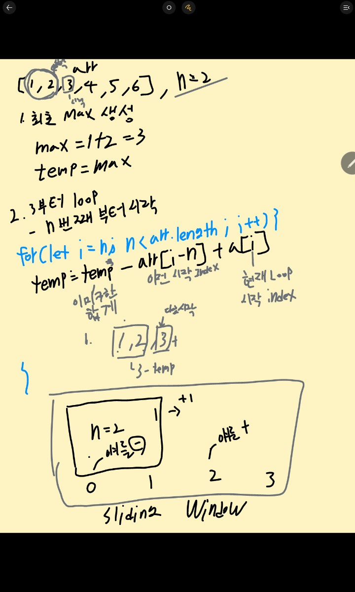

<div align='center'>

</div>

# 슬라이딩 윈도우 패턴

> **배열이나 문자열과 같은 일련의 데이터를 입력하거나 특정 방식으로 연속적인 
해당 데이터의 하위 집합을 사용하여 일련의 조건을 검사하고,
그에 따른 Process를 진행하는 패턴**


## 예시 문제
- maxSubArraysum 함수를 작성하라
- 인수로 array (int) 와 n (int) 를 받는다.
- array 안애서 연속된 n 개의 수의 합이 제일 큰 값을 반환하라.

### 테스트 케이스
```js
maxSubArraysum([1,2,5,2,8,1,5], 2) // 10 : 인접한 2+8이 제일 크다
maxSubArraysum([1,2,5,2,8,1,5], 4) // 17 : 2+5+2+8 이 제일 크다.
maxSubArraysum([1,2,4,1,6], 1) // 6 : 6이 제일 크다.
maxSubArraysum([4,2,1,6,2], 4) // 13 : 4 + 2+ 1 + 6 이 제일크다.
maxSubArraysum([], 4) // null
```

### 기본 해결 방법 - O(N^2)
```js
function maxSubArraySum(arr,num) {
	if(arr.length < num) {
	return null;
	}
	
	let max = -Infinity //음수 배열이 올수 있다.
	for(let i = 0; i < arr.length - num + 1; i ++ ) {
		let temp = 0;
		for (let j = 0; j < num; j ++ ) {
			temp += arr[i + j];
		}
		if (max < temp) {
			max = temp
		}
	}
}
```

### 슬라이딩 윈도우 패턴 해결법 - O(N)
```js
function maxSubArraySum_solution(arr, num) {
	let maxSum = 0;
	let tempSum = 0;
	if (arr.length < num) return null;
	// 최초 Max 생성
	for (let i = 0; i < num; i++) {
		maxSum += arr[i[;
	}
	
	tempSum = maxSum;
	
	for(let i = num; i<arr.length; i++) {
		tempSum = tempSum - arr[i - num] + arr[i]
		maxSum = Math.max(maxSum, tempMax);
	}
  return maxSum;
}
```

### 이해를 하기위한 필기...



## 배운점
- 슬라이딩 윈도우 패턴 이해하는데 40분 넘게 걸렸다.
- 근데 진짜 이름 그대로 여닫이 창문으로 이해해버렸다.
- 이걸 내가 제로에서 구현할수 있을까?

## 강의
- [Udemy : Javascript 자료구조 & 알고리즘 마스터 클래스](https://www.udemy.com/course/best-javascript-data-structures/)