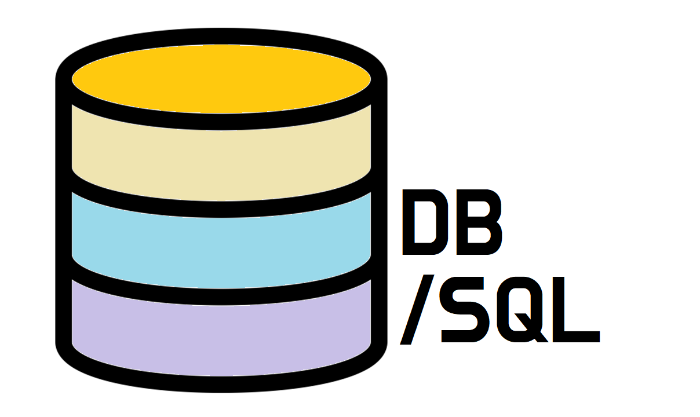

> 이 과정을 위해 WSL2 를 설치하여 Linux CLI 환경에서 Docker 및 Maria DB를 사용하였다.   
> 리눅스 짱

# 데이터베이스 (DB)

- 데이터를 효율적을 `관리` 하기 위한 데이터 집합체
- 데이터의 중복을 막고, 효율적이고 빠른 데이터 연산을 가능케 한다.
- 데이터는 데이터베이스 관리 시스템(DBMS) 에 의해 관리 된다.
- 데이터의 작성 및 질의 문으로 `쿼리문` 을 사용한다.

## 대표적인 DB 브랜드

- Oracle, MySQL, MariaDB, MongoDB, PostgresQL

## SQL (Structured Query Language)

- DB에 연산을 요청하기 위해 사용되는 `구조화 질의문`
- 데이터의 삽입,조회,수정,삭제 기능을 수행시킨다.
- 각 브랜드별로 주요 SQL 문법은 같으며, 브랜드별 SQL문이 (주요하지 않은?) 다른 경우도 있다.

# Doker

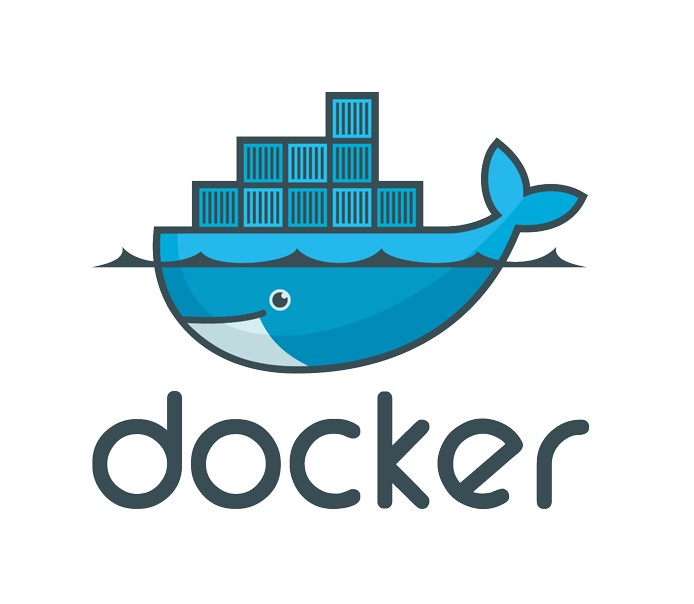

> 응용 프로그램들을 프로세스 격리 기술들을 사용해 컨테이너로 실행하고 관리하는 오픈 소스 프로젝트이다. - 위키피디아 -
> 

## 도커 설치

1. 운영체제에 맞는 Docker 설치 파일 다운로드
2. Windows는 계속 체크하여 설치 진행
3. 설치 완료 후, 재시작하여 설치 완료 클릭하여 재시작
4. PowerShell 관리자 모드에서 docker 정상 설치 확인
    
    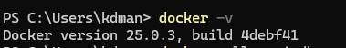
    

### 도커에 마리아 DB 설치

```powershell
docker pull mariadb
docker run --name mariadb -d -p 3306:3306 --restart=always -e MYSQL_ROOT_PASSWORD=root mariadb
docket run --name [컨테이너이름] -d -p [포트:포트] -restart=always -e MYSQL_ROOT_PASSWORD=[비밀번호] [컨테이너이름]
```

- 3306 은 `포트번호`

### 도커로 마리아 DB가 있는 컨테이너 접속

```powershell
docker exec -it [컨테이너이름] /bin/bash
docker exec -it mariadb /bin/bash

exit 명령시 도커환경을 빠져 나온다
```

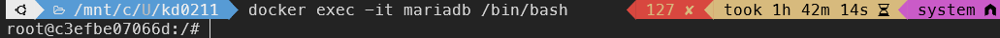

### mariaDB 컨테이너에서 mariadb 실행

- mysql이 깔려있는 경우

```powershell
mysql -u root -p
```

- mariadb만 설치 되어있는 경우

```powershell
mariadb -u root -p
```

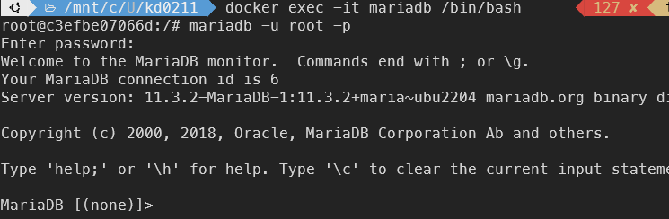

### 도커 데스크탑에서 mariadb 구동 상황 확인

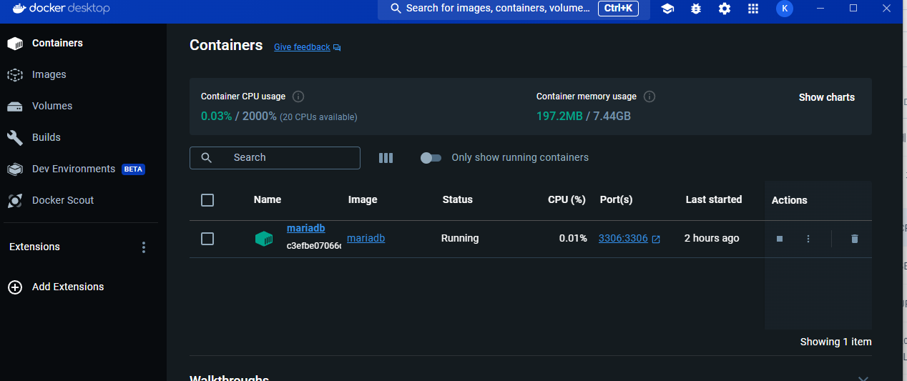

## MariaDB 사용하기

- In 도커환경
- SQL 구문을 사용하여 DB를 관리 및 조작한다.

### 데이터베이스 목록 조회

```sql
SHOW DATABASES;
```

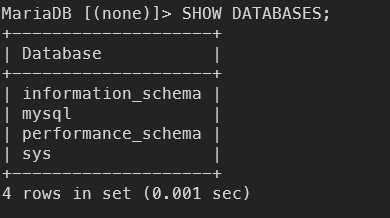

### Tennis DB 생성

```sql
CREATE DATABASE Tennis;
```

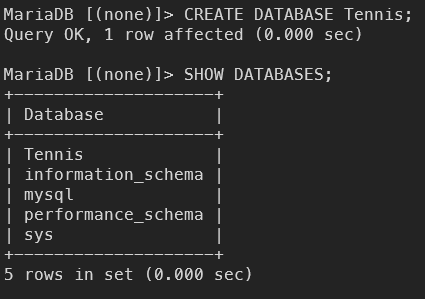

### Tennis DB 접속

```sql
USE Tennis;
```

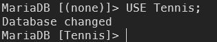

### Table 만들기

```sql
CREATE TABLE member
(
	id VARCHAR(30),
	name VARCHAR(30),
	pwd VARCHAR(30)
)
```

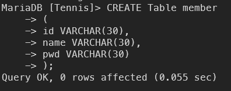

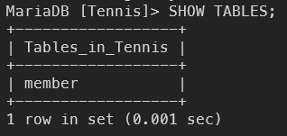

### Table 조회 및 데이터 삽입

```sql
// 테이블 데이터 조회
SELECT 컬럼명 FROM Table_Name;

// 테이블 데이터 삽입
INSERT 컬럼명1, 컬럼명2,.. INTO 테이블명
VALUES (컬럼1 데이터, 컬럼2 데이터, ...);
```

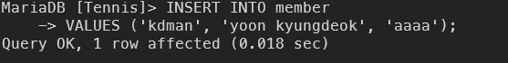

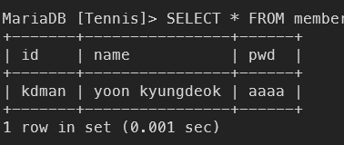

### 조건 조회 문

```sql
SELECT 컬럼명 FROM 테이블 명
WHERE 조건;
```

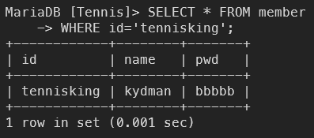

### 테이블 데이터 수정 (UPDATE)

```sql
UPDATE 테이블명 SET 컬럼명 = 수정값 WHERE 조건식;
UPDATE member SET pwd = 'wwwww' WHERE id = 'tennisking';
```

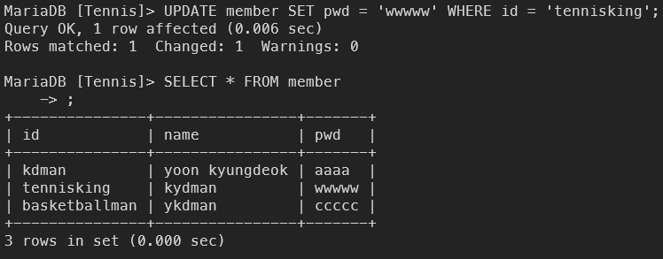

- 조건식을 쓰지 않으면, table에 있는 모든 데이터가 UPDATE 된다.

### 테이블 데이터 삭제 (DELETE)

```sql
DELETE FROM 테이블명 WHERE 조건;
DELETE FROM member WHERE name = 'ykdman';
```


- UPDATE 와 같이 조건식을 사용하지 않으면, 테이블의 모든 Row가 삭제 된다.

## Product 테이블 생성

- 이제 실습에 사용할 product 테이블을 만든다.

```sql
CREATE TABLE product
( 
	ID INT,
	name VARCHAR(30),
	description VARCHAR(30),
	price INT
);
```

- 실습 시 사용할 데이터를 임의로 넣어준다.

```sql
INSERT INTO product
VALUES (1, 'Red Racket', 'Hot Red!', 300000),
(2, 'Black Racket', 'Chick Black!', 500000),
(3, 'Blue Racket', 'Cool Blue!', 350000);
```

### Node에 도커 mariaDB연결

- `npm i mysql --save` 를 통해 npm mysql 패키지 설치
- 프로젝트 폴더 내 database \ connect \ mariadb.js 파일 생성
- mariadb.js 에 Connection 에 필요한 정보를 작성 후, module.exports로 내보내준다.

```jsx
const mariadb = require("mysql");

const connect = mariadb.createConnection({
  host: "localhost",
  port: 3306,
  user: "root",
  password: "root",
  database: "tennis",
});

module.exports = connect;

```

- requestHandle.js 내에 mariadb 에 쿼리를 수행해 row를 추출

```jsx
const mariadb = require("./database/connect/mariadb.js");

const main = (res) => {
  console.log("main");

  mariadb.query(`SELECT * FROM product`, function (err, rows) {
    console.log(err);
    console.log(rows);
  });

  res.statusCode = 200;
  res.setHeader("Content-Type", "text/plain; charset=utf-8");
  res.end("메인 화면!");
};
```

- html 파일을 읽어와 응답으로 렌더링 해주기

```jsx
/** requestHandel.js */
const mariadb = require("./database/connect/mariadb.js");
const fs = require("fs");

// view page
const mainView = fs.readFileSync("./main.html", "utf-8");

const main = (res) => {
  console.log("main");

  mariadb.query(`SELECT * FROM product`, function (err, rows) {
    console.log(err);
    console.log(rows);
  });

  res.statusCode = 200;
  res.setHeader("Content-Type", "text/html; charset=utf-8");
  res.write(mainView); // main.html
  res.end();
};
```

- main 화면 부르기는 성공하였으나,  내부 asset 이나 style이 적용이 안되어있음
- log를 확인해보니, GET 요청으로 img나 css 파일에 대한 요청이 실패하였음이 발생
- handle 파일 안에 handle 객체에 각 요청 url 경로별 callback 함수들을 정의

```jsx
/** requestHandle.js */
const blueRacket = (res) => {
  fs.readFile("./asset/img/blueRacket.png", function (err, data) {
    res.statusCode = 200;
    res.setHeader("Content-Type", "text/plain; charset=utf-8");
    res.write(data);
    res.end();
  });
};
const blackRacket = (res) => {
  fs.readFile("./asset/img/blackRacket.png", function (err, data) {
    res.statusCode = 200;
    res.setHeader("Content-Type", "text/plain; charset=utf-8");
    res.write(data);
    res.end();
  });
};

const mainCss = (res) => {
  fs.readFile("./style/main.css", function (err, data) {
    res.statusCode = 200;
    res.setHeader("Content-Type", "text/css; charset=utf-8");
    res.write(data);
    res.end();
  });
};

// handle key value 할당
const handle = {};
handle["/main"] = main;
handle["/login"] = login;
handle["/"] = home;
handle["/error"] = errorPage;

/**
 * image directory
 */
handle["/asset/img/redRacket.png"] = redRacket;
handle["/asset/img/blueRacket.png"] = blueRacket;
handle["/asset/img/blackRacket.png"] = blackRacket;

handle["/style/main.css"] = mainCss;
exports.handle = handle;
```

- html 오더 버튼 클릭시 발생 시키기 위한 코드작성

```html
<!-- main.html -->
<div class="card_page">
      <div class="card_item">
        
        <p class="card_title">Red Racket</p>
        <input
          class="card_btn"
          type="button"
          value="Order"
          onclick="location.href='/order?productId=1'"
        />
      </div>
```

- url query 를 발생 시킨다.

```jsx
// server.js
const http = require("node:http");
const url = require("node:url");
const router = require("./router.js");

const hostname = "127.0.0.1";
const port = 8888;

const start = (handle) => {
  const onRequest = (req, res) => {
    let pathName = url.parse(req.url).pathname;
    // url Query 를 확인
    let queryData = url.parse(req.url, true).query;

    router.route(pathName, handle, res, queryData.productId);
  };

  const server = http.createServer(onRequest);

  server.listen(port, hostname, () => {
    console.log(`Server running at http://${hostname}:${port}/`);
  });
};

exports.start = start;

```

```jsx
// router.js
const route = (pathName, handle, res, productId) => {
// productId 인수
  if (pathName.includes("favicon")) {
    return;
  }
  console.log(`Path Name : ${pathName}`);

  if (typeof handle[pathName] === "function") {
    handle[pathName](res, productId);
  } else {
    res.writeHead(404, { "Content-Type": "text/html" });
    res.write(`<h1>PAGE Not Found!</h1>`);
    res.end();
  }

  // if (handle[pathName]) {
  //   handle[pathName](res);
  // } else {
  //   handle['/error'](res);
  // }
};

exports.route = route;
```

```jsx
// requestHandle.js
const order = (res, productId) => {
  res.writeHead(200, { "Content-Type": "text/html" });
  mariadb.query(
    `
  INSERT INTO orderlist
  VALUES ('${productId}', '${new Date().toLocaleDateString}');
  `,
    function (err, row) {
      console.log(row);
    }
  );
};
```