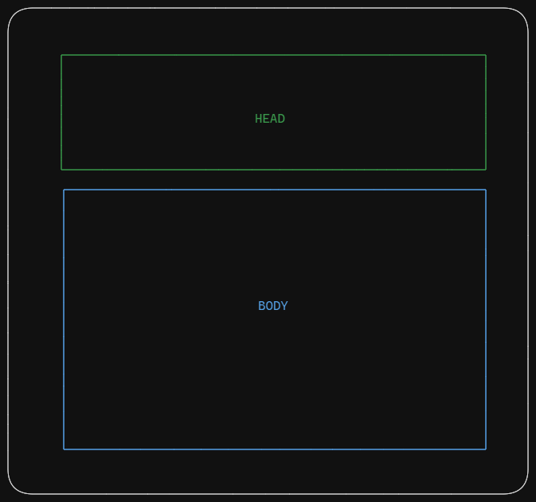
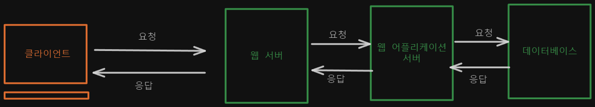

# 백엔드 기초

## 백엔드 구조

- 정적 페이지
    - 화면의 내용 과 데이터 같은 부분이 변동이 없는 페이지
    - 보통 웹서버 에서 컨트롤
- 동적 페이지
    - 데이터 처리, 연산을 통해 화면의 내용 및 데이터가 변하는 페이지
    - 보통 웹 어플리케이션 서버에서 컨트롤

## API

- Application Programming Interface 의 약자
- 응용 소프트웨어 와 다른 소프트웨어 (또는 서비스)와 상호작용 (통신) 하기 위한 방법을 정의 하는 규칙 묶음이다.
- API는 식당의 `점원` , 클라이언트는 `손님`, 서버 및 데이터베이스는 `요리사` 라고 볼 수 있다.

## REST API

- Represtational State Transfer, RESTful 이라고도 한다.
- REST 아키텍쳐 스타일의 제약조건을 준수 하여, RESTful 웹 서비스와 상호작용 할 수 있도록 하는 API

## 프로토콜 (Protocol)

- 클라이언트와 서버 간 통신을 위해 지켜야 하는 `규약`
- 계층별 프로토콜의 종류 (OSI 7계층)

| 계층                   | 프로토콜                               |
| ---------------------- | -------------------------------------- |
| 응용(Application)      | HTTP, SMTP, FTP, Telnet                |
| 표현(Presentation)     | ASCII, MPEG, JPEG, MIDI                |
| 세션(Session)          | NetBIOS, SAP, SDP, NWLink              |
| 전송(Transport)        | TCP, UDP, SPX                          |
| 네트워크(Network)      | IP, IPX                                |
| 데이터 링크(Data Link) | Ethernet, Token Ring, FDDI, Apple Talk |
| 물리(Physical)         | 없음                                   |

## HTTP 프로토콜

### HEAD

- 통신 상태
- 요청에 대한 응답 형태

### BODY

- 요청/응답 데이터
    - 데이터
    - 화면
    - JSON
    - 등 ….

## URL

- Uniform Resource Locator
- 인터넷 상 리소스의 `주소`

## REST API URL 규칙

- 대문자 X, 소문자 사용
- 언더바 사용 X, 하이픈 사용
- URL의 마지막에 슬래쉬는 포함하지 않는다. (’/’)
- `행위를 포함하지 않는다.`
    - 목적을 포함하지 않는다. (METHOD 를 포함하지 않는다는 말)
- 파일 확장자를 포함하지 않는다.
- 복수형을 쓴다.

### REST API URL 예시

- *https://shop.com/select_all_products*
    - ⇒ `https://shop.com/products` : `[GET]`
- *https://shop.com/DeleteProduct*
    - ⇒ `https://shop.com/products` : `[DELETE]`
- *https://shop.com/post-product*
    - ⇒ `https://shop.com/products` : `[POST]`
- *https://shop.com/SELECT-one-product*
    - ⇒ `https://shop.com/products/:product-id`  : `[GET]`

## 느낀점
- URL 에 대해 작명 규칙이 있는것을 처음 알았다.
- METHOD가 사실 중요하고, 그것을 어떤식으로 명세할지 설계하는것이 제일 중요한것 같다.
- 얼른 Backend를 제대로 맛보고 싶다.