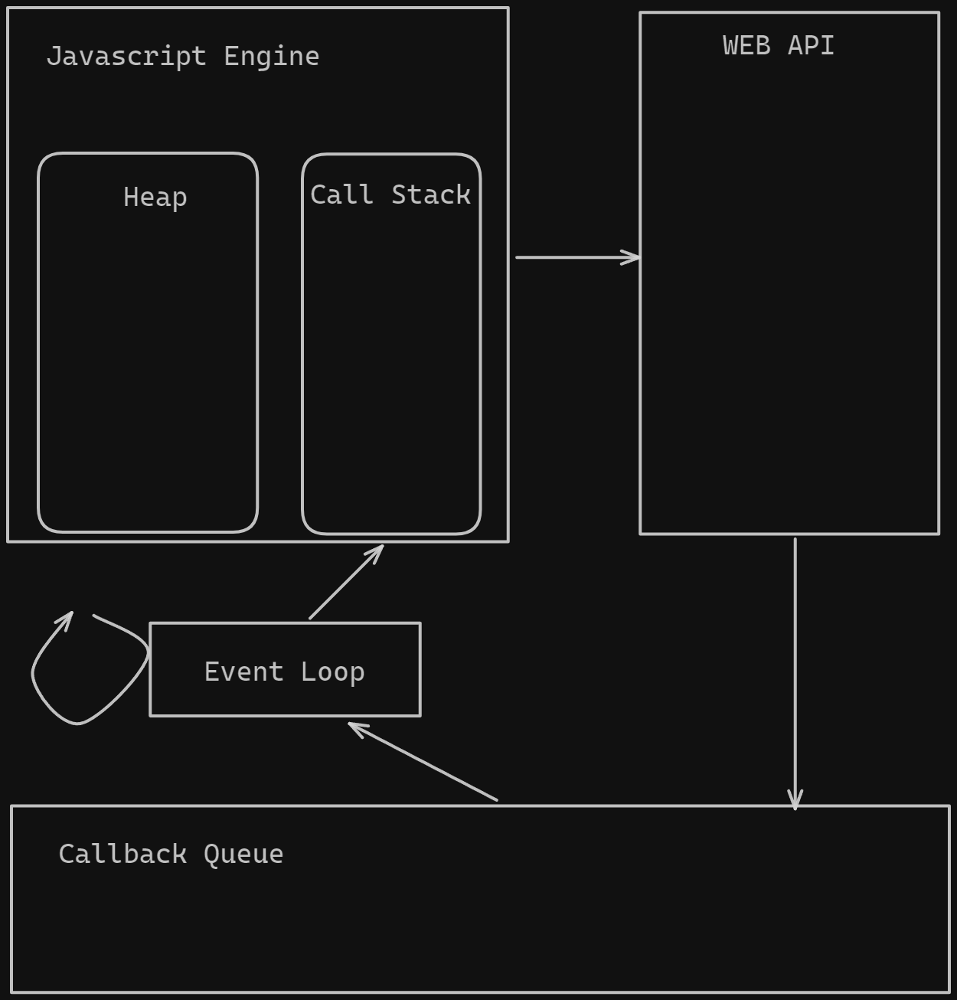
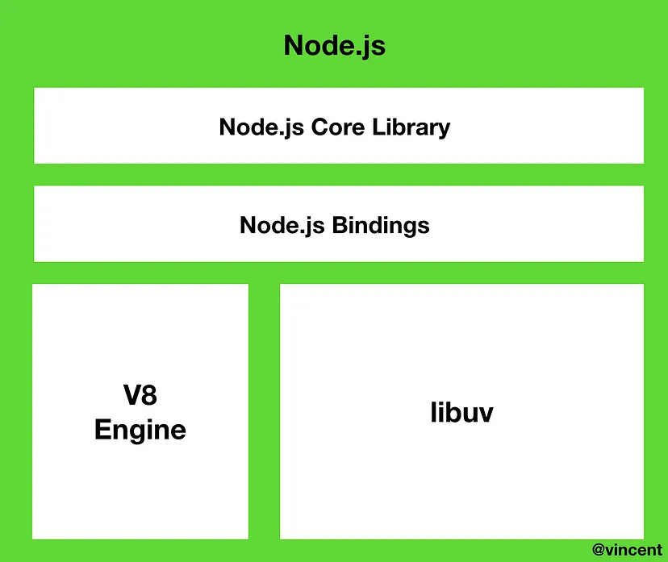
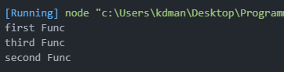
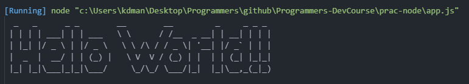

## HTTP method

- 생성 : `POST`
- 조회 :  `GET`
- 수정 :  `PUT` , `PATCH`
    - `PUT` : 덮어쓰기 (값 존재 유무 상관없이)
    - `PATCH` : 부분수정
- 삭제 : `DELETE`

## Javascript 작동 원리

### Javascript 구성 요소

- Javascript 엔진
    - Heap
    - Call Stack
- Web API
- Event Loop
- Callback Queue

### Javascript 작동 예시



```jsx
/** 실행 코드*/
//1
console.log("시작")

//timout
setTimeout(()=> {
	console.log("1초")
 },1000)
 
 //2
 console.log("끝")
```

1. `1번함수` 가 Call Stack에 등록된다.
2. `1번함수` 는 그대로 실행 되어 ‘시작’ 이 출력된다.
3. `timeout 함수` 가 Call Stack 에 등록된다.
4. `timeout 함수` 는 비동기 함수 이므로 WEB API 로 이동 (실행 X)
5. `2번함수` 가 Call Stack 에 등록된다.
6. `2번함수` 가 실행되오 ‘끝’ 이 출력된다.
    1. 1초가 아직 지나지 않아 timeout 함수는 아직 Web API에 있다.
7. 1초가 지나 Callback Queue 에 `timeout` 함수가 등록된다.
8. `Event Loop` 가 Call Stack이 비었는지 확인하고 `timeout` 함수를 call stack 에 등록한다.
9. call stack 에 등록된 `timeout` 안의 callback 함수가 실행 된다.
10. 모든 함수가 호출 및 실행 되고 Call stack이 비어지게 된다.

- `Event Loop`
    - Call Stack 이 비어있는지 주기적으로 확인 (`tick` 이라고함)
    - Call Stack이 비었다면 Callback Queue에서 Callback function 을 Call Stack 에 등록 한다.

## Node.js 특징

- 싱글 스레드
- 이벤트 기반
- Non Blocking I/O

### Node.js 내부구조



- 내장 라이브러리
- V8 엔진
- libuv : 이벤트 기반 , 논블로킹 I/O 가 구현되는 곳

### Non-Blocking I/O

> Input 과 Output 이 관련된 작업 (http, Database CRUD, third Party api, filesystem)등의 블로킹 작업을 백그라운드에서 수행하고,이를 비동기 콜백함수로 이벤트 루프에 전달하는것
> 
- 자세한 설명은 아래 참고 글의 ‘nodejs 동작 원리’ 글로!

```jsx
function firstFunc() {
  console.log('first Func');
}
function secondFunc() {
  console.log('second Func');
}
function thirdFunc() {
  console.log('third Func');
}

firstFunc();
secondFunc();
thirdFunc();

/** 출력 결과*/
first Func
second Func
third Func
```

- 일반적인 호출의 경우 순차적으로 지정된 함수가 실행 됐다.

```jsx
/** Non Blocking Practice */

function firstFunc() {
  console.log('first Func');
}
function secondFunc() {
  console.log('second Func');
}
function thirdFunc() {
  console.log('third Func');
}

firstFunc();
setTimeout(secondFunc, 2000);
thirdFunc();
	
```



1. `firstFunc` 가 실행됐다.
2. setTimeout으로 감싸진 `secondFunc` 가 실행 대기열에 있었지만 timout 설정으로 인해 다른 대기열로(callback Queue) 이동 (2초를 소진후 call stack 으로 돌아온다)
3. `thirdFunc` 가 실행 됐다
4. 2초가 지난 후 `secondFunc` 가 다시 call stack으로 호출되어 수행 되었다.

## 라이브러리

> 라이브러리는 주로 소프트웨어를 개발할 때 컴퓨터 프로그램이 사용하는 비휘발성 자원의 모임이다. 여기에는 구성 데이터, 문서, 도움말 자료, 메시지 틀, 미리 작성된 코드, 서브루틴, 클래스, 값, 자료형 사양을 포함할 수 있다 -위키백과-
> 

## 프레임워크

> 소프트웨어 프레임워크(software framework)는 복잡한 문제를 해결하거나 서술하는 데 사용되는 기본 개념 구조이다. 간단히 뼈대, 골조(骨組), 프레임워크(framework)라고도 한다. -위키백과
> 

## NPM

- Node Package Modules
- Node Package를 관리

[npm | Home](https://www.npmjs.com/)

- 필요한 `라이브러리` 를 `npm install` 명령어를 통해 프로젝트에 사용할 수 있다.
- 각 npm 라이브러리 마다 사용법이 적혀있으니 사용방법을 확인하자

### figlet 라이브러리 사용해보기

[npm: figlet](https://www.npmjs.com/package/figlet)

1. figlet 설치

```bash
npm i figlet
```

1. figlet 코드 작성

```jsx
/** app.js */
const figlet = require('figlet');

figlet('Hello World!!', function (err, data) {
  if (err) {
    console.log('Something went wrong...');
    console.dir(err);
    return;
  }
  console.log(data);
});

```

- 디버깅 결과



## 참고한 글
- [Medium : Node.js 동작원리](https://medium.com/@vdongbin/node-js-%EB%8F%99%EC%9E%91%EC%9B%90%EB%A6%AC-single-thread-event-driven-non-blocking-i-o-event-loop-ce97e58a8e21)
- [Medium : javascript 동작원리](https://blog.toycrane.xyz/%EC%A7%84%EC%A7%9C-%EC%89%BD%EA%B2%8C-%EC%95%8C%EC%95%84%EB%B3%B4%EB%8A%94-%EC%9E%90%EB%B0%94%EC%8A%A4%ED%81%AC%EB%A6%BD%ED%8A%B8-%EB%8F%99%EC%9E%91-%EC%9B%90%EB%A6%AC-c7fbdc44cc97)
