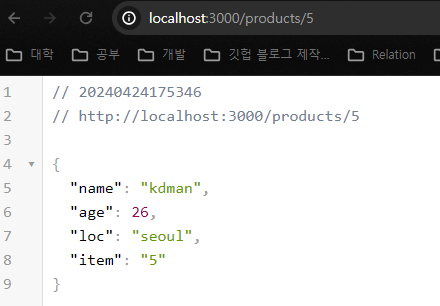

# Express.js

[Express - Node.js 웹 애플리케이션 프레임워크](https://expressjs.com/ko)

- Node.js 기반의 웹 개발 프레임워크

## Express.js 설치

1. 새로운 프로젝트 생성
2. 프로젝트 내부에서 `npm init` 으로 `package.json` 파일 생성
3. `npm i express` 명령어로 프로젝트에서 Express.js 설치

- Hello World 출력하기

```jsx
const express = require("express");

const app = express();

app.get("/", (req, res) => {
  res.send("Hello World");
});

app.listen(3000);

```

## Get 요청 받기

```jsx
const express = require('express');
const app = express();

/**app.get
 * arg1 : url 
 * arg2 : callbackFn (request, response)
 */
app.get("/test", (req, res) => {
  res.send("Test API");
});
```

- `app.get()` 함수를 통해 `GET` 요청에 대한 서버의 실행 함수를 작성할 수 있다.

## PORT 세팅

```jsx
const express = require('express');
const app = express();

const PORT = 3000;

app.listen(PORT);
```

- `app.listen` 을 이용하여, 서버가 열어놓을 Port 번호를 설정할 수 있다.

## 라우팅 처리

- app 객체(express 객체) 와 `http Method` 의 조합으로 이루어진다.

```jsx
app.get('/' , callbackFn); // GET 요청 처리
app.post('/', callbackFn); // POST 요청 처리
app.put('/', callbackFn); // PUT 요청 처리
app.delete('/', callbackFn); // DELETE 요청 처리
```

## 매개변수 URL 라우팅

- 동적으로 변할 수 있는 url (ex : /products/1) 에 대한 요청 라우팅을 처리할 수 있다.
- app.httpMethod 라우팅 함수에서 url 인수에 `:` 를 이용하면 url내의 변동 url을 request 의 params 객체로 받아올 수 있다.

```jsx
app.get("/products/:item", (req, res) => {
  const testObj = {
    name: "kdman",
    age: 26,
    loc: "seoul",
    item: req.params.item // 변동 url
  };

  res.send(testObj);
});
```



## 객체란?

```jsx
const obj = {
	name : 'kdman',
	age : 45,
	loc : 'south korea'
}
```

- 객체는 이름과 값으로 (key, value) 구성된 프로퍼티의 `정렬되지 않은` 집합이다.

## JSON

- `Javascript Object Notation` 의 약자
- 경량의 Data 교환 방식이다.
- JS에서 객체(Object)를 만들 때 사용하는 표현식을 의미

### JSON 특징

- 다른 프로그래밍 언어를 이용해서도 쉽게 만들 수 있다.
- 특정언어에 종속되지 않고, 대부분의 프로그래밍 언어에서 JSON 포맷의 데이터를 핸들링 할 수 있는 라이브러리를 제공한다.
- 항상 쌍따옴표를 이용하여 표기
- Number, Null, String, Array, Object, Boolean 을 사용할 수 있다.