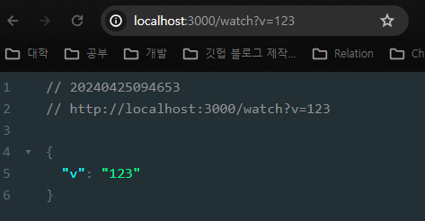
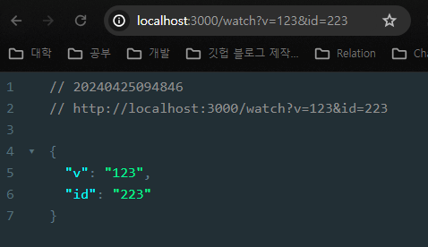

## JS 숫자형 변환

- `parseInt` 를 사용하여 문자열을 숫자형으로 변환 할 수 있다.
- 문자열 변수나 표현식 앞에 `+` 를 붙여도 숫자형 변환이 가능하다.
- JS 는 문자와 숫자 비교시에 타입을 변환하여 서로 비교가 되게 한다.
    - ‘10’ == 10 ⇒ true
    - 동등 비교 연산자 (==) 는 비교 값들의 타입을 변환 시킨다. (실제 값자체가 변환되지는 않음)
    - 엄격한 동등 비교 연산자 (===) 는 타입 변환 없이 있는 그대로 동등 비교를 수행한다.
    

## Express.js url 쿼리 받아오기

```jsx
app.get("/watch", (req, res) => {
  const querys = req.query;
  console.log(querys);

  res.send({ ...querys });
});
```





- url 뒤에 `?` 로 Url 쿼리문을 입력할 수 있다.
- app.get 의 req 인수가 query 를 받아올 수 있다.
- url Query도 key-value 의 형태로써 `key=value` 의 형태로 되어있다.
- url Query는 `&` 으로 추가적인 조건을 더 붙여 쓸 수 있다.

## JS 객체 및 배열 비구조화 할당

- 객체와 배열에는 `비구조화 할당` 이라는 아주 편리한 방식으로 데이터를 할당할 수 있는 방법이 있다.

- 객체 비구조화 할당

```jsx
const obj = {
	name : 'kd',
	age : 450,
	};
	
const { name, age } = obj;
	
console.log(name); // 'kd'
console.log(age); // 450
	
// 객체의 Key 와 같은 이름의 변수를 { } 로 감싸서 할당하면, 객체에서 자동으로
// 매칭 되는 key 이름을 가진 변수에 value를 할당 해준다.
// 이름이 정확하다면, {} 안의 순서는 중요하지 않다. (애초에 객체가 순서성이 없기때문)
```

- 배열 비구조화 할당
- 배열의 비구조화 할당은 배열의 Index와 관련있다.

```jsx
const arr = [1, 2, 3];
const [one, two, three] = arr;

console.log(one); // 1
console.log(two); // 2
console.log(three); // 3

// 배열의 비구조화 할당은 받아오는 부분에서 [ ] 를 사용하여 할당
// 이때 배열의 순서와 할당받을 변수의 순서가 중요하다.
// [two, one, three] 를 선언 했다면, two 의 값이 1이 되고 one 이 2가 된다.
```

## JS의 Map 자료형

- key -value 형태로 구성 되어, Object(객체와) 유사하다.
- 객체와 다른점은, key에 다양한 자료형을 허용하는것

```jsx
new Map() // Map 을 생성
map.set(key, value) // key를 이용해 value를 저장
map.get(key) // key에 해당하는 값을 반환. key가 존재하지 않으면 undefined를 반환
map.has(key) // key가 존재하면 true, 존재하지 않으면 false를 반환
map.delete(key) // key에 해당하는 값을 삭제
map.clear() // 맵 안의 모든 요소를 제거
map.size // 요소의 개수를 반환
출처: https://inpa.tistory.com/entry/JS-📚-자료형-Map-🚩-정리 [Inpa Dev 👨‍💻:티스토리]
```

출처:  [Inpa Dev 👨‍💻:티스토리](https://inpa.tistory.com/entry/JS-📚-자료형-Map-🚩-정리)

- Map 은 객체와 다르게 삽입된 순서를 기억한다.