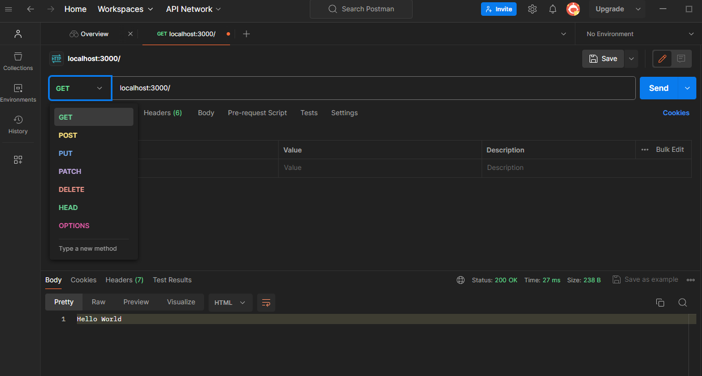
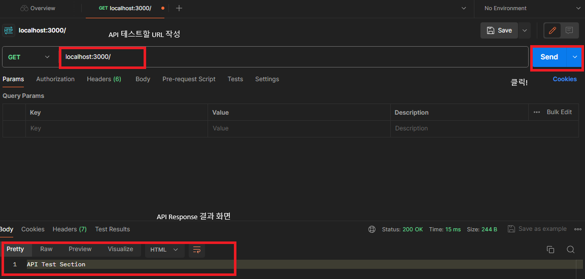
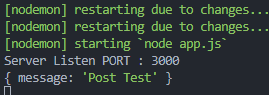
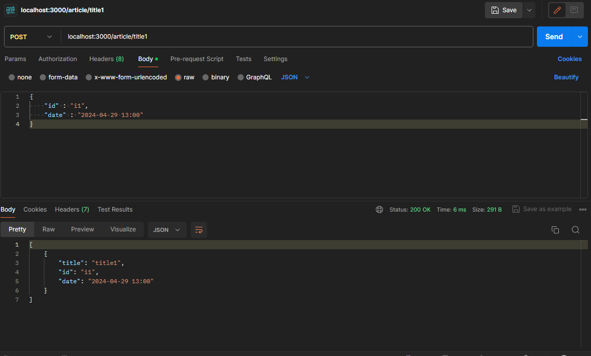
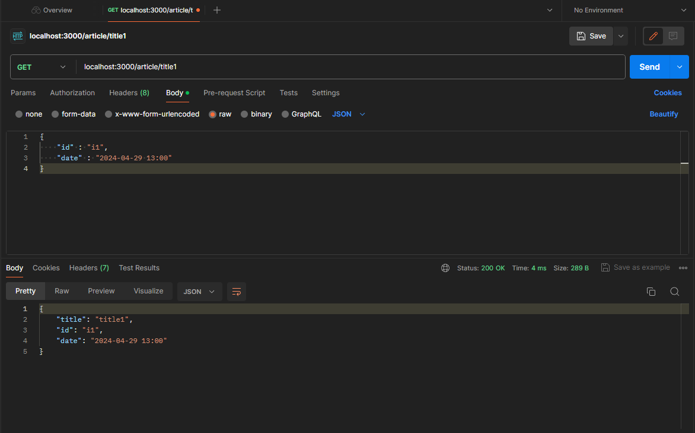

## Postman

[Download Postman](https://www.postman.com/downloads/)

- Postman API Agent 를 통해  API 테스트를 수행할 수 있다.



- 실제 API 사용 테스트를 정확히 수행할 수 있다.
- http Method, 및 메세지 에 대해 이해가 필요하다.

## Postman 으로 내가 작성한 API 테스트 해보기

### Express로 서버사이드 코드 작성하기

```js
/** app.js */
const express = require("express");
const app = express();
const PORT = 3000;

app.get("/", (req, res) => {
  res.send("API Test Section");
});

app.listen(PORT, () => {
  console.log(`Server Listen PORT : ${PORT}`);
});

```

### Postman으로 API 처음 수행해보기



### POST 요청에 대한 Body 값 받기

- POST url : localhost:3000/article
- POST body : { “meesage” : “Post Test” }
- express Code
    - middleware 로 express.json 사용을 선언해주어야 한다. ⇒ json 형태의 body 데이터를 해석 가능
    - middleware express.urlencodedd 사용 선언 ⇒ x-www-form-urlencoded 형태의 데이터 해석
    
    ```js
    const express = require("express");
    const app = express();
    const PORT = 3000;
    
    /** Middleware */
    app.use(express.json({ extended: true }));
    app.use(express.urlencoded({ extended: true }));
    
    app.get("/", (req, res) => {
      res.send("API Test Section");
    });
    
    app.post("/article", (req, res) => {
      console.dir(req.body);
      res.send("콘솔창 확인~");
    });
    
    app.listen(PORT, () => {
      console.log(`Server Listen PORT : ${PORT}`);
    });
    
    ```
    

- Postman으로 POST url 에 Send
- 결과



*console response 결과*

## Post를 활용하여 가상의 article 작성 후 저장 하기

- POST method 활용
- 서버사이드 코드 작성
    
    ```js
    const express = require("express");
    const app = express();
    const PORT = 3000;
    const articles = [];
    
    /**
     * Article 중복확인 함수
     * @param {*} ariticles: article 저장 객체
     * @param {*} updateArticle: update할 article
     * true 반환 시 중복 존재
     *
     */
    function checkDuplicateArticle(ariticles, updateArticle) {
      const filteredArticles = ariticles.filter(
        (article) => article.title === updateArticle.title
      );
      return filteredArticles.length === 0 ? false : true;
    }
    
    function updateArticleItem(updateArticle) {
      const updateTitle = updateArticle.title;
    
      if (checkDuplicateArticle(articles, updateArticle)) {
        // 중복 article이 있는 경우
        const existingIndex = articles.findIndex(
          (article) => article.title === updateTitle
        );
        articles[existingIndex] = updateArticle;
        return;
      } else {
        articles.push(updateArticle);
      }
    }
    
    /** Middleware */
    app.use(express.json({ extended: true }));
    app.use(express.urlencoded({ extended: true }));
    
    app.get("/", (req, res) => {
      res.send("API Test Section");
    });
    
    app.get("/articles", (req, res) => {
      res.send(articles);
    });
    
    app.get("/articles/:title", (req, res) => {
      const { title } = req.params;
    
      const viewArticleIndex = articles.findIndex(
        (article) => article.title === title
      );
    
      if (viewArticleIndex > -1) {
        const viewArticle = articles[viewArticleIndex];
        res.send(viewArticle);
      } else {
        res.send("Article Not Found");
      }
    });
    
    app.post("/articles/:title", (req, res) => {
      const { title } = req.params;
      const { id, date } = req.body;
      const updateArticle = {
        title,
        id,
        date,
      };
      updateArticleItem(updateArticle);
      res.send(articles);
    });
    
    app.listen(PORT, () => {
      console.log(`Server Listen PORT : ${PORT}`);
    });
    
    ```
    
    - `/article/:title` 로 POST 요청 시, articles 배열 변수에 body와 title 값을 가진 객체를 업데이트
    - GET 요청 시 articles 변수 내 순회하여 title이 일치하는 item을 찾아서 send
    
    
    
    *POST 요청 결과*
    
    
    
    *GET 요청 결과*