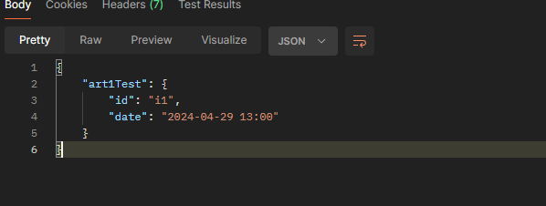
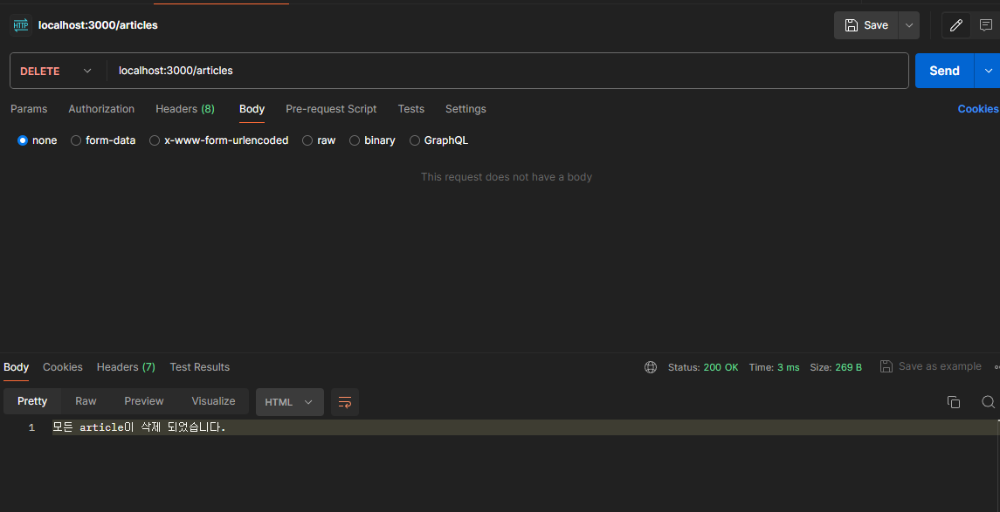
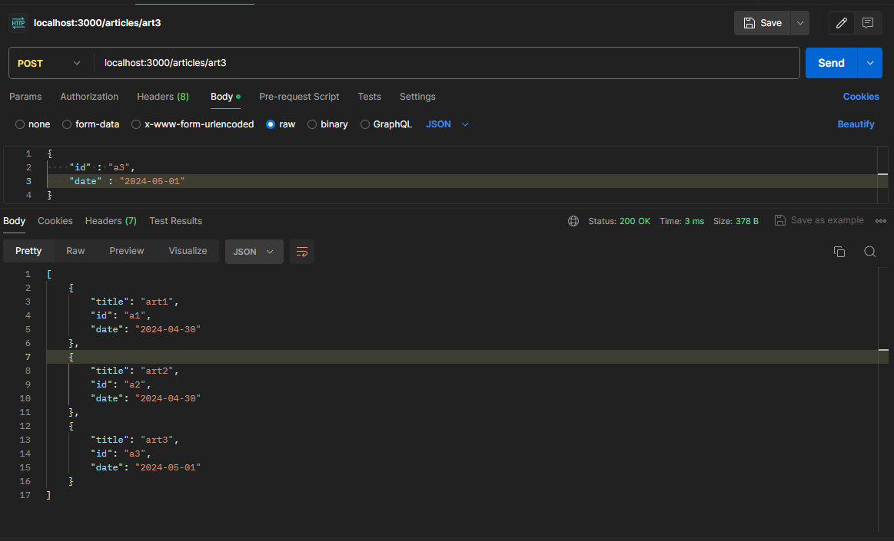
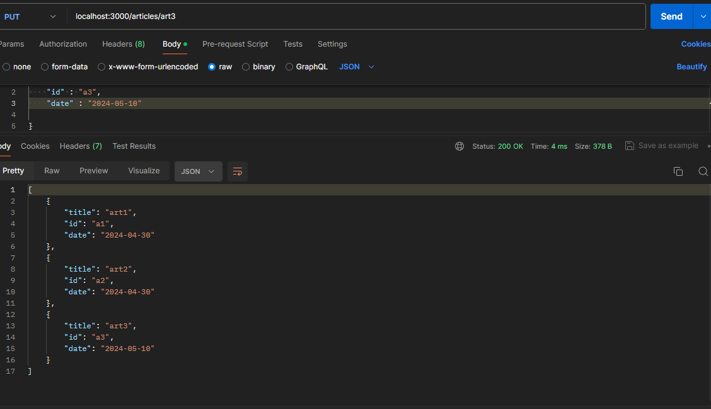

## article 전체 조회 : JSON 형식으로 응답 출력하기

- 이전에 작성하였던 코드를 기반으로 전체 조회 기능을 추가한다.
- JS 의 Array.object.forEach 를 통해, 새로운 iterator를 반환하는 것이 아닌, 배열의 item 수만큼 callback 을 수행

```jsx

app.get("/articles", (req, res) => {
  const articleList = {};
  articles.forEach((article) => {
    articleList[article.title] = {
      id: article.id,
      date: article.date,
    };
  });
  res.send(articleList);
});
```

- 결과
    
    
    

## 특정 article 지우기

- Array.prototype.filter 문법이용
- filter 한 전체 article 배열을 articles에 재할당 하여 반환

```jsx
app.delete("/articles/:title", (req, res) => {
  const { title } = req.params;
  const articleIndex = articles.findIndex((article) => article.title === title);
  console.log(articleIndex);
  if (articleIndex > -1) {
    articles = articles.filter((article) => article.title !== title); // 자르기
  } else {
    res.send(`${title} 제목을 가진 article이 존재하지 않습니다.`);
    return;
  }

  res.send(articles);
});
```

## 모든 articles 삭제

- DELETE method 사용
- 구글링으로 찾아본 배열 초기화 방법중, 벤치마킹 성능이 제일 높은 splice문법 사용
    
    ```jsx
    app.delete("/articles", (req, res) => {
      if (articles.length > 0) {
        articles.splice(0, articles.length);
        res.send("모든 article이 삭제 되었습니다.");
      } else {
        res.json({
          message: "저장된 article이 없습니다.",
        });
      }
    });
    ```
    
    
    

## 특정 article 정보 변경

- splice 문법을 통해 전체 article 배열에서 필요한 요소를 대체
    
    ```jsx
    app.put("/articles/:title", (req, res) => {
      const { title } = req.params;
      const { body } = req;
      const articleIndex = articles.findIndex((article) => article.title === title);
    
      if (articleIndex > -1) {
        const updateArticle = { ...articles[articleIndex], ...body };
        articles.splice(articleIndex, 1, updateArticle);
        res.json(articles);
      } else {
        res.json({
          message: `${title} 에 해당하는 article 이 없습니다.`,
        });
      }
    });
    ```
    
    - art3 객체 추가
    
    
    
    - art3 객체 수정
    
    
    

## forEach 문법

> Array 인스턴스의 **`forEach()`** 메서드는 각 배열 요소에 대해 제공된 함수를 한 번씩 실행합니다.
>  \- [MDN : Array.prototype.forEach()](https://developer.mozilla.org/ko/docs/Web/JavaScript/Reference/Global_Objects/Array/forEach) -
> 
- forEach 문법 특징
    - forEach내부 callbackFn 의 반환값은 항상 `undefined` 이다.
    - forEach 는 일반 반복문 for 문과 달리, 중간에 중지가 불가능 하다.
- forEach의 인수(callbackFn, thisArg)
    - callbackFn : 배열의 각 요소에 `수행될` 함수, return은 사용되지 않는다.
        - callbackFn 의 인수 (순서대로)
            - element : 배열에서 처리중인 현재요소
            - index : 배열에서 처리중인 현재요소의 인덱스
            - array : forEach 를 호출한 배열
    - thisArg (선택 옵션) : callbackFn 을 수행할 때, this 로 사용할 값

## map 문법

> **`map()`** 메서드는 배열 내의 모든 요소 각각에 대하여 주어진 함수를 호출한 결과를 모아 새로운 배열을 반환합니다.
> \- [MDN : Array.prototype.map()](https://developer.mozilla.org/ko/docs/Web/JavaScript/Reference/Global_Objects/Array/map) -
> 
- map 문법 특징
    - callback 함수를 각각의 요소에 대해 한번 씩 수행하여 발생한 `반환값으로` `새로운 배열을 반환`
    - callback 함수는 값이 있는 요소에 대해서만 수행 된다.
    
- map의 인수 (callbackFn, thisArg)
    - callbackFn : 새로운 배열 요소를 생성하는 함수, 밑의 인수들을 차례대로 가진다.
        - currentValue : 처리할 현재 요소
        - index (선택 옵션) : 처리할 현재 요소의 인덱스
        - array (선택 옵션) : map 을 호출한 배열
    - thisArg : callbackFn 을 수행할 때, this로 사용되는 값.