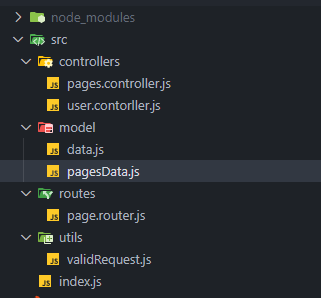
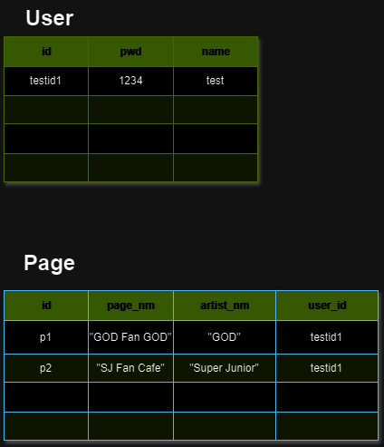

> 프로그래머스의 강의를 그대로 작성한 것이 아니고, 스스로 예제자체를 바꾸어 작성한 코드입니다.

## Server 와 Router 의 역할

- Server : Client와 같은 요청 군의 Request 를 받고 응답을 돌려준다.
- Router : Request의 URL에 따라(요청경로) 에 따라 그에 맞는 응답 경로 (route) 를 정해준다.
    - Application 단의 endpoint 를(URI) 정의한다.

이번 Express 과정을 진행하면서 `MVC패턴` 에 대해서 알게 되어

나도 일단 구글링하여 Express에서 MVC 패턴을 모양만 따라해보았다.



- index.js
    - Express Server 가 돌아가는 코드
    - 요청을 받는 직접적인 부분
- model
    - 서버가 사용하는 Data를 저장해놓은 코드들을 모아놓은 폴더이다.
    - 실상 DB를 사용하지 않았기에 구성에 어려움은 없었고, 나중에는 DB를 사용하여 Model 부분을 구축해보고 싶다는 생각이 들었다.
- routes
    - index.js에서 요청을 받을 때의 URL(엔드포인트) 를 통해 판단하여 Controller로 넘어가게 해주는 부분
    - 실질적으로 `통로` 의 역할을 하게 만들었다.
    - 한편으로 이렇게 작은 단위를 분리해야 하나? 싶은 마음이 있지만, index.js나 특정부분에서 응답에 관련된 코드들을 한번에 다 쓰는 것보다는 낫다고 생각이 들었다.
    - 응답이 오면 Controller로 넘겨주는 방식이 정말 마음에 든다.
- controller
    - 실제 응답이 이루어 지는 부분
    - router가 응답 통로를 열어줌에 따라, 각 요청에 대한 지정된 Response 함수들이 실행되게 작성하였다.
    - 코드를 수정해야 할 때, 구조적으로 틀리지 않는 이상, Controller 에만 신경을 쓰면되서 확실히 편했다.
    - Controller 하나 때문에, 지금과 같은 응답 구조를 만들게 되었다.

## 서버 코드 : index.js

```jsx
const express = require("express");
const app = express();
const PORT = 3000;

// controllers
const userControllers = require("./controllers/user.contorller.js");

// Router
const pagesRouter = require("./routes/page.router.js");

app.listen(PORT, () => {
  console.log(`server listen : ${PORT}`);
});

// body Parser
app.use(express.json());

// middlw Ware (logger)
app.use((req, res, next) => {
  const start = Date.now();
  console.log(`start: ${req.method} ${req.url}`);
  next(); // router 실행
  const diffTime = Date.now() - start;
  console.log(`end: ${req.method} ${req.baseUrl}${req.url} ${diffTime}ms`);
});

// pages 라우터
app.use("/pages", pagesRouter);

// 회원가입 Route
app.post("/signup", userControllers.signupUser);

// 로그인 Route
app.post("/login", userControllers.loginUser);

// 개별 회원 정보 조회 Route
app.get("/users/:id", userControllers.getUser);

// 개별 회원 탈퇴 (삭제) Route
app.delete("/users/:id", userControllers.deleteUser);

```

- 실제 middle ware 나 따로 쓰기 위해 작성한 logger 부분을 제외하면, 엄청 간결한 요청⇌응답 구조를 만들었다.
- signup 이나, login, users도 Router 형식으로 사용하려다가, router 유무의 비교를 위해 구조를 그대로 놔두었다.
    - 그래도 보기에 간단한것 같다.
- app.use(’경로’, Router함수) 를 통해, index.js는 ‘pages’ url로 오는 요청에 대한 응답에 책임을 지지 않게 된 것이 확실히 큰 것 같다.

## 데이터 저장소 : model

```jsx
// model/data.js
const dataBase = new Map();
dataBase.set("admin", { pwd: "admin", name: "admin" });
module.exports = dataBase;
```

```jsx
// model/pagesData.js
const pageData = new Map();
pageData.set("admin", { pageName: "admin Page", artistName: "admin" });

module.exports = pageData;

```

- 실제 사용할만한 데이터가 아니기 때문에 간단하게 Map 자료구조로 데이터를 저장할수 있게만 하였다.
- 하나의 파일에 다 작성해도 될 크기이지만, 역할을 나누는 것이 목적이기에 두개의 파일에 나누어서 작성하였다.

## 실질적 응답 반환 : controller

- pages.contoller.js
    
    ```jsx
    const pageData = require("../model/pagesData.js");
    
    /**
     * pages 전체 조회 API
     * @param {import("express").Request} req
     * @param {import("express").Response} res
     */
    const getPages = (req, res) => {
      const pages = [];
      [...pageData.keys()].forEach((key) => {
        const page = {
          id: key,
          pageName: pageData.get(key).pageName,
          artistName: pageData.get(key).artistName,
        };
        pages.push(page);
      });
      res.status(200).json(pages);
    };
    
    /**
     * 페이지 생성 API : POST | '/pages/'
     * @param {import("express").Request} req
     * @param {import("express").Response} res
     */
    const createPage = (req, res) => {
      const { artistName, pageName, id } = req.body;
      const pageExist = pageData.has(id);
    
      if (!pageExist) {
        pageData.set(id, { artistName, pageName });
        res
          .status(200)
          .json({ id, artistName, pageName, message: `페이지 생성 완료 : ${id}` });
      } else {
        res.status(400).json({ message: "이미 존재하는 페이지 입니다." });
      }
    };
    
    /**
     * 한 페이지 조회 API : GET | '/pages/:id'
     * @param {import("express").Request} req
     * @param {import("express").Response} res
     */
    const getOnePage = (req, res) => {
      console.log(req.params);
      const { id } = req.params;
      const page = pageData.get(id);
    
      if (!page) {
        res.status(404).json({ message: "페이지를 찾을 수 없습니다." });
      } else {
        const pageInfo = { id, ...page };
        res.status(200).json(pageInfo);
      }
    };
    
    /**
     * 페이지 정보 수정 API : PUT | '/pages/:id'
     * @param {import("express").Request}} req
     * @param {import("express").Response} res
     * @returns
     */
    const updatePage = (req, res) => {
      const { id } = req.params;
      const { artistName, pageName } = req.body;
      const existPage = pageData.get(id);
      if (!artistName || !pageName) {
        res.status(400).send("올바른 정보를 입력해주세요.");
        return;
      }
      if (!existPage) {
        res.status(404).send("수정하려는 페이지를 찾을 수 없습니다.");
        return;
      }
    
      pageData.set(id, { artistName, pageName });
      res.status(200).json({
        message: "페이지 정보가 수정되었습니다.",
        id,
        artistName,
        pageName,
      });
    };
    
    /**
     * 페이지 삭제 API : DELETE | '/pages/:id'
     * @param {import("express").Request} req
     * @param {import("express").Response} res
     */
    const deletePage = (req, res) => {
      const { id } = req.params;
      const existPage = pageData.get(id);
    
      if (!existPage) {
        res.status(404).json({ message: "삭제할 페이지를 찾을 수 없습니다." });
    
        return;
      }
    
      pageData.delete(id);
      res
        .status(200)
        .json({ message: "페이지를 삭제하였습니다.", pageId: existPage.id });
    };
    
    module.exports = {
      getPages,
      createPage,
      getOnePage,
      updatePage,
      deletePage,
    };
    
    ```
    
- user.contoller.js
    
    ```jsx
    const db = require("../model/data.js");
    const utilFn = require("../utils/validRequest.js");
    /**
     * user 로그인 API : POST
     * @param {Request} req
     * @param {Response} res
     * @returns
     */
    const loginUser = (req, res) => {
      const { id, pwd } = req.body;
    
      const validReq = utilFn.validRequest([id, pwd]);
      const idExist = db.get(id);
    
      // 계정정보를 올바르게 입력 안했을때
      if (!validReq) {
        res.status(400).send("올바른 로그인 정보를 입력해주세요");
        return;
      }
    
      // db가 비어있거나, 일치하는 id 가 없을 때
      if (db.size === 0 || !idExist) {
        res.status(404).send("해당 ID가 존재하지 않습니다.");
        return;
      }
    
      // ID 존재 상황
      if (idExist) {
        const dbUser = db.get(id);
        console.log(dbUser);
        if (dbUser && dbUser.pwd === pwd) {
          res.status(200).send(`${id} : ${dbUser.name} 님 로그인을 환영합니다.`);
        } else {
          res.status(400).send("비밀번호가 일치하지 않습니다.");
        }
      }
    };
    
    /**
     * user 회원 가입 API : POST
     * @param {Request} req
     * @param {Response} res
     * @returns {Response}
     */
    const signupUser = (req, res) => {
      const { id, pwd, name } = req.body;
      const validReq = utilFn.validRequest([id, pwd, name]);
    
      if (!validReq) {
        res.status(400).send("올바른 가입정보를 입력하세요");
        return;
      }
    
      const existId = db.get(id);
      if (existId) {
        res.status(400).send(`이미 존재하는 아이디 입니다. : ${id}`);
        return;
      } else {
        const newUser = {
          pwd,
          name,
        };
        db.set(id, newUser);
        res.status(200).json({ id, ...newUser, message: "회원가입 완료" });
      }
    };
    
    /**
     * 회원 개별 조회 API : GET
     * @param {Request} req
     * @param {Response} res
     */
    const getUser = (req, res) => {
      const { id } = req.params;
      const dbUser = db.get(id);
      const validReq = utilFn.validRequest([id]);
    
      if (!validReq) {
        res.status(400).send("올바른 회원 id를 입력해주세요");
        return;
      }
    
      //db에 회원 id가 없는 경우
      if (!dbUser) {
        res.status(404).send(`${id} 회원이 존재하지 않습니다.`);
        return;
      }
    
      const user = {
        id,
        pwd: dbUser.pwd,
        name: dbUser.name,
      };
      res.status(200).json(user);
    };
    
    /**
     * 개별 회원 탈퇴 API : DELETE
     * @param {Request} req
     * @param {Response} res
     */
    const deleteUser = (req, res) => {
      const { id } = req.params;
      const validReq = validRequest([id]);
      if (!validReq) {
        res.status(400).send("올바른 id를 입력해주세요");
      }
    
      const dbUser = db.get(id);
    
      // 올바른 user 존재 시 삭제
      if (dbUser) {
        const userDeleteState = db.delete(id);
        if (userDeleteState) {
          res.status(200).send(`${id} 회원이 정상적으로 탈퇴 되었습니다.`);
        } else {
          res.status(505).send(`${id}의 탈퇴가 이루어지지 않았습니다.`);
        }
      }
    };
    
    module.exports = {
      loginUser,
      signupUser,
      getUser,
      deleteUser,
    };
    
    ```
    
- 각 엔드포인트에 따라 응답을 반환하는 함수들을 분리하여 작성하였다.
- 해당 방식이 코드 수정시, 또는 코드 파악시 상당히 편하다는 느낌을 받았다.
- user.contoller와 page.controller 가 서로 모르는 사이로 만들어 주면서 책임이 분리되는 것을 느꼈는데, 이에 대해 실제 서비스에서도, 서로다른 엔드포인트 일 때는 어떻게 분리원칙을 적용하는지가 궁금해졌다.

## 데이터 구조



- user PK 는 id, page의 PK도 id 이다.
- user가 여러 page를 가질수 있기에 설계상 user_id 는 page의 FK 가 된다. (1 : N 관계)

강의에서는 demo라는 이름의 js 파일들을 분리하여 아예 서버코드자체가 2개가 되었던걸 다시 합쳤는데, 미리 mvc 패턴을 알게 되어 적용한 것이 이번 실습에서 편리함을 아주 많이 제공했던것 같다.

(물론 완전한 mvc 가 아닌건 알고있다.)

오늘은 Express 를 사용하여 간단한 백엔드 환경을 구축해 보았다.

확실히 디자인 패턴에 대해 중요성을 한 번 더 체감했다.

단순히 멋지다의 의미가 아니라, 개발자로써 어떻게 효율적으로 개발을 할 것인지, 이에 따른

생산성이 얼마나 증가할 것인지 궁금해졌다.