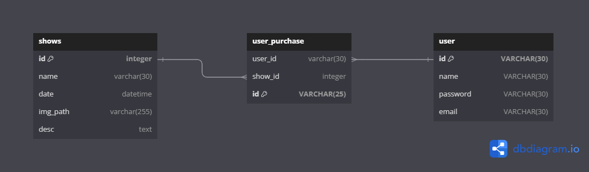
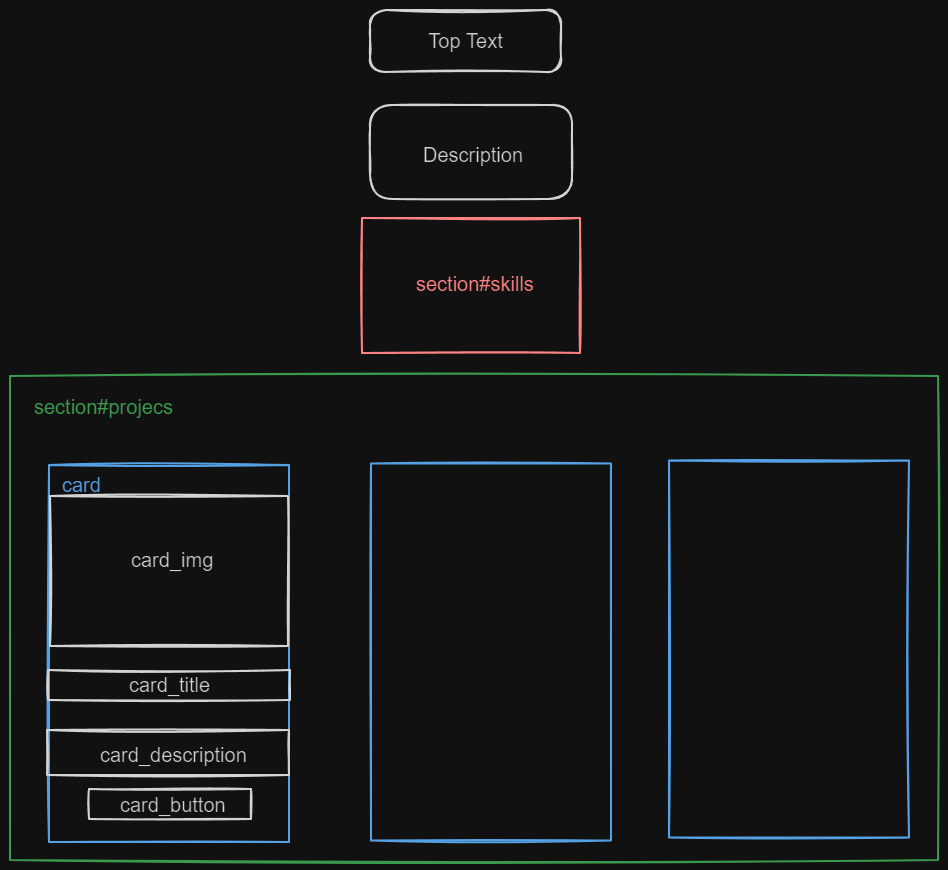

# 오늘 배운 내용

- ERD 작성해보기
- DB 설계? 해보기
- 간이 포트폴리오 웹 페이지 구축해보기

오늘은 프로그래머스에서 2개의 개인 과제가 나왔는데,

하나는 개인 포트폴리오 간단하게 만들어보기,

다른 하나는 페이지를 제시 받고, 페이지 기반 DB를 설계해보고 ERD를 작성해보기

## DB설계 및 ERD 작성

- 제시된 페이지는 티몬의 공연 티켓을 구매하는 것과 비슷한 느낌의 페이지 였다.
- 상품구매하고, 회원이 그 상품을 구매한 내역을 저장하는 느낌!

### 화면 구성

- 메인페이지
    - 상품 이미지 및 이미지 리스트 표시
- 상품 상세 페이지
    - 상품 1개에 대한 상세정보 표시
        - 상품명
        - 상품가격
        - 상품날짜
        - 상품설명
    - 상품 구매 버튼
- 로그인 페이지
    - 아이디, 비밀번호, 로그인 버튼, 회원가입 버튼
- 회원가입 페이지
    - 이름, 이메일, 비밀번호, 회원가입 버튼
- 주문내역 페이지
    - 주문번호
    - 주문 일자
    - 구매 상품명, 상품 날짜, 상품 가격
    - 구매자 이름, 구매자 이메일, 구매 수량, 총 구매 가격

### ERD 작성



- shows 는 상품 정보 Table
    - 상품의 정보가 저장된다.
    - PK : id
- user 는 회원 정보 Table
    - 회원의 정보가 저장된다.
    - PK : id
- user_purchase 는 구매 정보 Table
    - 구매 정보가 저장된다.
    - FK : user_id (from user.id), show_id (from shows.id)
    - PK : id

## 간이 포트폴리오 구축해보기


- 만들어 보고 싶었던 기능
    - 각 card (프로젝트) 마다 hover시 위로 조금씩 움직이는 애니메이션이 발생
    - github pages 배포

- index.html
    
    ```html
    <!DOCTYPE html>
    <html>
      <head>
        <meta charset="UTF-8" />
        <meta name="viewport" content="width=device-width, initial-scale=1.0" />
        <title>윤경덕 포트폴리오</title>
    
        <link rel="stylesheet" href="./style/index.css" />
    
        <link rel="preconnect" href="https://fonts.googleapis.com" />
        <link rel="preconnect" href="https://fonts.gstatic.com" crossorigin />
        <link
          href="https://fonts.googleapis.com/css2?family=Noto+Sans+KR:wght@100..900&display=swap"
          rel="stylesheet"
        />
      </head>
      <body>
        <section id="top">
          <h1>윤경덕의 포트폴리오</h1>
        </section>
    
        <section id="description">
          <p>안녕하세요</p>
          <p>배움을 게을리 하지 않는 개발자</p>
          <p>윤경덕 입니다.</p>
        </section>
        <section id="skills">
          <p>My Skills</p>
          <div class="skill">
            
            
            
            
            
            
            
          </div>
        </section>
    
        <section id="projects">
          <div class="card">
            
            <h3 class="card_title">Ebook 구매 사이트</h3>
            <span class="card_desciprtion">
              Ebook 구매하여 전자도서를 관람 및 독서 할 수 있는 사이트
            </span>
            <button class="card_button">자세히 알아보기</button>
          </div>
    
          <div class="card">
            
            <h3 class="card_title">OTT 웹/앱 어플리케이션</h3>
            <span class="card_desciprtion"
              >독자들이 자체적으로 만드는 OTT 서비스, 독립영화, 자체 제작 콘텐츠
              만을 송출</span
            >
            <button class="card_button">자세히 알아보기</button>
          </div>
    
          <div class="card">
            
            <h3 class="card_title">Sprint 관리 앱</h3>
            <span class="card_desciprtion">Sprint 를 관리할 수 있는 앱</span>
            <button class="card_button">자세히 알아보기</button>
          </div>
        </section>
      </body>
    </html>
    
    ```
    
    - 각 section 별로 id를 지정하여 스타일을 지정하였다
    
    
    

- index.css
    
    ```css
    * {
      box-sizing: border-box;
      margin: 0;
      padding: 0;
      font-family: "Noto Sans KR", sans-serif;
      font-optical-sizing: auto;
    
      font-style: normal;
    }
    
    img {
      width: 24rem;
      height: 24rem;
    }
    
    body {
      display: flex;
      flex-direction: column;
      align-items: center;
      /* background: linear-gradient(to bottom right, #666666, #999999); */
      background-color: #666666;
      height: 100vh;
    }
    
    button {
      cursor: pointer;
    }
    
    #top {
      margin: 1.5rem;
      padding: 4px;
    }
    
    #description {
      text-align: center;
      margin: 2rem 0;
      font-size: 1.2rem;
    }
    
    #projects {
      display: flex;
      flex-wrap: wrap;
      align-items: center;
      justify-content: center;
      gap: 2rem;
      margin-top: 1rem;
      margin-bottom: 1rem;
    }
    
    #projects .card {
      height: 48rem;
      margin: 1rem;
      padding: 1rem;
      padding-top: 0;
      background-color: #eef7ff;
      width: 24rem;
      display: flex;
      flex-direction: column;
      align-items: center;
      gap: 1rem;
      transition: bottom 0.3s ease;
    }
    
    #projects .card:hover {
      transform: translateY(-1rem);
      transition: transform 0.3s ease-in-out;
    }
    
    #projects .card:not(:hover) {
      transform: translateY(0);
      transition: transform 0.2s ease-in-out;
    }
    
    #projects .card .card_title {
      border-top: 1px solid #666666;
      width: 100%;
      text-align: center;
    }
    
    #projects .card .card_description {
      word-wrap: break-word;
    }
    
    #projects .card .card_button {
      outline: none;
      background-color: #0a6847;
      border: none;
      padding: 4px;
      width: 10rem;
      border-radius: 1rem;
      color: #fff;
      transition: 0.3s;
    }
    
    #projects .card .card_button:hover {
      background-color: #7aba78;
    }
    
    #skills {
      width: 100%;
      text-align: center;
    }
    
    #skills p {
      color: #fff;
      margin-bottom: 1rem;
    }
    
    #skills img {
      width: 4rem;
      height: 2rem;
    }
    
    ```
    
    ### Github Pages 배포
    
    
    
    - Repository의 settings 로 이동
    - Pages 옵션 이동
    - Source : ‘Deploy From branch’ 옵션 선택
    - save 버튼 클릭
    - 이미 github.io repository가 있다면, 그 이름으로 배포한 url의 서브 url로 접속할 수 있게된다.
    - 나의 경우 이미 github.io로 블로그를 배포하여 돌고있는 상태
        - https://ykdman.github.io/portfolio.io