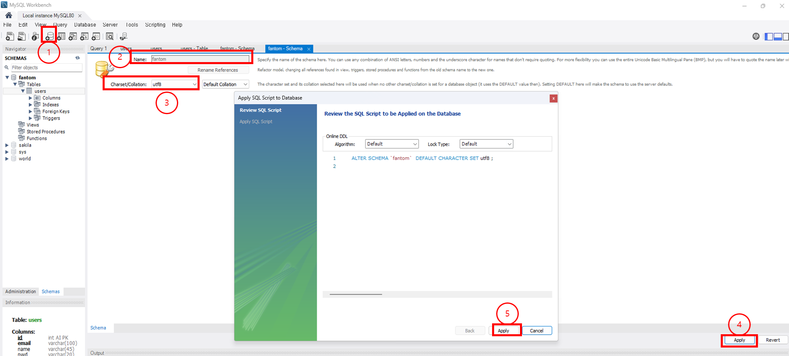
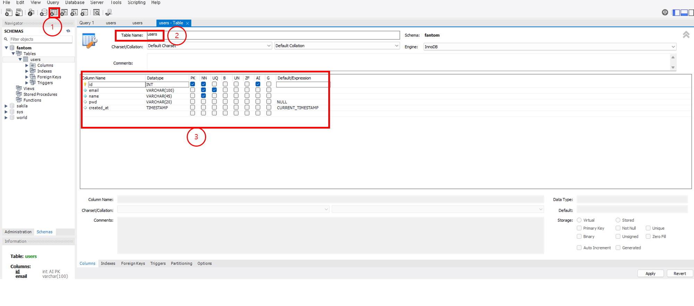

mysql workbench 를 통해 기존에 작성한 `fantom` 프로젝트를 DB와 연결하여 CRUD 재작성

> 이번에 동원예비군을 다녀오면서 진도를 많이 놓쳤다…
5/7 ~ 5/9 일 진도가 오늘 (5/10) 진행하는 강의의 구축 단계였는데, 해당 과정을 시간제한으로 인해 주말에 들어야 해서, 필요한 부분만 짧게 보면서 참고하여 DB 생성 및 연동 소스코드 작성을 진행했다…. 너무 아쉽다… 나쁜 예비군.
> 

우선 오늘 강의에서는 mysql workbench 를 통해 구축한 DB와 이전 강의들에서 작성한 소스코드를 연동하는 작업부터 시작했는데, 나는 기존 강의의 레퍼런스만 참고해서 아예 다르게 API 및 서버코드를 작성하였기 때문에, 상당히 복잡해졌다.

## 1. mysql workbench 설치

- 첫 째로 mySQL Workbench 를 설치해주었다.
- 설치 및 사용법 참고 글: [dearmycode.tistory](https://dearmycode.tistory.com/15)
- 강의에서는 mac PC 기준으로 설치를 진행하였어서 Windows인 나는 구글링으로 설치 및 사용법을 알아 보았다.

## 2. Database 만들기



1. 화면 상단의 create Schema 버튼을 눌러 scema 생성을 진행
2. name에 원하는 이름을 작성
3. charset 을 `utf8`로 설정
4. 화면하단의 Appliy 버튼 클릭
5. 발생한 팝업 화면에서 Appliy 버튼 클릭

## 3. table 만들기



1. create Table 버튼을 눌러 테이블 생성 진행
2. table name 설정 → users
3. users 테이블의 column 설정
4. 하단의 Apply 버튼 클릭

## 4. DB연동 코드 작성하기

이전의 fantom 프로젝트에 Model 에 새로운 js 파일을 작성

- fantom 프로젝트 : [fantom](https://github.com/ykdman/fantom)
- 소스 위치 : src / model / dbConnect.js
- dbConnect.js 코드
    
    ```jsx
    const mysql = require("mysql2");
    
    const connection = mysql.createConnection({
      host: "127.0.0.1",
      port: 3306,
      user: "root",
      password: "****",
      database: "fantom",
    });
    
    module.exports = connection;
    
    ```
    
    - mysql2 라이브러리를 통해 구동중인 mysql 과 접촉
    - host : mysql의 host
    - port : mysql의 port
    - user : mysql을 사용가능한 user의 아이디
    - password : user의 비밀번호
    - database : 연결할 mysql의 db중 사용하려는 db

## 4. fantom/users 의 API 코드 DB 연동

### 회원 가입 API

- 첫째 로 회원 가입 API 코드를 sql과 연동하여 등록할 수 있도록 변경하였다.
    
    ```jsx
    // index.js 
    const express = require("express");
    const app = express();
    const PORT = 3000;
    
    // controllers
    const userControllers = require("./controllers/user.contorller.js");
    
    // Router
    const pagesRouter = require("./routes/page.router.js");
    
    app.listen(PORT, () => {
      console.log(`server listen : ${PORT}`);
    });
    
    // body Parser
    app.use(express.json());
    
    // middlw Ware (logger)
    app.use((req, res, next) => {
      const start = Date.now();
      console.log(`start: ${req.method} ${req.url}`);
      next(); // router 실행
      const diffTime = Date.now() - start;
      console.log(`end: ${req.method} ${req.baseUrl}${req.url} ${diffTime}ms`);
    });
    
    // pages 라우터
    app.use("/pages", pagesRouter);
    
    // 회원가입 Route
    app.post("/signup", userControllers.signupUser);
    
    // 로그인 Route
    app.post("/login", userControllers.loginUser);
    
    app
      .route("/users/:email")
      // 개별 회원 정보 조회 Route
      // 개별 회원 탈퇴 (삭제) Route
      .get(userControllers.getUser)
      .delete(userControllers.deleteUser);
    
    ```
    
    - app.post(’/signup’) 의 라우팅을 통해 userControllers.signupUser 를 호출한다.
    - 수정은 userControllers.signupUser 만 진행해주면 된다!
- userControllers.signupUser 소스 코드 수정
    
    ```jsx
    // db연동 및 쿼리 사용을 위해 작성
    const connection = require("../model/dbConnect.js");
    
    /**
     * user 회원 가입 API : POST
     * @param {Request} req
     * @param {Response} res
     * @returns {Response}
     */
    const signupUser = (req, res) => {
      const { email, pwd, name } = req.body;
      console.log(req.body);
      let sql = `SELECT * FROM fantom.users
      WHERE email = '${email}'`;
    
      const validReq = utilFn.validRequest([email, pwd, name]);
    
      if (!validReq) {
        res.status(400).send("올바른 가입정보를 입력하세요");
      }
    
      //회원 가입 QUERY
      connection.query(sql, (err, result) => {
        if (err) console.log(err.name, err.message);
        else {
          if (!result[0]) {
            // 정상 회원가입 (중복 email 없음)
            let sql = `INSERT INTO users 
            (email, name, pwd) 
            VALUES 
            (?, ? ,?)`;
            connection.query(sql, [email, pwd, name], (err, result) => {
              if (err) console.log(err.name, err.message);
              else {
                res.status(201).json({ message: `${name} 님 가입을 환영합니다!` });
              }
            });
          } else {
            res.status(400).json({ message: "이미 존재하는 계정입니다." });
          }
        }
      });
    
    ```
    
    - 기존의 회원가입 API 에서도, 중복 가입에 대한 예외 처리를 진행하였었다.
        - 변경되는 소스코드에서도 똑같이 중복가입을 방지하기 위한 코드를 작성
        - email 정보가 동일한 row가 하나라도 있으면 중복가입으로 걸러내는 코드
        

### 로그인 API

```jsx
/**
 * user 로그인 API : POST
 * @param {Request} req
 * @param {Response} res
 * @returns
 */
const loginUser = (req, res) => {
  const { email, pwd } = req.body;
  let sql = `
    SELECT * FROM users 
    WHERE email = '${email}'`;
  connection.query(sql, (err, result) => {
    if (err) console.log(err.name, err.message);
    else {
      if (result[0] && result[0].pwd === pwd) {
        res.status(201).json({ message: `${email} 님 로그인 되었습니다.` });
      } else if (!result[0]) {
        res
          .status(404)
          .json({ message: `${email} 회원 정보를 찾지 못했습니다.` });
      } else if (result[0].pwd !== pwd) {
        res.status(400).json({ message: "비밀번호가 일치하지 않습니다." });
      }
    }
  });
 };
```

- 로그인 API 는 비밀번호 일치, 회원 이메일 못찾을 경우를 예외로 생각하여 코드를 작성하였다.
    - 정상 로그인시 실제 서비스에서는 화면이나 권한 같은 것이 변경되므로 201 코드를 선택
    - email이 없을 경우에는, email을 찾을 수 없는 것이므로 404 코드
    - 비밀번호가 일치하지 않을 경우에는 회원이 전달한 body값이 잘못되었기 때문에 400코드 선택

### 회원 탈퇴 API

```jsx
/**
 * 개별 회원 탈퇴 API : DELETE
 * @param {Request} req
 * @param {Response} res
 */
const deleteUser = (req, res) => {
  const { email } = req.params;
  const validReq = validRequest([email]);
  if (!validReq) {
    res.status(400).send("올바른 id를 입력해주세요");
  }

  let sql = `DELETE FROM users
    WHERE email = ?
  `
  connection.query(sql, email, (err, result) => {
     if (err) console.log(err.name, err.message)
    else {
      res.status(200).json({message: "회원탈퇴가 완료 되었습니다."})
    }
  })

};
```

- 회원 탈퇴의 경우는 간단하게 쿼리문 실행이 정상적으로 수행 됐다면, 메세지만을 출력.

### 회원 조회 API

- 개별 회원 조회

```jsx
/**
 * 회원 개별 조회 API : GET
 * @param {Request} req
 * @param {Response} res
 */
const getUser = (req, res) => {
  const { email } = req.params;
  console.log(email);
  let sql = `SELECT * FROM users
  WHERE email = ?`;

  connection.query(sql, email, (err, results, fields) => {
    console.log(results);
    if (err) console.log(err.name, err.message);
    else {
      if (results[0]) {
        res.status(200).json(results[0]);
      } else {
        res.status(404).json({ message: "회원 정보를 찾을 수 없습니다." });
      }
    }
  });
 };
```

- 회원 정보 조회 API 또한 쿼리를 실행한 결과가 존재하면 응답으로 그 결과만 뿌려주면 될것 같다.
- 결과가 없으면, 그때에서야 404를 뿌려주는 방식으로 진행

실제 서비스에서는 더욱 고도화된 서버코드가 작성되어 있겠지만,

우선 오늘같이 간단한게 백엔드를 좀 제대로 맛본것 같다.

추후에는 AWS 의 Database를 설치하여 계속 사용하거나, Firebase에 연동하는 식의 코드를 작성해보고 싶다.