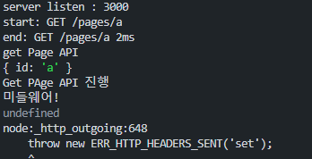

# 프로그래머스 데브코스 TIL : 2024-05-13(월)

## 유효성 검사

- Validation
- express-vaidator 라이브러리 사용

  [Getting Started | express-validator](https://express-validator.github.io/docs/guides/getting-started)

- 유효성 검사 라이브러리를 통해, params 또는 body 로 전달되는 값에 대한 올바른 타입을 받았는지 확인할 수 있다.

### 유효성 검사를 통해 params 체크 하기

- express-validator의 check는 req.params 를 수신하여 검사할 수 있다.

```js
// index.js
app
  .route("/users/:email")
  // 개별 회원 정보 조회 Route
  // 개별 회원 탈퇴 (삭제) Route
  .get(
    [check("email").isEmail().withMessage("이메일 주소를 입력해주세요.")],
    userControllers.getUser
  )
 
```

- params로 전달된 email 의 값이 email의 형태인지 검사.
- email 형태가 아니라면 validationResult 변수를 통해 error 유무를 알 수 있다.
- withMessage내부의 메세지는 에러 발생 시, err.array()의 msg 값으로 지정된다.

```js
// user.controller.js
/**
 * 회원 개별 조회 API : GET
 * @param {Request} req
 * @param {Response} res
 */
const { validationResult } = require("express-validator");
 
const getUser = (req, res) => {
  const err = validationResult(req);
  console.log(err.array());
  const { email } = req.params;
  console.log(email);
  let sql = `SELECT * FROM users
  WHERE email = ?`;

  connection.query(sql, email, (err, results, fields) => {
    console.log(results);
    if (err) console.log(err.name, err.message);
    else {
      if (results[0]) {
        res.status(200).json(results[0]);
      } else {
        res.status(404).json({ message: "회원 정보를 찾을 수 없습니다." });
      }
    }
  });
```

- validationResult(req)를 통해 err 변수에 유효성 검사 결과 객체를 할당

```json
// 잘못된 params 조건 요청시 err 변수의 array() 결과
[
  {
    type: 'field',
    value: '1',
    msg: '이메일 주소를 입력해주세요.',
    path: 'email',
    location: 'params'
  }
]
```

## express-validator로 page생성 API 수정

이전 fantom 프로젝트에서, 팬 페이지를 생성하는 API를 express-validator 라이브러리를 통해 유효성 검사를 진행하는 코드로 변경

- route \ pages.router.js
    
    ```js
    // routes/page.router.js
    
    const express = require("express");
    const { body } = require("express-validator");
    
    const pagesRouter = express.Router();
    const pagesController = require("../controllers/pages.controller.js");
    /**
     * /pages 라우터
     * - get : pages 전체 정보 조회
     * - post : pages 생성
     */
    pagesRouter
      .route("/")
      .get(pagesController.getPages)
      .post(
        [
          body("artist_id")
            .isString()
            .withMessage("아티스트 이름을 문자열로 입력하세요"),
    
          body("user_id").isInt().withMessage("user_id를 숫자형으로 입력해주세요."),
        ],
        pagesController.createPage
      );
    
    // /pages/:id 라우터
    // get
    // post
    pagesRouter
      .route("/:id")
      .get(pagesController.getOnePage)
      .put(pagesController.updatePage)
      .delete(pagesController.deletePage);
    
    module.exports = pagesRouter;
    
    ```
    
- controller \ page.controller.js 의 createPage API 수정 코드
    
    ```js
    /**
     * 페이지 생성 API : POST | '/pages/'
     * @param {import("express").Request} req
     * @param {import("express").Response} res
     */
    const createPage = (req, res) => {
      const error = validationResult(req);
      if (!error.isEmpty()) {
        console.log(error.array());
        return res.status(400).json(error.array());
      }
      const { artist_id, user_id } = req.body;
      let sql = `INSERT INTO pages 
      (user_id, artist_id) 
      VALUES 
      (?, ? )`;
      connection.query(sql, [+user_id, artist_id], (err, result) => {
        if (err) {
          console.log(err.name, err.message);
          return res.status(500).json({ message: err.message });
        } else {
          return res
            .status(200)
            .json({ artist_id, user_id, msg: "page create success" });
        }
      });
    ```
    
    - req의 params로 들어오는 ‘user_id’ 와 ‘artist_id’ 가 각각의 타입에 부합하지않으면, 해당 요청에 대한 에러 메시지로 지정한 내용(withMessage) 가 출력 되며, 그에 따른 응답 상태 코드도 400 으로 표기 된다.
    

### pages, GET 요청 SQL 연결하여 코드 수정

- page.controller.js
    
    ```js
    /**
     * 한 페이지 조회 API : GET | '/pages/:id'
     * @param {import("express").Request} req
     * @param {import("express").Response} res
     */
    const getOnePage = (req, res) => {
    	//유효성 검사
      const validError = validationResult(req);
      if (!validError.isEmpty()) {
        return res.status(400).json(validError.array());
      }
      console.log(req.params);
      const { id } = req.params;
      let sql = `SELECT * FROM pages 
      WHERE id=?`;
    
      connection.query(sql, id, (err, result) => {
        console.log(result[0]);
        if (err) {
          return res
            .status(400)
            .json({ message: `${id} 페이지를 찾을 수 없습니다.` });
        } else if (result[0]) {
          const page = { ...result[0] };
          return res.status(200).json({ ...page });
        } else {
          return res.status(404).json({ message: "페이지를 찾을 수 없습니다." });
        }
      });
    	
    	// SQL 연결 전 페이지 조회 API
      // if (!page) {
      //   res.status(404).json({ message: "페이지를 찾을 수 없습니다." });
      // } else {
      //   const pageInfo = { id, ...page };
      //   res.status(200).json(pageInfo);
      // }
    };
    ```
    
- route 과정에서 유효성 검사 코드 추가
    
    ```js
    pagesRouter
      .route("/:id")
      .get(
        check("id").isNumeric().withMessage("올바른 페이지 id를 작성해주세요"),
        pagesController.getOnePage
      )
    ```
    
    - express-validator를 사용하여 page 개별 조회 시, id params 가 숫자형이 아닐때에 에러메세지를 반환한다.
    

## 유효성 검사 코드를 모듈화 하기

- express-validator를 사용하여 유효성 검사를 하는 과정이 반복 되므로, 해당 로직을 모듈화 시켜야 하는 필요성이 있다.
- Route 과정에서 검사하는 일종의 유효성 테스트 코드는, 직접 작성하는것이 맞는 것으로 판단된다. (params나 body가 endpoint 마다 다르기 때문)

app.use 의 형태로 express-validator를 이용한 미들웨어 작성을 시도하였는데, 이 순서 자체가 모순이 있었다.

app.use의 미들웨어는 URL 의 정확도에 상관없이 무조건 실행된다는 점을 우선 기억하자

```js
// index.js 일
app.use((req, res, next) => {
  const error = validationResult(req);
  if (!error.isEmpty()) {
    return res.status(400).json(error.array());
  }
  next();
});

// pages 라우터
app.use("/pages", pagesRouter);
```

- 위의 코드에서 app.use로 지정된 미들웨어가 라우터보다 먼저 실행이 된다.
- 때문에 미들웨어 부분을 라우팅 하는 코드의 최하단으로 배치하여보았다.

```js
// index.js
const express = require("express");
// validator library
const { check, validationResult } = require("express-validator");
const app = express();
const PORT = 3000;

// controllers
const userControllers = require("./controllers/user.contorller.js");

// Router
const pagesRouter = require("./routes/page.router.js");
const { validRequest } = require("./utils/validRequest.js");

app.listen(PORT, () => {
  console.log(`server listen : ${PORT}`);
});

// body Parser
app.use(express.json());

// middlw Ware (logger)
app.use((req, res, next) => {
  const start = Date.now();
  console.log(`start: ${req.method} ${req.url}`);
  next(); // router 실행
  const diffTime = Date.now() - start;
  console.log(`end: ${req.method} ${req.baseUrl}${req.url} ${diffTime}ms`);
});

// pages 라우터
app.use("/pages", pagesRouter);

// 회원가입 Route
app.post("/signup", userControllers.signupUser);

// 로그인 Route
app.post("/login", userControllers.loginUser);

app
  .route("/users/:email")
  // 개별 회원 정보 조회 Route
  // 개별 회원 탈퇴 (삭제) Route
  .get(
    [check("email").isEmail().withMessage("이메일 주소를 입력해주세요.")],
    userControllers.getUser
  )
  .delete(userControllers.deleteUser);

// 유효성 검증 middleware
app.use((req, res, next) => {
  console.log("미들웨어!");
  const error = validationResult(req);
  if (!error.isEmpty()) {
    return res.status(400).json(error.array());
  }
  next();
});

```

```js
// page.controller.js 중 일부
/**
 * 한 페이지 조회 API : GET | '/pages/:id'
 * @param {import("express").Request} req
 * @param {import("express").Response} res
 */
const getOnePage = (req, res, next) => {
  console.log("get Page API");
  next();
  // const validError = validationResult(req);
  // if (!validError.isEmpty()) {
  //   return res.status(400).json(validError.array());
  // }
  console.log(req.params);
  console.log("Get PAge API 진행");

  const { id } = req.params;
  let sql = `SELECT * FROM pages 
  WHERE id=?`;

  connection.query(sql, id, (err, result) => {
    console.log(result[0]);
    if (err) {
      return res
        .status(400)
        .json({ message: `${id} 페이지를 찾을 수 없습니다.` });
    } else if (result[0]) {
      const page = { ...result[0] };
      return res.status(200).json({ ...page });
    } else {
      return res.status(404).json({ message: "페이지를 찾을 수 없습니다." });
    }
  });
};

```

- 특정 페이지 조회에 대한 요청을 전송했을 때에 대한 로그는 다음 과 같다.
    
    
    
    로그를 확인해보면, getPage API 내부에서 next가 끝난다음에 실행 되어야 할 코드가 먼저 실행 되는 것을 확인할 수 있는데, 
    
    나의 생각으로 이는 비동기 코드가 필요한 시점이라고 생각이 든다.
    
    Node의 처리 프로세스 상, 유효성 검사를 하는 미들웨어는 나중에 실행이 되버리고, 기존에 진행하던 코드흐름을 그대로 가져가는 것을 확인 할 수 있는데,
    
    이는 setTimeout 사용시, 원하는 코드를 특정시간이 지난후에 사용하게 되는 것과 같은 원리라고 보여진다.
    
    비동기 코드를 공부한 뒤, 추후 해당 코드를 수정해보는 시간을 가져야겠다.