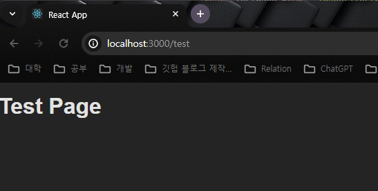

# 리액트 라우팅 맛보기

## 라우팅이란

웹 브라우저의 동작구조를 어느정도 알아야 한다.

url 중 도메인을 제외한 하위 url 의 정보를 토대로 컨텐츠를 로드

리액트에서 라우팅을 사용하기 위해서는 특정 라이브러리를 활용해야 한다.

페이지가 변경되면 Client Side의 리액트 코드가 페이지 변환을 핸들링 해야 하며,

표시되는 컨텐츠 들을 fetch 와 같은 api를 통해, html 파일을 불러들여야 한다.

## 라우터 정의하기

- npm i react-router-dom 을 설치
- createBrowserRotuer 를 react-router-dom으로부터 import
- createBrowserRouter를 사용하여 지정된 URL 에 대한 호출대상을 정의
    
    ```jsx
    import {createBrowserRouter} from 'react-router-dom';
    
    // path 에는 url 도메인의 뒤에 붙는 주소를 작성
    createBrowserRouter([
    	{path : '/'}
    ])
    ```
    
- element 속성을 사용하여, 해당 URL에 대한 페이지 이동 또는 요청이 있을 경우 호출할 요소를 지정
    
    ```jsx
    // index.js
    // 라우터를 정의하기위한 router 라이브러리 함수
    import { createBrowserRouter } from "react-router-dom";
    import Homepage from "./pages/Homepage";
    
    createBrowserRouter([{ path: "/", element: <Homepage /> }]);
    
    function App() {
      return <div></div>;
    }
    
    export default App;
    
    ```
    
    ```jsx
    // Homepage.js
    export default function Homepage() {
      return <h1>My Home PAge</h1>;
    }
    
    ```
    

### RouterProvider를 이용하여, 현재 접속중인 URL 에 대한 컨텐츠 표시

```jsx
// 라우터를 정의하기위한 router 라이브러리 함수
import { createBrowserRouter, RouterProvider } from "react-router-dom";
import Homepage from "./pages/Homepage";

const router = createBrowserRouter([{ path: "/", element: <Homepage /> }]);

function App() {
  return <RouterProvider router={router} />;
}

export default App;

```

RouterProvider 까지 import 후에 createBrowseRouter로 선언한 router를 RouterProvider의 router 속성의 값으로 지정한다.

그러면 실제 사용자가 접속해있는 사이트의 URL 에 따라 지정된 element를 화면에 표시 한다.

- Testpage.js
    
    ```jsx
    export default function Testpage() {
      return <h1>Test Page</h1>;
    }
    
    ```
    
- app.js 라우터 1개 추가
    
    ```jsx
    // 라우터를 정의하기위한 router 라이브러리 함수
    import { createBrowserRouter, RouterProvider } from "react-router-dom";
    import Homepage from "./pages/Homepage";
    import Testpage from "./pages/Testpage";
    
    const router = createBrowserRouter([
      { path: "/", element: <Homepage /> },
      { path: "/test", element: <Testpage /> }, 
    ]);
    
    function App() {
      return <RouterProvider router={router} />;
    }
    
    export default App;
    
    ```
    
- /test 접속 화면
    
  
    

### 구버전 Router 정의 방식

1. createBrowserRouter뿐 아니라, Route, CreateRoutesFromElelements를 import 한다.
2. createRoutesFromElements 로 만든 JSX 객체 에서 필요한 Path 에 대한 element를 매칭 시킨다 (Route 이용) 
3. createBrowserRouter에 createRouterFromElements 의 값을 할당한 변수를 인수로 넣는다.
4. RouterProvider 의 router속성의 값으로 (3)에서 생성한 변수를 입력

```jsx
import {createBrowserRouter, Route, createRoutesFromElements} from 'react-router-dom'

const routerDefinitions = createRoutesFromElements(
	<Route>
		<Route path='/' element={<Homepage />} />
		<Route path='/products' element={<ProductsPage/>} />
	</Route>
)

const router = createBrowserRouter(routerDefinitions);

function App() {
	return <RouterProvider router={router} />
}
```

### Link 태그를 이용한 페이지 전환 방법

- 기본 \<a> 태그를 이용하게 되면, 페이지를 전환하면서, client 의 상태를 잃어버릴수 있다.
    - 새로운 Http 요청을 전송하기 때문
- react-router-dom에서 Link를 import하여 페이지 전환 트리거에 사용
    - Link는 새로운 Http 요청을 전송하지 않고 라우트 정의만을 확인하여 이동 시킨다.
    - 그에 맞는 라우트 엘리먼트를 불러오기만 한다.

```jsx
// Homepage.js
import { Link } from "react-router-dom";

export default function Homepage() {
  return (
    <>
      <h1>My Home PAge</h1>;
      <p>
        GoTo <Link to="/products">The List Of Products Page</Link>.
      </p>
    </>
  );
}

```

## 레이아웃을 지정하여 라우팅을 구성하는 방법

- react-router-dom 활용
    - Outlet
    - createBrowserRouter

- MainNavigation.js 코드
    
    ```jsx
    import { Link } from "react-router-dom";
    
    function MainNavigation() {
      return (
        <header>
          <nav>
            <ul>
              <li>
                <Link to="/">Home</Link>
              </li>
              <li>
                <Link to="/products">Product</Link>
              </li>
            </ul>
          </nav>
        </header>
      );
    }
    
    export default MainNavigation;
    ```
    
- App.js 코드 변경
    
    ```jsx
    // 라우터를 정의하기위한 router 라이브러리 함수
    import { createBrowserRouter, RouterProvider } from "react-router-dom";
    import Homepage from "./pages/Homepage";
    import ProductPage from "./pages/Products";
    import RootLayout from "./components/RootLayout";
    
    const router = createBrowserRouter([
      {
        path: "/",
        element: <RootLayout />,
        children: [
          { path: "/", element: <Homepage /> },
          { path: "/products", element: <ProductPage /> },
        ],
      },
    ]);
    
    function App() {
      return <RouterProvider router={router} />;
    }
    
    export default App;
    
    ```
    
    - RootLayout 컴포넌트의 children으로 Homepage와 ProductPage가 위치하도록 설정
    - RootLayout 컴포넌트는 특정 태그를 이용하여 children 컴포넌트가 어디에 배치 될 것인지 지정해야함

- wrapper 역할을 하는 RootLayout.js 코드
    
    ```jsx
    import { Outlet } from "react-router-dom";
    import MainNavigation from "./MainNavigation";
    
    export default function RootLayout() {
      return (
        <>
          <h1>Root Layout</h1>
          <Outlet />
        </>
      );
    }
    
    ```
    
    - `Outlet`을 통해, children으로 지정된 컴포넌트의 렌더링 위치를 지정
    - 추가로 MainNavigation 컴포넌트가 템플릿 레이아웃으로써 작용하게 코드 변경
    
    ```jsx
    import { Outlet } from "react-router-dom";
    import MainNavigation from "./MainNavigation";
    
    export default function RootLayout() {
      return (
        <>
          <MainNavigation />
          <Outlet />
        </>
      );
    }
    
    ```