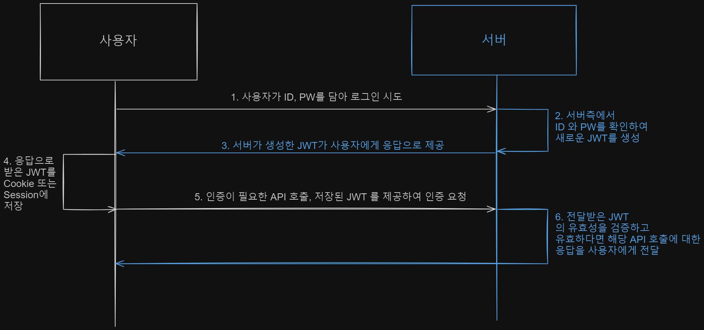
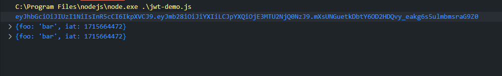

# 프로그래머스 데브코스 TIL : 2024-05-14(화)

### 참고 블로그 및 글

- [https://velog.io/@dkvlg/Express-js의-next-함수는-무엇일까](https://velog.io/@dkvlg/Express-js%EC%9D%98-next-%ED%95%A8%EC%88%98%EB%8A%94-%EB%AC%B4%EC%97%87%EC%9D%BC%EA%B9%8C)
- [https://velog.io/@ddangle/Session세션과-Token토큰의-차이는](https://velog.io/@ddangle/Session%EC%84%B8%EC%85%98%EA%B3%BC-Token%ED%86%A0%ED%81%B0%EC%9D%98-%EC%B0%A8%EC%9D%B4%EB%8A%94)

## Express 의 next()

## 인증과 인가

### 인증

- 서비스에 가입된 사용자 임을 증명하는것

### 인가

- 특정 권한을 가지고 있는지 확인 (인증 후 검증)

## 쿠키 (Cookie)

- 서버가 저장하지 않는다 ⇒ 서버의 공간을 사용하지 않는 것이 장점
- RESTful 하다? (StateLess 하다)
- 가로채기가 가능하다? ⇒ 단점

## 세션 (Session)

- 쿠키보다 비교적 보안이 좋다.
- 서버가 상태를 저장한다. ⇒ 서버 공간을 사용한다.

## JWT

- jwt 공식 사이트 : [jwt.io](https://jwt.io/introduction)

> JWT란?
Json Web Token 의 약자로 JSON 개체로 안전하게 전송하기 위한 간결하고 독립적인 방법을 정의하는 표준이다.
JSON 포맷을 사용하여 사용자에 대한 속성을 저장하는 Claim 기반의 Web Token
> 

JWT는 쿠키 및 세션의 단점을 보완한 정보교환 방식이다.

쿠키의 보안 관련 단점을, 세션의 리소스적 단점을 보완하였다.

### 개념

- JSON 형태의 데이터를 안전하게 전송하기 위한 웹에서 사용하는 Token
- 토큰 : 인증 + 인가를 위해 사용하는 정보 객체

### 장점

- 보안에 강하다 ⇒ 암호화가 되어있다.
- 서버가 상태를 저장하지 않는다. (StateLess)
    - 서버의 부담이 줄어든다.
- 토큰 발행 서버를 따로 만들 수 있어서 부담을 줄일 수 있다.

JWT는 `xxxxx.yyyyy.zzzzz` 와 같은식으로 Encoding (암호화) 되어 특정한 알고리즘을 걸쳐 복호화 되며, 개발자는 복호화된 정보를 토대로 로직을 수행한다.

## JWT의 구조

JWT 의 구조는 HEADER, PAYLOAD, Signature 로 구성되어있다.

### HEADER (헤더)

헤더는 두 부분으로 구성되어있다.

- JWT 인증 유형
- 서명 알고리즘 (HMAC SHA~  또는 RSA 등)

```jsx
{
	"alg" : "HS256",
	"typ" : "JWT"
}
```

헤더의 이 JSON 은 `Base64Url` 로 인코딩 되어 JWT의 첫 부분 (xxx.yyy.zzz 의 xxx 부분) 을 구성한다.

alg는 Signature를 해싱하기위한 알고리즘을 지정하는 부분이다.

### PAYLOAD (탑재정보)

- 토큰의 두번째 부분은 Claim 을 포함하는 정보 저장소 이다.
- Claim은 사용자 및 추가데이터에 대한 설명이다.
- Claim에는 등록된 Claim, 공개 Claim, 비공개 Claim 3종류가 존재한다.

- 등록된 Claim
    - 토큰 사용에 권장되는 `미리 정의된` Claim의 집하
    - iss(발급자), exp(만료시간), sub(주제), aud(수신자) 등의 정보를 포함한다.
- 공개 Claim
    - JWT를 사용하는 사람이 원하는 대로 정의할 수 있는 부분
    - 충돌 방지를 위해 URI 포맷을 이용한다.
        - “https://test.com” : true
- 비공개 Claim
    - 사용에 동의한 당사자간 정보를 공유하기 위해 생성된 맞춤 Claim

PAYLOAD의 예시

```jsx
{
	"sub" : "demoSubjection",
	"name" : "Jane Smith",
	"admin" : true
}
```

PAYLOAD 또한 `Base64Url` 로 인코딩 되어 JWT의 두번째 부분을 구성한다.

서명된 JWT 의 경우 PAYLOAD 또는 HEADER값을 누구나 읽을 수 있기 때문에, 비밀정보를 넣지 않는것이 원칙이다.

### Signature (서명)

서명은 토큰을 인코딩하거나, 유효성 검증을 수행할 때 사용하는 고유한 `암호화 코드` 이다.

- 서명 생성 과정
    
    HEADER 와 PAYLOAD 값을 각각 `Base64Url` 로 인코딩하고, 인코딩한 값을 비밀 키를 이용하여  HEADER에서 정의한 alg로 해싱하고, 이 값을 다시 `Base64Url` 로 인코딩하여 생성한다.
    

서명은 메시지가 도중에 변경되지 않았는지 확인하는데 사용되며, 개인 키 (Private-Key) 로 서명된

토큰의 경우 JWT를 보낸 사람이 누구인지도 확인 가능하다.

## JWT 인증+인가 절차

1. 사용자가 지정된 url (endpoint) 로 POST 로그인 요청을 보낸다.
2. 서버가 사용자임을 확인하고 `새로운 JWT를 생성한다`
3. 서버가 생성한 JWT가 사용자에게 응답으로 전달 된다.
4. 사용자 측에서는 응답으로 받은 JWT를 Cookie 또는 Session에 저장한다.
5. 사용자가 이용중 인증정보가 필요한 API 호출 시, 저장된 JWT를 서버에 보내 인증을 수행 한다.
6. 서버는 요청 받은 JWT가 유효한지 검증 한 후, 응답을 사용자에게 보낸다.
    
    
    

## JWT 구현해보기

- https://www.npmjs.com/package/jsonwebtoken
- npm 의 `jsonwebtoken` 라이브러리를 통해 JWT를 사용할 수 있다.
    
    ```jsx
    const dotenv = require("dotenv");
    dotenv.config();
    
    const jwt = require("jsonwebtoken"); //jwt 모듈 호출
    
    const token = jwt.sign({ foo: "bar" }, process.env.SECRET_KEY); // 토큰 생성 => jwt서명
    // 페이로드, 커스텀 암호키
    
    console.log(token); // 1
    
    const jwtResult = jwt.decode(token);
    console.log(jwtResult); // 2
    
    const jwtResult2 = jwt.verify(token, process.env.SECRET_KEY);
    
    console.log(jwtResult2); //3 
    
    ```
    
    - 콘솔 창
    
    
    

## .env 파일 사용하기

- 환경변수를 사용
- 외부 유출되면 안되는 정보 저장하는 방법이다
- github 에 코드를 push 할때, .gitignore 파일에서 해당 .env 파일의 공유를 막을 수 있다.
- Node에서는 npm 의 `dotenv` 라이브러리를 통해 환경변수 사용이 가능하다.