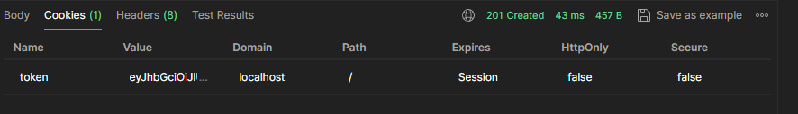

## npm cookie-parser

- [npm : cookie-parser](https://www.npmjs.com/package/cookie-parser)
- Request로 전달되는 cookie를 parsing할 수 있게 하는 라이브러리
- 서버는 기본적으로 응답에 쿠키를 동봉하여 응답한다.
    - 클라이언트 사이드인 브라우저는 응답받은 쿠키를 가지고 여러 API를 요청하는 등의 요청을 수행 할 수 있다.
- express에서 cookie-parser를 적용시키기
    
    ```jsx
    const express = require("express");
    const cookieParser = require("cookie-parser");
    const app = express()
    
    app.use(cookieParser());
    
    app.get('/' , (req, res) => {
    	console.log("Cookies : " , req.cookies)
    	
    	console.log("Signed Cookies :", req.signedCookies)
    	})
    ```
    
- jwt 를 사용하여 서버 측에서 응답(response)의 cookie에 JWT 정보를 담아 보내는 방법

```jsx
const token = jwt.sign(
   {
      email: loginUser.email,
      name: loginUser.name,
    },
    process.env.PRIVATE_KEY
  );
  // token 을 cookie 에 담기
  res.cookie("token", token);
  res.status(201).json({ message: `${email} 님 로그인 되었습니다.` });
```

- cookie에 token을 담아 응답을 발송한 결과
    
    
    

## JWT 토큰의 유효기간 설정

- JWT토큰은 유효기간을 설정해주어 토큰이 만료되게 해주어야 한다.
    
    ```jsx
    const jwt = require("jsonwebtoken");
    
    const token = jwt.sign(
      {
        email: loginUser.email,
        name: loginUser.name,
      },
      process.env.PRIVATE_KEY,
      // expiresIn 으로 유효시간을 지정 (h, m, s)
      // issuer로 토큰의 발급주체 정보를 알려줄 수 있다.
      { expiresIn: "3m", issuer: "kdman" }
    );
    // token 을 cookie 에 담기
    console.log(token)
    res.cookie("token", token, { httpOnly: true });
    ```
    

## Cookie 의 속성

### HttpOnly

- cookie는 클라리언트 사이드에서 JS를 이용하여 조회가 가능한데, 이에 따라 해커들도 JS로 쿠키를 가로채는 공격을 수행합니다. (XSS : Cross Site Scripting)
- HttpOnly 옵션을 사용한 쿠키는 브라우저에서의 접근이 제한된다.
- 쿠키의 정보를 기본적으로 브라우저가 이용할 필요는 없기 때문에 httpOnly 옵션을 가급적 적용시켜주는 것이 좋다.

### Secure

- https 가 아닌 프로토콜에서의 쿠키 교환을 제한하는 옵션
- 보안이 약한 http 에서의 쿠키 전달이 발생할 가능성이 있을 때, 이 옵션을 사용하여, 전송을 제한한다.

### Expires

- 쿠키의 만료 시간을 설정하는 옵션이다. (유효일자)
- 날짜/시간 의 값으로 지정된다.