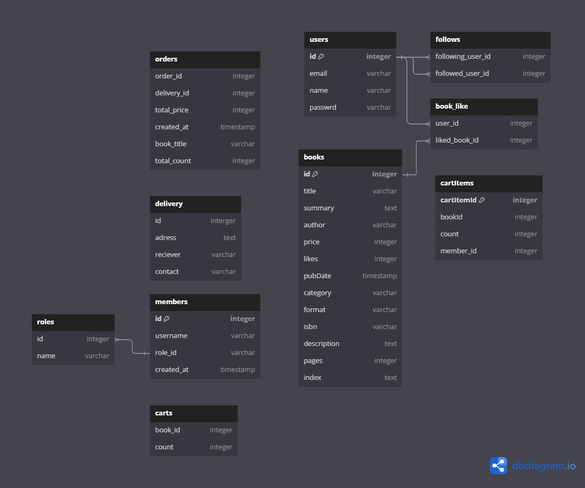

## 좋아요 API 및 DB ERD 설계

기존 좋아요 API는 좋아요 추가시 PUT, 취소 시 PUT으로 진행했었는데,

이번 강의에서는 좋아요 생성을 POST, 취소는 DELETE로

즉, 좋아요 테이블에서, 좋아요 행위에 대한 행을 추가 또는 삭제함으로써 그것을 관리하는 방식으로 전환했다.

이 방법이 기존의 메서드를 사용한 API 보다 낫다고 생각되는 이유는

PUT+PUT 방법은, Request Body 안에 신규 좋아요 인지, 좋아요 취소 인지에 대한 분기 값이 필요하고

그에 따라 Body를 해성하는 로직 또한 추가로 필요했으므로, 불필요한 연산 자체가 일부분 늘어나는 반면

POST + DELETE 조합은 라우터를 통해서만 컨트롤 하면 되기 때문에, 관심사도 분리 가능하고,

각 요청에 대한 Body에서 값을 뽑아내어 사용하기만 하면 되므로 훨씬 독립적인 API를 작성할 수 있는

장점이 있는 것으로 생각된다.

## 작성한 ERD

아래 첨부하는 ERD는 강의 내용에서 알려준 ERD이다.


도서구매 사이트를 예시로 한 ERD 인데,

다른 Table에 대해서는 올바른 설계라고 생각하지만,

members 와 cartItem에 대해서는 조금 다른 견해를 갖고 있다.

## member Table

members 테이블에는 유저 한명에 대한 여러 컬럼이 존재 하는데,

그중에 Role에 관하여 조금 다른 방식으로 생각했다.

이전에 프로젝트를 진행할 때, 권한과 관련하여, 카테고리화를 시켜놓은 테이블을

본 경험이 있어서, 저런 분류가 필요한 목록에 대해서는 또 다른 테이블을 가져야 하는 것이 아닐까 싶다.

member 한명이 role 의 id값을 참조하여 권한을 가지는 방식으로 진행 한다면,

role정책이 변경될때에, 해당 role테이블만 수정하도록 할 수 있기 때문에 role에 대한 테이블을 분리해 보았다.


즉 API 가 실행 될 때, 쿼리를 통해 member의 role_id를 통해 어떤 role인지 확인하는 작업은 추가적으로 필요하지만

지금보다 더 큰 규모의 권한을 다뤄야 하는 서비스의 경우에는 서비스 방향성에 따라 얼마든지 role이 변형될 수 있다고 생각한다.

## cartItem Table

cartItem 테이블은 유저 한명이 장바구니에 담게 되는 상품 정보 들을 담아놓는 테이블이 되는 것인데,

이때에도, member 또는 user 한명이 사용하는 행들을 수집하기 위해서는, 추가로 member의 id가 필요하지 않을 까 한다.

즉, 해당 cartItem에 한 행에 대한 `소유권`을 가지는 Member를 기입하여,

추후 API로 장바구니 목록을 찾게 될 때, 한 유저에 대해서 빠르게 찾을 수 있도록 함이 목적이다.


위의 이유로 인해 cartItem 테이블에도 member를 구분할 수 있는 컬럼인 member_id를 추가하였다. 

## 재작성한 ERD



위에서의 소견대로, 추가적으로 수정한 테이블은 roles와 members, 그리고 cartItems이다.

물론 현재 규모가 크지 않은 작은 프로젝트를 진행중이긴 하나.

나중에 사용자가 재로그인할 때에도, 해당 유저의 정보를 바탕으로 이전에 등록해놓은 장바구니목록을

불러오거나, 사용자 권한이 바뀌었을 때를 고려하여 위와 같이 테이블들을 재작성 하였다.

## API

위의 ERD를 토대로 장바구니 조회와 같은 API에 대한 명세를 작성해보았다.

### 장바구니 조회 API

- Method : `GET`
- URI : `/cart/:member_id`
- Request Body
- Response Body
    
    ```json
    [
    	{
    		"bookId" : 1,
    		"count" : int,
    		"price" : int,
    	},
    		{
    		"bookId" : 2,
    		"count" : int,
    		"price" : int,
    	},
    		{
    		"bookId" : 3,
    		"count" : int,
    		"price" : int,
    	},
    ]
    ```
    

위의 형식으로 Response를 응답하게 되면 프론트(클라이언트) 단에서 JSON 정보를 토대로

어떤 책을 얼마만큼 구매하고, 그에 대한 총 가격은 얼마인지를 계산하여 렌더링 할 수 있다.

중요한것은 권한상, 자신의 member_id로만 해당 카트에 접근할수 있도록 제한해야 하는 것이

사용자 경험에 영향을 끼칠 것 같다.

### 팔로잉 API

- 팔로잉 신청 API
    - Method : `POST`
    - URI : `/follow/:member_id`
    - Request Body
    - Response Body
    
    팔로잉 신청은 following 테이블과 같이 follow를 하는 사람과 follow 당할 유저만 알게 되면 된다.
    
    팔로잉을 신청하는 순간 새로운 행이 following 테이블에 INSERT 되는 식으로 API를 구성하면 
    
    취소 시에도 WHERE 조건문을 따라 DELETE만 하면 충분히 컨트롤 가능할 것으로 보인다.
    

- 팔로잉 취소 API
    - Method : `DELETE`
    - URI : `/follow/:member_id`
    - Request Body
        
        ```json
        {
        	"follow_user_id" : 팔로우 취소를 하는 user의 id
        }
        ```
        
    - Response Body
        
        ```json
        {
        	message : "~에 대한 팔로우가 취소되었습니다"
        }
        ```
        
        팔로우 취소도 팔로우 신청에 대한 URI를 같이 사용하며 Method에 따라 라우터로 분리하면 될 듯 하다.
        
        RequestBody에 팔로우를 취소 요청하는 요청자의 ID를 넣어 전달하게 되면
        
        서버에서 해당 ID가 팔로우 하고 있는 유저 중, Req의 Params 로 들어온 member의 id를 찾아 DELETE를 수행하면 된다.
        
    
    실제 서비스에서도 설계시에는, 같은 범주의 API 수행에 대해 위와 같이 같은 URI를 공유하며 METHOD에 대해서만 라우팅을 하면 될 듯 하다.
    
    다만 경험상 ERD 는 세분화 할 수 있을 만큼 어느정도 세분화 하는것이 추후 운영 및 유지보수를 위해 더욱 좋을 듯 하다.
    
    운영중 정책이 변경되거나 생성됨에 따라서, 그와 연관된 테이블의 사용 용도도 조금은 달라진다고 생각하기 때문에, 위에서 설명한 것과 같이 roles와 같은 따로 모아둘수 있는 범주의 개념들을 세분화 하여 테이블로 분리 해놓는 것이 더 좋은 운영을 위한 방안이지 않을 까싶다.