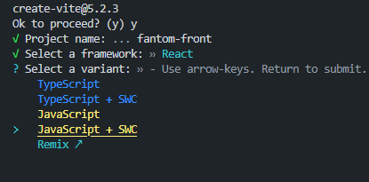
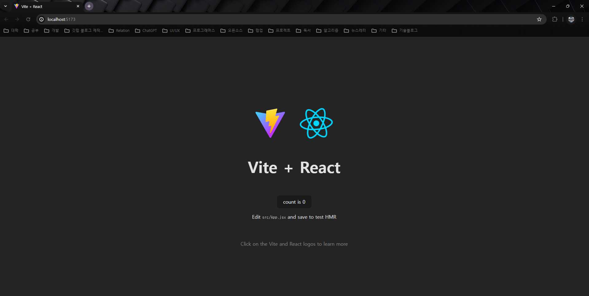
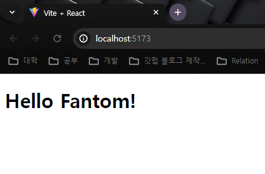

# fantom 프로젝트 구성

- 언어 : JS (추후 리팩토링 필요시 TS로 전환 예정)
- 라이브러리
    - React
    - TailwindCSS

## 프로젝트 설명

우선 fantom 사이트의 목적은 팬이 자신이 좋아하는 아티스트나 연예인의 아카이브를 생성하여

그곳에 사진이나 TMI 를 posting 할 수 있는 사이트로 만들고자 한다.

유저는 페이지를 아티스트별로 1개씩 생성할 수 있고, 내가 생성한 페이지는 다른 유저들도 검색하여 찾아볼수있다.

또한 페이지 좋아요 기능을 통해, 좋아요를 많이 받은 페이지는 상위 노출이 되도록 하는,

화면의 레이아웃은 페이스북과 인스타그램에 영향을 받아 기획 하였다.

 

## 프로젝트 시작

vite+ React의 조합으로 프로젝트를 시작하였다.

```bash
npm init vite
```


- 요즘 ESBuild 보다 SWC 컴파일이 속도면에서 더 빠르다는 글을 많이 봤어서 이번 프로젝트의 컴파일은 SWC로 진행하고자 JavaScript + SWC 의 조합으로 프로젝트를 생성하였다.

```bash
npm run dev
```

- 프로젝트 생성이 올바르게 되었는지 확인하기위해 개발 서버를 실행



- 올바르게 프로젝트가 생성된 것을 확인하였다.

이제 프로젝트를 완전히 리셋하기위해 main.jsx, App.jsx를 남겨놓고 모두 지운다.

그리고 App.jsx의 코드를 간단하게 Hello Fantom!으로 바꾸어 올바르게 적용 되었는지 확인!

```jsx
function App() {
  return <h1>Hello Fantom!</h1>;
}

export default App;

```



## 화면 구성

페이스북의 레이아웃을 거의 참고 하였다.

현재 내 능력으로는 레이아웃을 창작하는 능력까지는 없다.

그리고 지금의 기준으로는 뭔가 다양하게 이것저것 있는 화면이 더 보기 좋은 것이지 않을까?

하는 생각이 깊게 있었는데,(잡코리아, 잡플래닛을 좋은 레이아웃을 갖춘 사이트로 생각했었다)

그것이 생각보다 나라별, 문화에 따른 차이가 크게 영향을 끼친다는 것을 좀 느꼈다.

실제로 세상에서 가장 유명한 SNS 중 하나인 트위터, 페이스북, 인스타그램의 웹 화면을 보게 된다면, 생각보다 단순한 레이아웃 구성을 가지고 있다.

간단하게 포스팅을 렌더링하는 부분과, 특정 페이지로 이동할 수 있는 버튼들, 그리고 몇몇 모달이 거의 주를 이룬다.

하지만, 한국, 즉 국내의 대부분의 사이트 들은 정보가 다양하게 들어있는 페이지를 메인에 띄우는 경향이 있는 것을 조사하면서 확인했다.

아무래도 문화적 정서의 차이로, 간단하고 심플한 레이아웃을 추구하는 곳은 특정 기능으로 연계되도록 여러번 진입을 해야하는 구성으로 되어 있었고,

국내 대부분의 내로라 하는 웹사이트 들은, 한페이지 내에서 원하는 특정 기능으로 접근하기 위해 적게는 1번, 많게는 2번정도의 클릭으로 이동할 수 있는 UX를 구성하는 것으로 분석하였다.

실제 내가 만들고자 하는 웹사이트는 현재 MVP 기능만을 생각하고 구성하는것도 있지만,

그렇게 다양한 서비스를 제공하려는 목적이 아니다.

어떻게 보면 원초적으로 내가 좋아하는 연예인, 아티스트에 대한 나만의 저장공간, 나의 팬심을 드러낼 수 있는 공간과, 그 공간에 나는 이 존재를 어떻게 생각하는지를 보여주기만 하면 되는,

그런 간단하고 원초적인 목적을 염두하는 프로젝트 이기에

국내의 좋은 웹 사이트들이 많지만, 생각보다 화면에 많은 것이 포함되지 않는 페이스북의 레이아웃을 참조하려고 한다.