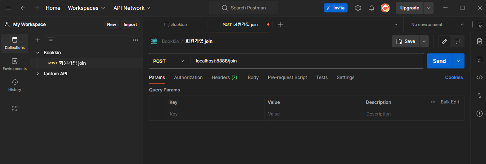

### 프로젝트 깃헙
- [bookio Github](https://github.com/ykdman/Programmers-DevCourse/tree/main/bookkio)
# 도서 구매 서비스 API 설계 및 서버 사이드 스크립트 작성

- 회원가입, 장바구니, 주문에 대한 기본 API 명세를 작성하여, 해당 API를 기반으로 서버를 구성한다.

## 회원 가입 API

### 회원 가입

- Method : `POST`
- URI : /join
- HTTP Status Code : 성공- 201
- Requiest Body
    
    ```jsx
    {
    	email : "사용자 입력 이메일",
    	password : "사용자 입력 비밀번호"
    }
    ```
    
- Response Body : None

### 로그인

- Method : `POST`
- URI : /login
- HTTP Status Code : 성공 200
- Request Body
    
    ```jsx
    {
    	email : "사용자 이메일",
    	password : "사용자 비밀번호"
    }
    ```
    
- Response Body : JWT Token

### 비밀번호 초기화 요청

- Method : `POST`
- URI : /reset
- HTTP Status Code : 200
- Request Body
    
    ```jsx
    {
    	email : "사용자 입력 이메일"
    }
    ```
    
- Response Body

### 비밀번호 초기화 (수정)

- Method : `PUT`
- URI : /reset
- HTTP Status Code : 200
- Request Body
    
    ```jsx
    {
    	password : "사용자가 입력한 비밀번호"
    }
    ```
    

## 도서 API

### 전체 도서 조회

- Method : `GET`
- URI : /books
- HTTP Status COde : 200
- Request Body
- Response Body
    
    ```jsx
    [
    	{
    		id : 도서id,
    		title : 도서 제목,
    		summary : 요약 설명,
    		author : 도서 작가,
    		price : 가격,
    		likes : 좋아요 수,
    		pubDate : 출간일
    	},
    		{
    		id : 도서id,
    		title : 도서 제목,
    		summary : 요약 설명,
    		author : 도서 작가,
    		price : 가격,
    		likes : 좋아요 수,
    		pubDate : 출간일
    	},
    		{
    		id : 도서id,
    		title : 도서 제목,
    		summary : 요약 설명,
    		author : 도서 작가,
    		price : 가격,
    		likes : 좋아요 수,
    		pubDate : 출간일
    	} ...
    ]
    ```
    

### 개별 도서 조회

- Method : `GET`
- URI : /books/:bookId
- HTTP Status Code : 200
- Request Body
- Response Body
    
    ```jsx
    {
    		id : 도서id,
    		title : 도서 제목,
    		summary : 요약 설명,
    		author : 도서 작가,
    		description : 상세 설명,
    		price : 가격,
    		likes : 좋아요 수,
    		pubDate : 출간일,
    		pages: 쪽수,
    		liked : boolean,
    		index : 목차,
    		ibbn : isbn,
    		format : 포맷,
    		category : 카테고리
    	}
    ```
    

### 카테고리별 도서 목록 조회

- Method : `GET`
- URI : /books?categoryId={cartegoryId}&new={boolean}
- HTTP Status Code : 200
- Request Body
- Response Body
    
    ```jsx
    [
    	{
    		id : 도서id,
    		author : 도서 작가,
    		price: 가격,
    		likes : 좋아요 수,
    		pubDate : 출간일
    	},
    		{
    		id : 도서id,
    		author : 도서 작가,
    		price: 가격,
    		likes : 좋아요 수,
    		pubDate : 출간일
    	},
    		{
    		id : 도서id,
    		author : 도서 작가,
    		price: 가격,
    		likes : 좋아요 수,
    		pubDate : 출간일
    	}
    ]
    ```
    

## 장바구니 API

### 장바구니 담기

- Method : `POST`
- URI : /cart
- HTTP Status Code : 200
- Request Body
    
    ```jsx
    {
    	bookId : 도서 id,
    	count : 수량
    }
    ```
    

### 장바구니 조회

- Method : `GET`
- URI : /cart
- HTTP Status Code : 200
- Request Body
- Response Body
    
    ```jsx
    [
    	{
    		id : 장바구니 도서 Id,
    		bookId : 도서 Id,
    		title : 도서 제목,
    		summary : 도서 요약,
    		count : 수량,
    		price : 가격
    	},
    		{
    		id : 장바구니 도서 Id,
    		bookId : 도서 Id,
    		title : 도서 제목,
    		summary : 도서 요약,
    		count : 수량,
    		price : 가격
    	},
    		{
    		id : 장바구니 도서 Id,
    		bookId : 도서 Id,
    		title : 도서 제목,
    		summary : 도서 요약,
    		count : 수량,
    		price : 가격
    	}
    ]
    ```
    

### 장바구니 도서 삭제

- Method : `DELETE`
- URI : /cart/:bookId

### 주문 예상 상품 목록 조회

- Method : `GET`
- URI : /
- HTTP Status Code : 200
- Request Body
    
    ```jsx
    [cartItemId, cartItemId, cartItemId...]
    ```
    
- Response Body
    
    ```jsx
    [
    	{
    		id : 장바구니 도서 Id,
    		bookId : 도서 Id,
    		title : 도서 제목,
    		summary : 도서 요약,
    		count : 수량,
    		price : 가격
    	},
    		{
    		id : 장바구니 도서 Id,
    		bookId : 도서 Id,
    		title : 도서 제목,
    		summary : 도서 요약,
    		count : 수량,
    		price : 가격
    	},
    		{
    		id : 장바구니 도서 Id,
    		bookId : 도서 Id,
    		title : 도서 제목,
    		summary : 도서 요약,
    		count : 수량,
    		price : 가격
    	}
    ]
    ```
    

## 결제 (주문) API

### 결제하기

- 주문하기 = 주문 등록 = DB 주문 Data Insert = Cart에서 주문된 상품 Delete
- Method : `POST`
- URI : /orders
- HTTP Status Code : 200
- Request Body
    
    ```jsx
    {
    	items : [
    		{
    			cartItemId:장바구니 도서 ID,
    			bookId:도서 Id,
    			count : 수량
    		},
    		{
    			cartItemId:장바구니 도서 ID,
    			bookId:도서 Id,
    			count : 수량
    		},
    		{
    			cartItemId:장바구니 도서 ID,
    			bookId:도서 Id,
    			count : 수량
    		},
    	],
    	delivery : {
    		address : 주소,
    		receiver : 수령인,
    		contact : 모바일 번호
    	},
    	totalPrice : 총 주문 금액
    }
    ```
    

### 주문 목록 조회

- Method : `GET`
- URI : /orders
- HTTP Status Code : 200
- Request Body
- Response Body
    
    ```jsx
    [
    	{
    		order_id : 주문 id,
    		created_at : 주문일자,
    		delivery : {
    				address : 주소,
    				receiver : 수령인,
    				contact : 모바일 번호
    		},
    		bookTitle : 대표 책 제목,
    		totalPrice : 결제 금액,
    		totalCount : 총 수량
    	}
    ]
    ```
    

### 주문 상세 상품 조회

- Method : `GET`
- URI : /orders/:orderId
- HTTP Status Code : 200
- Request Body
- Response Body
    
    ```jsx
    [
    	{
    		bookId : 도서 id,
    		bookTitle : 도서 제목,
    		author : 도서 작가,
    		price : 가격,
    		count : 수량
    	},
    	{
    		bookId : 도서 id,
    		bookTitle : 도서 제목,
    		author : 도서 작가,
    		price : 가격,
    		count : 수량
    	},
    	{
    		bookId : 도서 id,
    		bookTitle : 도서 제목,
    		author : 도서 작가,
    		price : 가격,
    		count : 수량
    	},
    ]
    ```
    

## Express Generator로 보는 백엔드 구조

### bin

- \www : 포트 번호 등과 같은 웹 서버를 구축하는데 필요한 설정 데이터 정의
    - package.json의 start 명령어를 보면 `node ./bin/www` 로 실제 실행부가 되는 것을 알 수 있다.

### node_modules

- NPM 및 프로젝트에서 사용하는 라이브러리 가 저장되어있는 폴더

### public

- 정적 파일을 저장해 놓는 폴더 (JS, IMG, CSS)

### routes

- 각 URL 요청 경로에 대한 응답을 담당하는 모듈들이 들어가야할 폴더
- 라우팅 로직을 구현해 놓는다.

### app.js

- express 서버의 시작점

### package.json

- 프로젝트 사용 의존성 및, 명령어가 작성되어 있는 파일 (node 프로젝트는 모두 package 파일을 가진다.)

## 프로젝트 셋팅

- 새로운 폴더를 생성하여 해당 폴더에 Node 의존성 패키지들을 다운로드하여 시작!
- 내가 만든 프로젝트 이름은 BOOKKIO (북끼오) 이다.
- 설치할 의존성
    - express
    - express-validator
    - jsonwebtoken
    - mysql2
    - dotenv
    
    ```json
    {
      "dependencies": {
        "dotenv": "^16.4.5",
        "express": "^4.19.2",
        "express-validator": "^7.1.0",
        "jsonwebtoken": "^9.0.2",
        "mysql2": "^3.9.7"
      }
    }
    ```
    

```json
express -e bookkio
```

- 위 명령어를 통해 ejs 템플릿 엔진을 이용하는 express 서버를 구축

## API 수행 Test

- Postman Agent 를 이용하여 API 에 대한 수행 테스트를 수행하기로 하였다.



## 회원 API 코드 작성

- www 로 서버 실행 → app.js의 라우팅으로 route 컨트롤러 모듈로 이동 → controller 함수 실행의 순으로 Request에 대한 응답을 처리하는 구조를 처리하게 구성하였다.

- app.js
    
    ```jsx
    // app.js
    const createError = require("http-errors");
    const express = require("express");
    const path = require("path");
    const cookieParser = require("cookie-parser");
    const logger = require("morgan");
    
    const usersRouter = require("./routes/users.router.js");
    
    const app = express();
    
    // view engine setup
    app.set("views", path.join(__dirname, "views"));
    app.set("view engine", "ejs");
    
    app.use(logger("dev"));
    app.use(express.json());
    app.use(express.urlencoded({ extended: false }));
    app.use(cookieParser());
    app.use(express.static(path.join(__dirname, "public")));
    
    // Routing
    app.use("/users", usersRouter);
    ```
    

- routes \ users.route.js
    
    ```jsx
    const express = require("express");
    const router = express.Router();
    
    const { userJoin } = require("../controller/users.controller.js");
    
    // 회원가입
    router.post("/join", userJoin);
    
    // 로그인
    router.post("/login");
    
    // 비밀번호 초기화 요청
    router.post("/reset");
    
    // 비밀번호 초기화
    router.put("/reset");
    
    module.exports = router;
    
    ```
    
- controller \ users.controller.js
    
    ```jsx
    /**
     *
     * @param {import("express").Request} req
     * @param {import("express").Response} res
     * @param {import("express").NextFunction} next
     */
    const userJoin = (req, res, next) => {
      res.status(200).json({ message: "회원가입 API" });
    };
    
    module.exports = {
      userJoin,
    };
    
    ```
    

위와 같이 구조를 결정한 이유는, 이후 router 가 변경되어야 할 때는 router만 변경 할 수 있고,

controller 로직이 변경될 때에는 controller의 소스만 변경할 수 있기 때문에,

추후 유지보수에 대하여 개발적 이점을 가져가기 위함이다.

추후 각 API에 대한 router → controller의 구조로 서버 스크립트 작성 및 ERD 작성 예정이다.