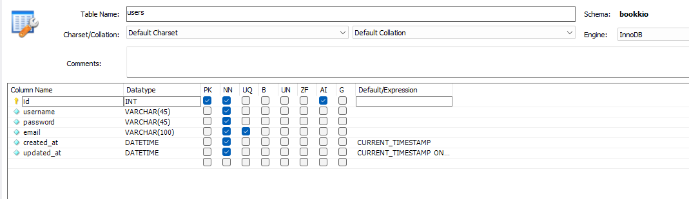
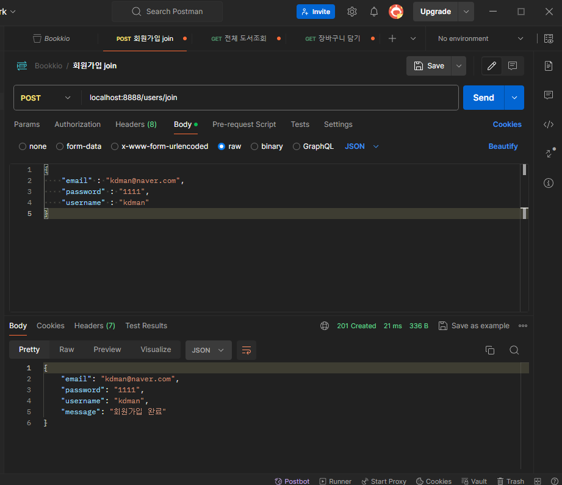
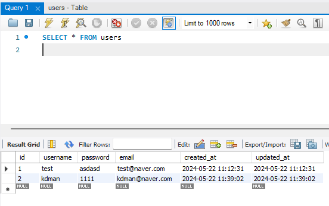
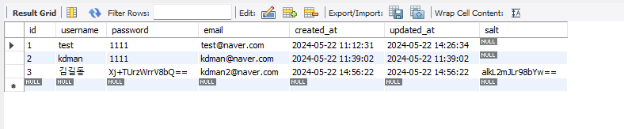

# Bookkio Project - 2일차

## 전체 DB 연결 코드

- model \ mysql.js
    
    ```jsx
    const dotenv = require("dotenv");
    dotenv.config();
    
    const mysql = require("mysql2");
    const connection = mysql.createConnection({
      host: "127.0.0.1",
      port: 3306,
      user: process.env.DB_USERNAME,
      password: process.env.DB_PASSWORD,
      database: "bookkio",
    });
    
    module.exports = connection;
    
    ```
    

## API npm : HTTP Status code 이용하기

```
npm i http-status-codes
```

- [npm : http-status-codes](https://www.npmjs.com/package/http-status-codes)를 이용하여 API 응답시 반환되는 Status Code에 대한 코드 일관성을 유지 한다.

## 회원가입 API 구현

### users Table 상세



- user.controller.js
    
    ```jsx
    const dbConnection = require("../model/mysql.js");
    const { StatusCodes } = require("http-status-codes");
    
    /**
     * 회원가입 로직
     * @param {import("express").Request} req
     * @param {import("express").Response} res
     * @param {import("express").NextFunction} next
     */
    const userJoin = (req, res, next) => {
      const { email, password, username } = req.body;
      let querySql = `
        SELECT * FROM users
        WHERE email = ?
      `;
      dbConnection.query(querySql, email, (err, result) => {
        if (err) {
          // Query Error
          return res.status(StatusCodes.SERVICE_UNAVAILABLE).json(err.message);
        }
    
        if (!result[0]) {
          // no rows => 200
          querySql = `INSERT INTO users 
          (email, username, password) 
          VALUES 
          (?, ? ,?)`;
          dbConnection.query(
            querySql,
            [email, username, password],
            (err, result) => {
              if (err) {
                return res.json(err);
              }
              return res.status(StatusCodes.CREATED).json({
                email,
                password,
                username,
                message: "회원가입 완료",
              });
            }
          );
        } else {
          return res
            .status(StatusCodes.BAD_REQUEST)
            .json({ email, message: "이미 가입된 회원입니다." });
        }
      });
    };
    ```
    
- postman으로 API 수행 테스트
    
    
    
    
    

## 로그인 API 구현

```jsx
/**
 * 로그인 로직
 * @param {import("express").Request} req
 * @param {import("express").Response} res
 * @param {import("express").NextFunction} next
 */
const userLogin = (req, res, next) => {
  const { email, password } = req.body;

  let sqlQuery = `
    SELECT * FROM users
    WHERE email = ?
  `;
  // email 존재 확인
  dbConnection.query(sqlQuery, email, (err, result) => {
    if (err) {
      return res.status(StatusCodes.SERVICE_UNAVAILABLE);
    }

    const existUser = result[0];
    // 입력 비밀번호 를 DB salt 기반 암호화 하여 비밀번호 비교
    const inputHashPassword = crypto
      .pbkdf2Sync(password, existUser.salt, 10000, 10, "sha512")
      .toString("base64");

    if (existUser && inputHashPassword === existUser.password) {
      // 로그인 성공
      const token = jwt.sign(
        {
          email: existUser.email,
        },
        process.env.PRIVATE_KEY,
        {
          expiresIn: "5m",
          issuer: "kdman",
        }
      );
      // token 쿠키 설정
      res.cookie("token", token, {
        httpOnly: true,
      });

      return res.status(StatusCodes.OK).json({ message: "로그인되었습니다." });
    } else {
      // email 미 존재시, 404
      return res
        .status(StatusCodes.UNAUTHORIZED)
        .json({ message: "존재하지 않는 이메일입니다." });
    }
  });
};
```

- crypto 모듈을 이용하여, DB에 저장된 salt로 사용자가 입력한 비밀번호를 암호화 한 후, 해당 입력 값이 DB에 저장된 암호화된 비밀번호와 일치하면 로그인을 승인하는 로직으로 작성하였다.
- 애초에 존재하지 않는 계정이라면, 비밀번호 비교 까지 갈 필요도 없기때문에 (리소스 낭비) if 문으로 먼저 email 선별 과정자체를 걸치게 작성하였다.

## 비밀번호 초기화 요청 & 적용 API 구현

- 비밀번호 초기화 요청 controller 함수
    
    ```jsx
    /**
     * 비밀번호 초기화 요청 로직
     * @param {import("express").Request} req
     * @param {import("express").Response} res
     * @param {import("express").NextFunction} next
     */
    const requestResetPassword = (req, res, next) => {
      const { email } = req.body;
      let sqlQuery = `SELECT * FROM users WHERE email=?`;
      dbConnection.query(sqlQuery, [email], (err, result) => {
        if (err) {
          console.log(err);
          return res.status(StatusCodes.BAD_REQUEST).end();
        }
    
        const existUser = result[0];
        if (existUser) {
          return res.status(StatusCodes.OK).json({ email });
        } else {
          return res.status(StatusCodes.FORBIDDEN).end();
        }
      });
    };
    ```
    

- 비밀번호 초기화 및 변경 적용 controller 함수
    
    ```jsx
    /**
     * 비밀번호 수정 로직
     * @param {import("express").Request} req
     * @param {import("express").Response} res
     * @param {import("express").NextFunction} next
     */
    const acceptResetPassword = (req, res, next) => {
      const { email, password } = req.body;
      const salt = crypto.randomBytes(10).toString("base64");
      const hashedPassword = crypto
        .pbkdf2Sync(password, salt, 10000, 10, "sha512")
        .toString("base64");
      let sqlQuery = `
        UPDATE users SET password = ?, salt = ? 
        WHERE email =?
      `;
      dbConnection.query(sqlQuery, [hashedPassword, salt, email], (err, result) => {
        if (err) {
          console.log(err);
          return res.status(StatusCodes.BAD_REQUEST);
        }
    
        if (result.affectedRows > 0) {
          return res.status(StatusCodes.OK).json(result[0]);
        } else {
          return res.status(StatusCodes.BAD_REQUEST).end();
        }
      });
    };
    ```
    

## 비밀번호 암호화 하여 저장하기

```jsx
const crypto = require('crypto')
```

- Node.js 자체 내장 모듈인 `crypto` 를 사용하여 비밀번호 생성 시 암호화 후 저장을 진행

```jsx
const salt = crypto.randomBytes(64).toString("base64");
const hashedPassword = crypto
  .pbkdf2Sync(password, salt, 10000, 64, "sha512")
  .toString("base64");
```

- 위와 같이 비밀번호 원천 값을 암호화를 진행한다.
    - randomBytes() : 매개변수의 수를 기반으로 랜덤 바이트를 생성
    - pbkdf2Sync : 매개변수를 통해 비밀번호 매개변수 암호화
        - password : 암호화 할 비밀번호
        - salt : 입력으로 들어가는 패스워드에 추가적으로 입력되는 string 값
        - iteration : 암호화를 반복할 횟수
        - keylen : 길이
        - digest : 암호화 알고리즘

- 암호화를 사용하여, 해시된 비밀번호와, salt 값을 DB에 같이저장하는 회원가입 코드
    
    ```jsx
    /**
     * 회원가입 로직
     * @param {import("express").Request} req
     * @param {import("express").Response} res
     * @param {import("express").NextFunction} next
     */
    const userJoin = (req, res, next) => {
      const { email, password, username } = req.body;
    
      // crypt password
      const salt = crypto.randomBytes(10).toString("base64");
      const hashedPassword = crypto
        .pbkdf2Sync(password, salt, 10000, 10, "sha512")
        .toString("base64");
    
      let sqlQuery = `
        SELECT * FROM users
        WHERE email = ?
      `;
      dbConnection.query(sqlQuery, email, (err, result) => {
        if (err) {
          // Query Error
          return res
            .status(StatusCodes.SERVICE_UNAVAILABLE)
            .json(err.message)
            .end();
        }
    
        if (!result[0]) {
          // no rows => 200
          sqlQuery = `INSERT INTO users 
          (email, username, password, salt) 
          VALUES 
          (?, ?, ?, ?)`;
          dbConnection.query(
            sqlQuery,
            [email, username, hashedPassword, salt],
            (err, result) => {
              if (err) {
                return res.json(err);
              }
              return res.status(StatusCodes.CREATED).json({
                email,
                password,
                username,
                message: "회원가입 완료",
              });
            }
          );
        } else {
          return res
            .status(StatusCodes.BAD_REQUEST)
            .json({ email, message: "이미 가입된 회원입니다." });
        }
      });
    };
    ```
    
- 로그인 API 또한 입력 한 비밀번호에 대한 암호화를 통해 DB의 비밀번호 값과 비교 한다.
    
    ```jsx
    /**
     * 로그인 로직
     * @param {import("express").Request} req
     * @param {import("express").Response} res
     * @param {import("express").NextFunction} next
     */
    const userLogin = (req, res, next) => {
      const { email, password } = req.body;
    
      let sqlQuery = `
        SELECT * FROM users
        WHERE email = ?
      `;
      // email 존재 확인
      dbConnection.query(sqlQuery, email, (err, result) => {
        if (err) {
          return res.status(StatusCodes.SERVICE_UNAVAILABLE);
        }
    
        const existUser = result[0];
        // 입력 비밀번호 를 DB salt 기반 암호화 하여 비밀번호 비교
        const inputHashPassword = crypto
          .pbkdf2Sync(password, existUser.salt, 10000, 10, "sha512")
          .toString("base64");
    
        if (existUser && inputHashPassword === existUser.password) {
          // 로그인 성공
          const token = jwt.sign(
            {
              email: existUser.email,
            },
            process.env.PRIVATE_KEY,
            {
              expiresIn: "5m",
              issuer: "kdman",
            }
          );
          // token 쿠키 설정
          res.cookie("token", token, {
            httpOnly: true,
          });
    
          return res.status(StatusCodes.OK).json(existUser);
        } else {
          // email 미 존재시, 404
          return res
            .status(StatusCodes.UNAUTHORIZED)
            .json({ message: "존재하지 않는 이메일입니다." });
        }
      });
    };
    ```
    
- DB에는 이제 암호화된 비밀번호와 해당 암호를 암호화 할 때 사용한 salt 값이 포함되어있다.



- 이제 비밀번호를 변경하는 API 또한, 기존 비밀번호를 복호화 할 필요 없이 비밀번호를 새로 설정 해야 한다.
    - 비밀번호를 새로 설정 할 때, 회원가입과 똑같이 salt 값과 salt인해 암호화된 password를 UPDATE문으로 수정한다.
- 비밀번호 변경 적용 API
    
    ```jsx
    /**
     * 비밀번호 수정 로직
     * @param {import("express").Request} req
     * @param {import("express").Response} res
     * @param {import("express").NextFunction} next
     */
    const acceptResetPassword = (req, res, next) => {
      const { email, password } = req.body;
      const salt = crypto.randomBytes(10).toString("base64");
      const hashedPassword = crypto
        .pbkdf2Sync(password, salt, 10000, 10, "sha512")
        .toString("base64");
      let sqlQuery = `
        UPDATE users SET password = ?, salt = ? 
        WHERE email =?
      `;
      dbConnection.query(sqlQuery, [hashedPassword, salt, email], (err, result) => {
        if (err) {
          console.log(err);
          return res.status(StatusCodes.BAD_REQUEST);
        }
    
        if (result.affectedRows > 0) {
          return res.status(StatusCodes.OK).json(result[0]);
        } else {
          return res.status(StatusCodes.BAD_REQUEST).end();
        }
      });
    };
    ```
    

오늘은 이렇게 bookkio 프로젝트에서 회원 가입, 로그인, 비밀번호 초기화 등 사용자와 관련된

API 코드를 작성하였다. 해당 로직은 강의에 나온것을 그대로 따라 친것이 아니고,

나름대로 궁리하여 내 나름의 로직으로 진행하였다!

작은 프로젝트겠지만 풀 사이클의 개발을 맛보는 느낌이라 상당히 기분이 좋다

화이팅이다!