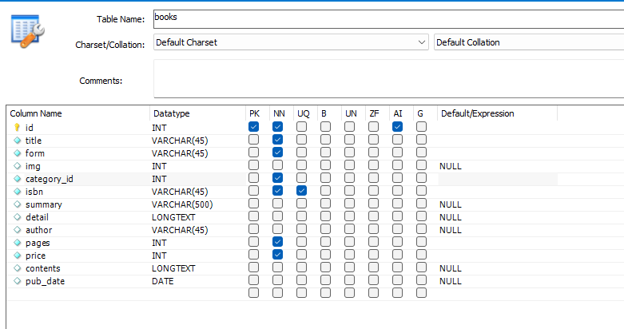
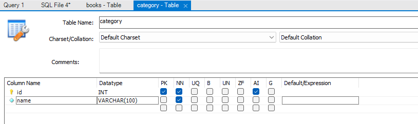

# Bookkio 도서 관련 API 작업

## books 테이블 생성

- mysql workbench 내 bookkio DB에 books 테이블 생성
    
    
    

## 전체 도서 조회 API 스크립트

- books.controller.js
    
    ```jsx
      let sqlQuery = `SELECT * FROM books`;
      dbConnection.query(sqlQuery, (err, results) => {
        if (err) {
          console.log(err);
          return res.status(StatusCodes.BAD_REQUEST).end();
        }
    
        if (results[0]) {
          const books = results.map((book) => {
            const resultBook = {
              id: book.id,
              title: book.title,
              summary: book.summary,
              author: book.author,
              price: book.price,
              pub_date: book.pub_date,
            };
            return resultBook;
          });
          return res.status(StatusCodes.OK).json(books);
        }
      });
    };
    ```
    

## 개별 도서 조회 API 스크립트

- books.controller.js
    
    ```jsx
    /**
     * 개별 도서 조회 로직
     * @param {import("express").Request} req
     * @param {import("express").Response} res
     * @param {import("express").NextFunction} next
     */
    const searchOneBook = (req, res, next) => {
      const { bookId } = req.params;
      let sqlQuery = `
        SELECT * FROM books
        WHERE id=?
      `;
      dbConnection.query(sqlQuery, [+bookId], (err, results) => {
        if (err) {
          console.log(err);
          return res.status(StatusCodes.BAD_REQUEST).end();
        }
    
        const book = results[0];
        if (book) {
          return res.status(StatusCodes.OK).json(book);
        } else {
          return res.status(StatusCodes.NOT_FOUND).end();
        }
      });
    };
    ```
    

## 도서 이미지 정보

- [Lorem Picsum](https://picsum.photos/)
- 위의 사이트에서 제공하는 무료 이미지를 사용
- `https://picsum.photos/id/{image}/width/height`
    - {image} 부분에 INT형 특정 아이디 값을 넣으면 사진주소를 얻을 수 있으므로, 테이블에는 INT형으로 img 정보를 저장

## 카테고리별 도서 조회 API 스크립트

- 카테고리별 도서 조회를 위해 Table 자체를 생성한다.
- 카테코리별 도서 조회 API는 URL이 books의 root로 향해 쿼리만 다르기 때문에,  전체 도서 조회의 API 코드에 합쳐 작성해야 한다.



- books.contoller.js 의 전체도서 조회 함수 searchBooks에 카테고리 검색 발생 시, 카테고리별로 검색하는 로직을 추가 하였다.
    
    ```jsx
    /**
     * 전체 도서 조회 Or 카테고리별 도서 조회
     * @param {import("express").Request} req
     * @param {import("express").Response} res
     * @param {import("express").NextFunction} next
     */
    const searchBooks = (req, res, next) => {
      const { category_id } = req.query;
    
      //카테고리 검색
      if (category_id) {
        let sqlQuery = `
        SELECT * FROM books LEFT 
        JOIN category ON books.category_id = category.id
        WHERE books.category_id = ?
        `;
    
        dbConnection.query(sqlQuery, [+category_id], (err, results) => {
          if (err) {
            console.log(err);
            return res.status(StatusCodes.BAD_REQUEST);
          }
    
          if (results.length > 0) {
            return res.status(StatusCodes.OK).json(results);
          } else {
            return res.status(StatusCodes.NOT_FOUND).end();
          }
        });
      } else {
        // 전체 도서 조회
        let sqlQuery = `SELECT * FROM books`;
        dbConnection.query(sqlQuery, (err, results) => {
          if (err) {
            console.log(err);
            return res.status(StatusCodes.BAD_REQUEST).end();
          }
    
          if (results[0]) {
            const books = results.map((book) => {
              const resultBook = {
                id: book.id,
                title: book.title,
                summary: book.summary,
                author: book.author,
                price: book.price,
                pub_date: book.pub_date,
              };
              return resultBook;
            });
            return res.status(StatusCodes.OK).json(books);
          }
        });
      }
    };
    ```