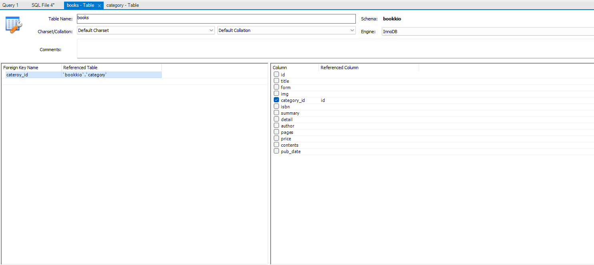
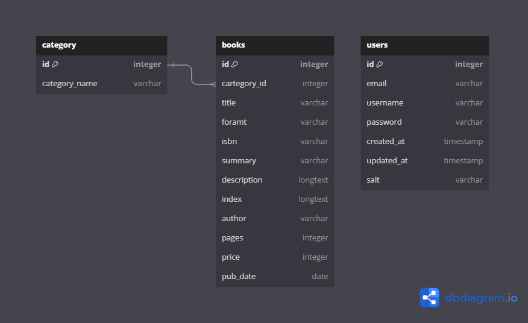
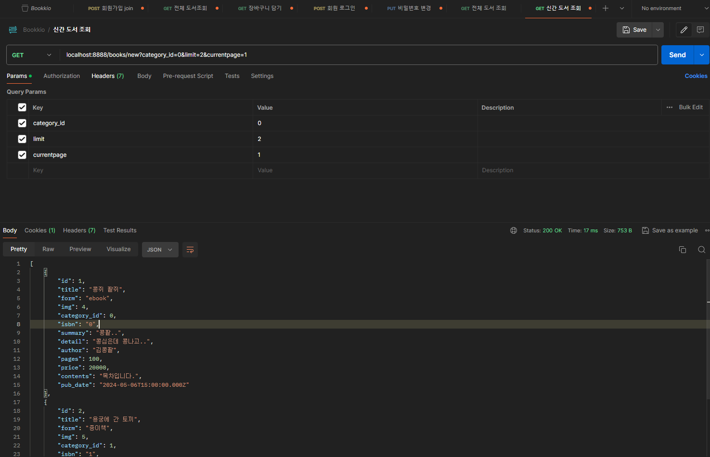

# Bookkio 프로젝트 3일차

## books Table에 FK 설정하기

현재 books 테이블은 category_id 의 값이 category 테이블의 id 값을 참조해야 하는데,

해당 설정이 되어 있지 않다.

MySql Workbench에서 books 테이블의 category_id를 category테이블의 id 값으로 FK 설정을 진행 한다.



ERD 또한 위의 변동사항에 따라 내용을 추가하였다.



어제 books.controller.js 파일에 작성한 전체 도서 조회 컨트롤러 함수에

request의 query로 category_id 의 값이 들어 온다면, 카테고리별 도서 조회가 가능하도록 코드를 변경하여 작성하였다.

- books.controller.js
    
    ```js
    const searchBooks = (req, res, next) => {
      const { category_id } = req.query;
    
      //카테고리 검색
      if (category_id) {
        let sqlQuery = `
        SELECT * FROM books LEFT 
        JOIN category ON books.category_id = category.id
        WHERE books.category_id = ?
        `;
    
        dbConnection.query(sqlQuery, [+category_id], (err, results) => {
          if (err) {
            console.log(err);
            return res.status(StatusCodes.BAD_REQUEST);
          }
    
          if (results.length > 0) {
            return res.status(StatusCodes.OK).json(results);
          } else {
            return res.status(StatusCodes.NOT_FOUND).end();
          }
        });
      } else {
        // 전체 도서 조회
        let sqlQuery = `SELECT * FROM books`;
        dbConnection.query(sqlQuery, (err, results) => {
          if (err) {
            console.log(err);
            return res.status(StatusCodes.BAD_REQUEST).end();
          }
    
          if (results[0]) {
            const books = results.map((book) => {
              const resultBook = {
                id: book.id,
                title: book.title,
                summary: book.summary,
                author: book.author,
                price: book.price,
                pub_date: book.pub_date,
              };
              return resultBook;
            });
            return res.status(StatusCodes.OK).json(books);
          }
        });
      }
    };
    ```
    
    - 카테고리 도서 조회 시 LEFT JOIN 문과 WHERE 문을 통해 입력받은 category_id query값을 사용하여 검색을 진행 했다.
    - 카테고리 도서 조회 가 아닐때, 즉 Request의 query로 category_id가 입력 되지 않았을 때는 전체 SELECT 문으로 books 테이블을 조회하여 전체 도서를 출력하도록 변경하였다.

> 강의에서는 개별 도서 조회에 위의 카테고리 별 도서 조회 로직 및 쿼리를 적용하였는데…
나는 그게 좀 이해가 안됐다.
실제 도서 사이트를 보면, 전체 도서가 있고, 그중에서 특정 카테고리 조회 이벤트가 요청 되면, 해당하는 카테고리를 가진 도서들을 쭉 보여주는데, 굳이 개별 도서 조회 쪽에 카테고리 조회 API를 적용시킬 필요가 있나 싶다.
> 

## 최신 도서 목록 가져오기 API

SQL의 시간 더하기, 뺴기 연산을 사용하여, 현재 기준 1달 이내의 도서만을 가져오는 API 코드를 작성코자 한다.

### SQL 시간 더하기 문법

- 시간 관련 SQL 예약어
    - 초 : SECOND
    - 분 : MINUTE
    - 시 : HOUR
    - 일 : DAY
    - 월 : MONTH
    - 연 : YEAR
- 시간 더하기 문법 : DATE_ADD(기준날짜, INTERVAL 입력기간)
    - 기준 날짜에 입력된 날짜 만큼 더하는 기능

```sql
-- 작성일 기준 : 2024-05-24
DATE_ADD(NOW(), INTERVAL 1 MONTH); -- 2024-06-24
DATE_ADD(NOW(), INTERVAL 1 MONTH); -- 2024-05-25
DATE_ADD(NOW(), INTERVAL -1 YEAR); -- 2023-05-24
```

- 시간 빼기 문법 : DATE_SUB(기준날짜, INTERVAL 입력기간)
    - 기준 날짜에 입력된 날짜 만큼 더하는 기능

```sql
-- 작성일 기준 : 2024-05-24
SELECT date_sub(NOW(), INTERVAL 1 DAY); -- 2024-05-23
SELECT date_sub(NOW(), INTERVAL 2 MONTH); -- 2024-03-23
SELECT date_sub(NOW(), INTERVAL -2 MONTH); -- 2024-07-24
```

### 전체 도서 중, 1달 이내의 도서만 추출

- 전체 도서 Table

| id  | title          | form   | img | category_id | isbn | summary         | detail            | author | pages | price | contents    | pub_date   |
| --- | -------------- | ------ | --- | ----------- | ---- | --------------- | ----------------- | ------ | ----- | ----- | ----------- | ---------- |
| 1   | 콩쥐 팥쥐      | ebook  | 4   | 0           | 0    | 콩팥..          | 콩심은데 콩나고.. | 김콩팥 | 100   | 20000 | 목차입니다. | 2024-05-07 |
| 2   | 용궁에 간 토끼 | 종이책 | 5   | 1           | 1    | 깡충..          | 용왕님 하이..     | 김거북 | 100   | 20000 | 목차입니다. | 2024-05-10 |
| 3   | 해님달님       | ebook  | 15  | 2           | 2    | 동앗줄..        | 황금 동앗줄..!    | 김해님 | 100   | 20000 | 목차입니다. | 2024-03-12 |
| 4   | 장화홍련전     | ebook  | 80  | 0           | 3    | 기억이 안나요.. | 장화와 홍련이?..  | 김장화 | 100   | 20000 | 목차입니다. | 2024-05-22 |
| 5   | 견우와 직녀    | ebook  | 8   | 1           | 4    | 오작교!!        | 칠월 칠석!!       | 김다리 | 100   | 20000 | 목차입니다. | 2024-02-12 |
| 6   | 효녀 심청      | 종이책 | 12  | 0           | 5    | 심청아..        | 공양미 삼백석..   | 김심청 | 100   | 20000 | 목차입니다. | 2024-01-15 |
| 7   | 혹부리 영감    | ebook  | 22  | 2           | 6    | 노래 주머니..   | 혹 두개 되버림..  | 김영감 | 100   | 20000 | 목차입니다. | 2024-03-08 |

- 1달 이내 출간된 도서만 SELECT 하는 쿼리
    
    ```sql
    SELECT * FROM bookkio.books
    WHERE pub_date BETWEEN DATE_SUB(NOW(), INTERVAL 1 MONTH) AND NOW();
    ```
    
    - 결과
    
    | id  | title          | form   | img | category_id | isbn | summary         | detail            | author | pages | price | contents    | pub_date   |
    | --- | -------------- | ------ | --- | ----------- | ---- | --------------- | ----------------- | ------ | ----- | ----- | ----------- | ---------- |
    | 1   | 콩쥐 팥쥐      | ebook  | 4   | 0           | 0    | 콩팥..          | 콩심은데 콩나고.. | 김콩팥 | 100   | 20000 | 목차입니다. | 2024-05-07 |
    | 2   | 용궁에 간 토끼 | 종이책 | 5   | 1           | 1    | 깡충..          | 용왕님 하이..     | 김거북 | 100   | 20000 | 목차입니다. | 2024-05-10 |
    | 4   | 장화홍련전     | ebook  | 80  | 0           | 3    | 기억이 안나요.. | 장화와 홍련이?..  | 김장화 | 100   | 20000 | 목차입니다. | 2024-05-22 |

이제 API 코드를 작성

- books.controller.js
    
    ```js
    /**
     * 1달 이내 출간된 신간 도서 조회
     * @param {import("express").Request} req
     * @param {import("express").Response} res
     * @param {import("express").NextFunction} next
     */
    const getNewBooks = (req, res, next) => {
      let sqlQuery = `
      SELECT * FROM bookkio.books
      WHERE pub_date BETWEEN DATE_SUB(NOW(), INTERVAL 1 MONTH) AND NOW();
      `;
      dbConnection.query(sqlQuery, (err, results) => {
        if (err) {
          console.log(err);
          return res.status(StatusCodes.BAD_REQUEST).end();
        }
    
        if (results.length > 0) {
          return res.status(StatusCodes.OK).json(results);
        } else {
          return res.status(StatusCodes.NOT_FOUND).end();
        }
      });
    };
    ```
    
- books.route.js
    
    ```js
    const express = require("express");
    const {
      searchBooks,
      searchOneBook,
      getNewBooks,
    } = require("../controller/books.controller");
    const router = express.Router();
    
    router.get("/", searchBooks);
    router.get("/new", getNewBooks);
    router.get("/:bookId", searchOneBook);
    
    module.exports = router;
    
    ```
    
    이떄 :bookId 라우터와 new 라우터가 위의 순서대로 적혀 있어야 URI로 book/new를 요청 시,
    
    올바른 신간 도서를 조회 할 수 있다.
    
    각 라우터의 순서가 바뀐다면, :bookId 로 라우팅되는 searchOneBook 컨트롤러가 수행 되므로, 
    
    라우팅별 같은 깊이의 URL 사용시에는 순서에도 꼭 주의 하자!
    

## 데이터 베이스 페이징 구현하기

```sql
SELECT * FROM books
LIMIT 5 OFFSET 2;
-- LIMIT 오프셋, 리밋수 로도 같은 기능을 한다.
```

- LIMIT : 가져올 행의 갯수
- OFFSET : 행을 가져오기 시작할 지

메인 books URI 접속 시, URL query를 통해 LIMIT 에는 limit를, OFFSET에는 currentpage 값을 받아 계산하여 쿼리에 넘긴다.

```js
// books.controller.js
// searchBooks 함수
const searchBooks = (req, res, next) => {
  let { category_id, limit, currentpage } = req.query;

  if (!limit || !currentpage) {
    limit = !limit ? 5 : limit;
    currentpage = !currentpage ? 1 : currentpage;
  }

  const offset = +limit * (+currentpage - 1);

  //카테고리 검색
  if (category_id) {
    let sqlQuery = `
    SELECT * FROM books LEFT 
    JOIN category ON books.category_id = category.id
    WHERE books.category_id = ?
    LIMIT ? OFFSET ?;
    `;

    dbConnection.query(
      sqlQuery,
      [+category_id, +limit, offset],
      (err, results) => {
        if (err) {
          console.log(err);
          return res.status(StatusCodes.BAD_REQUEST);
        }

        if (results.length > 0) {
          return res.status(StatusCodes.OK).json(results);
        } else {
          return res.status(StatusCodes.NOT_FOUND).end();
        }
      }
    );
  } else {
    // 전체 도서 조회
    let sqlQuery = `
    SELECT * FROM books
    LIMIT ? OFFSET ?
    `;
    dbConnection.query(sqlQuery, [+limit, offset], (err, results) => {
      if (err) {
        console.log(err);
        return res.status(StatusCodes.BAD_REQUEST).end();
      }

      if (results[0]) {
        const books = results.map((book) => {
          const resultBook = {
            id: book.id,
            title: book.title,
            summary: book.summary,
            author: book.author,
            price: book.price,
            pub_date: book.pub_date,
          };
          return resultBook;
        });
        return res.status(StatusCodes.OK).json(books);
      }
    });
  }
};

```

또한 신간 도서를 조회하는 API 코드에도 해당 과정을 추가한다.

```js
// getNewBooks 함수
/**
 * 1달 이내 출간된 신간 도서 조회
 * @param {import("express").Request} req
 * @param {import("express").Response} res
 * @param {import("express").NextFunction} next
 */
const getNewBooks = (req, res, next) => {
  const { limit, currentpage } = req.query;
  const offset = +limit * (+currentpage - 1);

  let sqlQuery = `
  SELECT * FROM bookkio.books
  WHERE pub_date BETWEEN DATE_SUB(NOW(), INTERVAL 1 MONTH) AND NOW()
  LIMIT ? OFFSET ?
  `;

  dbConnection.query(sqlQuery, [+limit, offset], (err, results) => {
    if (err) {
      console.log(err);
      return res.status(StatusCodes.BAD_REQUEST).end();
    }

    if (results.length > 0) {
      return res.status(StatusCodes.OK).json(results);
    } else {
      return res.status(StatusCodes.NOT_FOUND).end();
    }
  });
};
```

- 해당 API 를 postman agent에서 수행했을 때 정상적으로 응답결과를 반환한다.
    
    
    

실제 여러 웹사이트를 돌다 보면, 페이징 기능이 대부분 구현되어있는데, 그것이 이런 SQL 구문의 도움으로 구현 되는 줄은 몰랐다.

이 방법을 몰랐을 때는, 그저 특정 조건으로 반환된 전체 결과를 FrontEnd 쪽에서 알아서 나누어서 보여주는 줄알았는데, 그렇게 되면 리소스가 많이 사용되는 것이 아닐까 하는 궁금증이 있었고,

오늘에서야 그 궁금증을 해소할 수 있었다.

SQL과도 상당히 친밀해지는 시간이 되어가는 것 같아 좋다.