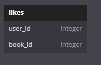
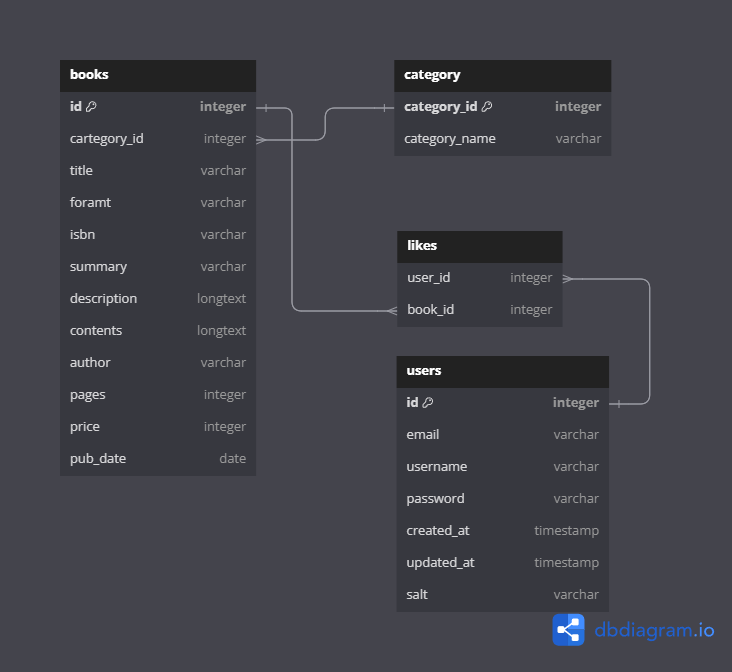
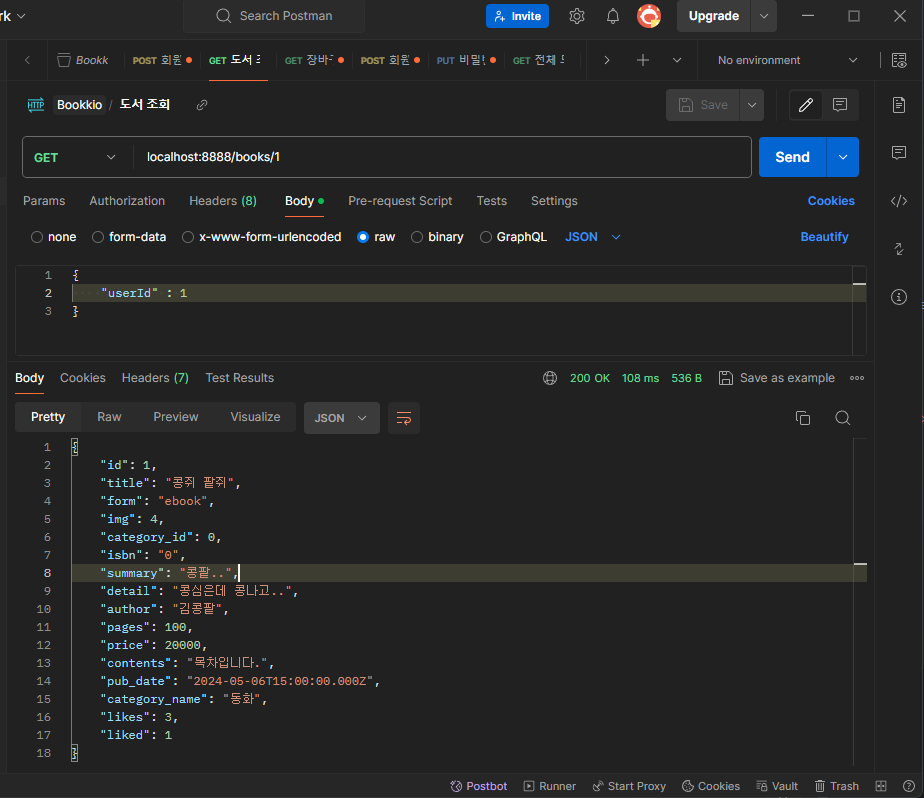

# Bookkio 프로젝트 4일차

## 👍좋아요 API 구하기



likes 테이블을 위와 같이 생성하여, user_id는 users.id를 FK로 book_id는 books.id를 FK 설정하여준다.

likes 테이블의 각 컬럼은 각각 users, books 의 id에 대해 N 개를 받아들이므로

N : 1 의관계가 성립한다.



### 좋아요 API 설계

1. 좋아요 추가 API
- Method : `POST`
- URI : `/likes/{book_id}`
- HTTP Status Code : 200
- Request Body
    - Token > Header “Authorization”
    - 현재 Token 을 저장해놓을 수 없으므로, Token을 저장했다는 전제하에 아래 Body 사용
        
        ```json
        {
        	"email" : "사용자 EMAIL",
        	"id" : "사용자 ID"
        }
        ```
        
- Response Body

1. 좋아요 취소 API
- Method : `DELETE`
- URI : `/likes/{book_id}`
- HTTP Status Code : 200
- Request Body
- Response Body

### 좋아요 API 코드 작성

새롭게 만드는 기능이며, URI또한 기존에 사용하던 것들과 다르므로, 새로운 Router와 Controller를 만든다.

- likes.route.js
    
    ```js
    const express = require("express");
    
    const router = express.Router();
    
    const { addLike, deleteLike } = require("../controller/likes.controller.js");
    
    router.post("/:bookId", addLike);
    router.delete("/:bookId", deleteLike);
    
    module.exports = router;
    
    ```
    
- likes.controller.js
    
    ```js
    /**
     * 좋아요 추가 API
     * @param {import("express").Request} req
     * @param {import("express").Response} res
     */
    const addLike = (req, res) => {
      return res.status(200).json({ message: "좋아요 추가 API" });
    };
    
    /**
     * 좋아용 제거 API
     * @param {import("express").Request} req
     * @param {import("express").Response} res
     * @returns
     */
    const deleteLike = (req, res) => {
      return res.status(200).json({ message: "좋아요 제거 API" });
    };
    
    module.exports = {
      addLike,
      deleteLike,
    };
    
    ```
    
- app.js
    
    ```js
    const createError = require("http-errors");
    const express = require("express");
    const path = require("path");
    const cookieParser = require("cookie-parser");
    const logger = require("morgan");
    
    const usersRouter = require("./routes/users.router.js");
    const booksRouter = require("./routes/books.route.js");
    const cartsRouter = require("./routes/cart.route.js");
    const ordersRouter = require("./routes/orders.route.js");
    const likesRouter = require("./routes/likes.router.js");
    
    const app = express();
    
    // view engine setup
    app.set("views", path.join(__dirname, "views"));
    app.set("view engine", "ejs");
    
    app.use(logger("dev"));
    app.use(express.json());
    app.use(express.urlencoded({ extended: false }));
    app.use(cookieParser());
    app.use(express.static(path.join(__dirname, "public")));
    
    // Routing
    app.use("/users", usersRouter);
    app.use("/books", booksRouter);
    app.use("/cart", cartsRouter);
    app.use("/orders", ordersRouter);
    app.use("/likes", likesRouter);
    ```
    

위의 controller코드에서 좋아요 기능이 정상적으로 동작하도록 예외처리 없이 한번 함수의 코드를 작성해보자.

- 기능이 동작하는 likes.controller.js
    
    ```js
    const dbConnection = require("../model/mysql.js");
    const { StatusCodes } = require("http-status-codes");
    
    /**
     * 좋아요 추가 API
     * @param {import("express").Request} req
     * @param {import("express").Response} res
     */
    const addLike = (req, res) => {
      const { userId } = req.body;
      const { bookId } = req.params;
    
      let sqlQuery = `
      INSERT INTO likes (user_id, book_id)
      VALUES (?, ?);
      `;
    
      dbConnection.query(sqlQuery, [+userId, +bookId], (err, result) => {
        if (err) {
          return res
            .status(StatusCodes.BAD_REQUEST)
            .json({ message: "잘못된 요청정보 입니다." });
        }
    
        return res.status(StatusCodes.OK).json(result.affectedRows);
      });
    };
    
    /**
     * 좋아용 제거 API
     * @param {import("express").Request} req
     * @param {import("express").Response} res
     * @returns
     */
    const deleteLike = (req, res) => {
      const { userId } = req.body;
      const { bookId } = req.params;
    
      let sqlQuery = `
        DELETE FROM likes
        WHERE user_id=? AND book_id=?;
      `;
      dbConnection.query(sqlQuery, [+userId, +bookId], (err, result) => {
        if (err) {
          return res
            .status(StatusCodes.BAD_REQUEST)
            .json({ message: "올바르지 않은 요청 입니다." });
        }
    
        return res.status(StatusCodes.OK).json(result.affectedRows);
      });
    };
    
    module.exports = {
      addLike,
      deleteLike,
    };
    
    ```
    

### 좋아요 수 반환을 위한 서브 쿼리 작성

```sql
SELECT *, 
(SELECT COUNT(*) from likes WHERE book_id = books.id) AS likes 
FROM books;
```

- like 컬럼을 새로 만들어, 해당 컬럼에 서브 쿼리를 작성하여 수행한다.
- 이때 각 books.id 에 대한 COUNT 값을 계수하기 위해, likes테이블의 book_id 는 book.id를 참조하도록 위와 같이 작성하면, 프로그래밍 언어의 반복문 처럼, books 각 행의 id를 참조하여 서브쿼리문을 실행 하게 된다.


해당 쿼리문중, 서브 쿼리에 해당하는 구문을 도서 조회 API 컨트롤러에 추가적으로 적용 시킨다.

- books.controller.js
    
    ```js
    const dbConnection = require("../model/mysql.js");
    const { StatusCodes } = require("http-status-codes");
    
    /**
     * 전체 도서 조회 Or 카테고리별 도서 조회
     * @param {import("express").Request} req
     * @param {import("express").Response} res
     * @param {import("express").NextFunction} next
     */
    const searchBooks = (req, res, next) => {
      let { category_id, limit, currentpage } = req.query;
    
      if (!limit || !currentpage) {
        limit = !limit ? 5 : limit;
        currentpage = !currentpage ? 1 : currentpage;
      }
    
      const offset = +limit * (+currentpage - 1);
    
      //카테고리 검색
      if (category_id) {
        let sqlQuery = `
        SELECT *, (SELECT COUNT(*) from likes WHERE book_id = books.id) AS likes FROM books LEFT 
        JOIN category ON books.category_id = category.id
        WHERE books.category_id = ?
        LIMIT ? OFFSET ?;
        `;
    
        dbConnection.query(
          sqlQuery,
          [+category_id, +limit, offset],
          (err, results) => {
            if (err) {
              console.log(err);
              return res.status(StatusCodes.BAD_REQUEST);
            }
    
            if (results.length > 0) {
              return res.status(StatusCodes.OK).json(results);
            } else {
              return res.status(StatusCodes.NOT_FOUND).end();
            }
          }
        );
      } else {
        // 전체 도서 조회
        let sqlQuery = `
        SELECT *, (SELECT COUNT(*) from likes WHERE book_id = books.id) AS likes FROM books
        LIMIT ? OFFSET ?
        `;
        dbConnection.query(sqlQuery, [+limit, offset], (err, results) => {
          if (err) {
            console.log(err);
            return res.status(StatusCodes.BAD_REQUEST).end();
          }
    
          if (results[0]) {
            const books = results.map((book) => {
              const resultBook = {
                id: book.id,
                title: book.title,
                summary: book.summary,
                author: book.author,
                price: book.price,
                pub_date: book.pub_date,
                likes: book.likes,
              };
              return resultBook;
            });
            return res.status(StatusCodes.OK).json(books);
          }
        });
      }
    };
    
    /**
     * 개별 도서 조회 로직
     * @param {import("express").Request} req
     * @param {import("express").Response} res
     * @param {import("express").NextFunction} next
     */
    const searchOneBook = (req, res, next) => {
      const { bookId } = req.params;
      let sqlQuery = `
        SELECT *, (SELECT COUNT(*) from likes WHERE book_id = books.id) AS likes FROM books
        WHERE id=?;
      `;
      dbConnection.query(sqlQuery, [+bookId], (err, results) => {
        if (err) {
          console.log(err);
          return res.status(StatusCodes.BAD_REQUEST).end();
        }
    
        const book = results[0];
        if (book) {
          return res.status(StatusCodes.OK).json(book);
        } else {
          return res.status(StatusCodes.NOT_FOUND).end();
        }
      });
    };
    
    /**
     * 1달 이내 출간된 신간 도서 조회
     * @param {import("express").Request} req
     * @param {import("express").Response} res
     * @param {import("express").NextFunction} next
     */
    const getNewBooks = (req, res, next) => {
      const { limit, currentpage } = req.query;
      const offset = +limit * (+currentpage - 1);
    
      let sqlQuery = `
      SELECT *, (SELECT COUNT(*) from likes WHERE book_id = books.id) AS likes FROM bookkio.books
      WHERE pub_date BETWEEN DATE_SUB(NOW(), INTERVAL 1 MONTH) AND NOW()
      LIMIT ? OFFSET ?
      `;
    
      dbConnection.query(sqlQuery, [+limit, offset], (err, results) => {
        if (err) {
          console.log(err);
          return res.status(StatusCodes.BAD_REQUEST).end();
        }
    
        if (results.length > 0) {
          return res.status(StatusCodes.OK).json(results);
        } else {
          return res.status(StatusCodes.NOT_FOUND).end();
        }
      });
    };
    
    module.exports = {
      searchBooks,
      searchOneBook,
      getNewBooks,
    };
    
    ```
    

## 사용자가 좋아요한 책인지 확인하는 쿼리

```sql
SELECT *,
(SELECT COUNT(*) FROM likes WHERE book_id =books.id) AS likes,
(SELECT EXISTS (SELECT * FROM likes WHERE user_id=1 AND book_id=1)) AS liked
 FROM books;
```

위의 쿼리를 통하여 2번째 서브쿼리는 기존과 똑같이 각 도서가 얼만큼의 좋아요를 받았는지 확인하고,

3번째 줄의 서브쿼리는 user의 id와 book의 id를 통하여, 사용자가 해당 도서에 좋아요를 눌렀는지 여부를 확인할 수 있다.

- 위의 코드에서 EXISTS 구문은 조회된 값의 갯수를 반환 하게 되는데 무조건 1아니면 0이 발생
- WHERE 절로 이어서 사용하는 EXIST구문의 경우 TRUE, FALSE 를 반환한다.

이런 쿼리를 작성했다면, 한 가지 적용할 점이 생긴다.

개별 도서를 조회할 때, 좋아요 수와, 유저의 좋아요 여부, 카테고리 명 까지 출력해줄수는 없을까?

위에 해당하는 쿼리를 작성해았다.

```sql
SELECT *,
(SELECT COUNT(*) FROM likes WHERE book_id = books.id) AS likes,
(SELECT EXISTS (SELECT * FROM likes WHERE user_id=1 AND book_id=1)) AS liked
FROM books
LEFT JOIN category
ON books.category_id = category.id
WHERE books.id= 1;
```

해당 쿼리를 적용하여 `개별 도서 조회` 코드를 수정하였다.

```js
/**
 * 개별 도서 조회 로직
 * @param {import("express").Request} req
 * @param {import("express").Response} res
 * @param {import("express").NextFunction} next
 */
const searchOneBook = (req, res, next) => {
  const { bookId } = req.params;
  const { userId } = req.body;
  let sqlQuery = `
  SELECT *,
  (SELECT COUNT(*) FROM likes WHERE book_id = books.id) AS likes,
  (SELECT EXISTS (SELECT * FROM likes WHERE user_id=? AND book_id=?)) AS liked
  FROM books
  LEFT JOIN category
  ON books.category_id = category.category_id
  WHERE books.id= ?;
  `;
  dbConnection.query(sqlQuery, [+userId, +bookId, +bookId], (err, results) => {
    if (err) {
      console.log(err);
      return res.status(StatusCodes.BAD_REQUEST).end();
    }

    const book = results[0];
    if (book) {
      return res.status(StatusCodes.OK).json(book);
    } else {
      return res.status(StatusCodes.NOT_FOUND).end();
    }
  });
};
```

