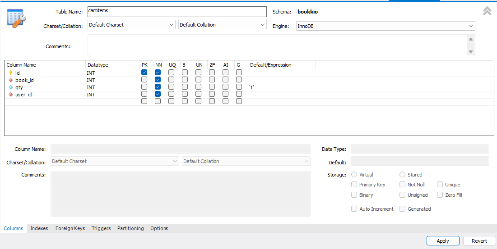
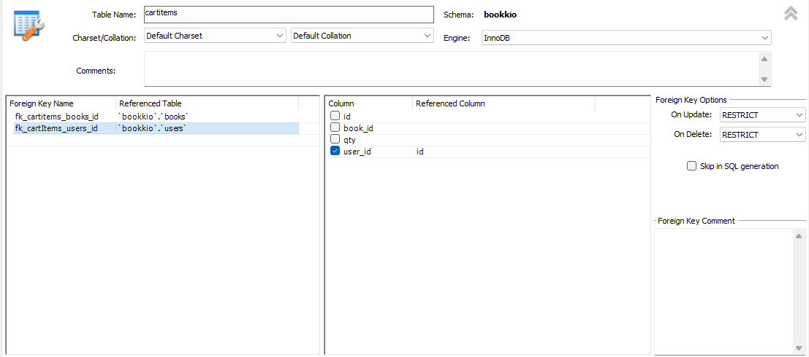
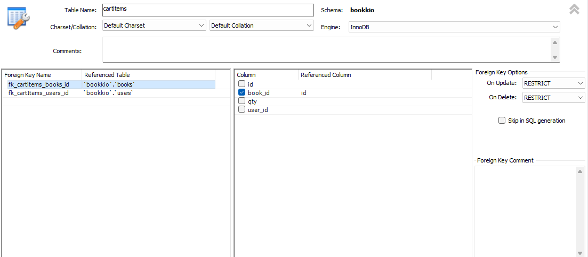
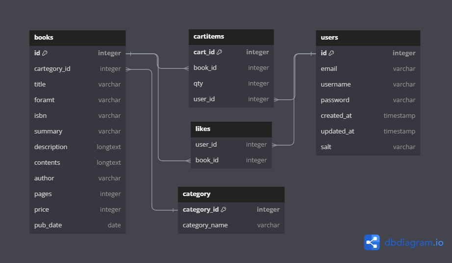
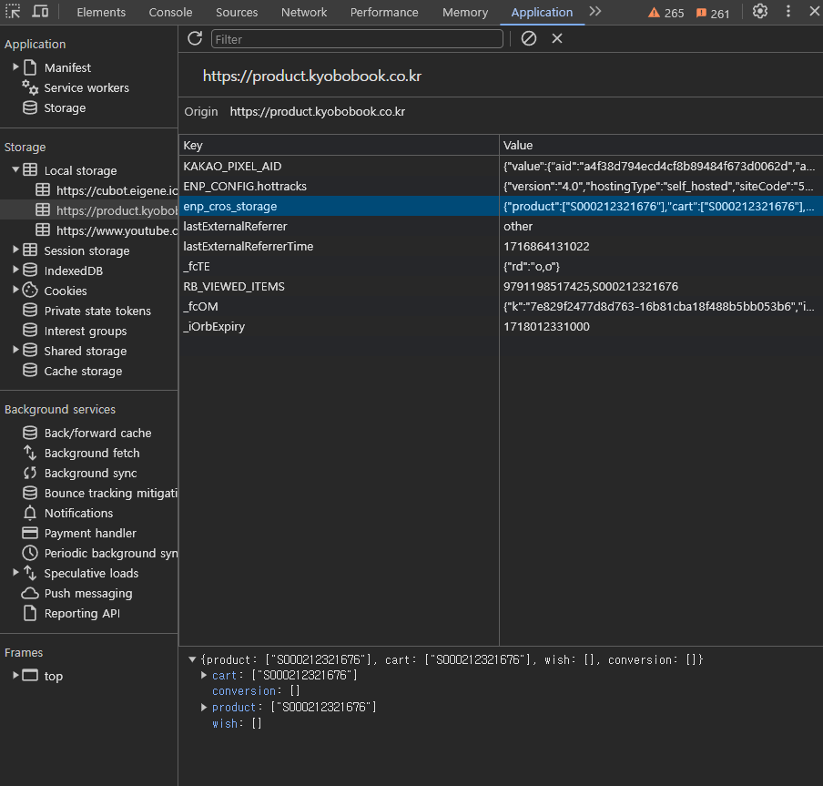
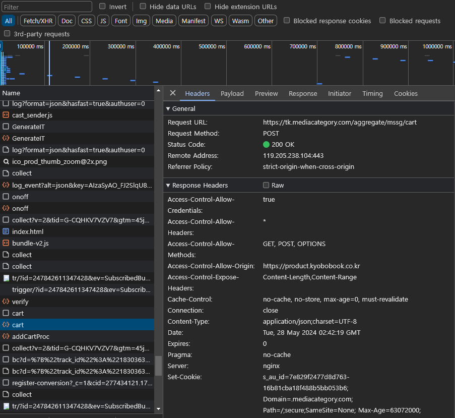
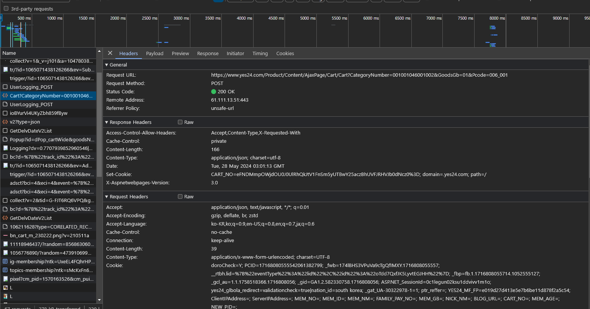
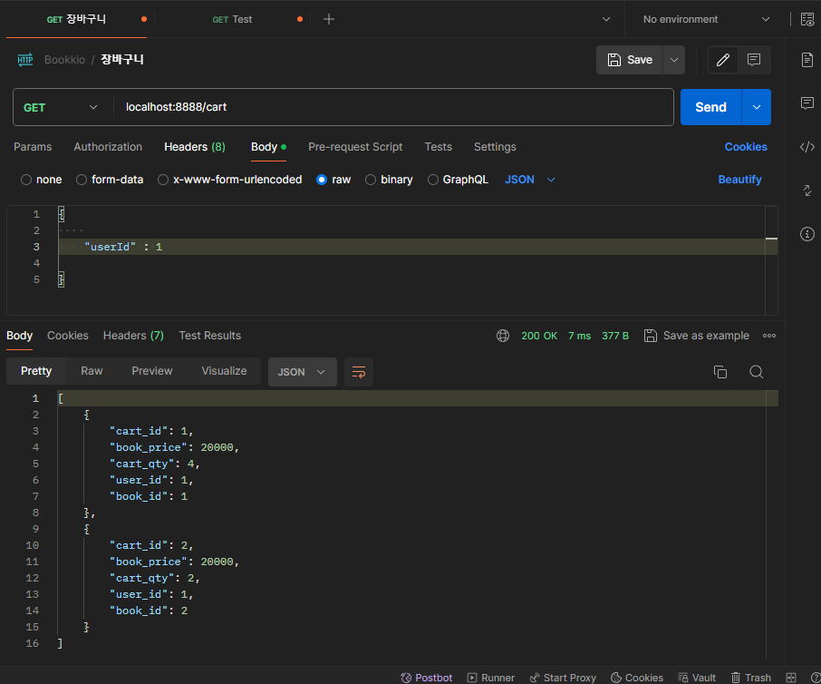

# Bookkio 프로젝트 5일차

- 장바구니 기능 구현

## cartItems Table 만들기

유저가 장바구니에 아이템을 추가하면, 해당 유저의 DB상 ID와 해당 도서의 ID, 추가된 갯수 (Count)

해당 장바구니 항목의 ID 정보를 저장하는 Table을 생성한다.

- cartItems Table Column 설정
    
    
    
- FK 제약 조건 설정
    
    
    
    
    
    FK 제약 조건 설정 시, 다른 테이블에서 설정한 제약조건의 이름과 중복되는 이름으로 설정하면,
    
    **`errno: 121 "Duplicate key on write or update”`** 가 발생하므로, 
    
    `fk_테이블명_참조테이블명_컬럼`의 방식으로 FK 이름을 지정하였다.
    

- 현재까지의 ERD
    
    
    

## 장바구니 기능 API 구현

장바구니 기능을 구현하기 전에, 도서 관련 도메인중 가장 유명한 교보문고와 YES24의 API에 대해 크롬 개발자도구로 나름 분석을 해보았다.

### 교보문고



우선 교보문고는 로그인 후에, 상품을 장바구니에 추가하면, 연결된 ENDPOINT로 Request 뿐만아니라

클라이언트 LocalStorage에도 해당 상품을 등록하는 것을 알 수 있었다.



또한 별도의 params 없이 연결된 ENDPOINT로 요청을 전송하면서, 클라이언트 cookie의 계정정보에 접촉하여 해당 계정의 장바구니에 상품을 추가하는 것으로 보인다.

### YES 24



YES24는 장바구니에 상품을 추가하는 경우 교보문고와 다르게 서브 URL에 여러 정보를 입력하여 해당 상품에 대한 정보를 가지고, 추가정보 (사용자)는 Cookie에서 가져오는것으로 생각 된다.

YES24는 클라이언트 측에 장바구니 쪽 정보를 저장하지는 않는 것으로 보인다.

교보문고는 생각 보다 클라이언트측에 많은것을 저장하지 않고, YES24는 생각보다 더 많은 정보를 클라리언트 브라우저 (localStorage, Cookies등) 에 저장하여 사용하는 것을 알 수 있었다.

### 💡그러면 내가 구현할 장바구니 추가 API는?

내가 구현할 장바구니에 상품 담기 API 는 현재 JWT기능이 없기에, 아무래도 Body에 user와 product에 대한 정보를 담아 Request를 해야 할 것 같다.

JWT기능을 구현해놓고 클라이언트 FE 가 존재 한다면, Cookie나 localstorage에 있는 사용자 인증 정보를 토대로, 암호화된 계정정보를 복호화 하여 해당 계정의 id 또는 다른 PK 정보로 cartitems DB에 등록 하는게 어떨까 라는 생각을 해보았다.

### 장바구니 담기 API 구현

```js
const dbConnection = require("../model/mysql.js");
const { StatusCodes } = require("http-status-codes");
/**
 * 장바구니에 아이템 담기 로직
 * @param {import("express").Request} req
 * @param {import("express").Response} res
 * @param {import("express").NextFunction} next
 */
const addItemToCart = (req, res, next) => {
  const { bookId, userId } = req.body;

  let sqlQuery = `
    SELECT * FROM cartitems
    WHERE user_id=? AND book_id=?;
  `;
  let queryArg = [+userId, +bookId];

  dbConnection.query(sqlQuery, queryArg, (err, results) => {
    if (err) {
      return res.status(StatusCodes.BAD_REQUEST).end();
    }

    if (results.length > 0) {
      // 장바구니에 이미 있는 경우 개수 증가
      const existItem = { ...results[0], qty: results[0].qty + 1 };
      sqlQuery = `
        UPDATE cartitems
        SET qty=?
        WHERE id = ? 
      `;
      queryArg = [existItem.qty, existItem.id];

      dbConnection.query(sqlQuery, queryArg, (err, results) => {
        if (err) {
          return res.status(StatusCodes.INTERNAL_SERVER_ERROR).end();
        }

        return res.status(StatusCodes.OK).json(existItem);
      });
    } else {
      // 장바구니에 없는 경우 => 새로 추가하는 상품
      sqlQuery = `
        INSERT INTO cartitems (book_id, user_id, qty)
        VALUES (?,?,?);
      `;
      queryArg = [+bookId, +userId, 1];

      dbConnection.query(sqlQuery, queryArg, (err, results) => {
        if (err) {
          return res.status(StatusCodes.INTERNAL_SERVER_ERROR).end();
        }

        return res.status(StatusCodes.OK).json({ result: results });
      });
    }
  });
};
```

우선 장바구니에 상품 담기에서는 분기해야할 조건이 상품이 이미 카트에 담겨있을 경우와 새로 추가하는 경우로 나뉘게 되어, 해당 분기에대해 수행하도록 코드를 작성 하였다.

상품이 이미 있는 경우, query로 가져온 정보에서 qty 값만 +1을 하여 SQL  UPDATE 구문으로 수량을 증가 시킨다.

상품이 없는 경우, 해당 도서 id와 사용자 id를 통해 새로운 row를 INSERT 하며, qty값은 1로 고정하여 데이터를 생성한다.

- 새로운 도서를 장바구니에 추가한 결과 (postman)
    
    
    
- 기존에 있던 도서를 장바구니에 추가한 결과 (postman)
    
    
    

### 장바구니 목록 조회 API 구현

사용자 한 명에 대한 장바구니 목록만 조회하면 충분한 기능이므로

해당 쿼리문을 먼저 작성해 보았다.

```sql
SELECT cartitems.id AS cart_id, 
books.price AS book_price, 
cartitems.qty AS cart_qty, 
cartItems.user_id AS user_id, 
cartItems.book_id AS book_id   
FROM cartitems LEFT 
JOIN books ON books.id = cartitems.book_id
WHERE cartitems.user_id = 1;
```

SELECT 문으로 모든 컬럼을 다 갖고 오는 것보다, 필요한 컬럼만 가져와서 쓰는게 더 낫다고 생각하여 각 Column의 이름을 지정하여 가져 오게 했다.

이때 인수로 필요한 값은 어떤 사용자의 장바구니 목록을 가져올지, 사용자의 id 값 하나만이 필요하다.

이제 API 코드로 구현 해보자

```js
/**
 * 장바구니 전체조회 로직 => 사용자 한 명에 대하여
 * @param {import("express").Request} req
 * @param {import("express").Response} res
 * @param {import("express").NextFunction} next
 */
const getAllCartItems = (req, res, next) => {
  const { userId } = req.body;
  let sqlQuery = `
  SELECT cartitems.id AS cart_id, 
  books.price AS book_price, 
  cartitems.qty AS cart_qty, 
  cartItems.user_id AS user_id, 
  cartItems.book_id AS book_id   
  FROM cartitems LEFT 
  JOIN books ON books.id = cartitems.book_id
  WHERE cartitems.user_id = ?;
  `;
  let queryArg = [+userId];

  dbConnection.query(sqlQuery, queryArg, (err, results) => {
    if (err) {
      return res.status(StatusCodes.BAD_REQUEST).end();
    }
		if (results.length === 0) {
      return res.status(StatusCodes.NOT_FOUND).end();
    }
    return res.status(StatusCodes.OK).json(results);
  });
};
```

- Postman 수행 결과



정상작동 한다… 흐흐흐

만약에 해당 사용자의 장바구니 목록이 존재하지 않으면 404를 response하도록 하였다.

### 장바구니 목록 삭제 API

이제 장바구니의 목록을 삭제하는 과정이 필요한데.

장바구니의 목록을 아예 삭제하는 거랑, 장바구니 목록의 갯수를 줄이는 API가 둘다 필요하지 않을 까 생각한다. 즉, remove와 decrease 기능이 들어있어야 한다.

decrease로 0까지 도달하면, 해당 상품을 삭제 하고, 그게 아니면 그냥 갯수만 줄이는 방식으로 진행하고, remove는 한번에 해당 상품목록을 지우고 싶을 때 필요하기에 두 기능 전부 만들기로 한다.

### 장바구니 목록 갯수 감소 API

- 감소 API 코드
    
    ```js
    /**
     * 카트 아이템 수량 감소
     * @param {import("express").Request} req
     * @param {import("express").Response} res
     */
    const decreaseCartItem = (req, res) => {
      const { userId, bookId } = req.body;
    
      let sqlQuery = `
      SELECT * FROM cartitems
      WHERE user_id=? AND book_id=?;  
      `;
    
      let queryArg = [+userId, +bookId];
    
      dbConnection.query(sqlQuery, queryArg, (err, result) => {
        if (err) {
          return res.status(StatusCodes.BAD_REQUEST).end();
        }
    
        const existItem = result[0];
        if (existItem) {
          //카트에 아이템 존재
          if (existItem.qty > 1) {
            // 수량 감소
            sqlQuery = `
            UPDATE cartitems
            SET qty = ?
            WHERE id = ?
            `;
            queryArg = [existItem.qty - 1, existItem.id];
    
            dbConnection.query(sqlQuery, queryArg, (err, result) => {
              if (err) {
                return res.status(StatusCodes.INTERNAL_SERVER_ERROR).end();
              }
    
              return res.status(StatusCodes.OK).json(result.affectedRows);
            });
          } else {
            sqlQuery = `
            DELETE FROM cartitems
            WHERE id=?
            `;
            queryArg = [existItem.id];
            dbConnection.query(sqlQuery, queryArg, (err, result) => {
              if (err) {
                return res.status(StatusCodes.INTERNAL_SERVER_ERROR).end();
              }
              return res.status(StatusCodes.OK).json(result);
            });
          }
        }
      });
    };
    ```
    
    - 카트 아이템의 수량이 1개 초과 일 때는, 해당 아이템의 수량을 1 감소시킨다.
    - 카트 아이템의 수량일 1일 때 해당 API가 실행 되면, 해당 카트 아이템을 삭제 하는 로직
    
    ### 장바구니 아이템 삭제 API
    
    ```js
    
    /**
     * 장바구니 아이템 삭제 로직
     * @param {import("express").Request} req
     * @param {import("express").Response} res
     */
    const removeCartItem = (req, res) => {
      const { userId, bookId } = req.body;
    
      let sqlQuery = `
      DELETE FROM cartitems
      WHERE user_id=? AND book_id=?;
      `;
    
      let queryArg = [+userId, +bookId];
    
      dbConnection.query(sqlQuery, queryArg, (err, result) => {
        if (err) {
          return res.status(StatusCodes.BAD_REQUEST).end();
        }
    
        return res.status(StatusCodes.OK).json(result);
      });
    };
    ```
    
    해당 API는 간단하게 user_id 와 book_id를 토대로, 일치하는 데이터를 삭제하기만 하는 API로 작성하였다.
    

### cart.route.js

```js
const express = require("express");
const {
  addItemToCart,
  getAllCartItems,
  decreaseCartItem,
  removeCartItem,
} = require("../controller/cart.controller");
const router = express.Router();

router
  .route("/")
  .post(addItemToCart)
  .get(getAllCartItems)
  .delete(removeCartItem);
router.post("/decrease", decreaseCartItem);

module.exports = router;

```

- 새로운 cart 관련 API를 작성하면서, cart.route.js에 위와 같은 router를 설정 해주었다.