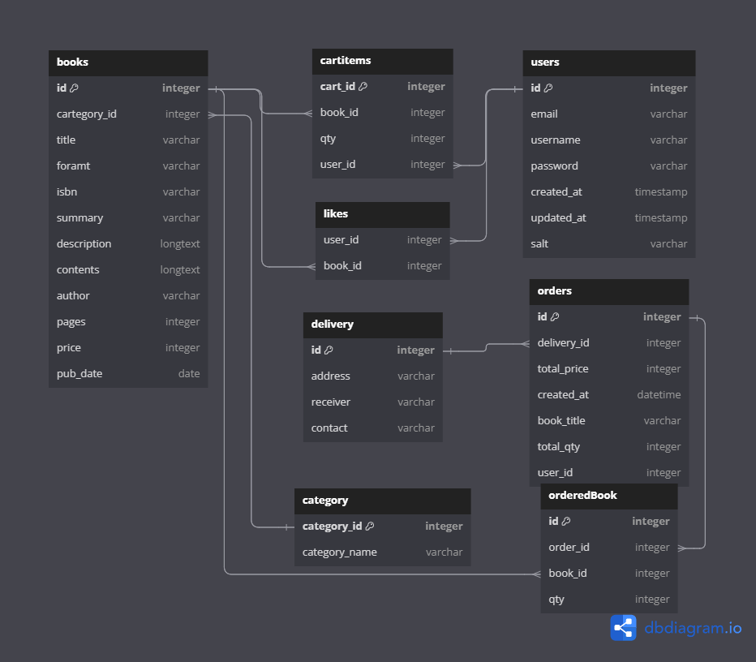
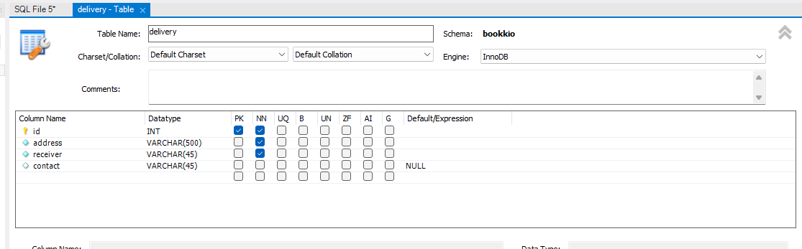
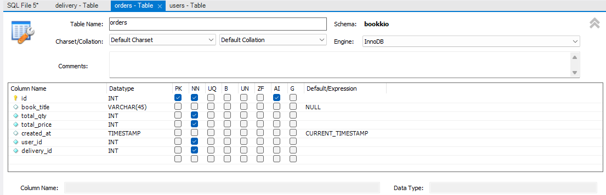
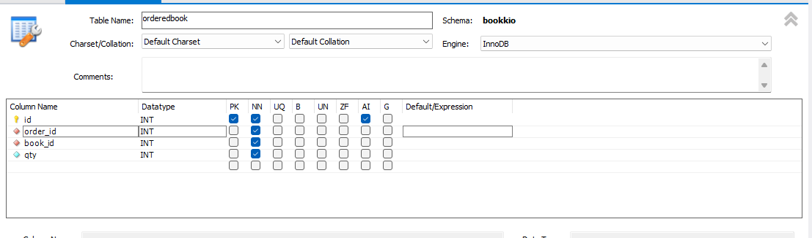
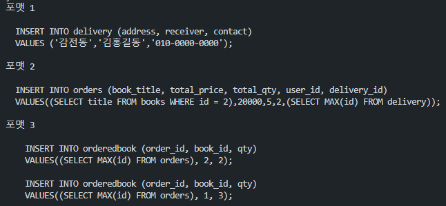
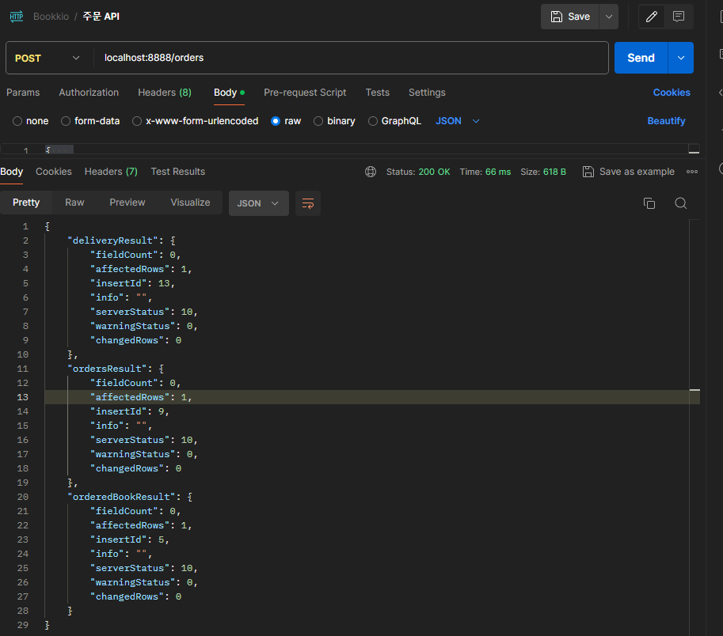

# Bookkio 프로젝트 6일차

- 주문(결제) API 만들기

## 결제 하기 API

### API

- Method : `POST`
- URI : `/orders`
- HTTP Status Code : 200
- Request Body
    
    ```json
    {
      "items": [
        {
          "cartItemId": "장바구니 도서 ID",
          "bookId": "도서 ID",
          "qty": "주문수량 INT"
        },
        {
          "cartItemId": "장바구니 도서 ID",
          "bookId": "도서 ID",
          "qty": "주문수량 INT"
        },
        {
          "cartItemId": "장바구니 도서 ID",
          "bookId": "도서 ID",
          "qty": "주문수량 INT"
        }
      ],
      "delivery": {
        "address": "주소",
        "receiver": "수령인 이름",
        "contact": "010-0000-000"
      },
      "orders": {
        "totalPrice": "총금액",
        "totalQty": "총 수량",
        "userId": "사용자"
      }
    }
    
    ```
    
    - items 정보 ⇒ orderedBook Table
    - delivery 정보 ⇒ delivery Table
    - orders 정보 + bookTitle ⇒ orders Table

## 주문  API를 위한 DB 설계



- orders, orderedBook, delivery DB 를 추가하여 기존의 Bookkio ERD를 작성하였다.  

- delivery Table




- orders Table




- FK
    - user_id > users.id
    - delivery_id > delivery.id

- orderedBook Table




- FK
    - order_id > orders.id
    - book_id > books.id
    

## 다중쿼리문을 이용한 주문하기 API 코드 작성

- 참고 : https://junspapa-itdev.tistory.com/10

mysql2 라이브러리에는 `format` 이라는 기능이 존재한다.

`format` 은 쿼리문과, 매핑해야할 값을 인수로 넣으면 매핑해주는 기능을 하는데, 해당 결과 값이 string으로 반환되어 하나의 쿼리문이 된다.

주문하기 API의 경우 글 최상단에 기재한 것과 같이 items의 정보로 orderedbook에 정보를 INSERT 해야 하고, delivery 정보로 delivery 테이블에도 INSERT 하며, orders 정보로 orders 테이블에 정보를 INSERT 해야 하기 때문에,

다중 쿼리를 실행 시켜야 한다.

DB상에서 작동해야하는 순서는 다음과 같다.

1. delivery 정보를 토대로 delivery 테이블에 새로운 배송지 정보를 INSERT 한다.
2. 생성된 delivery row의 id값을 참조하여, orders 테이블에 orders 정보를 INSERT 한다.
3. 새로운 oreders row가 생성되면서 발생한 id를 통해 orderedbook 테이블에, 해당 id를 참조하여 주문이 신청된 도서들을 (items) INSERT 한다.

위의 흐름을 위해서는 총 3개의 쿼리문이 하나의 API에 실행 되어야 하는데,

mysql2의 query 의 callback 매개변수중 하나인 result 는 다중 쿼리 실행시, 해당 쿼리 실행 결과 정보를 포함하는 배열 객체가 된다.

해당 결과 배열 객체를 통하여, 각각의 쿼리에 대한 결과에 따라 예외 처리까지 가능하여, 위의 방법으로 강의와는 다르게 진행 하였다.

- orders.controller.js
    
    ```js
    const dbConnection = require("../model/mysql.js");
    const { StatusCodes } = require("http-status-codes");
    /**
     * 주문하기 API
     * @param {import("express").Request} req
     * @param {import("express").Response} res
     */
    const orderItems = (req, res) => {
      const { items, delivery, totalPrice, totalQty, userId } = req.body;
      console.log({
        items,
        delivery,
        totalPrice,
        totalQty,
        userId,
      });
    
      let sqlQuery1 = `
      INSERT INTO delivery (address, receiver, contact)
      VALUES (?,?,?);
      `;
      const queryArg1 = [delivery.address, delivery.receiver, delivery.contact];
      const format1 = dbConnection.format(sqlQuery1, queryArg1);
    
      console.log("포맷 1");
      console.log(format1);
    
      let sqlQuery2 = `
      INSERT INTO orders (book_title, total_price, total_qty, user_id, delivery_id)
      VALUES((SELECT title FROM books WHERE id = ?),?,?,?,(SELECT MAX(id) FROM delivery));
      `;
      const queryArg2 = [items[0].bookId, totalPrice, totalQty, userId];
    
      const format2 = dbConnection.format(sqlQuery2, queryArg2);
      console.log("포맷 2");
      console.log(format2);
    
      let sqlQuery3 = `
        INSERT INTO orderedbook (order_id, book_id, qty)
        VALUES((SELECT MAX(id) FROM orders), ?, ?);
      `;
      let format3 = "";
    
      items.forEach((item) => {
        format3 += dbConnection.format(sqlQuery3, [item.bookId, item.qty]);
      });
      console.log("포맷 3");
      console.log(format3);
    
      dbConnection.query(format1 + format2 + format3, (err, result) => {
        if (err) {
          console.log(err);
          return res.status(StatusCodes.BAD_REQUEST).end();
        }
    
        if (
          result[0].affectedRows > 0 &&
          result[1].affectedRows > 0 &&
          result[2].affectedRows > 0
        ) {
          return res.status(StatusCodes.OK).json({
            deliveryResult: result[0],
            ordersResult: result[1],
            orderedBookResult: result[2],
          });
        } else {
          console.log(err);
          return res
            .status(StatusCodes.INTERNAL_SERVER_ERROR)
            .json({ message: "오류가 발생하였습니다." });
        }
      });
    };
    ```
    
    - mysql2의 format을 사용하여, 인자가 들어가야할 쿼리문에 값을 매핑하는 것을 알 수 있다.
    - format으로 만들어진 쿼리문
        
        
        

### 주문하기 API 실행 결과

- Request Body
    
    ```json
    {   
        "items" : [
        {
            "cartItemId" : 1,
            "bookId" : 2,
            "qty" : 2
        },
        {
            "cartItemId" : 1,
            "bookId" : 1,
            "qty" : 3
        }
    ],
        "delivery" : {
            "contact" : "010-0000-0000",
            "receiver" : "김홍길동",
            "address" : "감전동"
        },
        "totalPrice": 20000,
        "totalQty": 5,
        "userId": 2
    }
    ```
    
- posrtman
    
    
    

강의에서는 mysql2 의 fotmat이 아닌 mysql2.query를 여러번 실행하는 것으로 API 작성을 완료 하였지만,

그런 로직이 무언가 마음에 들지 않아서, 다른 방법을 찾던중 format 및 다중 쿼리 처리에 대해 잘 정리된 블로그 글을 운좋게 발견해서, 위의 방법대로 주문하기 API 코드를 작성하였다.

내가 한 방식의 장점은 한 번의 query 함수 실행으로 3개의 (+a) 쿼리문을 실행 시킬 수 있었고,

또한 매개변수 매핑또한 상당히 간편하게 배열을 사용할 필요없이 수행하였다는 점이 가장 장점이 아닐까 싶다.

다만 우려되는 것은 지금보다 훨씬 볼륨이 큰 API 를 구현해야 할 때 위의 방법이 얼만큼 효율적인지에 대해서는 깊게 비교분석이 필요할 것 같다는 생각이 든다.