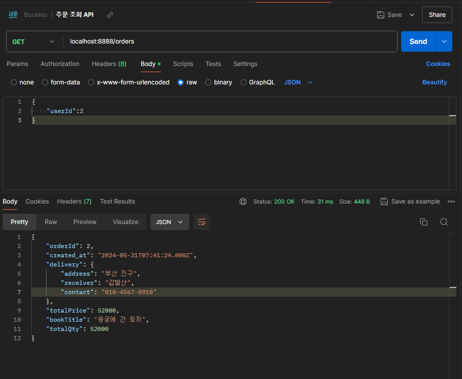
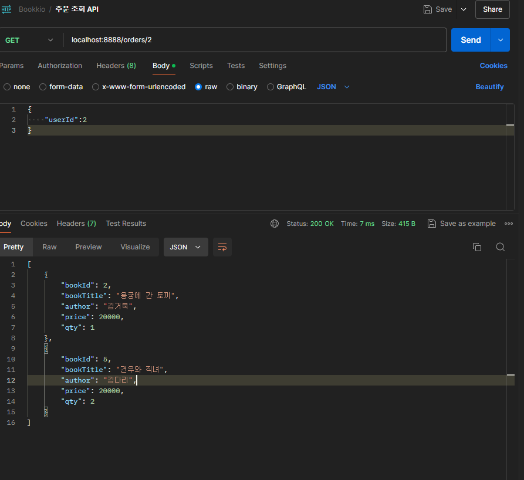

# Bookkio 프로젝트 8일차

- 주문 목록 조회, 주문 목록 개별 조회 API 구현

## MySQL 테이블 데이터를 삭제하는 방법

### 1) DELETE

```sql
DELETE FROM 테이블명
WHERE 삭제조건
```

- 조건 절이 존재하면 조건에 해당하는 행만 삭제
- 조건이 없으면 모든 행이 삭제된다.
    - 모든 행이 삭제 되어도 테이블은 유지된다.
- 테이블 데이터 전체를 삭제하더라도, 한줄씩 삭제하는 동작을 수행한다.
    - ⇒ 퍼포먼스 떨어진다.
- COMMIT 을 통해 사용자가 직접 변경사항을 저장할 수 있다.
    - COMMIT 은 해당 업데이트를 확정하는 것으로, 다른 사용자들에게도 업데이트를 반영하는것.,

### 2) DROP

```sql
DROP TABLE 테이블명;
```

- 테이블 자체를 통째로 삭제 (테이블이 사라진다.)
- 위 명령어도 COMMIT이 자동으로 수행된다 (명령 실행 후 되돌릴 수 없다.)

### 3) TRUNCATE

```sql
TRUNCATE TABLE 테이블명;
```

- 테이블에 있는 데이터를 한번에 제거하며, 테이블이 최초 생성되었을 당시의 storage만 남긴다.
- 이미 지운 데이터를 되돌릴 수가 없다. (자동 COMMIT 되는 명령어)

만약 FK 제약조건에 의해 테이블 데이터를  삭제할 수 없다면, `SET FOREIGN_KEY_CHECKS=0` 으로 해당 제약조건 확인을 하지 않게 설정하여 제약조건이 걸린 테이블 데이터를 삭제 할 수 있다.

## 주문 하기 API 장바구니 목록 지워주기

기존에 주문 하기 API 코드는 사용자가 담아놓은 장바구니 아이템을 기반으로 데이터를 끌어 오는 흐름이었는데, 강의 순서 상 주문하기 API 구현을 임시 데이터들로 하다보니, 실제 흐름인 장바구니 아이템 삭제기능이 들어가 있지 않았었다.

지금 부터는 실제 사이트에서 해당 API 가 실행 될 때, 사용자가 담아놓은 장바구님의 아이템을 대상으로 cartItemId 와 bookId, qty 같은 정보를 가져와 orders 에 주문 요청을 하는 흐름으로 인지하며 개발 하였다.

실제 사용자가 장바구니 목록 기반으로 주문을 요청하면, 장바구니에서는 사용자가 주문한 아이템은 사라져야 하기 때문에, 주문하기 API 코드를 조금 수정하였다.

```jsx
/**
 * 주문하기 API
 * @param {import("express").Request} req
 * @param {import("express").Response} res
 */
const orderItems = (req, res) => {
  const { items, delivery, totalPrice, totalQty, userId } = req.body;
  console.log({
    items,
    delivery,
    totalPrice,
    totalQty,
    userId,
  });

  // delivery INSERT query
  let sqlQuery1 = `
  INSERT INTO delivery (address, receiver, contact)
  VALUES (?,?,?);
  `;
  const queryArg1 = [delivery.address, delivery.receiver, delivery.contact];
  const format1 = dbConnection.format(sqlQuery1, queryArg1);

  console.log("포맷 1");
  console.log(format1);

  // oreders INSERT query
  let sqlQuery2 = `
  INSERT INTO orders (book_title, total_price, total_qty, user_id, delivery_id)
  VALUES((SELECT title FROM books WHERE id = ?),?,?,?,(SELECT MAX(id) FROM delivery));
  `;
  const queryArg2 = [items[0].bookId, totalPrice, totalQty, userId];

  const format2 = dbConnection.format(sqlQuery2, queryArg2);
  console.log("포맷 2");
  console.log(format2);

  // orderedBook INSERT query
  let sqlQuery3 = `
    INSERT INTO orderedbook (order_id, book_id, qty)
    VALUES((SELECT MAX(id) FROM orders), ?, ?);
  `;
  let format3 = "";

  items.forEach((item) => {
    format3 += dbConnection.format(sqlQuery3, [item.bookId, item.qty]);
  });
  console.log("포맷 3");
  console.log(format3);

  // cartItem DELETE query
  let sqlQuery4 = `
    DELETE FROM cartitems
    WHERE id=?;
  `;

  let format4 = "";

  items.forEach((item) => {
    format4 += dbConnection.format(sqlQuery4, item.cartItemId);
  });

  console.log("포맷 4");
  console.log(format4);

  dbConnection.query(format1 + format2 + format3 + format4, (err, result) => {
    if (err) {
      console.log(err);
      return res.status(StatusCodes.BAD_REQUEST).end();
    }

    if (
      result[0].affectedRows > 0 &&
      result[1].affectedRows > 0 &&
      result[2].affectedRows > 0 &&
      result[3].affectedRows > 0
    ) {
      return res.status(StatusCodes.OK).json({
        deliveryResult: result[0],
        ordersResult: result[1],
        orderedBookResult: result[2],
        deleteCartItemResult: result[3],
      });
    } else {
      console.log(err);
      return res
        .status(StatusCodes.INTERNAL_SERVER_ERROR)
        .json({ message: "오류가 발생하였습니다." });
    }
  });
};
```

강의에서는 mysql2 의 promise 를 이용하여 async/await 를 이용하여, 각 비동기 작업에 대한 순서를 보장하였는데, 나는 mysql2의 다중 쿼리 실행 기능을 이용하여 순서를 보장하였다.

## 주문 목록 조회 API 구현

### 전체 주문 상품 API

- METHOD : `GET`
- URI : `/orders`
- HTTP Status Code : `200`
- Request Body
    
    ```json
    {
    	"userId" : 2
    }
    ```
    
- Response Body
    
    ```json
    {
    	"orderId" : "주문 id",
    	"created_at" : "주문일자",
    	"delivery" : {
    		"address" : "주소",
    		"receiver" : "수령인",
    		"contact" : "번호"
    	},
    	"totalPrice" : "총금액",
    	"bookTitle" : "대표 책 제목",
    	"totalQty" : "총 수량"
    }
    ```
    

위의 결과 값을 반환해 주기 위해서는, orders 테이블과, delivery 테이블을 LEFT JOIN을 통해 조회한 결과를 참조해야 한다.

```sql
SELECT orders.id AS order_id,
orders.total_qty AS order_total_qty,
orders.total_price AS order_total_price,
orders.created_at,
orders.user_id,
orders.delivery_id,
delivery.address AS delivery_address,
delivery.receiver AS delivery_receiver,
delivery.contact AS delivery_contact
FROM orders LEFT 
JOIN delivery ON delivery.id = orders.delivery_id
WHERE orders.id = 2;

```

- 통째로 LEFT JOIN을 그냥 실행 시키면, 특정 중복되는 column들이 발생하여 위와 같이 필요한 컬럼만 선정하여 가져 오도록 하였다.

- controller 함수 작성
    
    ```jsx
    /**
     * 전체 주문 목록 조회 API
     * @param {import("express").Request} req
     * @param {import("express").Response} res
     * @returns
     */
    const getOrderList = (req, res) => {
      const { userId } = req.body;
    
      let sqlQuery = `
      SELECT orders.id AS order_id,
      orders.book_title AS order_book_title,
      orders.total_qty AS order_total_qty,
      orders.total_price AS order_total_price,
      orders.created_at,
      orders.user_id,
      orders.delivery_id,
      delivery.address AS delivery_address,
      delivery.receiver AS delivery_receiver,
      delivery.contact AS delivery_contact
      FROM orders LEFT 
      JOIN delivery ON delivery.id = orders.delivery_id
      WHERE orders.id = ?;
      `;
      let queryArg = [+userId];
    
      dbConnection.query(sqlQuery, queryArg, (err, result) => {
        if (err) {
          console.log(err);
          return res
            .status(StatusCodes.BAD_REQUEST)
            .json({ message: "잘못된 주문 목록 조회 요청입니다.", error: err });
        }
    
        const userOrders = result[0];
        console.log(userOrders);
        if (userOrders) {
          const resultJson = {
            orderId: userOrders.order_id,
            created_at: userOrders.created_at,
            delivery: {
              address: userOrders.delivery_address,
              receiver: userOrders.delivery_receiver,
              contact: userOrders.delivery_contact,
            },
            totalPrice: userOrders.order_total_price,
            bookTitle: userOrders.order_book_title,
            totalQty: userOrders.order_total_price,
          };
          return res.status(StatusCodes.OK).json(resultJson);
        } else {
          return res
            .status(StatusCodes.NOT_FOUND)
            .json({ message: "주문한 목록이 없습니다." });
        }
      });
    };
    ```
    
    - 조회 결과
    
    
    

### 주문 상세 내역 API 구현

- METHOD : `GET`
- URI : `/orders/{orderId}`
- HTTP Status Code : 200
- Request Body
- Response Body
    
    ```json
    [
    	{
    		"bookId" : "도서 id",
    		"bookTitle" : "도서 제목",
    		"author" : "작가명",
    		"price" : "가격",
    		"qty" : "주문 수량"
    	},
    		{
    		"bookId" : "도서 id",
    		"bookTitle" : "도서 제목",
    		"author" : "작가명",
    		"price" : "가격",
    		"qty" : "주문 수량"
    	},
    		{
    		"bookId" : "도서 id",
    		"bookTitle" : "도서 제목",
    		"author" : "작가명",
    		"price" : "가격",
    		"qty" : "주문 수량"
    	},
    	
    	
    ]
    ```
    

해당 기능을 위해서는 orderedBook 테이블과 books 테이블을 LEFT JOIN 하여 결과를 추출할 수 있다.

```sql
SELECT books.id AS book_id,
books.price AS book_price,
books.title AS book_title,
books.author AS book_author,
orderedbook.qty AS order_qty
FROM orderedBook LEFT 
JOIN books ON books.id = orderedbook.book_id
WHERE orderedbook.order_id = 2;
```

orderedbook.order_id 에 url params로 입력받는 order_id 값을 넣어주면 해당 하는 API로 상세 검색이 가능해진다.

- controller 함수
    
    ```jsx
    /**
     * 주문 상품 상세 조회 API
     * @param {import("express").Request} req
     * @param {import("express").Response} res
     * @returns
     */
    const getOrderDetail = (req, res) => {
      const { orderId } = req.params;
      let sqlQuery = `
      SELECT books.id AS book_id,
      books.price AS book_price,
      books.title AS book_title,
      books.author AS book_author,
      orderedbook.qty AS order_qty
      FROM orderedBook LEFT 
      JOIN books ON books.id = orderedbook.book_id
      WHERE orderedbook.order_id = ?;
      `;
      let queryArg = [+orderId];
    
      const format = dbConnection.format(sqlQuery, queryArg);
    
      dbConnection.query(format, (err, results) => {
        if (err) {
          console.log(err);
          return res.status(StatusCodes.BAD_REQUEST).end();
        }
    
        const orderDetails = [...results];
        console.log(orderDetails);
    
        if (orderDetails.length > 0) {
          const resultJson = orderDetails.map((item) => {
            return {
              bookId: item.book_id,
              bookTitle: item.book_title,
              author: item.book_author,
              price: item.book_price,
              qty: item.order_qty,
            };
          });
          return res.status(StatusCodes.OK).json(resultJson);
        } else {
          return res
            .status(StatusCodes.NOT_FOUND)
            .json({ message: "해당하는 주문을 찾지 못했습니다." });
        }
      });
    };
    ```
    
    - 조회 결과
        
        
        

오늘은 이렇게 주문에 관련된 API 기능들을 추가적으로 구현해 보았다.

실제 강의에서와의 코드는 좀 다르다.

우선 나는 비동기 프로그래밍 (async/await) 를 사용하지 않고 다중 쿼리문을 보내는 방식을 사용했는데,

그 이유는 내 소신으로 해당 과정에서 비동기까지 필요하다고 생각 되지 않아서와, mysql2에 이미 다중 쿼리를 지원하는 기능이 있기 때문이다.

물론 서비스가 감당해야할 트래픽이 크거나, 사용자가 워낙 많거나 할 땐, 당연히 비동기 코드가 필수 적일 것 이라고 생각한다.