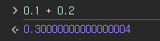

# Javascript 입문

## 실습환경 Setting

- 강의에서는 MAC 기준으로 세팅을 설명
- 현재 나는 WIndows 운영 체제를 사용중이므로 운영체제에 맞게 실습환경 세팅
- IDE : VSCode
- 브라우저 : Chrome

## 브라우저

- 브라우저의 종류 (제조사)
    - 크롬
    - 엣지
    - 사파리
    - 오페라 등
    - 브라우저 마다 JS 엔진이 다르다.

### 브라우저가 렌더링을 하는 과정

- 브라우저는 한번에 하나의 파일만 파싱하여 렌더링 할 수 있다. (HTML)
- 브라우저가 가져오는 HTML 파일이 로드 (다운로드) 되면, 해당 HTML에 연결된 JS, CSS 파일을 분석하여 같이 렌더링 한다.

### 개발자 도구

- Element
- Console
- Sources
- NetWork
- Performance
- Memory
- Application
- Security

위의 탭을 통해 브라우저에서 사용자 관점의 성능 및 에러와 같은 다양한 상황을 확인 할 수 있다.

### 브라우저에서의 디버깅(Debugging)

발생한 이슈에 대해 원인을 파악하고, 해결하기 위한 실마리를 찾는 과정을 `디버깅` 이라고 한다.

- 개발자는 이런 디버깅을 통해 미리 일어날 에러에 대해 오류를 추론하거나, 에러가 발생한 상황에서 원인을 찾을줄 알아야 한다!

## JS라는 언어

- JS는 대표적인 인터프리터 언어이다.
- 인터프리터 언어
    - 컴파일 단계가 없는 언어
    - 컴파일 언어에 비해, 실행 속도가 느리다는 단점이 있다.
    - 런타임 환경에서 실행 된다.
    - 코드를 문 단위로 한 줄 씩 읽어서 바로 실행하므로 속도가 느리다.
        - 코드 수정이 용이하다는 장점 존재,
        

### JS의 언어적 특징

- 변수의 타입
    - 동적 타입 언어
- 함수를 일급 객체로 취급
    - 함수를 값으로 주고 받기가 가능한 이유
- prototype 기반의 상속
- 여러 프로그래밍 패러다임 지원
    - 명령형, 함수형, 객체지향형

### JS의 발전…

- 초기 JS는 웹페이지의 `보조적인 기능` 정도만 수행하기 위해 탄생 (⇒ 추후 언어 발전을 통해 많은 역할을 하게 됐다)
- JS의 버전의 발전에 따라 브라우저 버전에 따른 지원되지 않는 JS기능이 발견됨
    - 트랜스 파일러, 번들러, lint와 같은 도구의 도움을 받아 해결할 수 있게됨 (폴리필)
- ECMA 스크립트 표기법
    - ECMAScript{표기연도} - ECMAScript2015
    - ES{연도} - ES2015
    - ES{버전 (판)}  : ES6
    - ES6부터 대대적인 JS의 역할이 다양해졌다
        - 모듈, 클래스, 블록레벨 스코프, iterator/generator, 비동기 프로그래밍, promise, 구조분해 패던 등의 개선점이 생겼다.
- 구식 브라우저 (버전) 에서 JS의 기능이 지원되지 않을 때,
    - polyfill , babel의 사용으로 해결 가능하다.
    - polyfill(폴리필)
        - 최신 기능을 제공하기 위해 해당 브라우저 버전에 맞춘 JS로 최신 기능을 구현한 코드
        - 브라우저가 다른 방식으로 동일한 기능을 구현하는 문제를 해결하는데에 사용된다.
    - babel ( 트랜스파일러)
        - 이전 버전의 브라우저에서 ES6 이전 버전의 JS로 변환하는데 사용되는 도구
        - 최신 문법을 사용한다면, 트랜스 파일러를 거쳐 내장 된 폴리필과 함께 최신 구문을 구식 브라우저에서 사용가능한 코드로 변환하여 작성한다.

## JS 좀 더 알아보기

### 변수

컴퓨터의 `메모리` (기억장치) 에 데이터를 담아 놓은 `주소값` 을 활용하기위 사용자가 이름을 지어 놓은 것.

원하는 데이터를 메모리에서 꺼내쓰기 위한 메모리의 식별자이다.

- JS의 변수 생성 키워드 : `let` (블록레벨), `const` (블록레벨) , `var` (함수 스코프)

### 변수의 생성 단계

1. 선언 : 변수를 변수 객체에 등록 (실행 Context 내)
2. 초기화 : 변수를 메모리에 할당, undefined로 초기화 한다.
3. 할당 : undefined로 초기화한 변수에 실제 할당된 값을 할당한다.
    - 코드가 실행이 되면서 할당이 진행 된다.

- `var`의 변수 생성
    - 코드 평가 단계 : 선언과 동시에 초기화 진행
    - 코드 실행 단계 : 할당 진
    - !! 코드 평가 시점에 `초기화` 가 진행 되어있으므로, 변수의 할당이 살행 되기전에 사용이 가능하다. `호이스팅`
- `var` 키워드의 단점
    - 키워드의 생략 가능 (가독성 문제)
    - 중복 선언 가능
    - 변수 호이스팅 (초기화 시점을 주의해야 하므로)
    - 전역 변수
    
- `const`, `let`의 변수 생성
    - 코드 평가 단계 :  변수 선언만 진행
    - 코드 실행 단계 : 변수 초기화 및 할당을 진행
        - 코드 실행이 되기 전까지 변수를 참조할 수 없다 (Reference Error)
    - const와 let키워드로 생성한 변수는 `블록 레벨 스코프` 를 가지므로, 변수의 사용범위를 명확히 이해할 수 있다.

## JS의 자료형

- JS의 자료형으로는 원시타입과 참조(객체)타입이 존재 한다.

### 원시타입

- 원시 타입은 7가지가 존재
- 특징
    - 원시타입의 값은 `변경 불가능` 하다. (immutable Value)
    - `값` 으로써 전달 된다 (참조는 다른 방식으로 전달 된다.)
- `Number`
    - 숫자 타입을 사용하기 위한 자료형
    - JS는 모든 숫자를 실수로 처리
    - 범위 : -2 ^ 53 ~ 2 ^ 53
    - 실수를 연산할 때, 근사값으로 처리한다. : 0.1 + 0.2 ≠ 0.3
    
      
    
    - Number.MAX_SAFE_INTEGER = Number 형의 최대값
    - Number.MIN_SAFE_INTEGER = Number 형의 최솟값
    - Infinity, NaN 의 값도 가진다.
        - infinity : 무한대
        - NaN : Not a Number 로 숫자가 아닌 숫자형 데이터를 나타낸다.
- `BigInt`
    - 정수를 나타낼 수 있는 JS의 숫자 원시 값 (임의정밀도)
    - Number의 최대값을 넘는 정수를 안전하게 저장 및 연산이 가능하다
    - 다른 타입과 `혼합하여 연산이 불가하다`.
    - 숫자형 값 뒤에 `n` 을 붙여 표현한다. (1234566771234124134n)
- `String`
    - 텍스트 데이터를 다룰 때 사용하는 자료형
    - UTF-16 코드 단위의 시퀀스로 표현
    - 할당된 문자값을 변경하는 것은 불가능 하다. (문자열 내부 요소를 변경할 수 없다)
    - 템플릿 리터럴 방식 (` `) 은 ES6 버전 이상부터 사용 가능하다.
- `Boolean`
    - 논리 연산을 위한 참,거짓 정보를 다루는 자료형
    - true, false 둘 중 하나의 값만 가질 수 있다.
- `undefined`
    - 값을 할당하지 않은 변수에 할당이 되는 값. (변수 선언 후, 초기화 까지 진행했을 때 자동으로 할당된다.)
- `null`
    - `값이 없다` 는 것을 의도적으로 표현하기 위해 사용되는 자료형
    - typeof 사용시 ‘object’ 나오므로 엄격한 일치연산자 === 를 사용하여 검사를 진행해야 한다.
- `Symbol`
    - ES6에 추가
    - 중복 되지 않은 `유니크한` 값이다.
        - 객체의 key로 사용가능
        - 클래스나 객체 형식의 `내부에서만 접근 가능` 할 수 있도록 전용 객체 속성의 key로 사용
    - Symbol 함수를 호출하여 생성 한다.

### 객체 타입 (참조 타입, Reference Type)

- 다양한 타입의 값을 하나의 단위로 구성한 복합저인 자료구조
- 원시 타입을 제외한 모든 것이 객체 타입이다.
- 특징
    - `참조`의 방식으로 전달 된다. (깊은 복사와, 얕은 복사가 존재)
        - 값이 수정 가능하다.
    - `힙 메모리` 에 저장
        - 동적으로 변화가 가능하므로, 메모리 공간 확보 및 저장
    - Pass - by - reference
        - 참조 타입이므로 참조 값으로 처리한다.
- Object, Array 등이 대표적인 객체 타입 자료형이다.

## 동적 타입 언어

- 타입이 동적으로 변환되는 언어.
- 명시적 타입 변환
    - 원시 래퍼 객체 (prototype) 을 통해 개발자가 의도적으로 값의 자료형을 변경 가능
        - .toString(), Number, +, Boolean
- 암묵적 타입 변환
    - 개발자가 의도하지 않은 타입 변환
        - 값 + “” : 문자열로 타입 변환
        - 값 * 1 : 숫자형으로 타입 변환
        - !!값 : Boolean 타입으로 변환
        - +값 : 숫자형으로 타입 변환

## JS의 연산자

### 단항 연산자

- 하나의 피연산자만 사용하는 연산자.
- void : 표현식을 평가할 때 값을 반환하지 않도록 지정
- typeof : 평가전의 피연산자 타입을 나타내는 `문자열`을 반환
- delete : 객체의 속성을 삭제 한다.
    
    ```jsx
    // void
    const a = 3;
    console.log(void a); // undefined
    
    // delete 
    const foo = { age : 250 }
    console.log(foo) // {age : 250}
    delete foo.age
    console.log(foo) // {}
    
    // typeof
    const b = "string문자열"
    console.log(typeof b) // "string"
    const d = {a : 3, b : 5 }
    console.log(typeof d) // "object" 
    ```
    

### 산술 연산자

- 단항 산술 연산자 : 1개의 피연산자를 산술 연산하여 숫자값 반환
    - ++
        - 전위 : 피 연산자의 값을  1 증가 시킨 뒤 다른 연산 수행
        - 후위 : 다른 연산을 수행한 후, 피 연산자의 값을 1 증가
    - —
        - 전위 : 피 연산자의 값을  1 감소 시킨 뒤 다른 연산 수행
        - 후위 : 다른 연산을 수행한 후, 피 연산자의 값을 1 감소
    - + : 양수 표현, 숫자가 아닌 값의 전위로 붙이면, 숫자형으로 해당 값을 변환한다.
        - 피연산자를 변경하는 것은 아님
    - - : 양수를 음수로, 음수를 양수로 반전시킨 값을 반환

- 관계 연산자 : 피연산자를 비교하고, 결과가 참인진에 따라 Boolean값을 반환
    - in : 객체 내에 속성이 존재할 경우 true
    - instanceof : 특정 객체 타입에 속하면 true를 반환
- 비교 연산자 : 피연산자를 비교하고 결과가 참인지에 따른 Boolean값을 반환
    - == (동등 연산자) : 서로 같으면 true
        - 비교를 위한 형변환이 발생 할 수 있다. (5 == “5” ⇒ true)
    - === (일치 연산자) : 서로 같고, 자료형도 같으면 true
    - ! = ( 부등 연산자) : 서로 다르면 true
        - 비교를 위한 형 변환이 발생 할 수 있음
    - ! == (불일치 연산자) : 서로 다른 값이거나, 자료형이 다르다면 true
    - <, >, ≤, ≥의 비교 연산자도 존재

### 논리 연산자

- && (AND) : 피연산자 두 개가 모두 true일 때 true 반환
- || (OR) : 피연산자 두개중 한개만 true여도 true 반환

### 기타 연산자

- 쉼표 연산자 : 두 연산자를 모두 평가한 후, 오른쪽 피연산자의 값을 반환
    
    ```jsx
    const a = (1, 2);
    console.log(a) // 2
    ```
    
- 문자열 연산자 (+) : 두 문자열 값을 서로 연결하여 새로운 문자열 반환
- 옵셔널 연산자 (?) : 객체 속성 참조시, 해당 속성이 유효하지 않은 경우, 에러 발생이 아닌 undefined 만을 발생 시킴
    
    ```jsx
    const obj = {name : "Test"}
    console.log(obj.age?) // undefined
    ```
    
- 할당 연산자
    - += : 더하기 할당
    - -= : 빼기 할당
    - *= : 곱하기 할당
    - /=  : 나누기 할당
    - %= : 나머지 할당
    - **= : 거듭제곱 할당
    - &&= : 논리 AND 할당
    - || = : 논리 OR 할당
- 삼항 연산자
    - 조건 연산자에 따라 두 값 중 하나를 반환
    
    ```jsx
    const a = false;
    console.log(a ? "참" : "거짓") // 거짓.
    ```
    

## JS의 함수

- 소프트웨어의 특정 동작을 수행할 수 있는 코드 일부분(단위) 를 의미
- JS에서 함수는 `일급객체`로 취급된다.
    - 일급객체 : 일반적으로 적용 가능한 연산을 모두 지원하는 객체
        - 일급객체는 함수의 매개변수가 될 수 있다.
        - 일급객체는 함수의 반환 값이 될 수 있다.
        - 일급객체는  할당 명령문의 대상이 될 수 있다. (변수 등에 할당 가능)
        - 일급객체는  동일 비교의 대상이 될 수 있다. (값으로 표현 가능하기 때문)
        
- 객체 처럼, `속성` 과 `메서드` 를 가질 수 있다.
- 함수 선언식의 경우, `나머지 매개변수` 를 통해 (…rest) 함수에 지정하지 않은 매개변수를 사용할 수 있다.
    - arguments 라는 함수 내장 객체를 사용하여, 입력된 인수의 배열 (유사배열) 을 사용할 수 있다.
- 매개변수 : 함수를 정의할 때 사용하는 변수
- 인자 : 함수가 호출 될 때 넘기는 값

### 함수 생성 방법

- 함수 선언문
    
    ```jsx
    function func (arg) {
    	return arg
    }
    ```
    
- 함수 표현식
    
    ```jsx
    // 익명함수
    const foo = function(arg) {
    	return arg
    }
    
    // 기명함수
    const bar = function barfunc(arg) {
    	return arg;
    }
    ```
    
- Function 생성자 함수
    
    ```jsx
    // JS의 내장객체
    new Function(ar1, arg2, "return arg2");
    ```
    
- 화살표 함수 (ES6)
    
    ```jsx
    const foo = (arg) => {
    	return arg;
    }
    
    const bar = (arg1, arg2) => {
    	return arg1 + arg2;
    }
    ```
    

### 함수 사용 패턴

- 즉시 실행 함수 (IIFE)
    - 함수의 정의와 동시에 실행 (재호출 불가)
- 재귀 함수
    - 함수 내에서 자기 자신을 호출
    - 탈출 조건을 필수로 정의해야 한다.
- 중첩 함수
    - 함수 내에 정의된 내부 함수
    - 부모 함수 내부의 변수에 접근 가능
    - 부모 함수는 내부함수의 변수에 접근 불가
- 콜백 함수
    - 함수의 일급객체 특징중 하나인, 함수는 매개변수가 될 수 있는 점을 이용한함수
    - 함수를 인자로 받는 함수가, 호출한 함수 내부에서 호출 되어 특정 이벤트에 대한 함수를 호출 할 수 있다.
    -