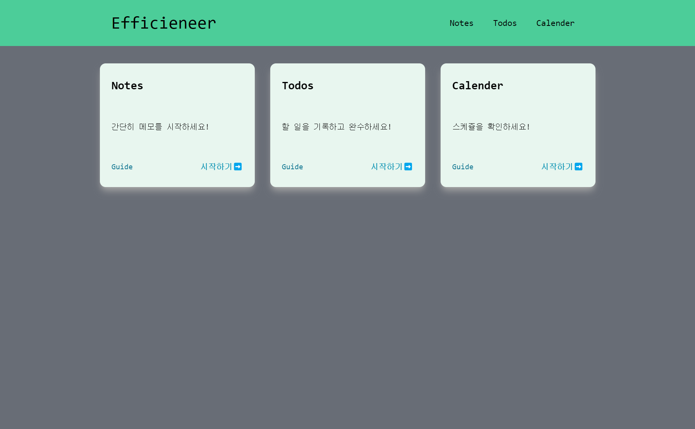

# Efficieneer 개발 2 일차

- 2024-06-18 (화)

## Card Item 컴포넌트 개발

Home 화면에 각 서비스별 링크를 보여주기 위한 CardItem 컴포넌트를 작성하였다.

- Home.tsx
    
    ```tsx
    
    import CardItem from "../components/CardItem";
    
    type CardDataType = {
      title: string;
      path: string;
      description: string;
    }[];
    
    const cardDatas: CardDataType = [
      { title: "Notes", path: "/notes", description: "간단히 메모를 시작하세요!" },
      {
        title: "Todos",
        path: "/todos",
        description: "할 일을 기록하고 완수하세요!",
      },
      { title: "Calender", path: "/calender", description: "스케쥴을 확인하세요!" },
    ];
    
    function Home() {
      return (
        <>
          <section
            id="card-nav"
            className="w-9/12 flex flex-col flex-wrap justify-center items-center min-h-max my-5 md:flex-row "
          >
            {cardDatas.map((cardData) => (
              <CardItem
                key={cardData.title + cardData.path}
                title={cardData.title}
                path={cardData.path}
                description={cardData.description}
              />
            ))}
          </section>
        </>
      );
    }
    
    export default Home;
    
    ```
    

- CardItem.tsx
    
    ```tsx
    import { Link } from "react-router-dom";
    
    type CardItemType = {
      path: string;
      title: string;
      description: string;
    };
    
    function CardItem({ path, title, description }: CardItemType) {
      return (
        // card
        <section id="card" className="m-4">
          <div className="bg-card w-80 min-h-[16rem] rounded-xl shadow-lg shadow-neutral-400 flex flex-col items-start justify-around px-6">
            <h2 className="text-2xl block font-bold">{title}</h2>
            {/* 이미지 넣는 부분 */}
            <span className="block">{description}</span>
            <div
              id="card-nav-links"
              className="flex justify-between items-center w-full"
            >
              <Link
                className="text-cyan-700 hover:text-cyan-400"
                to={`${path}/guide`}
              >
                Guide
              </Link>
    
              <Link
                to={path}
                className=" font-semibold text-cyan-600 hover:text-cyan-400"
              >
                시작하기➡️
              </Link>
            </div>
          </div>
        </section>
      );
    }
    
    export default CardItem;
    
    ```
    

### Home 화면 결과



- 각 서비스별 CardItem을 누르면 해당하는 서비스로 이동하도록 작성하였다.

## Trouble

### CardItem Link 의 flex 정렬 작동

CardItem 컴포넌트에 #card-nav-links div가 존재하는데 해당 엘리먼트의 flex 속성을 먹이고

justify-content를 먹였는데 작동을 안했다…

이때 가장 먼저 들었던 생각은 `<a>` 태그가 flex에 대해 좀 특별한가? inline 속성이라 그런가?

그래서 Link 태그들에 inline-block 속성을 주어봐도 해결이 되지 않았었는데,

해당 질문을 가지고 ChatGPT에게 굽신대며 물어봤다.

그 결과…

아주 간단하게, Link 태그들이 전개할 `너비` 가 턱없이 부족하다는 것이 답변!

그래서 순간 w-full (width : 100%) 에 대해 내가 망각 했다는 사실을 깨달았다.

#card-nav-links에 w-full 속성을 주고 나니 바로 적용이 되었다!

## 오늘의 소감

- 진짜 간단한 디자인인데 시간이 좀 걸렸다.
- 일정이 있어서 긴 시간을 할애하지 못한게 아쉬웠다.
- 오늘은 컴포넌트 하나에 Home의 Layout 배치와 position, MainNavigation의 position을 수정하는데 tailwind로 하면서 css 속성들을 제대로 확인하면서 작성하니 CSS 에 대한 지식도 조금은 더 발전 한 것 같았다.
- Trouble을 계속 기록하는 습관을 들여야 겠다는 생각이 들어서, Notion의 프로젝트 진행 상황 페이지에 Trouble을 기록소를 만들었다!
    - 나중에 README 에 적기 유용할 것 같다 ㅎㅎ