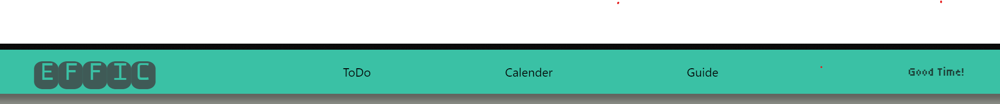

# Effic 개발 6 일 차

## 변경사항

- 프로젝트 명 변경 : Efficieneer ⇒ Effic
- 스타일 라이브러리 변경 : Tailwind ⇒ vanilla-extract

## 스타일 라이브러리 변경 건

기존에 Tailwind를 사용했을 때, 처음에 편하기는 진짜 편했는데,

className도 너무 길어지고, 무엇보다 css 문법이 좀 더 익숙한 나한테는

tailwind의 잘 나누어진 스타일링 문법이 보기가 어려웠다.

(직관적이지 않았다?)

데브코스에서 [**vanilla-extract**](https://vanilla-extract.style/documentation/getting-started/) 라는 스타일 라이브러리를 사용했었는데

module.css 와 거의 사용 방법이 비슷하고,

theme 같은 공용 var 를 지정해놓고 가는 방식 자체가 나한테 잘 맞았다.

실제로 헤더 컴포넌트를 만드는데 약 3일 정도 소요 했었는데,

오늘 프로젝트를 변경하기로 마음먹고  하루가 안되어 헤더를 만들었다.

이전에 작업 했던게 있어서 그런 것도 있지만,

체감상, 그냥 css문법을 최대한 쓰는게 나는 더 편했다.

## 프로젝트명 변경 건

사실 큰 이유는 없고, 직전에 개발을 진행하면서

집중을 너무 못했었는데, 아무래도 뭔가에 급급 했다.

그래서 그냥 처음부터 다시 만들었다.

프로젝트 세팅도 다시 하고, 여러가지 설정도 다시 처음부터 했는데

사실 뭐 많지는 않아서 오래 안걸렸다.

그리고, 지금 기능하나를 최후로 남겨두고 가능한것 같은 것만 최대한 구현하고자 한다.

## vanilla-extract 적용

우선 프로젝트는 vite를 사용하여 구축했다.

- vite
- React
- TypeScript + SWC

### 설치

```
npm install @vanilla-extract/css
```

### 글로벌 재사용 스타일 변수 설정

- src/style.css.ts
    - (App이나 main 파일에 적용 되는 것이 아닌 아예 분리된 파일이다)

```tsx
import { createGlobalTheme } from "@vanilla-extract/css";

export const vars = createGlobalTheme(":root", {
  color: {
    main: "#36BA98",
    sub: "#6B8076",
    ground: "#8B8E87",
    primary: "rgb(58, 193, 165);",
    dark: "#252928",
    brown: "#645955",
    forest: {
      basic: "#1d4239",
      sub: "#3F5A56",
      light: "#5A877E",
    },

    black: "#000",
  },
  textColor: {
    bright: "#F7F9F2",
  },
  font: {
    title: {
      family: `"Monofett", monospace`,
      weight: "400",
      style: "normal",
    },
    tiny: {
      family: `"Tiny5", sans-serif`,
      weight: "400",
      style: "normal",
    },
    anton: {
      family: `"Anton", sans-serif`,
    },
  },
  fontSize: {
    T1: "1rem",
    T2: "1.3rem",
    T3: "1.8rem",
    T4: "2rem",
    big1: "3rem",
    big2: "4rem",
  },
  space: {
    big1: "20px",
    big2: "15px",
    medium: "10px",
    small: "5px",
  },
});
```

초록 계열인데, 뭔가 영롱한 초록계열을 좋아해서 프로젝트 색을 color.main 의 색으로 지정했다.

그냥 초록은 보면 기분이 좋다 ㅎㅎ

- 위의 createGlobalTheme 을 통해 재사용 가능한 스타일 값 속성들을 정의할 수 있다.
- export 로 `vars` 객체를 내보냈기 때문에 다른 컴포넌트.css.ts 파일에서 필요할 때 마다 정의된 값을 사용할 수 있다.

### 사용 예시

- MainNavigation.css.ts

```tsx
import { style } from "@vanilla-extract/css";
import { vars } from "../../../style.css";

export const navigationWrapper = style({
  width: "100%",
  height: "76px",
  minHeight: "max-content",
  display: "flex",
  alignItems: "center",
  padding: vars.space.medium,
  justifyContent: "space-between",

  position: "fixed",
  backgroundColor: vars.color.primary,
  boxShadow: "10px 10px 10px rgb(0, 0, 0, 0.3)",
  borderRadius: 5,
});

export const header = style({
  marginLeft: vars.space.big2,
  marginRight: vars.space.big2,
  flexGrow: "1",
});
export const title = style({
  fontFamily: vars.font.title.family,
  fontWeight: vars.font.title.weight,
  fontStyle: vars.font.title.style,

  fontSize: vars.fontSize.big1,
  display: "flex",
  justifyContent: "center",
  alignItems: "center",
});

export const titleText = style({
  color: vars.color.forest.sub,
  transition: "color .2s",
  ":hover": {
    color: vars.color.forest.light,
  },
});

export const navContents = style({
  display: "flex",
  flexDirection: "row",
  alignItems: "center",
  justifyContent: "space-around",
  minWidth: "max-content",
  width: "300px",
  flexGrow: "1.5",
});

export const headerSub = style({
  fontFamily: vars.font.tiny.family,
  color: vars.color.forest.basic,
  fontSize: vars.fontSize.T2,
  flexGrow: "1",
  padding: `0 ${vars.space.big1}`,
  display: "flex",
  justifyContent: "center",
  alignItems: "center",
});
```

vars 호출을 통해 여러 값을 지정된 값으로 사용하였다.

일단 지금 스타일링이 꽤나 재밌다.

## 시도해 볼 것

지금 Redux (+ Toolkit) 은 사용을 해봤었는데,

내 프로젝트에서는 조금 무겁지 않을 까란 생각이 들었다.

내일은 시간날 때, Recoil이랑 Jotai를 한번 비교해 보고자 한다.

### ToDo

ToDo 에서는 생각해놓은 기능은 다음과 같다.

- ToDo 생성
    - 날짜 지정
    - 중요도 지정 : optional ?
    - 루틴 지정 (꼭 해보고 싶다….)
- ToDo 조회
    - 설정해놓은 카테고리별 ToDo 조회
        - 날짜 (Default)
        - 우선순위
        - 루틴만

ToDo 생성물중, 날짜를 지정한 것에 대해서는 Calender 와 연동하여

Calender 에서도 해당 ToDo를 볼 수 있게 하려고 한다.

### Calender

현재 가장 어려울 것 같은 부분인데

사실 다 어렵다 ㅋ

일단 그리드의 형식으로 이번달 기준으로 달력 표시와, ToDo를 표시 하는 것을 해보고 싶다.

재밌을 것 같다.

월별 Swipe를 되게 하는 것도 상당히 유용 할 것 같다.

## 오늘 만든 헤더 ㅎㅎ

