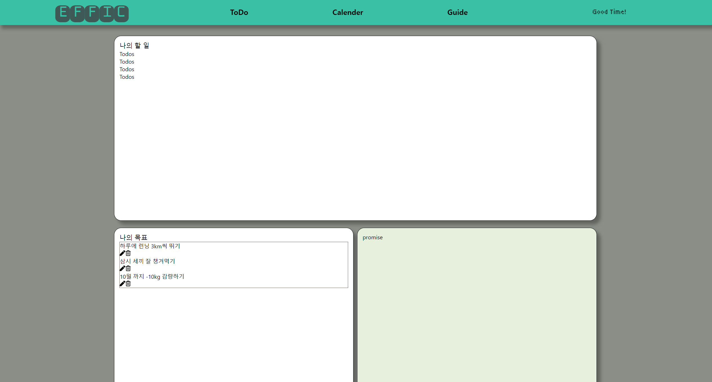

# Effic 개발 8일 차

## 개발 내용

- Home 페이지 작성
    - 할 일 (Todo) card 컴포넌트 작성
    - 그리드를 이용한 렌더링 레이아웃

오늘은 프로젝트 Home 부분 개발을 하는데 시간을 전부 할애 했다..

개발을 하면 할 수록, 그저 감자가 된 느낌이다.

심지어 반응형도 입히지 못해서, 화면을 축소하면 난장판이 된다 ㅋㅋㅋ

그리고 React FSD 아키텍쳐를 알게되어서 살펴 보았는데,

지금 내 프로젝트는 확실히 폴더 구조가 중구 난방인 면이 있다.

근데 아직 feature가 정확히 어떤 것인지도 모르고, model은 무슨 역할을 하는 것들을 

모은 것인지도 몰라서, 프로젝트를 우선 완성시킨다음에

리팩토링을 진행해야 할 것 같다.

몇년후의, 어느정도 발전한 내가 지금의 코드를 본다면,

기가차고 웃음이 나겠지?

꼭 그러길 바란다.