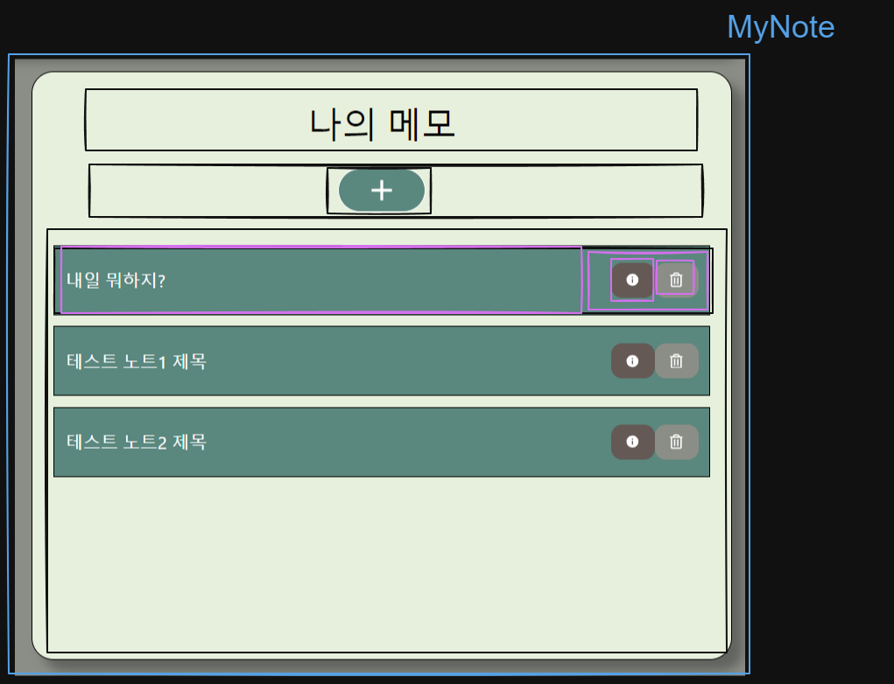
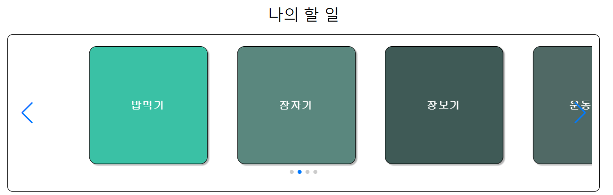

# Effic 개발 9일 차

## 참고

- swiper React 사용
    - 공식문서 : https://swiperjs.com/react#usage
    - 블로그 : https://xionwcfm.tistory.com/331

## 할 일

- [x]  MyTodo 구현
    - [x]  컴포넌트 작성
    - [x]  zustand→ todoStore → 갱신 및 가져오기
- [x]  MyNote 구현
    - [x]  컴포넌트 작성
    - [x]  zustand → noteStore → 수정, 삭제, 추가

### MyNote 구현

### 컴포넌트



### 컴포넌트 트리

- MyNote.tsx
    
    ```tsx
    import React, { memo } from "react";
    import { useNoteStore } from "../../../../store/noteStore";
    import { AddNoteButton, NoteElement } from "..";
    import { areaTitle } from "../../../../style.css";
    import { addButtonArea, noteElementWrapper } from "./MyNote.css";
    import ModalPortal from "../../../../share/ui/Modal/ModalPortal";
    import NoteInfoModal from "../NoteInfoModal/NoteInfoModal";
    
    const MyNote: React.FC = () => {
      const notes = useNoteStore((state) => state.notes);
      const isNewNote = useNoteStore((state) => state.isNew);
      const activeNote = useNoteStore((state) => state.activeNote);
      return (
        <>
          <ModalPortal>
            <NoteInfoModal isNew={isNewNote} activeNote={activeNote} />
          </ModalPortal>
          <h3 className={areaTitle}>나의 메모</h3>
          <div className={addButtonArea}>
            <AddNoteButton />
          </div>
          <div className={noteElementWrapper}>
            {notes &&
              notes.map((note) => (
                <NoteElement key={note.id} id={note.id} title={note.title} />
              ))}
          </div>
        </>
      );
    };
    
    export default memo(MyNote);
    
    ```
    
    - NoteElement
        
        ```tsx
        import React, { memo } from "react";
        import { TNote } from "../../../../share/types";
        import {
          buttonArea,
          infoButton,
          noteElementWrapper,
          removeButton,
        } from "./NoteElement.css";
        import { MdInfo } from "react-icons/md";
        import { FaRegTrashAlt } from "react-icons/fa";
        import { useNoteStore } from "../../../../store/noteStore";
        import { button } from "../../../../style.css";
        
        type TNoteElemntProps = Pick<TNote, "id" | "title">;
        
        const NoteElement: React.FC<TNoteElemntProps> = ({ id, title }) => {
          const setActiveNoteAction = useNoteStore((state) => state.setActiveNote);
          const noteInfoModalOpen = useNoteStore((state) => state.noteModalOpen);
          const setIsExistNote = useNoteStore((state) => state.setIsExist);
        
          const removeNote = useNoteStore((state) => state.removeNote);
        
          const handleInfoButton = () => {
            setActiveNoteAction(id);
            noteInfoModalOpen();
            setIsExistNote();
          };
        
          const handleRemoveNote = () => {
            removeNote(id);
          };
        
          return (
            <div className={noteElementWrapper}>
              <div>{title}</div>
              <div className={buttonArea}>
                <button
                  onClick={handleInfoButton}
                  className={`${button} ${infoButton}`}
                >
                  <MdInfo />
                </button>
                <button
                  onClick={handleRemoveNote}
                  className={`${button} ${removeButton}`}
                >
                  <FaRegTrashAlt />
                </button>
              </div>
            </div>
          );
        };
        
        export default memo(NoteElement);
        
        ```
        
    

### noteStore 구현 : zustand

- noteStore.ts
    
    ```tsx
    import { v4 } from "uuid";
    import { create } from "zustand";
    import { devtools } from "zustand/middleware";
    import { immer } from "zustand/middleware/immer";
    import { getCurrentDate } from "../share/utils/func.ts";
    
    import { TNote } from "../share/types/index.ts";
    
    interface INoteState {
      author: string;
      notes: TNote[];
      activeNote: TNote;
      isNew: boolean;
      noteModalisOpen: boolean;
    }
    
    interface INoteAction {
      addNote: ({ title, content }: { title: string; content: string }) => void;
      removeNote: (noteId: string) => void;
      setActiveNote: (noteId: string) => void;
      updateNote: (
        noteId: string,
        updateTitle: string,
        updateContent: string
      ) => void;
      setIsNew: () => void;
      setIsExist: () => void;
      noteModalOpen: () => void;
      noteModalClose: () => void;
    }
    
    const initialNoteState: TNote[] = [...];
    
    export const useNoteStore = create<INoteState & INoteAction>()(
      devtools(
        immer((set) => ({
          author: "user",
          isNew: false,
          notes: initialNoteState,
          activeNote: initialNoteState[0],
          noteModalisOpen: false,
          addNote: ({ title, content }: { title: string; content: string }) =>
            set((state: INoteState) => {
              state.notes.push({
                id: v4(),
                content,
                title,
                date: getCurrentDate(),
              });
            }),
          removeNote: (noteId: string) =>
            set((state: INoteState) => {
              state.notes = state.notes.filter((note) => note.id !== noteId);
            }),
          setActiveNote: (noteId: string) =>
            set((state: INoteState) => {
              state.activeNote = state.notes.find((note) => note.id === noteId)!;
            }),
          updateNote: (
            noteId: string,
            updateTitle: string,
            updateContent: string
          ) =>
            set((state: INoteState) => {
              state.notes = state.notes.map((note) =>
                note.id !== noteId
                  ? note
                  : {
                      ...note,
                      title: updateTitle,
                      content: updateContent,
                    }
              );
            }),
          setIsNew: () =>
            set((state: INoteState) => {
              state.isNew = true;
            }),
          setIsExist: () =>
            set((state: INoteState) => {
              state.isNew = false;
            }),
          noteModalOpen: () =>
            set((state: INoteState) => {
              state.noteModalisOpen = true;
            }),
          noteModalClose: () =>
            set((state: INoteState) => {
              state.noteModalisOpen = false;
            }),
        })),
        { name: "noteStore" }
      )
    );
    
    ```
    

## MyTodo 구현

### 컴포넌트



### 컴포넌트 트리

- MyTodo.tsx
    
    ```tsx
    import React, { memo } from "react";
    import Todos from "./Todos/Todos";
    import { areaTitle } from "../../../../style.css";
    import { myTodoWrapper, todoCardWrapper } from "./MyTodo.css";
    
    const MyTodo: React.FC = () => {
      return (
        <>
          <div className={myTodoWrapper}>
            <h3 className={areaTitle}>나의 할 일</h3>
            {/* <TodoCard /> */}
            <div className={todoCardWrapper}>
              <Todos />
            </div>
          </div>
        </>
      );
    };
    
    export default memo(MyTodo);
    
    ```
    
    - Todos.tsx
        
        ```tsx
        import React from "react";
        import { Swiper, SwiperSlide } from "swiper/react";
        import TodoCard from "../../TodoCard/TodoCard";
        import { useTodoStore } from "../../../../../store/todoStore";
        import { Navigation, Pagination } from "swiper/modules";
        import { swiperWrapper } from "./Todos.css";
        
        const Todos: React.FC = () => {
          const todos = useTodoStore((state) => state.todos);
          return (
            <div className={swiperWrapper}>
              <Swiper
                spaceBetween={30}
                slidesPerView={4}
                centeredSlides={true}
                autoplay={false}
                pagination={{
                  clickable: true,
                }}
                rewind={true}
                freeMode={true}
                scrollbar={{ draggable: true }}
                modules={[Pagination, Navigation]}
                navigation={true}
              >
                {todos &&
                  todos.map((todo) => (
                    <SwiperSlide key={todo.id}>
                      <TodoCard
                        // key={todo.id}
                        content={todo.content}
                        id={todo.id}
                        priority={todo.priority}
                      />
                    </SwiperSlide>
                  ))}
              </Swiper>
            </div>
          );
        };
        
        export default Todos;
        
        ```
        
        - TodoCard.tsx
            
            ```tsx
            import React from "react";
            import {
              contentArea,
              firstColors,
              secondColors,
              thirdColors,
              todoCardContent,
            } from "./TodoCard.css";
            import { useTodoStore } from "../../../../store/todoStore";
            
            type TTodoCardProps = {
              id: string;
              content: string;
              priority: number;
            };
            
            const TodoCard: React.FC<TTodoCardProps> = ({ id, content, priority }) => {
              const setActiveTodo = useTodoStore((state) => state.setActiveTodo);
            
              return (
                <div
                  className={`${todoCardContent} ${
                    priority === 1
                      ? firstColors
                      : priority === 2
                      ? secondColors
                      : thirdColors
                  }`}
                  onClick={() => setActiveTodo(id)}
                >
                  <div className={contentArea}>{content}</div>
                </div>
              );
            };
            
            export default TodoCard;
            
            ```
            

### todoStore 구현 : zustand

- todoStore.ts
    
    ```tsx
    import { v4 } from "uuid";
    import { create } from "zustand";
    import { devtools } from "zustand/middleware";
    import { immer } from "zustand/middleware/immer";
    import { getCurrentDate } from "../share/utils/func";
    
    export interface ITodo {
      id: string;
      content: string;
      priority: number;
      done: boolean;
    }
    
    interface ITodoStore {
      todos: ITodo[];
      todoModalIsOpen: boolean;
      activeTodo: ITodo;
      addTodo: (todo: ITodo) => void;
      todoModalOpenAction: () => void;
      todoModalCloseAction: () => void;
      setActiveTodo: (todoId: string) => void;
    }
    
    const initialTodos: ITodo[] = [...];
    
    export const useTodoStore = create<ITodoStore>()(
      devtools(
        immer((set) => ({
          todos: initialTodos,
          activeTodo: initialTodos[0],
          todoModalIsOpen: false,
          addTodo: (todo: ITodo) =>
            set((state: ITodoStore) => {
              state.todos.push(todo);
            }),
          toggleTodoDone: (todoId: string) =>
            set((state: ITodoStore) => {
              state.todos = state.todos.map((todo: ITodo) =>
                todo.id === todoId ? { ...todo, done: !todo.done } : todo
              );
            }),
          setActiveTodo: (todoId: string) =>
            set((state: ITodoStore) => {
              state.activeTodo = state.todos.find((todo) => todo.id === todoId)!;
            }),
          todoModalOpenAction: () =>
            set((state: ITodoStore) => {
              state.todoModalIsOpen = true;
            }),
          todoModalCloseAction: () =>
            set((state: ITodoStore) => {
              state.todoModalIsOpen = false;
            }),
        })),
        { content: "todoStore" }
      )
    );
    
    ```