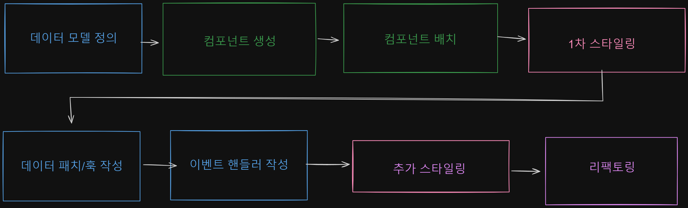

# React 로 하는 동적 UI 개발 - 8

## 생산성

- 기능 단위 작업 파악을 하면 명확히 어떤 작업을 진행 할지 알 수 있다.
- 스스로 하나의 기능을 만들어내는데에 대한 루틴? 성 흐름을 만드는 것도 좋은것 같다.

- 강사님의 기능 개발 흐름
    
    
    

## 회고를 통한 추가 적용건

- alias 적용
- 중복코드 제거
- 스니펫 만들기
- useAuth 훅
- react-query 적용
- 다양한 UI 경험

## alias 적용

- [CRACO](https://craco.js.org/docs/getting-started/) 설치
    
    ```bash
    npm i @craco/craco // craco 라이브러리
    npm i -D craco-alias // directory alias
    ```
    
1. tsconfig.paths.json 생성
2. tsconfig.json 에 extends 속성으로 tsconfig.paths.json 적용
    
    ```json
    "extends": "./tsconfig.paths.json",
    ```
    
3. tsconfig.paths.json 작성
    
    ```json
    {
      "compilerOptions": {
        "baseUrl": ".",
        "paths": {
          "@/*": ["src/*"]
        }
      }
    }
    
    ```
    
4. craco.config.js 작성
    
    ```jsx
    const cracoAlias = require("craco-alias");
    
    module.exports = {
      plugins: [
        {
          plugin: cracoAlias,
          option: {
            soure: "tsconfig",
            baseUrl: ".",
            tsConfigPath: "tsconfig.paths.json",
            debug: false,
          },
        },
      ],
    };
    
    ```
    

1. tsconfig.json 에 craco 적용
    
    ```json
    "include": ["src", "craco.config.js"]
    ```
    

1. package.json 스크립트 수정
    
    ```json
     "scripts": {
        "start": "craco start",
        "build": "craco build",
        "test": "craco test",
        "eject": "craco eject",
        "typecheck": "tsc --noEmit --skipLibCheck"
      },
    ```
    

이제 절대 경로 `@/.` 를 통해 src 내의 경로를 지정할 수 있다.

## http 요청 Request 핸들러 작성

```tsx
import axios, { AxiosRequestConfig } from "axios";
import { getToken, removeToken } from "../../store/authStore";

const BASE_URL = "http://localhost:8888";

const DEFAULT_TIMEOUT = 30000;

export const createClient = (config?: AxiosRequestConfig) => {
  const axiosInstance = axios.create({
    baseURL: BASE_URL,
    timeout: DEFAULT_TIMEOUT,
    headers: {
      "Content-Type": "application/json",
      Authorization: getToken() ? getToken() : "",
    },
    withCredentials: true,
    ...config,
  });
  axiosInstance.interceptors.response.use(
    (response) => {
      return response;
    },
    (error) => {
      if (error.response.status === 401) {
        // 로그인 만료 처리
        removeToken();
        window.location.href = "/login";

        return;
      }
      return Promise.reject(error);
    }
  );
  return axiosInstance;
};

export const httpClient = createClient();

type RequestMethod = "get" | "post" | "put" | "delete";

// 공통 요청 부분
export const requestHandler = async <T>(
  method: RequestMethod,
  url: string,
  payload?: T
) => {
  let response;
  switch (method) {
    case "post": {
      response = await httpClient.post(url, payload);
      break;
    }
    case "get": {
      response = await httpClient.get(url);
      break;
    }
    case "delete": {
      response = await httpClient.delete(url);
      break;
    }
    case "put": {
      response = await httpClient.put(url, payload);
      break;
    }
  }

  return response.data;
};

```

위의 http 코드 리팩토링을 기반으로 새로운 order.api.ts 함수를 작성

```tsx
export const order = async (orderData: OrderSheet) => {
  // const response = await httpClient.post("/orders", orderData);
  // return response.data;

  return await requestHandler("post", "/orders", orderData);
};

export const fetchOrders = async () => {
  // const response = await httpClient.get("/orders");
  // return response.data;
  return await requestHandler("get", "/orders");
};
```

## 스니펫 만들기

- VSCode 확장 프로그램 : [Snippet Generator](https://marketplace.visualstudio.com/items?itemName=fiore57.snippet-generator)

코드 스니펫은 개발자의 경험 (DX) 에 많은 영향을 준다.

- $1 : 코드가 생성 될 때, 포인터 커서가 위치할 자리를 지정할 수 있는 문자.
- $2: 코드가 생성 되고 tab 버튼을 통해 바로 이동할 수 있는 자리를 나타낼 수 있는 문자
- ${TM_FILENAME_BASE} : 파일 명을 바로 입력 받는 위치

위의 규칙 이외에도 상당히 유용한 예약어 기능들이 존재한다.

해당 명령어를 사용하여 React-TS 환경에서 styled-component 까지 한번에 작성해주는

컴포넌트 작성 스니펫을 만들어 본다.

```tsx
 import styled from "styled-components";

function ${TM_FILENAME_BASE}() {
  return (
    <${TM_FILENAME_BASE}Style>
      <h1>${TM_FILENAME_BASE}</h1>
    </${TM_FILENAME_BASE}Style>
  );
}

const ${TM_FILENAME_BASE}Style = styled.div``;

export default ${TM_FILENAME_BASE};

```

위와 같이 먼저 만들 코드를 스니펫 문법에 맞게 작성해 놓는다.

위에서 적어놓은 확장 프로그램 (Snippet Generator) 를 설치했다면,

해당 코드를 전부 드래그 한 후, 우클릭을 하면 `Generate Snippet` 이 우클릭 옵션에 있을 것이다.

해당 버튼을 누른 후

1. 필요한 환경에 맞는 스니펫 파일을 선택
    - typescriptreact 를 선택했다.
2. 해당 스니펫의 이름을 입력
    - _comp 로 입력했다.
3. prefix 입력
    - prefix는 실제 트리거 명령어를 명명할 수 있는 부분이므로 겹치지 않고 쓰기쉬운 이름을붙여주자!
    - 이것 또한 _comp 로 작성했다.

1. description 입력
    - 해당 스니펫에 대한 설명을 입력하는 부분이다.
    - “Create Component With styled-component” 라고 작성했다.

이제 `_comp` 명령어를 입력하는 것만으로 styled-component 기반의 컴포넌트를 손쉽게 만들수 있다!