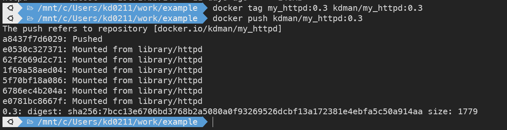
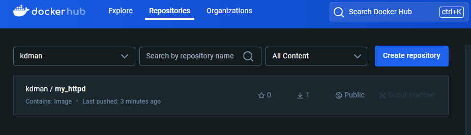

# 웹 개발 파이프 라인 구축 - 1

### 배우는 내용

- CI/CD (지속적 통합과 지속적 배포)
- 컨테이너
    - 가상화
    - Docker
- 도커에 대해 아주 다양히…

## 배포/인도 자동화의 중요성

### 전통적 인도 프로세스의 한계점

- 느린 인도 기간
- 느린 피드백 주기
- 자동화 미비
- 핫픽스 위험성
- 개발문화 건전성 제한

위의 문제점을 `지속적 인도 / 배포 방식` 으로 충분히 개선할 수 있다.

- 프로세스의 각 단계를 자동화 한다.
    - 빠른 제품 인도
    - 짧은 피드백 주기
    - 위험도가 낮은 릴리스 : 반복과 롤백
    - 유연한 릴리스 정책 결정 가능
    

### 지속적 통합 (CI : Continuouse Integration)

- 코드가 올바르게 빌드 및 통합되는지를 `자동으로` 확인
    - Repository 에서 코드를 체크아웃
    - 빌드 (컴파일 및 링크등) 을 수행하고 단위 테스트를 행함 (UnitTest)
    - 코드 품질 검증
        - 정적 분석을 통한 규칙검사
        - 코딩 규약등의 준수 여부 검사

### 자동 인수 테스트

[인수 테스트 (UAT L User Acceptance Test)]

- 제품이 릴리스할 준비가 되었는지를 “사용자 요구사항에 견주어 확인”
- 전통적으로 QA 팀의 역할
- 통합테스트, 인수테스트, 비기능적 분석 등을 포함

[CD 파이프라인에 통합]

- 품질점검을 나중에 하는 것이 아니라 개발중에 제품에 내재시키는것
- 개발자가 구현을 마치는 즉시 고객이 원하는 제품인지를 검증
- 소프트웨어의 인도 결정을 자동화 한다

[구성 관리]

- 소프트웨어와 환경변화를 추적하고 제어
- 전통적으로 운영팀의 역할
- 필수 도구 준비와 설치
- 응용의 배포와 관련한 다양한 서비스 인스턴스와 배포 버전 관리

[CD 파이프 라인에 통합]

- 프로덕션 환경의 응용을 자동으로 구성하고 배포
- 구성 관리 도구를 이용하여 구성 관리 파일을 버전 관리 시스템에 저장하고 변경이력을 추적

### CD를 위한 기술적 전제 조건

- `자동` 빌드, 테스트, 패키징, 배포
    - 전체 프로세스 중 자동화 되지 않는 부분이 있다면 지속적 인도가 불가능’

- 신속한 파이프라인 실행
    - Repository 에 commit 이 발생할 때마다 실행되어야 하므로 소요시간이 길면 안됨

- 신속한 장애 복구
    - 신속한 롤백이 가능해야 하며, 그렇지 못할 경우 잦은 릴리스에 따른 위험도가 높아짐

- 무중단 배포
    - 잦은 배포가 이루어지므로 배포중 서비스 다운타임이 발생하면 안 됨

- 트렁크 기반 개발
    - 로컬 브랜치에만 코드 체크인 (커밋) 하면 코드 통합 검증이 이루어지지 않고 릴리스 회수가 줄어듬

## 웹 개발 파이프 라인 구성 도구

도구는 사용법을 익히는데 집중하는게 아니고, 해당 도구가 프로세스에서 어떤 역할을 하는지를 

중점적으로 이해하고 배워야한다!

- 컨테이너 가상화 및 클러스터 운영
    - Docker + Kubernetes

- 소프트웨어 개발 파이프라인 자동화 서버 (CI 서버)
    - Jenkins

- 구성 관리 자동화
    - Ansible

- 소프트웨어 버전 관리
    - GitHub
    
- 그 외
    - 빌드도구 (자동화 지원)
    - 단위 테스트 프레임 워크
    - 정적 코드 분석기
    - 인수 테스트 프레임워크
    

## 컨테이너 화

응용 프로그램, 설정 (Configuration) 파일, 라이브러리, 그리고 이들 사이의 의존성 관계를 한군데

(컨테이너) 에 관리

- 소프트웨어 개발 및 배포의 효율과 안정성을 향상시킴
- 하이퍼바이저에 의한 가상 기계 의 대체 및 보완 방식으로 각광 받고 있음
- 시스템 의존성이 최소화 되어 소프트웨어 시스템의 이식이 용이해짐
- 예측가능하고 유연한 소프트웨어 실행 환경을 제공하여 클라우드 컴퓨팅 인프라에서 활용도가 높음

## **`컨테이너 가상화와 도커`**

### 가상화

물리적인 컴퓨팅 자원의 특징을 다른 시스템, 

응용프로그램 최종 사용자들이 자원과 

상호작용하는 방식으로부터 감추는 기술

### 가상화 컴퓨팅의 이점

- 시스템 측면
    - 시스템 이용률
    - 설정의 구성과 복원 용이
- 비즈니스 측면
    - 자본 및 운영 비용절감
    - 다운타임 최소화 또는 제거
    - 비즈니스 연속성 및 재해 복구 향상
    - 데이터 센터 관리 간소화
- 관심
    - 개발한 SW를 배포,테스트, 구성관리 등에 통일된 환경을 제공할 수 있음
    - SW 통합/인도 프로세스의 자동화에 적용하기가 좋음

### 컨테이너 기반 서버 가상화

호스트 OS의 컨테이너 기술을 이용

### 도커 이미지와 도커 컨테이너

- 도커 이미지
    - 응용을 실행하는데 필요한 모든 파일들과 그것을 실행하는 방법을 한데 묶어 놓은것
    - 상태를 저장하지 않는 방식(stateless) : 네트워크로 전송, 레지스트리에 저장, 이름 및 버전 지정 가능
    - 계층화 되어 있다는 특징을 갖고 있으며, 어떤 이미지로 부터 다른 이미지를 만드는 것이 가능
    
- 도커 컨테이너
    - 이미지의 실행 인스턴스
    - 하나의 이미지로 부터 여러 컨테이너를 만들어 동일한 응용을 여러개 실행할 수 있음 (각각은 독립)
    - 상태를 저장하는 방식 (stateful) : 컨테이너를 사용하면서 상태를 변경할 수 있음
        - 컨테이너가 소멸하면 이 상태도 잊어버림

### 도커 명령어

- 이미지 실행
    
    ```bash
    docker run "이미지 이름"
    ```
    
- 컨테이너 실행 중지
    
    ```bash
    docker stop "컨테이너 이름 또는 ID"
    
    ```
    
    - 컨테이너가 사라지지는 않는다.

- 이미지 검색
    
    ```bash
    	docker search "이미지 이름"
    ```
    

- 내가 가지고 있는 이미지 확인
    
    ```bash
    docker images
    ```
    
    레지스트리에서 한번이라도 호출했던 이미지에 대해서는 소유하고 있다.
    

- 중단되어있는 컨테이너까지 조회
    
    ```bash
    docker ps
    ```
    
    ```bash
    CONTAINER ID   IMAGE     COMMAND              CREATED         STATUS         PORTS     NAMES
    a7d9f4f67c33   httpd     "httpd-foreground"   3 seconds ago   Up 2 seconds   80/tcp    unruffled_benz
    ```
    

- 이전에 만들었던 컨테이너 까지 조회
    
    ```bash
    docker ps -a
    ```
    
- 컨테이너 제거
    
    ```bash
    dociker rm "컨테이너 이름 또는 ID"
    ```
    

- 이미지 제거
    
    ```bash
    docker rmi "이미지 이름 또는 ID"
    ```
    
    ```bash
    Untagged: httpd:latest
    Untagged: httpd@sha256:932ac36fabe1d2103ed3edbe66224ed2afe0041b317bcdb6f5d9be63594f0030
    Deleted: sha256:19c71fbb71404e06730aa9bc4ec079eefc63d84d46fa0fa1c768263669adb0d3
    Deleted: sha256:16a1f866ba4cca2e3df060b4b8e625fbdf56768ede03a2de49f9b4fc023e0999
    Deleted: sha256:a342f3a036e853c3b936eb76a39c361b43563fa4e6f909a49563927367f1a5e8
    Deleted: sha256:0e450e535afabf5c4426b0266d77e1bae8b91cc8aa9289c56e95261580764f8c
    Deleted: sha256:d3db6c23e41b0fe7731709a483322bc0d3f812ab2f62d3e9b1d477e223f5835f
    Deleted: sha256:e7395ba2b211ddb5435f878cc50ab6dc237f0e7e0be8a58480b13c2d738a2543
    Deleted: sha256:e0781bc8667fb5ebf954df4ae52997f6f5568ec9f07e21e5db7c9d324ed41e1f
    ```
    
    *삭제 결과*
    

## 도커 이미지 만들어보기!

- 실행및 중단된 컨테이너가 존재하지 않고 이미지도 존재하지 않는 상태에서 진행

- 아파치 httpd 이미지를 사용해 shell 을 사용하는 컨테이너 생성
    
    ```bash
    docker run -it httpd /bin/bash
    ```
    

- docker commit
    
    도커 컨테이너에서 발생한 변경사항을 새로운 이미지로 저장하여 도커 이미지 레지스트리에 업로드하여 공유하거나 다른 도커 호스트에서 실행할 수 있게 하는 것
    
    ```bash
    docker commit [OPTIONS] CONTAINER [REPOSITORY[:TAG]]
    ```
    

### 이미지 생성 자동화

- DockerFIle : 계층 구조를 이용하여 도커  이미지를 만드는 절차를 기술하는 파일
    
    
- 이미지 빌드 명령어 : docker build [OPTIONS] PATH|URL|-
    
    ```bash
    FROM httpd:latest
    RUN echo "<html><body><h1>Docker Build Example</h1></body></html>" > /usr/local/apache2/htdocs/index.html
    ENTRYPOINT /usr/local/bin/httpd-forground%
    ```
    
    cat 명령어를 통해 Docker 파일을 생성
    

해당 경로에서 (Dockerfile이 존재하는 경로) docker build를 하면 해당 텍스트 대로 빌드된다.

- 빌드를 통한 자동 이미지 생성
    
    ```bash
    docker build -t my_httpd:0.3
    ```
    
    위의  명령어를 Dockerfile을 생성한 경로에서 진행하면 Docker파일의 생성 텍스트를 따라 자동으로 빌드 된다.
    

- tag 를 추가후, 도커 허브에 push 하기
    - 도커 허브에 로그인 되어있는 상태여야 한다.
    
    ```bash
    // 1. tag 를 붙여준다.
    docker tag my_httpd:0.3 kdman/my_httpd:0.3
    
    // 2. 도커 허브에 push 한다.
    docker push kdman/my_httpd:0.3
    ```
    





### 도커 이미지 생성 결과


### 도커 호스트와 로컬 PC 호스트 포트 연결

도커 서비스를 외부로 노출 시킨다.

```bash
docker run -d --rm -p 8888:8080 tomcat 
```

- -d : 백그라운드 실행 플래그
- —rm : 실행 종료시 해당 컨테이너 자동삭제 플래그
- -p : 외부포트와 연결플래그
- 8888:8080 : 왼쪽이 외부 포트, 오른쪽이 현재 Docker의 포트

수행결과 (docker ps 로 확인)

```bash
CONTAINER ID   IMAGE     COMMAND             CREATED         STATUS         PORTS                                       NAMES
e4a77182f29d   tomcat    "catalina.sh run"   4 seconds ago   Up 3 seconds   0.0.0.0:8888->8080/tcp, :::8888->8080/tcp   gracious_ganguly
```

### 도커 컨테이너에 이름을 명명하여 실행

```bash
docker run --name<컨테이너이름><이미지>

docker run --name my_tomcat tomcat
```

### 도커 클린업

- 이미지 삭제 (뒤에 Id 또는 이름을 연결해서 삭제 가능)
    
    ```bash
    docker rmi <이미지>
    ```
    

- docker 컨테이너 삭제
    
    ```bash
    docker rm <컨테이너이름>
    ```
    

- docker 이미지 전체 삭제
    
    ```bash
    docker image prune -a
    ```
    

- docker 컨테이너 전체 삭제
    
    ```bash
    docker container prune
    ```
    

## 컨테이너 안의 파일들과 도커 볼륨

- 실행하고 있는 컨테이너와 호스트 사이의 파일 복사
    - docker cp 를 이용
    
- 이미지를 빌드할 때 호스트로부터 파일을 컨테이너에 추가
    - Dockerfile 안에 ADD 지시자 활용

- 바인드 마운트
    - docker -v 옵션으로 호스트의 특정 디렉토리를 컨테이너와 공유

- 도커 볼륨
    - docker -v 옵션으로 호슽와 공유하는 것은 비슷하지만 컨테이너가 마운트 하는 것은 추상화된 볼륨
    

### 기본 설정

- nginx:latest 이미지로 컨테이너 실행
    - 80 포트 를 호스트의 8080 포트에 연결
- 호스트의 브라우저에서 해당 웹 접속 성공 확인
    
    
    ```bash
     docker run --rm -d -p 8080:80 --name my_nginx nginx:latest 
    ```
    
    위의 컨테이너에 접속
    
    - 실행중인 컨테이너에 대한 접속은 exec 명렬어를 사용
    
    ```bash
    docker exec -it my_nginx /bin/bash
    ```