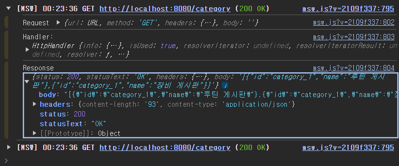

# 모운게 project : Mock 서버 세팅

- 프로젝트에서 Mock 서버를 사용하기 위해 postman 이 아닌 `msw`  를 사용하여 Mock 서버를 구축하기로 했다.

(프로젝트는 React+Vite+TS+ SWC) 환경이다.

### 설치

- [msw 공식 사이트](https://mswjs.io/docs/getting-started)

- 설치 스크립트
    
    ```bash
    npm i msw --save-dev
    ```
    

- init 스크립트
    
    ```bash
    npx msw init <PUBLIC_DIR>/ --save
    ```
    
    위의 스크립트를 처음에 계속 쳤는데
    
    `could not determine executable to run` 라는 에러메세지만 계속 나왔었다.
    
    이전에 강의에서 본 msw 설치 부분을 다시 쭉 살펴봐도 틀린 게 없없는데
    
    실제 스크립트에서는 init 과 msw 위치를 바꾸어 적어서 안됐다…
    
    msw가 init 앞에 위치하는 것이 맞다!
    
    위의 스크립트까지 실행하면, public 폴더에도 `mockServiceWorker.js` 라는 파일도 생겨났을 것이다.
    

### worker 설정

우선 나는 프로젝트의 src/mock/browser.ts 파일에 

mock의 worker 부분을 실행 시킬 코드를 작성하였다.

```tsx
import { setupWorker } from "msw/browser";
import { getCategory } from "./category.mock";

const handler = [getCategory];

export const worker = setupWorker(...handler);

```

- setupWorker를 통해 핸들러로 받은함수들을 api 함수로 사용하게 된다.

실제 mocking 하기 위한 api 함수는 아래와 같이 예시로 작성하였다.

```tsx
import { http, HttpResponse } from "msw";

const CATEGORY = [
  {
    id: "category_1",
    name: "루틴 게시판",
  },
  {
    id: "category_1",
    name: "장비 게시판",
  },
];

export const getCategory = http.get(
  `${import.meta.env.VITE_API_BASE_URL}/category`,
  () => {
    return HttpResponse.json(CATEGORY, { status: 200 });
  }
);

```

간단하게 하드코딩으로 category 부분에 대한 response.json 데이터를 만들었고,

이 변수가 url/category 로 get 요청에 대한 응답 값이 된다.

이제는 msw의 worker 가 일을 할 수 있게 구성해줘야 한다.

- main.tsx
    
    ```tsx
    import React from "react";
    import ReactDOM from "react-dom/client";
    import App from "./App.tsx";
    import "./index.css";
    
    async function mountApp() {
      if (import.meta.env.MODE === "development") {
        const { worker } = await import("./mock/browser.ts");
        await worker.start();
      }
    
      ReactDOM.createRoot(document.getElementById("root")!).render(
        <React.StrictMode>
          <App />
        </React.StrictMode>
      );
    }
    
    mountApp();
    
    ```
    
    이전에 CRA로 리액트를 만들었을 때는, require 구문이 작동하여서 worker를 require문으로 불러왔었는데
    
    vite는 require 구문을 아예 사용할 수 없다.
    
    그래서 위와 같이 async 함수를 통해, 현재 production 환경이 개발 환경이라면, await를 통해 worker를 import 하여
    
    start 실행 까지 진행하도록 작성하였다.
    
- Chrome 개발자 도구 console
    
    
    
    (*React.strictMode 로 인해 두 번 실행 된 모습!*)