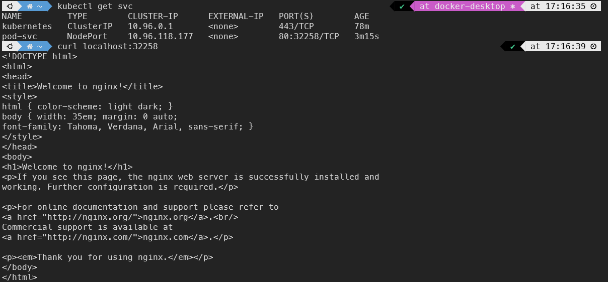

# 웹 개발 파이프 라인 구축 - 2 (k8s)

## 쿠버네티스란

- Kubernetes (A.K.A k8s)
- 컨테이너 오케스트레이션 솔루션
    - 다수의 컨테이너 관리
    - 자동배포, 배포된 컨테이너의 동작 보증, 부하에 따른 동적 확장 등의 기능 담당

- 도커와 잘 어울리는 실행 환경 구성 도구
    - 도커 컨테이너들을 `클러스터` 내에 실행하고 관리하는데 적합
    - 지속적 통합과 인도 (CI / CD) 에 유효하게 적용할 수 있음
    - 컨테이너는 `포드(pod)` 라고 불리는 k8s 오브젝트와 연관하여 실행
        - 포드 위에서 실행한다고 표현

### k8s 클러스터의 구성요소

- 하나이상의 노드 (컴퓨터) 로 구성됨

- `마스터 노드` (컨트롤플레인)
    - kubectl
    - API 서버, 설정을 저장한 etcd : 클러스터 중심 역할을 하는 구성 요소들
    - 컨트롤러 매니저, 스케줄러
    
- 워커 노드
    - 컨테이너 런타임 (CRI : Container Runtime Interface) - 포드를 이루는 컨테이너의 실행을 담당
    - kublet - 포드의 구성 내용을 받아 CRI 에 전달하고 컨테이너 들의 동작 상태를 모니터링

### k8s 가 제공하는 기능

- 컨테이너 밸런싱
    - 포드의 부하 균등화를 수행
    - 몇개의 응용을 복제할 것인지를 알려주면 나머지는 k8s가 처리

- 트래픽 로드 밸런싱
    - 응용의 복제본이 둘 이상 있다면  k8s 가 트래픽 부하 균등화를 수행하여 클러스터 내부에 적절히 분배

- 동적  수평 스케일링
    - 인스턴스 수를 동적으로 확장하거나 감축하여 동적 요구사항에 대응 하면서 시스템 자원을 효율적으로 활용

- 오류복구
    - 포드와 노드를 지속적으로 모니터링 하고 장애가 발생하면 새  포드를 실행하여 지정된 복제본의 수를 유지

- 롤링 업데이트
    - 지연 시간을 적용하고 순차적으로 업데이트 배포함으로써 문제가 발생하더라도 서비스를 정상 유지할 수 있음

- 스토리지 오케스트레이션
    - 원하는 응용에 다양한 스토리지 시스템 (AWS EBS, Google GCE  Persistent Disk 등) 을 마운트 할 수 있음

- 서비스 디스커버리
    - 태생적으로 수명이 짧은 포드의 동적 성질을 관리하기 위하여 DNS 기반으로 서비스를 동적 바인딩 할 수 있는 기능을 제공
    

### k8s 포드 (pod) 의 생명주기

- kubectl 을 통해서 API 서버에 포드의 생성을 요청
    - 업데이트가 있을 때마다 API 서버는 etcd 에 기록하고 클러스터의 상태를 최신으로 유지

- 컨트롤러 매니저는 포드를 생성하고 이 상태를 API 서버에 전달
    - 아직 어떤 워커 노드에 포드를 적용할 지는 결정하지 않은 상태

- 스케줄러는 포드가 생성되었다는 정보를  인지하고 이 포드를 어떤 워커노드에 적용할지를 결정해서 해당 노드에 포드의 실행을 요청

- 해당 노드의 kubelet 이 CRI 에 요청하여 포드가 만들어지고 사용 가능한 상태가 됨

`k8s` 는 절차적인 구조가 아닌 선언적인 구조를 가지고 있음

⇒ 각 요소가 추구하는 상태를 선언하면 현재 상태와 비교하고 지속적으로 맞추어 가려고 노력하는 구조

### k8s 의 오브젝트

- 기본 오브젝트
    - Pod : 한 개 이상의 컨테이너로 단일 목적의 일을 하기 위해서 모인 단위
        - 독립적인 공간과 사용 가능한 IP를 가지고 있음 , 언제든지 죽을 수 있다.
    
    - Namespace : k8s 클러스터에서 사용되는 리소스들을 구분해 관리하는 그룹
    - Volumne : 포드가 생성될 때 포드에서 사용할 수 있는 디렉토리를 제공
    - Service : 유동적인 포드들에 대한 접속을 안정적으로 유지하도록 클러스터 내 / 외부에 연결하는 역할

- 디플로이먼트 (deployment)
    - 기본 오브젝트들을 보다 효율적으로 작동할 수 있도록 조합하고 추가로 구현한것
    - 레플리카셋 오브젝트를 합쳐 놓은 형태

### k8s 인프라 구축 방법들

- 로컬 환경
    - kubeadm, docker desktop 등을 설치 및 운용으로 로컬 환여에 클러스터 구성 가능
    - 개발 단계에서의 테스트 등에 이용
- Public Clouds
    - AWS EKS (Elastic Kubernetes Services)
    - GCP GKE (Google Kubernetes Engine)
    - MS AKS (Azure Kubernetes Service)
    
- On-prem 설치
    - SUSE 의 Rancher
    - Redhat 의 OpenShift
    

## 쿠버 네티스 실습

### Node 와 Pod 정보 조회

```bash
kubectl get nodes
kubectl get pods
```

- -o wide
- —all-namespaces
- 위의 추가 명령어를 통하여 확장된 결과를 얻을 수 있다.

### Pod 생성

```bash
kubectl run <pod 이름> --image=<이미지이름>
```


### Deployment

- 응용의 배포를 위하여 많이 이용되는 k8s 오브젝트 형태
- 동일한 모습의 포드들의 복제본 모음인 레플리카셋을 이용하는 것이 일반적
- 단순한 레플리카셋에 비하여 동적 업데이트 및 롤백, 배포버전의 고나리등이 유연하여 응용의 배포에 널리 이용됨
- 보통은 상태가 없는 (stateless) 응용의 배포에 이용
    - 포드는 언제든 사멸할 수 있다는 것을 인지해야함

- `동작 방식`
    - 디플로이먼트의 상태를 선언하면 k8s가 동적으로 의도된 상태 (desired state) 가 되도록 레플리카 셋을 관리

### Deployment 생성

```bash
kubectl create deployment <dp 이름> --image=<이미지이름>
```


- Deployment 상세 조회
    
    ```bash
    
    # 오브젝트 상세 조회
    kubectl describe <오브젝트 타입> <오브젝트 이름>
    
    # deployment 상세조회
    kubectl describe deployment <deployment 이름>
    ```
    
    
    

### deployment 레플리카 셋 복제

- deployment 의 레플리카를 복제 한다.
    
    ```bash
    kubectl scale <오브젝트 타입> <생성한 이름> --replicas=<복제할 수량>
    kubectl scale deployment dpy-nginx --replicas=3
    ```
    
    
    
    실습을 통해 scale 명령어로 deployment 인 dpy-nginx 의 replica 를 3 개가 되도록 복제하였는데
    
    해당 복제를 통해 생성된 pod 를 확인해 보면,
    
    각각의 pod 가 다른 IP 주소를 가진 점을 알 수 있다.
    
    이는 하나의 `클러스터` 내에서 각기 다른 IP를 가진다는 것을 뜻한다.
    

### 클러스터 외부로 응용을 노출해보기

- k8s 서비스
    - 클러스터 내부의 포드에 의하여 실행되는 응용을 외부에 접근 가능하도록 노출하는 기능을 하는 오브젝트
- 노출하는 대상
    - 특정 pod (또는 pod들의 집합) 에서 실행하는 컨테이너의 특정 포트
- 서비스의 서로 다른 형태들
    - ClusterIP
    - NodePort
    - LoadBalancer
    - ExternalName
    

### NodePort 를 통한 응용 외부 노출하기

- NodePort 로 타입을 지정하여 외부에서 연결 가능한 port를 지정하면서 노출시키기
    
    
    ```bash
    kubectl expose <오브젝트타입> <생성한 오브젝트 이름> --type=<서비스타입> --name=<서비스로 지정할 이름> --port=<TCP 포트로 오픈할 포트 번호(클러스터 기준)>
    
    kubectl expose pod nginx-pod --type=NodePort --name=pod-svc --port=80
    ```
    
    
    
    curl 명령어를 통해 노출한 pod 서비스에 접속해 볼건데,
    
    위 그림에서 아래 pod-svc의 PORT 를 보면 [80:32258] 로 포트가 연결 되어있는것을 알 수있다.
    
    해당 포트는 80번은 k8s의 클러스터가 열어놓은 포트, 32258은 우리가 접속가능한 포트번호이다.
    
    curl 로 접속을 확인해보자
    
    ```bash
    curl localhost:32258
    ```
    
    
    

이번에는 위에서 생성했던 Deployment 인 dpy-nginx 를 외부로 노출 시켜 보자

```bash
kubectl expose deployment dpy-nginx --type=NodePort --name=dpy-svc --port=80
```


### 오브젝트 삭제

```bash
kubectl delete <오브젝트타입> <삭제할 이름>
```


- service중 ‘pod-svc’ 를 삭제하기 위해 delete 명령어로 삭제하였다.

일반 포드 (deployment에 속하지 않은)들은 위의 명령어로 쉽게 삭제 가능하지만

이전에 만들었던 dpy-nginx에 속한 pod들은 다른 방법으로 삭제해야한다.

### deployment에 속한 pod 삭제하기

- 현재 상태
    
    
    
    일반적인 방법 (단순 delete)으로 deployment에 속한 pod를 삭제해보면
    
    deployment가 생성한 pod의 개수를 유지하기위해 k8s가 해당 pod의 수를 유지한다.
    
    (노력한다)
    
- 그럼 deployment를 삭제하면?
    
    
    
    dpy-nginx-[id] 가 속했던 deployment 인 dpy-nginx 자체를 삭제하니
    
    해당 deployment 에 속해있던 pod 들도 모두 삭제 되었다!
    

### 메니페스트를 이용한 k8s 관리

- 메니페스트란?
    
    `k8s 오브젝트` 에 대한 명세를 파일로 기록한것
    
    - YAML 형태를 이용
    
    - 파일에 각 오브젝트에 의도하는 상태 (desired state) 를 기술
        - 오브젝트 스펙 (object spec)
    
    - 이 방법을 통해 할 수 있는 것
        - 오브젝트 생성
        - 파일내용 변경을 통한 오브젝트 상태 변경
        - 자동화가 필요한 환경에서 CLI 환경에 명령하는것 보다 생산성이 증가

- YAML 예시
    - kubectl create deployment 예시
        
        ```yaml
        apiVersion : apps/v1
        kind : Deployment
        
        metadata :
        	name : nginx-deployment
        	labels :
        		app : nginx
        		
        spec :
        	replicas : 3
        	selector :
        		matchLabels : 
        			app : nginx
        	template :
        		metadata :
        			labels :
        				app : 3
        				
        		spec :
        			containers :
        			- name : nginx
        				image : nginx
        				ports :
        				- containerPort : 80
        ```
        
        간단하게 요약
        
        - 3개로 구성된 레플리카 셋을 생성하고
        - nginx-deployment 라는 이름의 deployment 로 만들 것을 지시
        
    - kubectl expose deployment 예시
        
        ```yaml
        apiVersion : v1
        kind : Service
        
        metadata :
        	name : nginx-service
        	
        spec :
        	type : NodePort
        	selector :
        		app : nginx
        	ports :
        		- name : http
        			protocol : TCP
        			port : 80
        			targetPort : 80
        			nodePort : 30000
        ```
        
        간단하게 요약
        
        - 해당 셀렉터에 의하여 발견되는 오브젝트의 80/TCP 포트를 노드의 30000번 포트로 노출하는 서비스로 만들어라!

## 웹 서버 만들기 실습

- k8s
- Docker
- flask
- nginx

준비된 파일은 아래와 같다 (강의 자료이므로 코드 공개는 하지 않겠다)

- deployment.yaml
- service.yaml
- app.py
- Dockerfile
- site.conf
- requirements.txt
- start.sh

위의 파일이 있는 경로로 CLI 를 이동한 상태에서 진행

- 우선적으로 Docker 허브에 이미지를 배포해 놓아야 한다.

```bash
docker build -t <사용자>/hostname:latest .
docker tag hostname:lastest <사용자>/hostname:latest
docker push <사용자>/hostname:latest

# 위의 명령으로 Docker Hub에 실습 이미지를 배포해 놓았다.
```

- k8s 실습 부분

1. pod 생성
    
    ```yaml
    kubectl apply -f deployment.yaml
    ```
    
    
    
2. service 생성
    
    ```yaml
    kubectl apply -f service.yaml
    ```
    
    
    
3. 생성된 결과 확인
    
    ```bash
    curl localhost:30000
    ```
    
    
    

### 같은 경로에 접근했는데 왜 IP가 다른 응답이 발생할까?

k8s는 같은 기능을 하는 pods 들의 `레플리카` 들을 사용하여, `부하 균등화` 를 한다.

즉, 부하에 대해 한 곳에 쏠리지 않도록 부하를 분산하여 같은 기능을하는 pod 들에게

일을 분배한다.

### Pod가 사멸했을 때

실제 요청중, pod를 삭제 했을 때, 요청에 무리없이 정상작동 하는 것을 확인할 수 있는데

k8s는 pod가 사멸하더라도, 바로 새로운 pod를 생성함으로써 Deployment 에 선언된 의도된 상태를 유지하려고 한다.

### pod의 동작 보증

Deployment에 의하여 배포된 포드의 컨테이너 실행에 문제가 생긴다

⇒ k8s는 이 포드에서 실행하던 컨테이너를 삭제하고 다시 컨테이너를 생성해 응용을 지속 실행

## 포드의 업데이트와 복구

- rollout 기능에 대해 중점적으로 알아본다.
- nginx : 1.16.0

```bash
kubectl rollout status <오브젝트타입> <생성한 이름> # 디플로이먼트의 배포 상태를 조회
kubectl rollout history <오브젝트타입> <생성한 이름> # 디플로이먼트의 배포 이력을 조회
```

## k8s 의 서비스

- 클러스터 내부에서 동작하는 기능을 외부로 `노출` 하는 것을 Service 라고 한다.
- 서비스 종류
    - ClusterIP
    - NodePort
    - LoadBalancer
    - Ingress

### ClusterIP

- 클러스터 내부에서만 접근할 수 있는 IP 를 할당
- 포트 포워딩 또는 프록시 를 통해 클러스터 외부로부터 접근가능
- 테스트, 디버깅 등의 목적에 제한적으로 이용

### NodePort

- 동작 방식
    
    모든 워커 노드의 특정 포트를 열고, 해당 포트로 오는 모든 요청을 노드포트 서비스에 전달
    
    ⇒ 노드포트 서비스는 해당 요청을 처리할 수 있는 포드로 요청을 전달
    

### LoadBalancer

- 클러스터 외부의 로드 밸런서를 이용하여 `균등 부하` 수행
- NodePort 와 달리 특정 노드가 접근 불가한 경우에도 서비스 제공 가능
- 클러스터 외부에 존재하는 로드 밸런서가 노드들의 상태를 체크하고 부하 균등화 하여 노드들에 트래픽 전달

### Ingress

- 엄밀히 k8s 의 서비스의 종류는 아님
- 복수의 서비스에 대해 목적에 따라 트래픽을 연결하는 도구

## 동적 수평 오토 스케일링 (HPA)

- Horizontal Pod Autoscaler
- 부하량에 따른 Deployment 의 Pod 수를 유동적으로 관리하는 k8s 의 기능
    - 보통 고려되는 부하량 은 CPU 및 메모리 사용량이다.

- 매트릭스 서버로부터 부하 계측값을 전달받아 동일한 기능을 제공하는 Pod의 수를 동적으로 조절
- 스케일링 기준이 되는 값과 최소/최대 Pod의 수를 지정