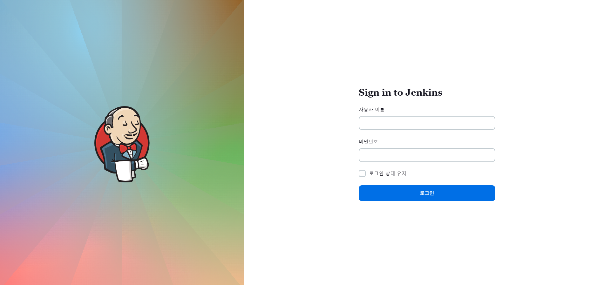
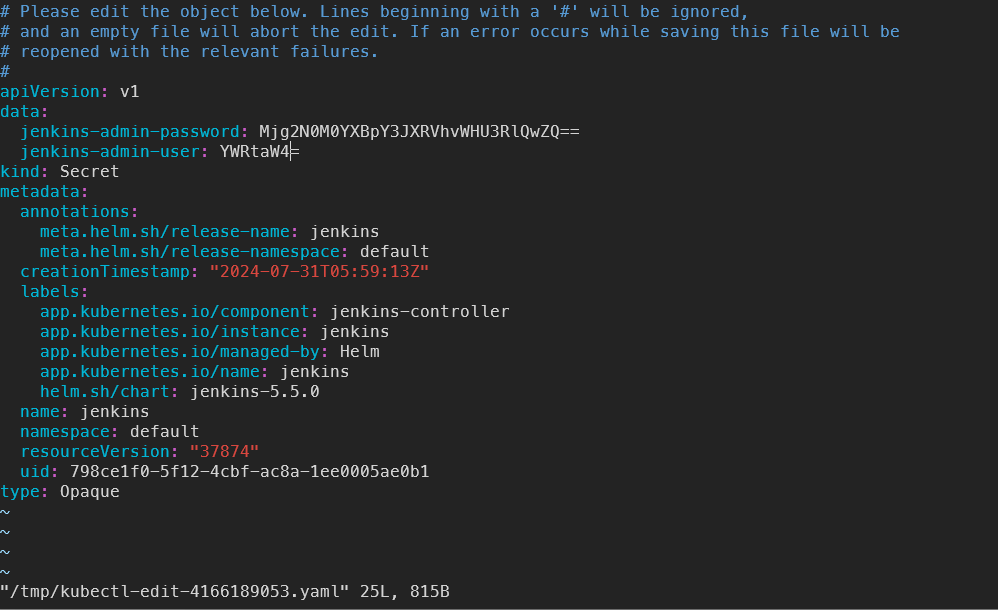
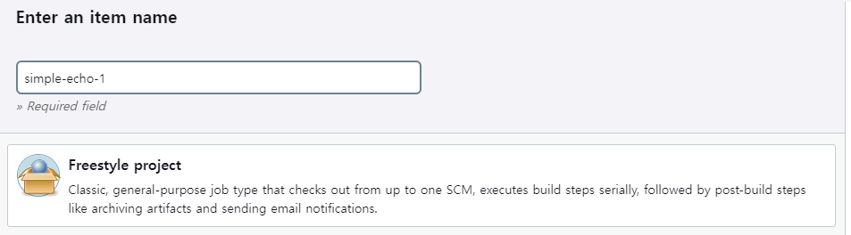
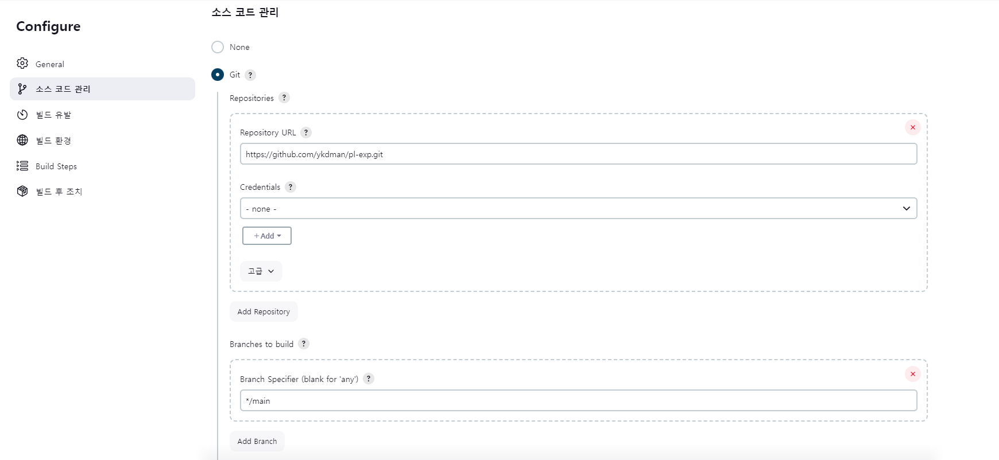
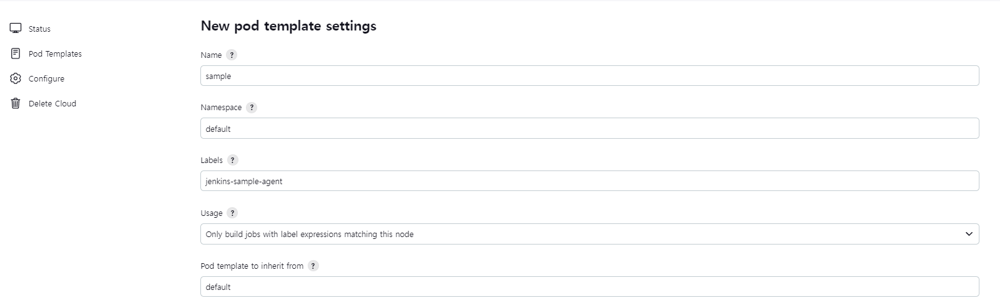

# 웹 개발 파이프 라인 구축 - 3 (Jenkins)

- [Jenkins](https://www.jenkins.io/)

### CI/CD 시나리오

- `CI` (Continuos Interfration : 지속적 통합) 단계
    - 일반적으로 개발자가 소스 코드를 커밋하고 푸시 하는 것으로 시작
    - 응용소프트웨어를 자동으로 빌드 통합
    - (자동) 테스트를 통하여 배포할 수 있는 상태임을 확인

- `CD` (Continuos Delivery / Deployment : 지속적 인도) 단계
    - CI 단계에서 소프트웨어가 배포 가능한 상태임을 확인하는 것으로 시작
    - 응용 소프트웨어를 컨테이너 이미지로 만들어냄
    - Pod, Deployment, Service 등 다양한 오브젝트 조건에 맞추어 (미리 설정한 파일을 통해) 배포

### 지속적 통합 파이프라인 (CI Pipeline)

- 레포지토리에 코드 커밋이 발생할 때마다 빌드, 단위 테스트 (Unit Test) 정적 분석 등을 행한다.

### 젠킨스의 특징

- 다양한 프로그래밍 언어 지원
- 플러그인을 통한 확장 가능
- 이식성
- 대부분의 소스 관리 시스템 지원
- 분산처리 지원
    - 마스터 / 슬레이브 구조를 채택하여 여러 노드에서 작업 수행
- 코드로 파이프라인 구성
    - 프로세스 자동화에 적합하다

## 젠킨스 아키텍처

### 마스터 - 슬레이브 구조

- `마스터`
    - 빌드 시작 트리거 포착 (ex : 코드 커밋)
    - 알림 (ex : 빌드 실패 알림)
    - 클라이언트와 통신하여 HTTP 요청 처리
    - 에이전트(슬레이브) 에서 실행중인 작업의 우선순위 조정 등 빌드 환경 관리
    
- `슬레이브` (에이전트)
    - 마스터에 의한 개시 후 모든 작업을 처리

### 테스트 인스턴스와 프로덕션 인스턴스

- 젠킨스 인스턴스 는 `항상` 테스트용과 프로덕션용으로 분리 운용해야함
- 시스템 설정 변경이 일어날 때 마다 프로덕션에 적용하기 이전에 철저한 검증 필요
    - 젠킨스 소프트웨어 업데이트
    - 신규 플러그인 적용
    - CI/CD 파이프라인 변경 및 유지 보수

## 젠킨스 사용해보기

### 1. Helm 설치

- 공식문서 : [Helm.sh](https://helm.sh/ko/docs/intro/install/#apt%EB%A1%9C-%EB%8D%B0%EB%B9%84%EC%95%88%EC%9A%B0%EB%B6%84%ED%88%AC)
- Linux (WSL) 환경에서 설치한다.
- k8s 용 패키지 매니저 (npm 같은) `Helm` 을 사용
    
    
    1. gpg 키를 받아 /usr/share/keyrings/helm.gpg 로 저장
        
        ```bash
        curl https://baltocdn.com/helm/signing.asc | gpg --dearmor | sudo tee /usr/share/keyrings/helm.gpg > /dev/null
        ```
        
        sudo 를 썼기 때문에 ubuntu user password를 입력해주어야 한다.
        
        - 결과
            
            ```bash
              % Total    % Received % Xferd  Average Speed   Time    Time     Time  Current
                                             Dload  Upload   Total   Spent    Left  Speed
            100  1699  100  1699    0     0   3408      0 --:--:-- --:--:-- --:--:--  3404
            ```
            
    2. apt 로 apt-transport-https 패키지 설치
        
        ```bash
         sudo apt install -y apt-transport-https 
        ```
        
        - 결과
            
            ```bash
            Reading package lists... Done
            Building dependency tree... Done
            Reading state information... Done
            The following packages will be upgraded:
              apt-transport-https
            1 upgraded, 0 newly installed, 0 to remove and 48 not upgraded.
            Need to get 1510 B of archives.
            After this operation, 0 B of additional disk space will be used.
            Get:1 http://archive.ubuntu.com/ubuntu jammy-updates/universe amd64 apt-transport-https all 2.4.12 [1510 B]
            Fetched 1510 B in 1s (2348 B/s)
            (Reading database ... 32270 files and directories currently installed.)
            Preparing to unpack .../apt-transport-https_2.4.12_all.deb ...
            Unpacking apt-transport-https (2.4.12) over (2.4.11) ...
            Setting up apt-transport-https (2.4.12) ...
            ```
            
    3. Helm 을 받아오기 위한 apt Repo 설정
        
        ```bash
         echo "deb [arch=$(dpkg --print-architecture) signed-by=/usr/share/keyrings/helm.gpg] https://baltocdn.com/helm/stable/debian/ all main" | sudo tee /etc/apt/sources.list.d/helm-stable-debian.list
        ```
        
        - 결과
            
            ```bash
            deb [arch=amd64 signed-by=/usr/share/keyrings/helm.gpg] https://baltocdn.com/helm/stable/debian/ all main
            ```
            

1. Helm 패키지 설치
    
    ```bash
    sudo apt-get update
    sudo apt install -y helm
    ```
    
    - 결과
        
        ```bash
        Reading package lists... Done
        Building dependency tree... Done
        Reading state information... Done
        The following NEW packages will be installed:
          helm
        0 upgraded, 1 newly installed, 0 to remove and 53 not upgraded.
        Need to get 16.6 MB of archives.
        After this operation, 52.5 MB of additional disk space will be used.
        Get:1 https://baltocdn.com/helm/stable/debian all/main amd64 helm amd64 3.15.3-1 [16.6 MB]
        Fetched 16.6 MB in 2s (6860 kB/s)
        Selecting previously unselected package helm.
        (Reading database ... 32270 files and directories currently installed.)
        Preparing to unpack .../helm_3.15.3-1_amd64.deb ...
        Unpacking helm (3.15.3-1) ...
        Setting up helm (3.15.3-1) ...
        Processing triggers for man-db (2.10.2-1) ...
        ```
        

1. Helm 이용 가능 확인
    
    ```bash
    which helm
    ```
    
    - 결과
        
        ```bash
        /usr/sbin/helm
        ```
        

1. Repo 설정
    
    ```bash
    helm repo add jenkinsci https://charts.jenkins.io
    helm repo update
    ```
    
    - 결과
        
        ```bash
        # repo 설정 결과
        "jenkinsci" has been added to your repositories
        
        # 업데이트 결과
        Hang tight while we grab the latest from your chart repositories...
        ...Successfully got an update from the "jenkinsci" chart repository
        Update Complete. ⎈Happy Helming!⎈
        ```
        

### 2. Helm 을 이용한 Jenkins 설치

- jenkins 설치
    
    ```bash
    helm install jenkins jenkinsci/jenkins
    ```
    
    - 결과
        
        ```bash
        NOTES:
        1. Get your 'admin' user password by running:
          kubectl exec --namespace default -it svc/jenkins -c jenkins -- /bin/cat /run/secrets/additional/chart-admin-password && echo
        2. Get the Jenkins URL to visit by running these commands in the same shell:
          echo http://127.0.0.1:8080
          kubectl --namespace default port-forward svc/jenkins 8080:8080
        
        3. Login with the password from step 1 and the username: admin
        4. Configure security realm and authorization strategy
        5. Use Jenkins Configuration as Code by specifying configScripts in your values.yaml file, see documentation: http://127.0.0.1:8080/configuration-as-code and examples: https://github.com/jenkinsci/configuration-as-code-plugin/tree/master/demos
        
        For more information on running Jenkins on Kubernetes, visit:
        https://cloud.google.com/solutions/jenkins-on-container-engine
        
        For more information about Jenkins Configuration as Code, visit:
        https://jenkins.io/projects/jcasc/
        ```
        

- jenkins 포트 포워딩
    
    k8s 클러스터 내에서 원하는 포트를 제공하고있는 jenkins 서비스에 로컬 컴퓨터의 포트를 연결한다.
    
    포트번호는 8080으로 진행
    
    ```bash
    kubectl port-forward svc/jenkins 8080:8080
    ```
    
    위 과정을 진행하면 localhost:8080 으로 로컬 PC에서 k8s에서 서비스중인 Jenkince Service 에접속 가능해진다.
    
    - 결과
        
        ```bash
        Forwarding from 127.0.0.1:8080 -> 8080
        Forwarding from [::1]:8080 -> 8080
        ```
        
        
        

### Jenkins 의 관리자 비밀번호 알아보기

관리자 계정은 admin + password 로 되어있는데

Jenkins를 설치했을 때 안내된 스크립트 중에 첫번째로

Login 비밀번호를 알수있는 코드가 적혀있다.

```bash
  kubectl exec --namespace default -it svc/jenkins -c jenkins -- /bin/cat /run/secrets/additional/chart-admin-password && echo
```

위의 코드 또는

```bash
kubectl get secret jenkins -o jsonpath="{.data.jenkins-admin-password}" | base64 --decode && ehco
```

해당 코드를 실행하면 Jekins Admin 비밀번호가 출력 된다.

```bash
2867C4apicrWEXoXu7FT0e
```

### Jenkins 관리자 비밀번호 변경

(vi 가 실행되는 환경에서 진행하였다)

우선 강의에서 말해준 내용으로는, Jenkins 웹 UI 상에서도 비밀번호를 변경할 수 있지만,

그러면 해당 Service 상태, 새로운 Pod 를 통한 New Service를 게시할 때는 또 암호화된 

관리자 비밀번호를 알아내야 한다.

그래서 kubectl 을 이용하여 Jenkins 내의 설정 (configureFile) 의 secret을 변경해 주어야 한다.

```bash
kubectl edit secrets jenkins
```



위의 스크립트를 실행하면 아래 사진과 같은 결과를 확인할 수 있다.

우리가 바꾸어야 할 부분은 data>jenkins-admin-password 부분이다.

해당 부분과 user( ID) 부분은 Base64로 인코딩되어있다.

우리도 base64 로 인코딩된 문자를 비밀번호에 넣어주어야 한다.

```bash
echo "바꿀 문자열" | base64
```

위 코드를 실행하면 원하는 문자열을 base64로 인코딩 된다.

출력값으로 얻은 문자열을 jenkins secret을 변경해주고 파일을 저장 후 닫아준다. (vi 의 경우 :wq)

변경사항이 올바르게 적용되었다면 아래와 같은 결과가 발생한다.

```bash
secret/jenkins edited
```

이제 기존 pod를 삭제해보면 service가 다시 새로운 pod로 재구동되고

이때부터는 우리가 새로 설정한 비밀번호로 관리자 로그인을 할 수 있다.

(혹시나 localhost접속이 안되면, port-forwarding 을 다시 한번 해보자!)

### Jenkins 와 k8s 클러스터

Jenkins 는 Item 단위로 프로젝트를 관리 한다.

HelloWorld 를 출력하는 파이프라인 아이템을 5개 실행한다고 했을때

현재 내가 사용하는 Jenkins 는 Local 의 k8s 클러스터에 연결되어 있으므로

그 동작을 확인할 수 있다.

“Hello, World” 를 출력하는 Item을 만들고 Build를 5번 진행하면

k8s 클러스터에 동적으로 5개의 Pod 가 생성되고 실행 되는 것을 알 수 있다.

```bash
NAME            READY   STATUS    RESTARTS      AGE
default-1sdsc   1/1     Running   0             31s
default-1zcd7   1/1     Running   0             31s
default-4ntwx   1/1     Running   0             33s
default-9mdw9   1/1     Running   0             33s
default-lbxkj   1/1     Running   0             34s
jenkins-0       2/2     Running   1 (51m ago)   60m
```

해당 Pod들은 실제 Jenkins Slave가 작업을 처리하는 pod 라고 볼수있다.

## Jenkins 와 Github 연동

- 준비
    - Public Github Repository를 생성
        - 내부에 사용할 코드나 Dockerfile 존재해야 한다 (실습파일은 저작권으로 인해 여기에 올릴수 없다 ㅠ)
    - Github Repo에 코드를 Push 해 놓은 상태 여야 한다.

### 1. Jenkins 접속 및 새 Item 생성

지금까지 Jenkins를 잘 설치 했다면 이제 localhost로는 충분히 접속이 가능한 환경일 것이다.

그러면 Jenkins 좌측의 “새로운 Item” 을 눌러 새로운 Item 생성으로 들어가자



간단하게 이름을 작성하고

프로젝트 스타일은 “Freestyle Project” 로 지정 후 OK 버튼을 눌렀다.

### 2. Item Configure 설정 -Git

위의 과정을 따라왔으면 Configure 설정 부분으로 넘어오는데

이 때, Git 과의 연동을 통해 설정할 부분이 있다.



소스 코드 관리 부분을 `Git` 으로 체크한 후에,

Repository URL 에는 내가 만든 Github Repository 주소를 넣고,

(Public Repo 가 아니라면 Credential 도 설정해주어야 한다.)

이후 Branch to build 부분에는 Jenkins가 주목할 branch 명을 적어주는 데

현재 main 브랜치가 main 이기 때문에 `*/main` 으로 바꾸어 적어 주었다.

### 3. Item Configure 설정 - Build Step

GIt 설정 완료 후,

Build Step 부분에 Build 시에 실행 되어야 할 Shell 스크립트를 작성 할 수 있다.

드랍다운 을 누르고 `Excute shell` 을 선택후 스크립트에 아래와 같이 적었다.

```bash
# Docker 허브 사용자 이름은 본인을 기준으로 작성!
docker build -t <Docker허브 사용자이름>/simple-echo .
docker push <Docker허브 사용자이름>/simple-echo
```

이후에 Save 버튼을 눌러 Item 설정을 저장하였다.

### 4. Build Now !

Item 이 생성되고 난 후 바로 Build Now 버튼을 눌러 빌드하였다.

근데 실패했다!

해당 Item 의 Console로 가서 확인해보니

GIt 관련된 부분은 성공하였고,

이후 Docker build를 하는 과정에서 에러가 발생한 것 같다.

```bash
Building remotely on default-gf6gw (jenkins-jenkins-agent) in workspace /home/jenkins/agent/workspace/simple-echo-1
The recommended git tool is: NONE
No credentials specified
Cloning the remote Git repository
Cloning repository https://github.com/ykdman/pl-exp.git
 > git init /home/jenkins/agent/workspace/simple-echo-1 # timeout=10
Fetching upstream changes from https://github.com/ykdman/pl-exp.git
 > git --version # timeout=10
 > git --version # 'git version 2.39.2'
 > git fetch --tags --force --progress -- https://github.com/ykdman/pl-exp.git +refs/heads/*:refs/remotes/origin/* # timeout=10
 > git config remote.origin.url https://github.com/ykdman/pl-exp.git # timeout=10
 > git config --add remote.origin.fetch +refs/heads/*:refs/remotes/origin/* # timeout=10
Avoid second fetch
 > git rev-parse refs/remotes/origin/main^{commit} # timeout=10
Checking out Revision 02d9ec8ae93794a20207138875cb9f2afdd19862 (refs/remotes/origin/main)
 > git config core.sparsecheckout # timeout=10
 > git checkout -f 02d9ec8ae93794a20207138875cb9f2afdd19862 # timeout=10
Commit message: "create"
First time build. Skipping changelog.
[simple-echo-1] $ /bin/sh -xe /tmp/jenkins4323929740505682022.sh
+ docker build -t kdman/simple-echo .
/tmp/jenkins4323929740505682022.sh: 2: docker: not found
Build step 'Execute shell' marked build as failure
Finished: FAILURE
```

제일 하단의 `docker : not found` 를 볼 수 있는데,

이 뜻은 Docker 명령어를 실행할 수 있는 실행 명령 툴이 없다는 뜻.

그럼 Docker CLI 를 사용가능한 Image 를 가지고 있는 환경으로 변경해야 한다.

### 5. 새로운 Pod 생성

- Cloud > Kubernetes > Add new Pod 로 들어와서 새로운 Pod를 작성
    
    
    
    하단의 Container 에서 이제 새로운 컨테이너를 추가하는데
    
    해당 컨테이너는 강사님이 직접 만든 컨테이너라 기술하지는 않겠다.
    

- 빌드 작업을 실행할 컨테이너 : jnlp
    - Jenkins 마스터와 작업 조율하면서 빌드 작업 실행
    - doker CLI 와 kubectl CLI 를 갖추고 있음

- 도커 데몬 (daemon) 을 실행하는 컨테이너 : dind
    - 어느 클러스터에 있더라도 통일된 docker build 환경을 제공하기 위해 독립된 컨테이너로 제공

### 6. 새로만든 Pod 와 실패한 Item 연결

1. 이전에 실패했던 Item으로 들어가 Configure 로 접속
2. General 메뉴에서 “Restrict where this project can be run” 을 체크한 후
3. Label Expression 을 입력한다.
    
    방금 만들었던 Pod의 Label 인 “Jenkins-sample-agent” 를 입력
    
    그리고 저장버튼을 눌렀다.