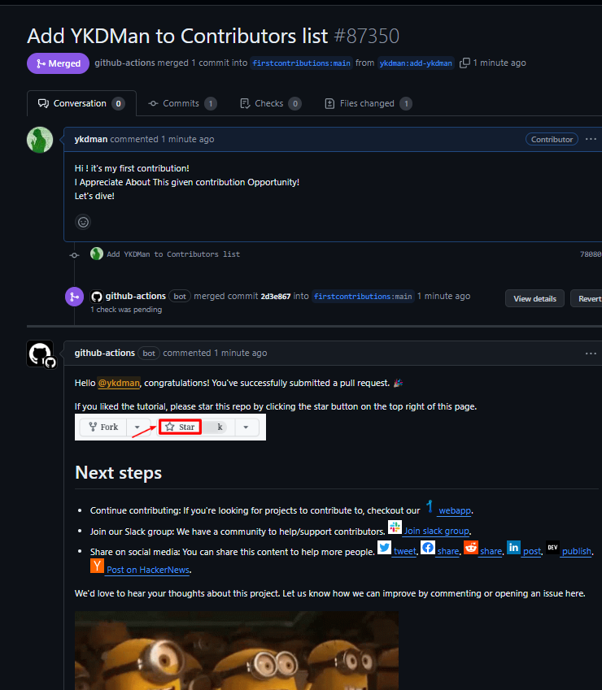

# 오픈소스 기여하기 - 3

- https://github.com/firstcontributions/first-contributions

### 오픈소스 기여 방법

1. Repository Fork
    - 원본 저장소를 가져오는 과정
2. Local PC 에 해당 Fork 한 Repository Clone
3. 새로운 Branch 생성
4. 필요한 부분 추가 및 생성, 수정 후 Commit 반영 (프로젝트 별 가이드라인에 따름)
5. 나의 github (fork 한 ) Repository Origin main 에 새로운 push 를 하면 원본 저장소 (프로젝트) 에 PR 가능해진다.
6. 나의 저장소 에서 Compare PR 을 실행하여 PR을 요청 하면 원본 저장소로 PR 요청이 가게 된다!

### 첫 Contribution

- first-contribution 기여 가이드에 나와있는대로 기여를 진행 했다.
- Contribution List에 이름과 github 주소를 넣는 것 뿐이었지만, 멀기만 했던 일이 가깝게 느껴졌다
- 개발 문화는 정말 재밌는게 많은 것 같다.

### 기여할 오픈 소스 찾기

처음에 오픈소스 기여는 소스코드 수정, 버그 수정과 같은 무겁고 어려운 것 만 있는줄 알았다.

최근에 Google Expended 행사와 데브코스 오픈소스 관련 강의를 듣고

그저 문서 수정, 요청, Issue 기여, 오탈자 수정도 `기여` 의 한 종류인것을 알게 된 후에

심리적으로 꽤나 오픈소스가 가까워진것 같다.

- https://github.com/search/advanced
    - Label : good first Issue 로 검색하면 초심자가 봐도 괜찮을 이슈! 가 검색 된다.
    - good first issue
    - contribution welcome
    - first-timer-only
    - low-haning-fruit

