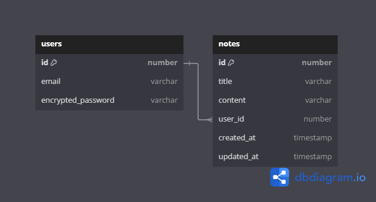

# 웹 기반 문서 편집기 프로젝트 - 3

- mysql : prmgs, prgms
- 구조 설계서
    - 소프트웨어의 구조 설계를 기술하고 정의하는 문서
    - 소프트웨어 개발 과정에 있어 가장 중요한 기준
    - 프로젝트 초기 단계에서 필수적으로 산출해야 하는 문서

- BE 패키지 구조 (express)
    - index.ts, app.ts ⇒ 앱 진입점 파일
    - settings.ts ⇒ 환경변수 및 각종 설정 변수
    - routes/ ⇒ 라우트 함수 모음
    - models / ⇒ 모델 클래스 모음
    - utils / ⇒ 유틸리티 함수 및 유틸리티 객체 모음
    - middlewares/ : 미들웨어 함수 모음

- ERD
    
    
    
- 로컬 Docker에 (with k8s) 에 db 구축
    
    ```yaml
    # notes-db.yaml
    apiVersion: apps/v1
    kind: Deployment
    
    metadata:
      name: notes-db
      namespace: db
    spec:
      selector:
        matchLabels:
          run: notes-db
      replicas: 1
      template:
        metadata:
          labels:
            run: notes-db
        spec:
          containers:
          - name: notes-database
            image: mariadb:11.2.2
            env:
            - name: MARIADB_ROOT_PASSWORD
              value: root
            volumeMounts:
            - name: notes-db-storage
              mountPath: "/var/lib/mysql"
          volumes:
          - name: notes-db-storage
            persistentVolumeClaim:
              claimName: notes-db-pvc
    
    ---
    
    apiVersion: v1
    kind: Service
    
    metadata:
      name: notes-db
      labels:
        run: notes-db
      namespace: db
    spec:
      type: NodePort
      selector:
        run: notes-db
      ports:
      - port: 3306
        nodePort: 30036
    
    ```
    
    ```yaml
    # notes-db-volume
    apiVersion: v1
    kind: PersistentVolume
    
    metadata:
      name: notes-db-volume
      labels:
        type: local
      namespace: db
    spec:
      storageClassName: manual
      capacity:
        storage: 10Gi
      accessModes:
      - ReadWriteOnce
      hostPath:
        path: "<Path to your data directory>"
    
    ---
    
    apiVersion: v1
    kind: PersistentVolumeClaim
    
    metadata:
      name: notes-db-pvc
      namespace: db
    spec:
      storageClassName: manual
      accessModes:
      - ReadWriteOnce
      resources:
        requests:
          storage: 10Gi
    
    ```
    
    - kubectl 로 생성
        
        ```yaml
        kubectl create namespace db
        kubectl apply -f notes-db-volume.yaml
        kubectl apply -f notes-db.yaml
        ```
        
    
    - 접근
        - 로컬 컴퓨터로 부터 접근
            - localhost:30036
        - 클러스터 안의 다른 포드에서 접근하는 경우
            - notes-db.db.svc.cluster.local