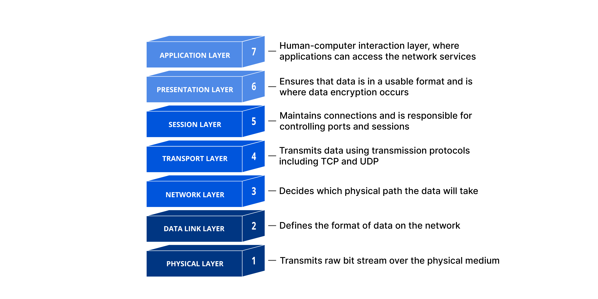

# CS 기초 - 3

### 디지털 데이터 통신의 이점

- 정보의 손실이 적다
    - 통신 잡음에 대하여 강건성이 높다
    - 신호 지연 및 손실에 대한 보완이 가능
    - 자가 오류 정정이 가능한 기법 도입이 가능
- 매체를 다중화하여 대역폭 활용도를 높일 수 있다.
- 정보의 암호화가 용이하다

### 데이터 전송 방식의 분류

- 동기식 전송
    - 타이밍 제어 신호와 데이터 신호를 동기화
    - 고속 통신에 유리
- 비동기식 전송
    - 하나의 통신선을 이용하여 제어 비트와 데이터 비트 전송
    - 하드웨어  비용이 낮은편

### 전송 방향에 따른 데이터 분류

- 단방향 전송
    - 한방향으로만 데이터 전송이 가능
        - 키보드, 방송, 화면 출력
- 반이중 전송
    - 양방향 전송이 가능하지만 동시에는 전송할 수 없음
        - fax, 휴대용 무전기 등
- 전이중 전송
    - 동시에 양방향 데이터 전송이 가능
        - 전화, 일반적인 데이터 네트워크 등
    

### 회선 접속 방식에 따른 분류

- 점대점 방식
    - 서로다른 두 장치가 전용회선을 이용하여 연결
        - 블루투스
- 다지점 방식
    - 하나의 통신 회선에 여러개의 장치가 연결
        - 이더넷

### 망 구선 범위에 따른 분류

- LAN : 근거리 통신망
    - 집, 사무실, PC방 등 주로 단일한 네트워크로 구성
- MAN : 도시 지역 통신망
    - 여러 LAN을 연결한 도시 하나 정도의 네트워크 단위
- WAN : 광역 통신망
    - 근거리 통신망을 벗어나는 경우 모두 WAN 영역으로 보는 견해
    - MAN 은 LAN이 모여 이루어진 것이고 WAN 은 MAN이 모여 이루어진 것이라는 견해

## OSI-7 계층 모델

- 표준 Protocol 을 사용하여 다양한 시스템이 통신할 수 있도록 국제표준화기구 (OSI) 에서 제정한 걔념 모델
    
    
    
    OSI-7계층
    

### 이더넷과 와이파이

- 이더넷 : IEEE 802.3
    - 모든 장치는 고유의 `MAC` 주소를 가진다.
        - b8:8d:12:44:4d ~
    - 데이터 전송에 있어 발생하는 충돌을 감지하고 제어하는 기법을 정의
- 와이파이 : IEEE 802.11
    - 이더넷과 동일한 형태의 `MAC` 주소를 사용
    - 주로 2.4GHz, 5GHz 의 주파수를 가지는 무선 통신을 이용

- 이더넷의 다중 접근 제어
    - CSAM/CD
        1. 노드 (또는 호스트) 는 데이터 전송 이전에 회선이 사용중인지 점검
        2. 회선이 사용중이면 임의의 시간만큼 기다린뒤 다시시도
        3. 회선이 사용중이 아님이 확인되면 데이터 전송 시작
        4. 데이터 전송중 충돌이 검출되면 충돌  발생 사시슬을 모든 노드에게 통보
        5. 충돌이 발생하면 임의의 시간동안 대기 한 후 다시 시도
        

### 흐름제어 : 슬라이딩 윈도우 프로토콜

1. 송신측에서는 매 프레임에 순차번호를 매김
2. 순차번호 및 오류 검출 코드 등을 프레임에 표기하고 순서대로 전송
3. 수신측에서는 매프레임에 대한 응답 (ACK) 프레임으로 회신
4. 슬라이딩 윈도우 - 송신측에서 응답을 받지 않고도 연속하여 전송할 수 있는 프레임 개수에 대한 제한

### 1 : Physical Layer

- 물리적인 데이터 송/수신 단계 레이어
- coaxial, Fibre Optic, UTP 와 같은 케이블을 사용하여 통신을 수행하는 레이어
- 요즘은 Radio 방식을 많이 사용 (Wifi)

- 리피터
    - 동일 LAN 에서 거리를 연장하거나 접속 시스템의 수를 증가시키기 위해 사용
    - 신호의 감쇄, 잡음 등에 의하여 원래의 신호가 훼손되는 것을 막기 위함

- 전자 정보 통신 쪽의 주된 영역

### 2: Data Link Layer

- 두개의 노드 사이에 신뢰성있는 정보 교환을 위한 데이터 링크를 만들어주는 레이어
- 스위칭 허브
    - 연결 장치간 스위칭 역할을 수행
    - 하나의 LAN을 여러 병렬회선 형태로 세그먼트화
- 브릿지
    - 복수의 LAN을 서로 연결하기 위하여 이용
    - 전체 네트워크의 노드 수 및 거리 확장

## IP 네트워크와 주소

- 프로토콜
    - 서로 다른 컴퓨터 사이에 데이터를 주고 받기 위한 약속
        - 서로 다른 컴퓨터들은 이용하는 하드웨어, 데이터의 표현 등이 다를 ㅅ ㅜ있으므로 표준 프로토콜을 정하고 서로 대화 할 떄 이 `규약` 을 따를 필요가있음
        - 주소 지정, 데이터 흐름 제어, 연결 제어, 캡슐화, 다중화 등의 방식을 규정
- 프로토콜 스택
    - 이메일 메시지에는 보낸사람과 제목등을 어떻게 포함할지
    - 특정한 컴퓨터에 있는 특정한 이미지 파일을 지정할때 어떻게 표현할 지 등

### 인터넷 주소 체계

- IP 주소는 네 바이트로 이루어져 있고, 각바이트에 표현된 수 사이에 점을 찍어 구분 표현
- 네트워크의 크기나 호스트의 수에 따라 A~E 클래스로 나누어 진다.

![[출처] 한국인터넷정보센터-IP](../assets/img/post/2024/08/ipv4.png)

[출처] 한국인터넷정보센터

| 클래스(class) | 첫 자리의 범위 | 기본 subnet mask |
| ------------- | -------------- | ---------------- |
| A             | 1 ~ 126        | 255.0.0.0        |
| B             | 128 ~191       | 255.255.0.0      |
| C             | 192 ~ 223      | 255.255.255.0    |
| D             | 224 ~ 239      |                  |
| E             | 240 ~ 254      |                  |

### PORT

- 하나의 IP 주소에도 여러개의 포트가 연결된
    - 192.168.0.1 : `포트번호`
- Well known Port
    
    
    | TCP    | port   |
    | ------ | ------ |
    | FTP    | 20, 21 |
    | SSH    | 22     |
    | Telnet | 23     |
    | SMTP   | 25     |
    | DNS    | 53     |
    | HTTP   | 80     |
    | POP3   | 110    |
    | NTP    | 123    |
    | IMAP4  | 143    |
    | HTTPS  | 443    |
    
    | UDP         | port |
    | ----------- | ---- |
    | DNS         | 53   |
    | BooTPS/DHCP | 67   |
    | TFTP        | 69   |
    | SNMP        | 161  |

## 소프트웨어 공학

- 학문적 의미
    - 높은 품질의 소프트웨어를 효율적으로 개발하는 방법을 탐구하는 학문,연구분야
- 실천적 의미
    - 소프트웨어를 제품화함에 있어서 적용할 수 있는 품질보증 및 개선 활동을 규정하는 프로세스

### 소프트웨어 품질 보증의 어려움

- 제조업과는 달리 검증을 위한 프로토타입의 제작과 양산 단계를 구별하기가 어려움
    - 소프트웨어는 개발활동이 곧 생산활동
- 코드의 변경과 개선이 끊임없이 일어남
    - 형상을 달리하며 지속적으로 진화하는 시스템
- 통제된 공정을 적용하기 어려움
    - 많은 수의 개발자들이 제품으로서의 코드에 접근할 필요
    - 잦고 유연한 릴리스가 비즈니스 경쟁력에 직결

### 소프트에어 개발 프로세스 성숙 모델

- 소프트웨어 개발 조직의 역량을 평가하는 모델
    - 가능한한 객관적이고 정량적으로 평가하고자 함

- CMMI (Capability Maturity Model Intergrated)
    - 미국 국방부에 의하여 1980년대 중반에 개발되어 지금까지 수천개의 기업이 평가, 인증받고 있음
- SPICE (Software Process Improvement and Capability dEtermination)
    - ISO/IEC 15504 에 의하여 규저오디어 프로세스 개선과 조직평가 모델로 활용

### 소프트웨어 개발 및 유지관리 프로세스

- 개발 방법 론
    - 소프투에어 개발에 적용할 개발 프로세스 모델
        - 구조적, 정보공학적, 객체지향적, 컴포넌트 위주
    - 소스코드 형상관리
        - 구성요소에 대한 변경관리 대상인 형상항목을 식별 하고 변경을 통제 기록
    - 단계별 산출물 관리
        - 프로세스에 따른 필수산출물의 제작과 검수, 유지관리
    - 요구사항 관리
        - 개발될 시스템에 대한 고객의 요구를 이해하고 목표와 제약사항을 확립하며 개발 및 남품 프로세스를 관리
    - 테스트 및 검증
        - 단위 테스트, 통합테스트, 인수테스트 등의 과정과 결과를 정의하고 품질보증을 위한조직구성및 절차를 규정

### 소프트웨어 개발 방법론

### 워터폴 모델

1. Requirement
2. Design
3. Implementation
4. Verification
5. Maintenance
- 이전 단계로 돌아가는 Loopback을 적극 채택 하므로, 일자형이 아닌 원형의 모델

### 애자일 모델

- 스크럼을 통하여 빠르게 소프트웨어를 개발하는 모델

- 스크럼 방식의 장단점
    - 장점
        - 반복 주기 마다 생산되는 실행가능한 제품을 통해 사용자와 충분히 의견 교환 가능
        - 데일리 미팅 을통해 팀원들 사이에 빠른 협조와 조율 가능
        - 스프린트 단위의 제품 개발을 통한 업무 집중 환경 조성
        - 프로젝트 진행현황을 모니터링 하고 신속하게 목표와 결과 추정 변화시도가 가능
    - 단점
        - 스프린트가 끝날때마다 실행 가능 또는 테스트 가능한 제품을 만들어야 하므로 추가 작업 소요
        - 데일리 스크럼 미팅에 매우 짧은 시간  제한이 설정되어있음 (15분)
        - 프로세스 품질 평가가 어려움 (회고의 중요성이 부각)