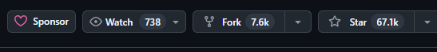
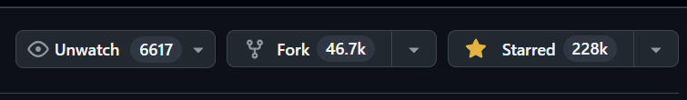

# 개발과 글쓰기의 (with 글또)

요즘 `개발` 과 `글쓰기` 는 같은 맥락의 성격을 갖고 있다는 생각을 계속 한다.

좋은 코드를 쓰는 생각의 흐름은, 좋은 글을 쓰는 흐름, 읽기 좋고 이해가 잘되는 글을 쓰는

흐름과 같지 않을까 하는 생각을 갖고 있다.

### 글쓰기와 개발을 연관짓게 된 계기

요즘 데브코스 최종 프로젝트를 진행하면서, 팀원과 협업을 하고 있다.

백엔드 쪽 리드를 맡게 되어서 어찌저찌 하는 중인데,

새로운 PR을 올릴 때 마다, 팀원들이 리뷰시간이 짧았으면 좋겠다는 생각이 들었다.

그래서 코드로 충분히 나의 의도가 설명되게 하려고, 함수명도 고민하고, 함수도 어느정도

level로 분리할지, 내 코드를 봐줄 사람을 위해 여러가지 고민을 갖게 되었는데,

문득, 책을 읽을 때 독자의 시점에 대해 생각이 났다.

나도 가끔 책을 읽는 독자로써, 책의 주제 자체는 좋으나, 내용이 이해하기 어렵게 쓰여졌다면

그 책을 재밌게 또는 인상깊게 읽을 수 있는가에 대한 생각이 들었다.

그러면 이번에는 내 코드는 `글` 이고, 보는 팀원(리뷰어)들을 독자라고 생각할 때,

- 내 글`(코드)`는 좋은 주제`(목표)` 를 갖고 있는가 ?
- 내 글`(코드)` 는 독자`(팀원, 리뷰어)`들이 이해하기 쉽게 쓰여져 있는가 ?
- 내 글`(코드)` 를 독자들이 소비할만 한가? (like 모듈, 오픈소스)

위의 생각이 머리를 스쳤다.

그러면 사람들이 많이 사용하는 오픈소스들은 위의 조건들을 충족하는 코드들인가?

### 오픈소스를 살펴보자

- [Nest.js Github](https://github.com/nestjs/nest)
- [Nestjs Docs](https://docs.nestjs.com/)

- 많은 독자들이 소비하고 있는가?
    - Nest.js
    
    
    
    - React.js
    
    
    
    ⇒ 유명한 프레임워크, 라이브러리인 두 오픈소스를 봤을 떄, 인기의 지표를 알 수 있는 Star 수를 보면 상당히 많다.
    
    ⇒ 해당 소스의 기여자의 척도를 간단하게 알 수 있는 Fork 정도도 상당히 높다.
    많은 개발자들이 해당 오픈소스를 같이 발전시켜나간다는 점 또한 알 수 있다.
    
- 좋은 주제를 가지고 있는가? : [원본 링크](https://github.com/nestjs/nest?tab=readme-ov-file#philosophy)
    - Nest.js의 철학
    
    > **Philosophy
    … 중략
    Nest aims to provide an application architecture out of the box which allows for effortless creation of highly testable, scalable, and loosely coupled and easily maintainable applications. The architecture is heavily inspired by Angular.**
    > 
    
    쉽게 얘기하자면, Nest.js 는 테스트 가능성, 확장성이 뛰어나고
    
    느슨한 결합을 통해 유지보수가 쉬운 애플리케이션을 손쉽게 만들수 있는 프레임워크
    
    라는 설명이다.
    
    위의 설명 대로라면 당연하게도 좋은 주제를 가지고 있는지에 대한 질문에 부합한다
    
    (개인적으로도 Express 보다 더 간편하고 안정적인 Framework 라고 생각한다)
    
    - React.js
        - [최신 공식문서](https://ko.react.dev/)
        - [구버전 공식문서](https://ko.legacy.reactjs.org/)
    
    React 공식문서에서는 React가 다음과 같은 주제를 가진 라이브러리 임을 나타낸다.
    
    1. 선언형
    2. 컴포넌트 기반
    3. 한 번 배워서 어디나 사용하기
    4. 간단한 컴포넌트
    5. 상태를 가지는 컴포넌트
    6. 애플리케이션
    7. 외부 플러그인을 사용하는 컴포넌트
    
    위의 주제들을 보면, 프론트엔드 개발자 입장에서는, 어쩌면 마법과도 같은?
    
    느낌을 받을 정도로 React는 프론트엔드 기술을 구성하는데 있어 정말 매력적인
    
    오픈소스 라이브러리이다.
    
- 그러면 코드는 ?

코드 부분에 있어서 너무 자세하게 리뷰하는것 보다 느낌을 기술하고자 한다.

React의 소스와 Nest.js의 소스를 보면 구조적으로 읽기 쉽다는 느낌보다는

> 복잡한 구조는 가지고 있지만, 핵심만 명확히 짚어 사용에 무리함이 없다
> 

라는 느낌이 들게 한다.

되게 논리적이기도 하며, 철저함이 느껴지기도 한다.

### 그러면 글쓰기와 개발은 무엇이 비슷한가?

우선, 논리적인 부분이 제일 비슷한것 같다.

요즘 자기계발서를 읽으며 드는 생각은, 사실 같은 얘기를 반복하지만, 

해당 주제를 강조하기 위해, 초장 부터 적당한 속도로 독자에게 

해당 책의 주제를 상기 시키며, 결국 이 주제가 독자에게 필요할 수밖에 없도록

설득한다는 느낌을 많이 받는다.

잘 작성된 코드, 흔히말해 클린코드들을 보고 있으면, 변수명, 함수명, 클래스명부터

블록 안의 내용들이 모두 유기적이기도 하며, 순수(프로그래밍의 순수성)하게

프로젝트의 주제를 어필하며 논리적으로 흐른다.

그래서 개발과 글쓰기는 상당히 연관있다고 생각이 든다.

글쓰기를 잘하는 사람은 개발을 잘할 확률이 있다고 생각한다!

### 그래서 글또 합류

- [공식](https://geultto.github.io/)

현재 멘토님을 통해서 글또 라는 커뮤니티를 추천 받았다.

지속적인 글쓰기를 통해 내 나름의 글쓰기의 틀을 만들 수 있지 않을까 싶다.

마치 프레임워크위에서 개발하는 느낌이 드는 글쓰기를 하고 싶다.

아직 나는 글을 쓰는데 있어 명확한 구조가 정립되지 않은 상태인데,

글또 활동을 하면서는 나만의 확고한 글의 모양이 잡힐 것 같다.

### 글또 Action Item

아직 나는 무언가에 특화된 개발자가 아니다.

원래는 웹 프론트를 지향했지만, 현재는 웹 백엔드를 더 많이 공부하고

개발하는 중인데, 그러면서 생긴 다양한 궁금증들이 있다.

그래서 궁금한 것들을 풀어나가는 `시리즈` 를 발행해보고 싶다.

조금은 어려울 수 있는 주제로, 조금은 깊은 주제로 하나씩 고민하며

찾아보고 공부해서 글을 쓸 목적이다.

화이팅!